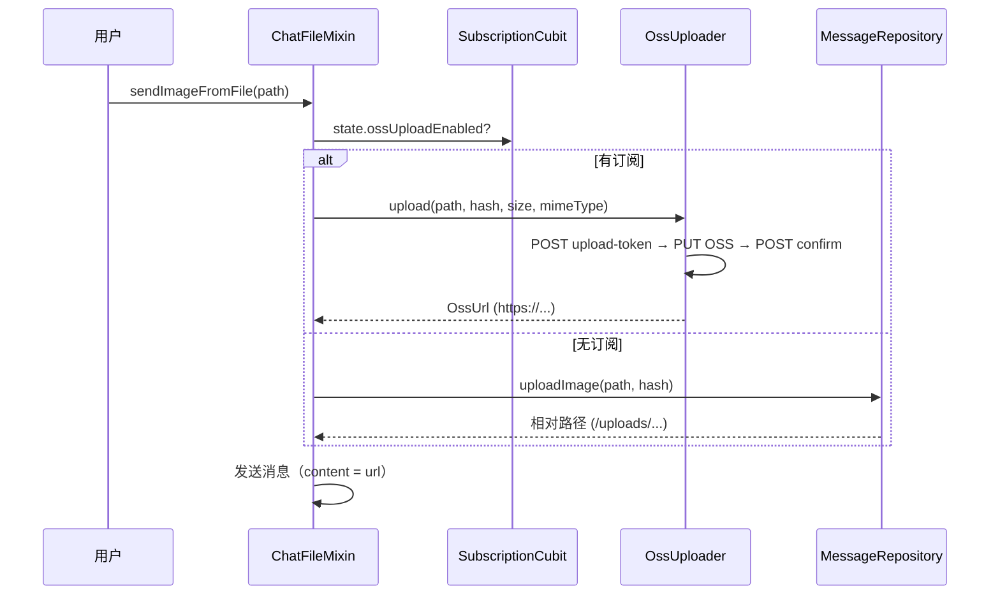
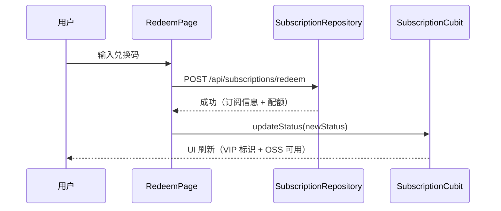

# 云空间 OSS 直传 + 订阅兑换 — 前端设计报告

> 关联设计：[cloud v0.0.3 后端](../server/design.md) | [cloud v0.0.1 客户端](../../v0.0.1/client/design.md)

## 1. 目标

- 订阅状态管理：登录后查询 + 缓存 + 实时刷新
- OSS 直传上传器：获取 STS Token → PUT OSS → confirm
- 上传分流：有订阅走 OSS，无订阅走现有本地 multipart
- 兑换码 UI：输入页 + 验证 + 激活 + 刷新状态
- VIP 头像框：订阅用户头像外加渐变边框
- 403 Fallback：upload-token 被拒时自动降级到本地上传

## 2. 现状分析

| 能力 | 状态 |
|------|------|
| 文件上传（multipart） | ✅ chat_file_mixin + MessageRepository |
| 配额检查（前端） | ✅ checkHash 接口 403 时弹 toast |
| 订阅状态 | ❌ 不存在 |
| OSS 直传 | ❌ 不存在 |
| 兑换码 UI | ❌ 不存在 |
| VIP 标识 | ❌ 不存在 |

## 3. 数据模型

### 订阅状态（前端缓存）

```dart
class SubscriptionStatus {
  final bool hasActiveSubscription;
  final String? planCode;
  final String? planName;
  final DateTime? expiresAt;
  final bool ossUploadEnabled;
  final int usedBytes;
  final int quotaBytes;
}
```

### OSS Upload Token（接口返回）

```dart
class OssUploadToken {
  final String accessKeyId;
  final String accessKeySecret;
  final String securityToken;
  final String expiration;
  final String bucket;
  final String endpoint;
  final String objectKey;
  final String? thumbObjectKey;
  final String url;
  final String? thumbUrl;
}
```

## 4. 核心流程

### 上传分流



### 兑换码激活



## 5. 项目结构与技术决策

### 新增/修改文件

```
client/modules/flash_session/lib/src/
├── data/
│   └── subscription_repository.dart       # 新建：订阅 API 调用
└── logic/
    └── subscription_cubit.dart            # 新建：订阅状态管理

client/modules/flash_im_chat/lib/src/
├── logic/
│   └── chat_file_mixin.dart              # 修改：上传分流
└── data/
    └── oss_uploader.dart                  # 新建：OSS 直传封装

client/lib/src/home/
├── profile/
│   └── redeem_page.dart                   # 新建：兑换码输入页
└── view/
    └── home_page.dart                     # 修改：登录后查询订阅状态

client/modules/flash_shared/lib/src/
└── widgets/
    └── avatar_widget.dart                 # 修改：VIP 头像框
```

### 技术决策

| 决策 | 方案 | 理由 |
|------|------|------|
| 订阅状态放哪 | 独立 SubscriptionCubit（在 flash_session 模块） | 全局可用，不依赖聊天模块 |
| OSS PUT 方式 | dio.put 直接调 OSS（带 STS headers） | 不需要额外 SDK，dio 已有 |
| 缩略图处理 | OSS 图片处理参数（URL 拼 `?x-oss-process=image/resize,w_400`） | 不需要前端生成+上传缩略图 |
| 403 Fallback | upload-token 返回 403 时 → 刷新订阅状态 → 降级本地上传 | 用户体验不中断 |
| VIP 头像框 | AvatarWidget 增加 `isVip` 参数，外加 2px 渐变 Border | 最小改动 |
| 兑换码入口 | 云空间页/设置页增加"兑换码"行 | 低优先级功能，不占主要位置 |

### 依赖关系

```
SubscriptionCubit（flash_session）
    ↑ 读取
ChatFileMixin（flash_im_chat）→ OssUploader（flash_im_chat/data）
    ↑ 读取
HomePage → 登录后 loadSubscription()
AvatarWidget（flash_shared）← isVip 参数
```

## 6. 验收标准

| 验收条件 | 验收方式 |
|----------|----------|
| flutter analyze 零错误 | 命令行 |
| 无订阅用户上传走本地 multipart | 日志验证 |
| 有订阅用户上传走 OSS 直传 | 日志 + OSS 控制台确认文件存在 |
| 兑换码输入后订阅激活 | 手动操作 |
| 激活后立即可以 OSS 上传 | 手动操作 |
| VIP 用户头像有金色边框 | 视觉验证 |
| upload-token 403 时 fallback 到本地 | 模拟测试 |
| 消息中 OSS URL 正常展示图片 | 手动验证 |

## 7. 暂不实现

| 功能 | 理由 |
|------|------|
| 前端生成缩略图并上传 | 用 OSS 图片处理参数代替 |
| 订阅到期倒计时提醒 | 下版本 |
| 多档位套餐展示 | 下版本（本期只有兑换码） |
| 上传进度条区分 OSS/本地 | 本期统一用 dio 进度回调 |
