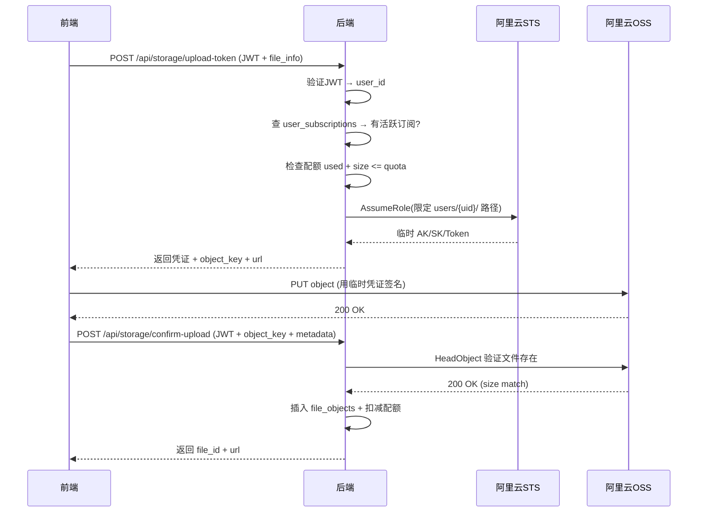
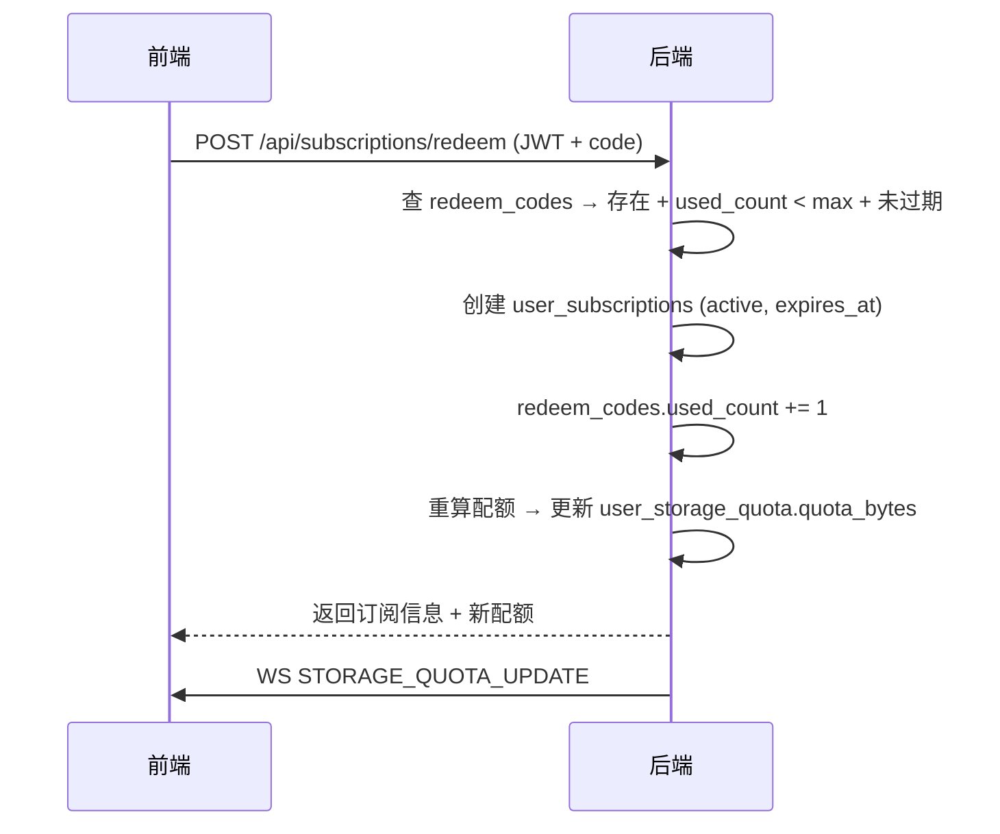

# 云空间 OSS 存储 + 订阅兑换 — 后端设计报告

> 关联设计：[cloud v0.0.1 后端](../../v0.0.1/server/design.md)

## 1. 目标

- OSS 直传支持：签发 STS Token 接口 + 上传确认接口
- 订阅系统：subscription_plans + user_subscriptions + redeem_codes 三张表
- 兑换码接口：验证 + 激活订阅 + 配额升级
- 订阅状态查询接口：前端判断走 OSS 还是本地

## 2. 现状分析

| 能力 | 状态 |
|------|------|
| StorageBackend trait | ✅ 已有 |
| LocalFs 实现 | ✅ 已有 |
| OssBackend 实现 | ✅ 刚完成（put/get/delete/exists 测试通过） |
| multipart 上传接口 | ✅ 已有（/api/upload/image, /api/upload/video, /api/upload/file） |
| 配额管理 | ✅ 已有（user_storage_quota 表 + check_quota） |
| WS 配额通知 | ✅ 已有（STORAGE_QUOTA_UPDATE） |
| 订阅系统 | ❌ 不存在，需新建 |
| STS Token 签发 | ❌ 不存在，需新建 |

## 3. 数据模型与接口

### 新增表

```sql
-- 订阅计划定义
CREATE TABLE subscription_plans (
    id SERIAL PRIMARY KEY,
    code VARCHAR(50) UNIQUE NOT NULL,
    name VARCHAR(100) NOT NULL,
    storage_bytes BIGINT NOT NULL,
    features JSONB NOT NULL DEFAULT '{}',
    price_cents INT NOT NULL DEFAULT 0,
    period_days INT NOT NULL DEFAULT 30,
    is_active BOOLEAN NOT NULL DEFAULT TRUE,
    created_at TIMESTAMPTZ NOT NULL DEFAULT NOW()
);

-- 用户订阅记录
CREATE TABLE user_subscriptions (
    id SERIAL PRIMARY KEY,
    user_id BIGINT NOT NULL,
    plan_id INT NOT NULL REFERENCES subscription_plans(id),
    status VARCHAR(20) NOT NULL DEFAULT 'active',
    starts_at TIMESTAMPTZ NOT NULL DEFAULT NOW(),
    expires_at TIMESTAMPTZ NOT NULL,
    source VARCHAR(50) NOT NULL DEFAULT 'redeem',
    original_transaction_id VARCHAR(255),
    created_at TIMESTAMPTZ NOT NULL DEFAULT NOW(),
    updated_at TIMESTAMPTZ NOT NULL DEFAULT NOW()
);

-- 兑换码
CREATE TABLE redeem_codes (
    id SERIAL PRIMARY KEY,
    code VARCHAR(32) UNIQUE NOT NULL,
    plan_id INT NOT NULL REFERENCES subscription_plans(id),
    duration_days INT NOT NULL DEFAULT 30,
    max_uses INT NOT NULL DEFAULT 1,
    used_count INT NOT NULL DEFAULT 0,
    expires_at TIMESTAMPTZ,
    created_at TIMESTAMPTZ NOT NULL DEFAULT NOW()
);

-- 初始数据
INSERT INTO subscription_plans (code, name, storage_bytes, features, price_cents, period_days)
VALUES ('cloud_pro', '云空间 Pro', 1073741824, '{"oss_upload": true}', 99, 30);
```

### 接口契约

#### POST /api/subscriptions/redeem — 兑换码激活

请求：
```json
{ "code": "FLASH-XXXX-YYYY" }
```

成功响应 200：
```json
{
  "subscription": {
    "id": 1,
    "plan_code": "cloud_pro",
    "plan_name": "云空间 Pro",
    "status": "active",
    "starts_at": "2026-06-21T10:00:00Z",
    "expires_at": "2026-07-21T10:00:00Z",
    "storage_bytes": 1073741824
  },
  "quota": {
    "used_bytes": 52428800,
    "quota_bytes": 1178599424
  }
}
```

错误：
- 400 `{"code": "INVALID_CODE", "message": "兑换码无效"}`
- 400 `{"code": "CODE_EXHAUSTED", "message": "兑换码已用完"}`
- 400 `{"code": "CODE_EXPIRED", "message": "兑换码已过期"}`

#### GET /api/subscriptions/status — 查询订阅状态

响应 200：
```json
{
  "has_active_subscription": true,
  "plan_code": "cloud_pro",
  "plan_name": "云空间 Pro",
  "expires_at": "2026-07-21T10:00:00Z",
  "oss_upload_enabled": true,
  "quota": {
    "used_bytes": 52428800,
    "quota_bytes": 1178599424
  }
}
```

无订阅时：
```json
{
  "has_active_subscription": false,
  "oss_upload_enabled": false,
  "quota": {
    "used_bytes": 52428800,
    "quota_bytes": 104857600
  }
}
```

#### POST /api/storage/upload-token — 签发 STS 临时凭证

请求：
```json
{
  "file_name": "photo.jpg",
  "file_size": 2048000,
  "mime_type": "image/jpeg",
  "hash": "a1b2c3d4..."
}
```

成功响应 200：
```json
{
  "access_key_id": "STS.xxxxx",
  "access_key_secret": "xxxxx",
  "security_token": "xxxxx",
  "expiration": "2026-06-21T10:15:00Z",
  "bucket": "flash-im-storage",
  "endpoint": "https://oss-cn-beijing.aliyuncs.com",
  "object_key": "users/1/original/2026/06/uuid.jpg",
  "url": "https://flash-im-storage.oss-cn-beijing.aliyuncs.com/users/1/original/2026/06/uuid.jpg"
}
```

错误：
- 403 `{"code": "NO_SUBSCRIPTION", "message": "需要订阅才能使用云存储"}`
- 403 `{"code": "QUOTA_EXCEEDED", "message": "云空间不足"}`

#### POST /api/storage/confirm-upload — 确认上传完成

请求：
```json
{
  "object_key": "users/1/original/2026/06/uuid.jpg",
  "file_size": 2048000,
  "mime_type": "image/jpeg",
  "mime_category": "image",
  "hash": "a1b2c3d4...",
  "original_name": "photo.jpg",
  "width": 1920,
  "height": 1080,
  "duration_ms": null,
  "thumb_object_key": "users/1/thumb/2026/06/uuid.webp"
}
```

成功响应 200：
```json
{
  "file_id": 42,
  "url": "https://flash-im-storage.oss-cn-beijing.aliyuncs.com/users/1/original/2026/06/uuid.jpg",
  "thumb_url": "https://flash-im-storage.oss-cn-beijing.aliyuncs.com/users/1/thumb/2026/06/uuid.webp",
  "quota": {
    "used_bytes": 54476800,
    "quota_bytes": 1178599424
  }
}
```

## 4. 核心流程

### STS Token 签发 + 确认上传



### 兑换码激活



## 5. 项目结构与技术决策

### 新模块 app-subscription

```
server/modules/app-subscription/
├── Cargo.toml
└── src/
    ├── lib.rs           -- 导出 router + 公共类型
    ├── model.rs         -- SubscriptionPlan, UserSubscription, RedeemCode
    ├── repository.rs    -- CRUD: find_active_sub, create_sub, redeem_code...
    ├── service.rs       -- 兑换逻辑、配额重算、订阅状态查询
    └── api.rs           -- POST /redeem, GET /status
```

### app-storage 新增

```
server/modules/app-storage/src/
├── backend/
│   ├── mod.rs           -- trait 定义（已有）
│   ├── local_fs.rs      -- 本地存储（已有）
│   └── oss.rs           -- OSS 存储（已完成）
├── sts.rs               -- 新增：STS Token 签发逻辑
├── api.rs               -- 新增：upload-token + confirm-upload 路由
└── ...
```

### 技术决策

| 决策 | 方案 | 理由 |
|------|------|------|
| STS 签发 | 直接调阿里云 STS HTTP API（reqwest） | aws-sdk-sts 太重，只需一个 HTTP 调用 |
| 订阅模块独立 | 新建 app-subscription crate | 和存储解耦，后续接 Apple IAP 不影响存储 |
| 配额重算 | 订阅变更时：100MB + SUM(活跃订阅.storage_bytes) | 简单直接 |
| OssBackend 用途 | confirm 时 head_object + 删除时 delete | 前端直传不经过后端 |
| Bucket 权限 | 公共读 + Referer 防盗链 | 前端直接用 URL 加载，无需签名 |
| object_key 生成 | 后端 upload-token 时生成（users/{uid}/original/{date}/{uuid}.ext） | 前端不决定路径，安全 |

### 依赖

| 依赖 | 用途 | 状态 |
|------|------|------|
| aws-sdk-s3 | OssBackend | ✅ 已添加 |
| reqwest | STS AssumeRole HTTP 调用 | 需新增 |
| hmac + sha1 | 阿里云签名 | 需新增 |
| flash-core | JWT 鉴权 + AppError | ✅ 已有 |

## 6. 验收标准

| 验收条件 | 验收方式 |
|----------|----------|
| cargo build 编译通过 | 命令行 |
| 兑换码接口可激活订阅 | 测试脚本 POST /api/subscriptions/redeem |
| 订阅状态接口返回正确 | 测试脚本 GET /api/subscriptions/status |
| upload-token 对无订阅用户返回 403 | 测试脚本 |
| upload-token 对有订阅用户返回 STS 凭证 | 测试脚本 |
| confirm-upload 记录元数据并扣配额 | 测试脚本 + 数据库验证 |
| 前端用 STS Token 直传文件到 OSS 成功 | 手动验证 |

## 7. 暂不实现

| 功能 | 理由 |
|------|------|
| iOS 内购验单 | 下版本，本期用兑换码 |
| 订阅到期自动降级定时任务 | 下版本，本期手动/查询时检查 |
| 配额奖励表 | 下版本 |
| 管理后台管理兑换码 | 本期直接 SQL 插入 |
| 缩略图由后端生成 | 前端生成缩略图并直传 |
