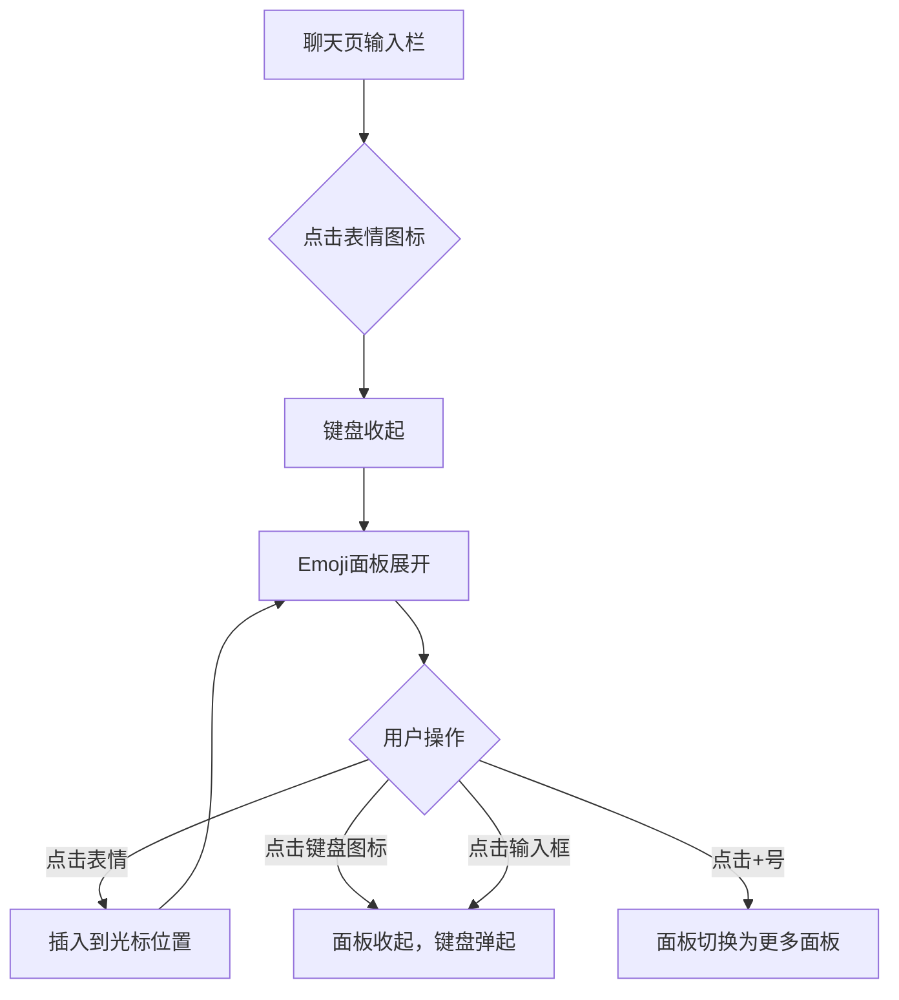
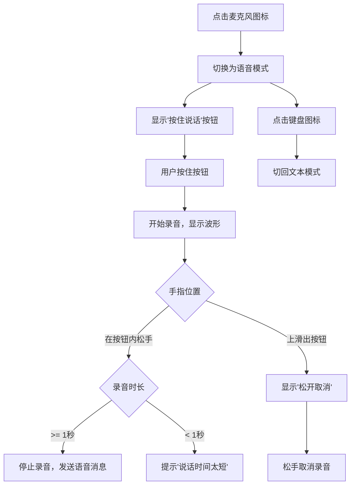
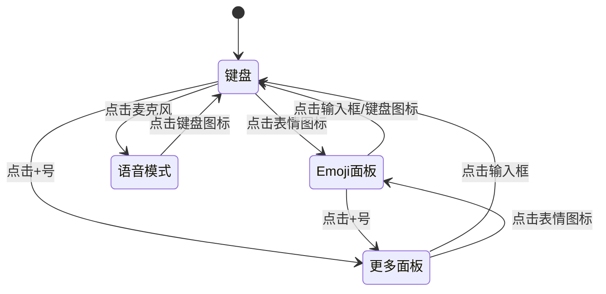

# 聊天输入框功能优化 — 功能分析

## 概述

对聊天页底部输入栏进行优化：样式改为微信风格、新增 Emoji 表情面板、新增语音消息。样式改造是纯视觉调整（不分配功能编号），Emoji 和语音是新增交互能力。

## 一、交互链

### 场景 1：Emoji 表情输入

**用户故事**：作为用户，我想快速插入表情符号，以便让聊天更生动。

用户在聊天页输入文字时，点击输入框右侧的表情图标。键盘收起，底部平滑切换为 Emoji 面板，展示常用表情的网格。用户点击某个表情，它被插入到输入框当前光标位置。可以连续点击多个表情。想继续打字时，点击面板左下角的键盘图标，面板收起，键盘弹回。如果直接点击输入框，效果相同。

### 场景 2：语音消息发送

**用户故事**：作为用户，我想发送语音消息，以便在不方便打字时快速沟通。

用户点击输入框左侧的麦克风图标，输入栏从文本模式切换为语音模式：输入框区域变成一个"按住 说话"的大按钮。用户按住按钮开始录音，界面显示录音时长和波形动画。松手后录音结束，语音消息发送到聊天中（显示时长气泡）。如果按住后手指上滑超出按钮区域，进入"松开取消"状态，此时松手不发送。录音不足 1 秒时提示"说话时间太短"。

### 场景 3：面板互斥切换

**用户故事**：作为用户，我在键盘、表情面板、更多面板、语音模式之间切换时，界面不应该跳动或出现空白。

输入栏底部同一时刻只能显示一种面板（键盘/Emoji/更多/无）。切换时旧面板收起、新面板展开，高度保持一致避免页面跳动。语音模式下所有面板和键盘都收起。

## 二、逻辑树

### 事件流：Emoji 输入

| 时刻 | 事件 | 处理 | 产生的新事件 |
|------|------|------|-------------|
| T0 | 点击表情图标 | 收起键盘，设置 showEmojiPanel=true | 面板展开动画 |
| T1 | 点击某个 emoji 字符 | 获取当前光标位置，在该位置插入字符，光标后移 | hasText 状态可能变化 |
| T2 | 点击键盘图标 | 设置 showEmojiPanel=false，requestFocus | 键盘弹起 |

### 事件流：语音消息

| 时刻 | 事件 | 处理 | 产生的新事件 |
|------|------|------|-------------|
| T0 | 点击麦克风 | 设置 isVoiceMode=true，收起键盘和面板 | UI 切换 |
| T1 | 手指按下按钮 | 请求录音权限 → 开始录音 → 启动计时器 | 波形动画开始 |
| T2 | 手指移动 | 检测是否超出按钮区域，更新 UI 状态（录音中/取消中） | — |
| T3a | 原地松手 | 停止录音 → 检查时长 → 上传音频文件 → 发送消息 | ChatCubit.sendAudio |
| T3b | 上滑松手 | 取消录音，删除临时文件 | — |
| T4 | 上传完成 | 通过 WS 发送 type=4 的消息帧（content=audioUrl, extra={duration}) | ACK |

### 状态流转

| 实体 | 触发事件 | 前状态 | 后状态 |
|------|---------|--------|--------|
| 输入栏模式 | 点击麦克风 | textMode | voiceMode |
| 输入栏模式 | 点击键盘图标 | voiceMode | textMode |
| 底部面板 | 点击表情图标 | none/more | emoji |
| 底部面板 | 点击 + 号 | none/emoji | more |
| 底部面板 | 点击输入框 | emoji/more | none（键盘弹起） |
| 底部面板 | 切换语音模式 | any | none |
| 录音状态 | 手指按下 | idle | recording |
| 录音状态 | 手指上滑 | recording | canceling |
| 录音状态 | 手指回到按钮 | canceling | recording |
| 录音状态 | 松手（正常） | recording | idle（发送） |
| 录音状态 | 松手（取消） | canceling | idle（不发送） |
| 发送按钮 | 输入文字 | hidden | visible |
| 发送按钮 | 清空/切换语音 | visible | hidden |

## 三、功能编号与网络定位

### 本次新增节点

| 编号 | 功能节点 | 层级 | 简介 |
|------|---------|------|------|
| P-21 | Emoji 表情面板 | 前端业务 | 常用表情网格，点击插入光标位置 |
| P-22 | 语音消息输入 | 前端业务 | 按住录音、松手发送、上滑取消 |
| D-10 | 语音消息类型 | 领域 | msg_type=4，extra 含 duration |

注：输入栏样式改造为纯视觉调整，不分配编号。

### 前置依赖

| 依赖节点 | 依赖方式 | 是否已有 |
|----------|---------|---------|
| 文件上传接口（app-storage） | POST /api/upload/audio | ❌ 需新增（复用 upload/file 逻辑） |
| WS 消息类型 | proto MessageType.AUDIO = 4 | ❌ 需在 proto 中新增 |
| ChatFileMixin | sendAudioFromFile 方法 | ❌ 需新增 |
| 录音插件 | record 或 flutter_sound | ❌ 需引入 |
| 麦克风权限 | Android RECORD_AUDIO / iOS NSMicrophoneUsageDescription | ❌ 需声明 |

### 边界接口

| 接口 | 定义方 | 消费方 | 说明 |
|------|--------|--------|------|
| POST /api/upload/audio | app-storage | 前端 | 上传音频文件，返回 {audio_url, duration_ms} |
| WS ChatMessage (type=4) | im-message | 前端 | 语音消息帧，content=url, extra={duration_ms} |

## 四、结论

- 开发顺序：样式改造（纯前端）→ Emoji 面板（纯前端）→ 语音消息（前后端）
- 样式改造和 Emoji 面板可以独立完成，不依赖后端
- 语音消息复杂度最高：录音插件选型、权限声明、上传接口、proto 新增类型、气泡 UI
- 参考项目 `docs/ref/flash_im-main` 中有完整的语音输入实现（VoiceInputWidget + RecordManager），可直接参考移植
- 面板互斥切换是交互细节的重点，需要确保键盘高度和面板高度一致，避免页面跳动
