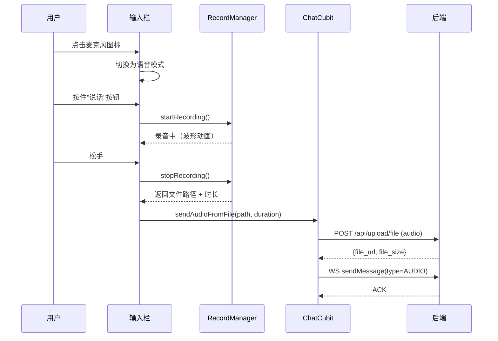
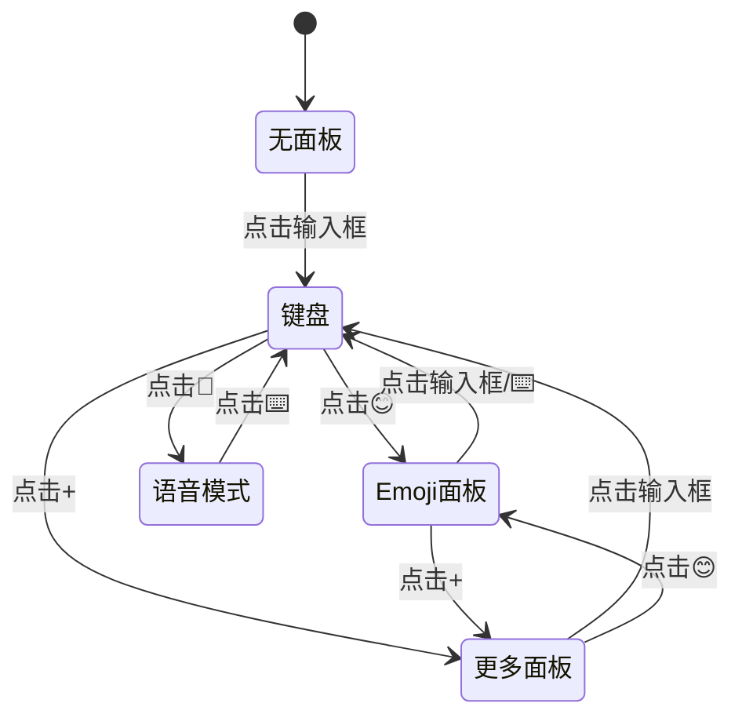

# 聊天输入框优化 — 客户端设计报告

> 关联设计：[im-chat v0.21.0 client](../../im-test/v0.21.0/client/design.md)

## 1. 目标

- 输入栏样式改为微信风格（灰色容器、白色矩形圆角输入框、发送按钮动态显隐）
- 新增 Emoji 表情面板（常用表情网格，点击插入光标位置）
- 新增语音消息（按住录音、松手发送、上滑取消）
- 面板互斥切换（键盘/Emoji/更多/语音四种模式平滑切换）

## 2. 现状分析

### 已有能力

- 文本输入与发送
- 图片/视频/文件发送（更多面板）
- @提及功能（群聊）
- ChatFileMixin 处理文件上传流程

### 存在的问题

| 问题 | 影响 |
|------|------|
| 输入框圆角 20（胶囊形），不符合微信风格 | 视觉不协调 |
| 容器背景白色，和页面缺少层次 | 输入栏和聊天区域没有明确分界 |
| 无 Emoji 面板 | 用户只能通过系统键盘输入表情 |
| 无语音消息 | 不方便打字时无法快速沟通 |
| 发送按钮始终显示 | 无文字时按钮无意义，浪费空间 |

## 3. 数据模型与接口

### 客户端数据模型

语音消息复用现有 Message 模型，新增 type：

```dart
enum MessageType {
  text,    // 0
  image,   // 1
  video,   // 2
  file,    // 3
  audio,   // 4  ← 新增
  forward, // 5
}
```

语音消息的 extra：

```dart
{
  "duration_ms": 5200,    // 录音时长（毫秒）
  "file_size": 83200,     // 文件大小（字节）
}
```

### 接口契约

**POST /api/upload/audio** — 上传音频文件

复用现有 app-storage 的文件上传逻辑，返回格式：

```json
// Request: multipart/form-data, field: "file"
// Response:
{
  "audio_url": "/uploads/audio/2026/05/xxx.wav",
  "file_size": 83200
}
```

**WS 消息帧** — type=4 (AUDIO)

```
content: "/uploads/audio/2026/05/xxx.wav"
extra: {"duration_ms": 5200, "file_size": 83200}
```

| 决策 | 方案 | 理由 |
|------|------|------|
| 音频格式 | WAV | record 包默认格式，兼容性好，不需要额外编码 |
| 时长计算 | 客户端计时 | 录音过程中客户端已有 Stopwatch，不需要服务端解析 |
| 上传接口 | 复用 /api/upload/file 逻辑 | 音频本质是文件，不需要单独接口 |

## 4. 核心流程

### 语音消息发送流程



### 面板切换逻辑



## 5. 项目结构与技术决策

### 项目结构

```
flash_im_chat/lib/src/view/
├── chat_input.dart              ← 重写：微信风格输入栏
├── emoji_panel.dart             ← 新增：Emoji 表情面板
├── voice_input/
│   ├── voice_input_widget.dart  ← 新增：按住说话 UI + 波形动画
│   └── record_manager.dart      ← 新增：录音管理器（封装 record 包）
├── bubble/
│   └── audio_bubble.dart        ← 新增：语音消息气泡（时长 + 播放按钮）
```

### 职责划分

```
ChatInput（UI 组件）
  ├── 管理面板状态（emoji/more/voice/none）
  ├── 文本输入 → onSend 回调
  ├── Emoji 选择 → 插入文本
  └── 语音录制 → onSendAudio 回调

ChatFileMixin（逻辑层）
  └── sendAudioFromFile(path, duration)
      ├── 上传文件
      ├── WS 发送 type=4 消息
      └── 本地消息状态管理

RecordManager（工具层）
  └── 封装 record 包，管理录音生命周期
```

### 技术决策

| 决策 | 方案 | 理由 |
|------|------|------|
| 录音库 | `record` ^5.1.0 | 参考项目已验证，API 简洁，支持 Android/iOS |
| 权限管理 | `permission_handler` ^11.0.0 | 项目中已有依赖（扫码页用过） |
| Emoji 数据 | 硬编码常用表情列表 | 简单直接，不需要额外包 |
| 音频播放 | `just_audio` ^0.9.0 | 轻量，支持网络 URL 播放 |
| 波形动画 | 自定义 CustomPainter | 参考项目已有实现，不需要额外包 |

### 第三方依赖

| 依赖 | 用途 | 已有/需新增 |
|------|------|-----------|
| record | 录音 | ❌ 需新增 ^5.1.0 |
| permission_handler | 权限请求 | ✅ 已有 |
| path_provider | 临时文件路径 | ✅ 已有 |
| just_audio | 语音播放 | ❌ 需新增 ^0.9.0 |

## 6. 验收标准

| 验收条件 | 验收方式 |
|----------|----------|
| 输入栏样式符合微信风格 | 视觉对比截图 |
| 有文字时显示发送按钮，无文字时隐藏 | 手动操作 |
| Emoji 面板展开/收起平滑 | 手动操作 |
| 点击 Emoji 插入到光标位置 | 手动操作 |
| 面板切换无跳动 | 手动操作 |
| 按住录音，松手发送 | 手动操作，对方收到语音气泡 |
| 上滑取消录音 | 手动操作，不发送 |
| 录音 < 1 秒提示太短 | 手动操作 |
| 语音气泡显示时长，可点击播放 | 手动操作 |
| `flutter analyze` 零 issue | 命令行验证 |
| 14 个已有测试仍通过 | `flutter test` |

## 7. 暂不实现

| 功能 | 理由 |
|------|------|
| Emoji 分类 tab（笑脸/手势/动物等） | 先做常用表情一页，后续按需扩展 |
| 最近使用表情记录 | 需要本地持久化，后续版本加 |
| 语音消息转文字 | 需要 ASR 服务，复杂度高 |
| 语音消息倍速播放 | 后续优化 |
| 录音降噪 | record 包默认配置已够用 |
