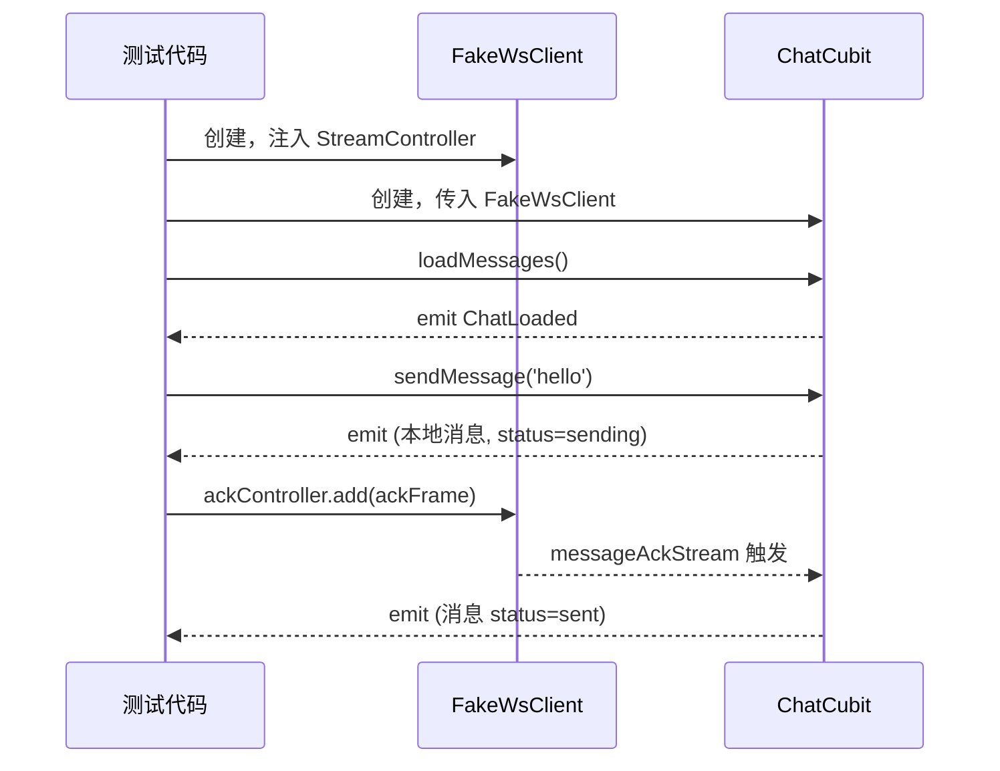
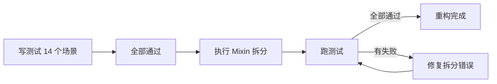

# IM 测试基础设施 + ChatCubit 拆分 — 客户端设计报告

## 1. 目标

- 为 MessageRepository 抽取抽象接口，提升可测试性和扩展性
- 搭建 IM 聊天模块的测试 Mock 层（MockRepository / FakeWsClient / MockLocalStore）
- 建立测试数据工厂（TestFixtures），保证 mock 数据与真实数据结构一致
- 为 ChatCubit 编写覆盖 14 个核心场景的单元测试
- 在测试保护下将 ChatCubit 拆分为 mixin 结构（772 行 → ~350 行本体 + 3 个 mixin）

## 2. 现状分析

### 已有能力

- ChatCubit 功能完整，14 个场景均可正常运行
- LocalStore 已是抽象类，天然可 mock
- WsClient 的 stream 基于 StreamController，可通过注入控制
- fx_logger 已就位，日志不影响测试

### 存在的问题

| 问题 | 影响 |
|------|------|
| MessageRepository 是具体类，ChatCubit 直接 `new` 依赖 | 无法注入 mock，不可测试 |
| ChatCubit 772 行，7 个职责域混在一起 | 维护成本高，新功能难加 |
| 无任何单元测试 | 重构无安全网，bug 只能靠手动发现 |
| WsClient 构造函数需要真实 WebSocket URL | 测试环境无法直接使用 |

### 基础设施就绪情况

| 项目 | 状态 |
|------|------|
| flutter_test | ✅ 已有 |
| bloc_test | ❌ 需新增（BLoC 官方测试工具） |
| mockito / mocktail | ❌ 需新增（mock 生成） |
| fake_async | ✅ flutter_test 内置 |

## 3. 数据模型与接口

### 接口抽象：IMessageRepository

从当前 `MessageRepository` 提取抽象接口，ChatCubit 依赖接口而非实现：

```dart
abstract class IMessageRepository {
  // 消息查询
  Future<List<Message>> getMessages(String conversationId, {int? beforeSeq, int limit = 50});

  // 文件上传
  Future<ImageUploadResult> uploadImage(String filePath, {void Function(double)? onProgress});
  Future<VideoUploadResult> uploadVideo(String filePath, String thumbPath, int durationMs, {int width, int height, void Function(double)? onProgress});
  Future<FileUploadResult> uploadFile(String filePath, {void Function(double)? onProgress});
  Future<void> downloadFile(String url, String savePath, {void Function(double)? onProgress});

  // 消息操作
  Future<void> recallMessage(String conversationId, String messageId);
  Future<void> forwardMessage({required String sourceConvId, required List<String> messageIds, required String targetConvId, required String forwardType});
  Future<List<Map<String, dynamic>>> getPinnedMessages(String conversationId);
  Future<void> pinMessage(String conversationId, String messageId);
  Future<void> unpinMessage(String conversationId, String pinId);
  Future<Map<String, int>> getReadSeq(String conversationId);

  // 本地缓存访问
  LocalStore? get store;
}
```

| 决策 | 方案 | 理由 |
|------|------|------|
| Repository 抽接口 | 定义 `IMessageRepository` | 比 mockito @GenerateMocks 更显式，提升架构可读性，未来换数据源只需换实现 |
| WsClient mock 方式 | 创建 `FakeWsClient` 手动实现 | WsClient 的 stream 是核心，需要精确控制时序，mockito 对 stream 支持不够好 |
| LocalStore mock 方式 | 用 `MockLocalStore`（mocktail） | 已是抽象类，mocktail 自动生成即可 |

### 测试数据工厂：TestFixtures

```dart
class TestFixtures {
  static Message message({
    String? id,
    String? conversationId,
    String? senderId,
    int? seq,
    MessageType type = MessageType.text,
    String content = 'hello',
    MessageStatus status = MessageStatus.sent,
  });

  static List<Message> messageList({int count = 10, String? conversationId});

  static CachedMessage cachedMessage({...});

  static ImageUploadResult imageUploadResult({...});
  static VideoUploadResult videoUploadResult({...});
  static FileUploadResult fileUploadResult({...});
}
```

| 决策 | 方案 | 理由 |
|------|------|------|
| 测试数据来源 | 工厂方法 + 合理默认值 | 比 JSON fixture 文件更灵活，类型安全，IDE 可跳转 |
| 数据一致性保证 | 工厂方法使用和生产代码相同的模型类 | 模型类变了，工厂方法编译就会报错，强制同步更新 |

## 4. 核心流程

### FakeWsClient 时序控制



### 测试 → 重构 → 验证 流程



## 5. 项目结构与技术决策

### 项目结构

```
flash_im_chat/
├── lib/src/
│   ├── data/
│   │   ├── i_message_repository.dart    ← 新增：抽象接口
│   │   ├── message_repository.dart      ← 改造：implements IMessageRepository
│   │   └── message.dart
│   └── logic/
│       ├── chat_cubit.dart              ← 瘦身：~350 行
│       ├── chat_file_mixin.dart         ← 新增：文件上传下载
│       ├── chat_pin_mixin.dart          ← 新增：置顶 + 撤回
│       ├── chat_select_mixin.dart       ← 新增：多选模式
│       └── chat_state.dart
└── test/
    ├── fixtures/
    │   └── test_fixtures.dart           ← 新增：测试数据工厂
    ├── mocks/
    │   ├── mock_message_repository.dart ← 新增
    │   ├── fake_ws_client.dart          ← 新增
    │   └── mock_local_store.dart        ← 新增
    └── logic/
        └── chat_cubit_test.dart         ← 新增：14 个场景测试
```

### 职责划分

```
测试代码 → ChatCubit → IMessageRepository（接口）
                     → WsClient（通过 FakeWsClient 注入 stream）
                     → LocalStore（通过 MockLocalStore）
```

### 技术决策

| 决策 | 方案 | 理由 |
|------|------|------|
| mock 库 | mocktail | 不需要代码生成（比 mockito 轻），API 简洁 |
| BLoC 测试 | bloc_test | 官方推荐，`blocTest()` 语法清晰 |
| 异步时序控制 | fakeAsync + StreamController | 精确控制"什么时候收到 ACK"、"什么时候超时" |
| Mixin 访问字段 | 抽象 getter | 保持封装性，Mixin 不依赖具体实现 |

### 第三方依赖

| 依赖 | 用途 | 已有/需新增 |
|------|------|-----------|
| flutter_test | 测试框架 | ✅ 已有 |
| bloc_test | BLoC 测试工具 | ❌ 需新增 |
| mocktail | mock 生成（无代码生成） | ❌ 需新增 |

## 6. 验收标准

| 验收条件 | 验收方式 |
|----------|----------|
| `IMessageRepository` 接口定义完整 | `flutter analyze` 零 error |
| `MessageRepository implements IMessageRepository` | 编译通过 |
| FakeWsClient 可控制所有 stream | 测试中验证 |
| TestFixtures 覆盖所有核心模型 | 测试中使用 |
| 14 个场景单元测试全部通过 | `flutter test` |
| ChatCubit 拆分为 3 个 mixin | 文件结构符合设计 |
| 拆分后 14 个测试仍全部通过 | `flutter test` |
| `flutter analyze` 零 issue | 分析通过 |
| chat_cubit.dart 行数 ≤ 400 | 统计验证 |

## 7. 暂不实现

| 功能 | 理由 |
|------|------|
| 集成测试（需真实后端） | 本次只做单元测试，集成测试等 CI 环境搭好后再做 |
| home_page / group_chat_info_page 拆分 | 本次聚焦 ChatCubit，其他大文件等后续版本 |
| Repository 层的单元测试 | Repository 主要是 HTTP 调用，mock HTTP 收益不大 |
| WsClient 本身的单元测试 | WsClient 依赖真实 WebSocket，需要集成测试环境 |
