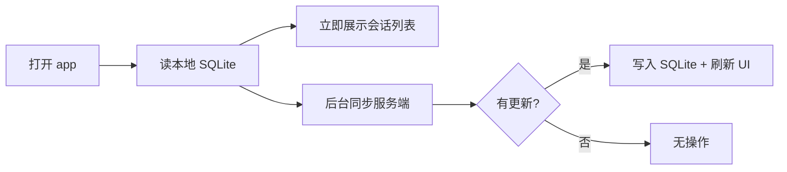
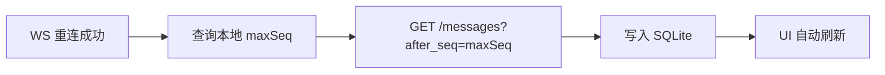
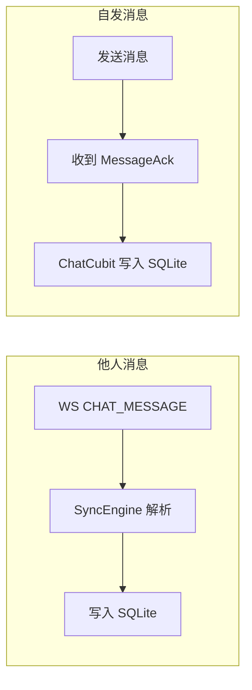
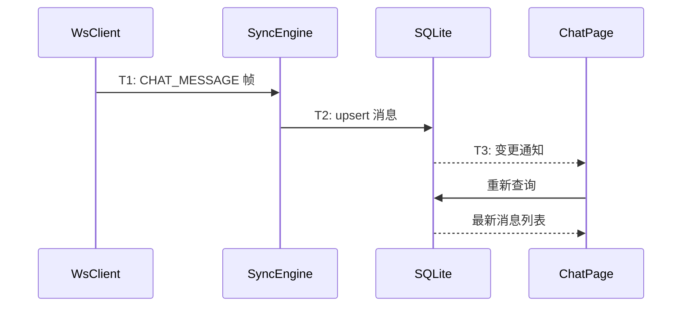
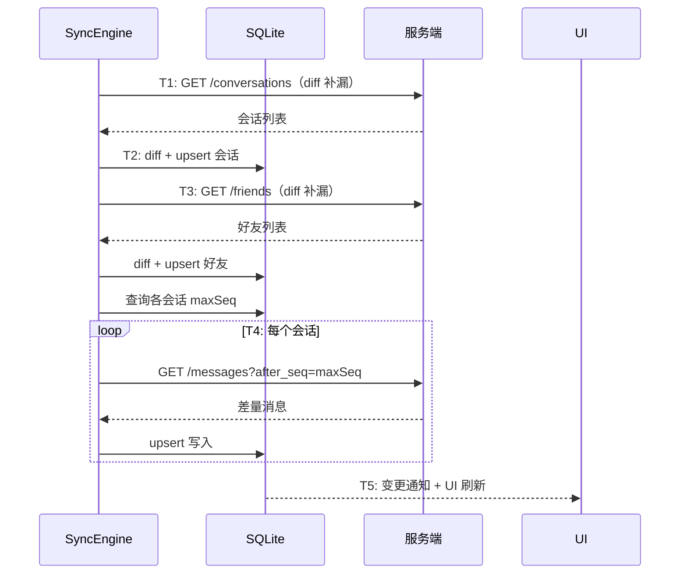

# 本地缓存与离线同步 — 功能分析

## 概述

闪讯目前完全依赖网络：打开 app 等 HTTP，进入聊天等 HTTP，翻页等 HTTP。网络慢就转圈，网络断就白屏。这一版引入本地数据库（SQLite），让客户端拥有自己的数据，实现本地优先的数据读写。

核心目标：
- 打开 app 瞬间看到会话列表和聊天记录，不等网络
- 离线时可以查看历史消息和会话列表
- 重连后自动补齐离线期间错过的消息

核心挑战：
- 数据有两份（本地 + 服务端），写入可能重复，怎么去重
- 实时推送（WS）和增量同步（HTTP）同时写入本地，怎么协调
- 首次登录本地是空的，全量拉取期间用户已经在用 app

---

## 一、交互链

### 场景 1：启动即可见

**用户故事**：作为用户，我打开 app 就想看到会话列表和聊天记录，不想等 loading。

打开 app 后，会话列表从本地 SQLite 读取，瞬间展示。后台静默向服务端同步最新数据，有更新时自动刷新 UI。用户感知不到网络请求的存在。

### 场景 2：离线浏览

**用户故事**：作为用户，没有网络时我也想翻看之前的聊天记录。

网络断开后，会话列表和已缓存的消息仍然可以正常浏览。翻页从本地 SQLite 读取。只有本地没有的更早消息才需要网络（此时提示"无网络"）。

### 场景 3：重连补漏

**用户故事**：作为用户，我离线了一段时间，重新上线后想看到离线期间的新消息。

WS 重连成功后，SyncEngine 查询每个会话的本地最大 seq，用 `after_seq` 参数向服务端请求差量消息，写入本地 SQLite。UI 自动刷新，用户看到离线期间的新消息。

### 场景 4：实时消息写入本地

**用户故事**：作为用户，收到新消息或自己发送的消息确认后，消息同时存到本地，下次打开不用重新拉取。

WS 推来的 CHAT_MESSAGE 帧（他人消息），SyncEngine 解析后写入本地 SQLite。自己发送的消息收到 MessageAck 后，ChatCubit 将已确认的消息（含真实 ID 和 seq）写入本地 SQLite。两条路径都保证消息持久化，退出聊天页再进入时消息仍在。

### 场景 5：首次登录全量拉取

**用户故事**：作为新用户或换设备用户，首次登录后需要从服务端拉取所有数据。

首次登录时本地数据库是空的。SyncEngine 先拉取会话列表写入本地，再对每个会话拉取最近消息。拉取过程中 UI 逐步展示已到达的数据。

---

## 二、逻辑树

### 数据读写链路变更

**现在（HTTP 驱动）**：

| 操作 | 链路 |
|------|------|
| 展示会话列表 | UI → ConversationRepository → Dio → 服务端 → UI |
| 展示消息列表 | UI → MessageRepository → Dio → 服务端 → UI |
| 展示好友列表 | UI → FriendRepository → Dio → 服务端 → UI |

**改造后（本地优先）**：

| 操作 | 链路 |
|------|------|
| 展示会话列表 | UI → ConversationRepository → LocalStore → UI（后台同步服务端 → LocalStore → 通知刷新） |
| 展示消息列表 | UI → MessageRepository → LocalStore → UI（后台同步服务端 → LocalStore → 通知刷新） |
| 展示好友列表 | UI → FriendRepository → LocalStore → UI（后台同步服务端 → LocalStore → 通知刷新） |

### 事件流：实时消息写入

**他人消息（SyncEngine 处理）**：

| 时刻 | 事件 | 处理 | 产生的新事件 |
|------|------|------|-------------|
| T1 | WS 收到 CHAT_MESSAGE | SyncEngine 解析 protobuf | — |
| T2 | 写入本地 SQLite | upsert by id（幂等） | CacheChangeEvent |
| T3 | UI 收到变更通知 | 从 SQLite 重新查询 | UI 刷新 |

**自发消息（ChatCubit 处理）**：

| 时刻 | 事件 | 处理 | 产生的新事件 |
|------|------|------|-------------|
| T1 | WS 收到 MessageAck | ChatCubit 解析 ACK | — |
| T2 | 更新内存消息（赋予真实 ID 和 seq） | 替换 localId | UI 刷新 |
| T3 | 通过 Repository.store 写入 SQLite | Message → CachedMessage 转换后 cacheMessages | — |

> SyncEngine 只监听 chatMessageStream（他人消息），不监听 messageAckStream。自发消息的缓存写入由 ChatCubit 在 ACK 回调中完成，因为只有 ChatCubit 持有完整的消息内容。

### 事件流：重连同步

| 时刻 | 事件 | 处理 | 产生的新事件 |
|------|------|------|-------------|
| T1 | WS 认证成功（重连） | SyncEngine 检测到 disconnected → authenticated | — |
| T2 | 同步会话列表 | 拉取会话列表，和本地 diff（新增插入、已有更新、多余删除） | CacheChangeEvent |
| T3 | 同步好友列表 | 拉取好友列表，和本地 diff | CacheChangeEvent |
| T4 | 同步消息 | 对每个有缓存的会话取本地 maxSeq，用 after_seq 拉差量 | CacheChangeEvent |
| T5 | UI 刷新 | 从 SQLite 重新查询 | — |

> 会话同步参考腾讯 IM SDK 的模式：首次登录全量拉取一次，之后靠 WS 的 ConversationUpdate 帧实时维护本地状态。重连时做一次 diff 补漏，不是每次都全量。日常运行中会话变更全部通过 WS 推送写入本地，不需要轮询。

### 设计决策

| 决策 | 方案 | 理由 |
|------|------|------|
| 本地数据库 | drift（SQLite ORM） | Flutter 生态最成熟，支持 reactive query、类型安全、代码生成 |
| 数据读取 | 本地优先 | 打开 app 瞬间有数据，不等网络 |
| 写入策略 | upsert（insertOnConflictUpdate） | 幂等，实时推送和增量同步写同一条消息不会重复 |
| 增量同步 | 消息基于 seq 的 after_seq 增量拉取；会话靠 WS 实时推送 + 重连时轻量 diff | 消息有 seq 可以精确增量；会话通过 ConversationUpdate 帧实时维护本地状态，重连后拉一次会话列表做 diff 补漏 |
| 会话同步策略 | 首次全量拉取 → 之后靠 WS ConversationUpdate 实时更新 → 重连时拉会话列表 diff | 参考腾讯 IM SDK 的模式：SDK 内部自动同步，通过回调通知变更（onNewConversation / onConversationChanged） |
| per-user 数据库 | 文件名含 userId | 切换用户时切换数据库，不需要清理 |
| 变更通知 | SyncEngine 回调（onConversationChanged / onFriendListChanged） | 参考腾讯 IM SDK 模式：同步引擎持有回调，同步完成后直接通知 Cubit 刷新 |
| 首次登录 | 先拉会话列表，再逐个拉最近消息 | 会话列表优先展示，消息逐步填充 |
| 后端改动 | GET /messages 新增 after_seq 参数 | 支持"拉本地没有的新消息"，现有 before_seq 是"拉更早的旧消息" |

---

## 三、功能编号与网络定位

### 本次新增节点

| 编号 | 功能节点 | 层级 | 简介 |
|------|---------|------|------|
| I-14 | 本地数据库 | 基础设施 | drift + SQLite，per-user 数据库，3 张缓存表 |
| F-15 | LocalStore | 前端基础 | 本地存储抽象接口 + 变更通知 Stream |
| F-16 | SyncEngine | 前端基础 | WS 事件写入本地 + 重连增量同步 |
| D-39 | 增量消息查询 | 领域 | GET /messages 新增 after_seq 参数 |

### 扩展节点

| 编号 | 扩展内容 |
|------|---------|
| P-01 | 会话列表从 HTTP 切到 SQLite 读取 |
| P-06 | 聊天页消息列表从 HTTP 切到 SQLite 读取 |
| P-20 | 好友列表从 HTTP 切到 SQLite 读取 |
| D-09 | 历史消息查询新增 after_seq 支持 |

### 前置依赖

| 依赖节点 | 依赖方式 | 是否已有 |
|----------|---------|---------|
| I-05 WS 连接管理 | SyncEngine 监听 WS 事件流 | ✅ 已有 |
| F-06 WsClient 帧分发 | SyncEngine 订阅 chatMessageStream 等 | ✅ 已有 |
| D-06 消息存储 | 增量同步依赖 messages 表的 seq | ✅ 已有 |
| D-02 会话列表查询 | 首次登录全量拉取 | ✅ 已有 |

### 边界接口

| 接口/协议 | 定义方 | 消费方 | 说明 |
|-----------|--------|--------|------|
| GET /messages?after_seq=N | D-39 | F-16 (SyncEngine) | 增量消息查询 |
| SyncEngine 回调 | F-16 (SyncEngine) | Cubit 层 | 同步完成通知（onConversationChanged / onFriendListChanged） |
| CHAT_MESSAGE WS 帧 | I-09 | F-16 (SyncEngine) | 实时消息写入本地 |

---

## 四、结论

- **开发顺序**：后端新增 after_seq 参数 → 前端新建 im_cache 模块（drift 建表 + DAO + CacheManager）→ SyncEngine（实时写入 + 重连同步）→ Repository 层改造（HTTP → SQLite）→ 首次登录全量拉取
- **复杂度集中点**：
  - SyncEngine 的重连同步：多个会话并发拉差量，和实时推送的竞争
  - Repository 层改造：所有数据读取从 HTTP 切到 SQLite，改动面大
  - 首次登录：全量拉取期间的 UI 渐进展示
- **和已有架构的关系**：新建 flash_im_cache 模块，Repository 层从"HTTP 封装"变成"LocalStore 封装"。后端只需要给 GET /messages 加一个 after_seq 参数。WsClient 的 Stream 被 SyncEngine 订阅，不修改 WsClient 本身
