# 本地缓存与离线同步 — 客户端设计报告

> 关联设计：[功能分析](../analysis.md) · [服务端设计](../server/design.md)

## 1. 目标

- 打开 app 瞬间展示会话列表和聊天记录，不等网络
- 离线时可浏览已缓存的历史消息和会话列表
- 重连后自动补齐离线期间错过的消息
- Repository 层从"HTTP 封装"变成"本地存储封装"，HTTP 退到后台同步
- 存储层可替换：上层只依赖抽象接口，不绑定具体 ORM

## 2. 现状分析

### 当前数据流

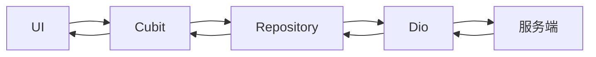

三个 Repository 全部直连 Dio：

| Repository | 模块 | 读取方式 |
|-----------|------|---------|
| ConversationRepository | flash_im_conversation | `_dio.get('/conversations')` |
| MessageRepository | flash_im_chat | `_dio.get('/conversations/$id/messages')` |
| FriendRepository | flash_im_friend | `_dio.get('/api/friends')` |

WS 实时事件由各 Cubit 直接监听处理，不经过 Repository，也不持久化。

### 问题

- 每次打开页面都要等 HTTP 响应，网络慢时白屏
- 离线时所有页面不可用
- WS 推来的消息只存在内存，退出聊天页就丢失
- 重连后没有增量同步，只能重新拉取

## 3. 架构设计

### 改造后数据流

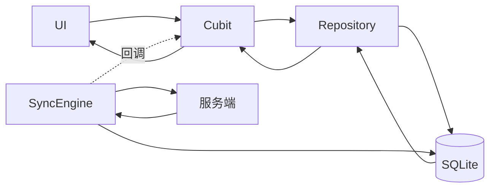

### 分层架构

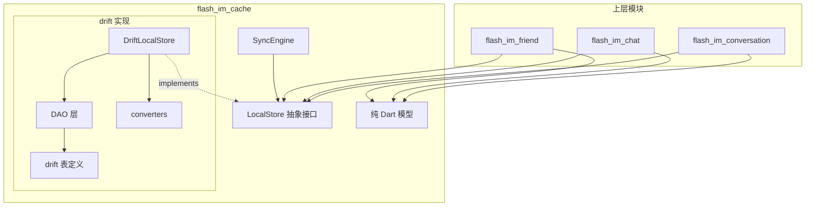

### 新增模块：flash_im_cache

```
client/modules/flash_im_cache/
├── lib/
│   ├── flash_im_cache.dart                    # barrel file
│   └── src/
│       ├── models/                            # 纯 Dart 模型（无 ORM 依赖）
│       │   ├── cached_message.dart
│       │   ├── cached_conversation.dart
│       │   └── cached_friend.dart
│       ├── local_store.dart                   # 抽象接口
│       ├── drift/                             # drift 实现（隔离）
│       │   ├── database/
│       │   │   ├── app_database.dart
│       │   │   ├── app_database.g.dart        # 代码生成
│       │   │   └── tables/
│       │   │       ├── cached_messages_table.dart
│       │   │       ├── cached_conversations_table.dart
│       │   │       └── cached_friends_table.dart
│       │   ├── dao/
│       │   │   ├── message_dao.dart
│       │   │   ├── conversation_dao.dart
│       │   │   └── friend_dao.dart
│       │   ├── drift_local_store.dart         # LocalStore 的 drift 实现
│       │   └── converters.dart                # drift 类型 ↔ 纯 Dart 模型转换
│       └── sync_engine.dart                   # 只依赖 LocalStore 接口
└── pubspec.yaml
```

### 依赖关系

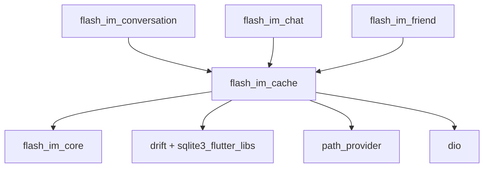

上层模块只 import `LocalStore`（接口）和 `models/`（纯 Dart 模型），不碰 drift。drift 的类型（Companion、生成类）被封锁在 `drift/` 子目录内。

## 4. 纯 Dart 模型

不依赖任何 ORM，是 LocalStore 接口的数据契约。

### CachedMessage

```dart
class CachedMessage {
  final String id;
  final String conversationId;
  final String senderId;
  final String senderName;
  final String? senderAvatar;
  final int seq;
  final int msgType;
  final String content;
  final String? extra;       // JSON 字符串
  final int status;
  final int createdAt;       // 毫秒时间戳
}
```

### CachedConversation

```dart
class CachedConversation {
  final String id;
  final int type;            // 0 单聊 1 群聊
  final String? name;
  final String? avatar;
  final String? peerUserId;
  final String? peerNickname;
  final String? peerAvatar;
  final int? lastMessageAt;  // 毫秒时间戳
  final String? lastMessagePreview;
  final int unreadCount;
  final bool isPinned;
  final bool isMuted;
  final int createdAt;
}
```

### CachedFriend

```dart
class CachedFriend {
  final String friendId;
  final String nickname;
  final String? avatar;
  final String? bio;
  final int createdAt;
}
```

## 5. LocalStore 抽象接口

```dart
enum CacheChangeType { messages, conversations, friends }

class CacheChangeEvent {
  final CacheChangeType type;
  final String? conversationId;
  const CacheChangeEvent(this.type, {this.conversationId});
}

abstract class LocalStore {
  Stream<CacheChangeEvent> get changeStream;

  // === 消息 ===
  Future<void> cacheMessages(List<CachedMessage> messages, {String? conversationId});
  Future<List<CachedMessage>> getMessages(String conversationId, {int? beforeSeq, int limit = 50});
  Future<int> getMaxSeq(String conversationId);
  Future<List<String>> getCachedConversationIds();

  // === 会话 ===
  Future<void> cacheConversations(List<CachedConversation> conversations);
  Future<List<CachedConversation>> getConversations({int limit = 100, int offset = 0});
  Future<CachedConversation?> getConversation(String id);
  Future<void> updateConversation(String id, {int? unreadCount, String? lastMessagePreview, int? lastMessageAt});
  Future<void> syncConversations(List<CachedConversation> remote);
  Future<void> deleteConversation(String id);

  // === 好友 ===
  Future<void> cacheFriends(List<CachedFriend> friends);
  Future<List<CachedFriend>> getFriends();
  Future<void> syncFriends(List<CachedFriend> remote);
  Future<void> deleteFriend(String friendId);

  // === 管理 ===
  Future<bool> isFirstLogin();
  Future<void> clearAll();
  void dispose();
}
```

接口方法签名只用纯 Dart 模型，没有任何 drift 类型。未来换数据库，写一个 `HiveLocalStore implements LocalStore`，改一行初始化代码，其他文件零改动。

## 6. DriftLocalStore 实现

### 数据库表结构

#### cached_messages_table

| 列 | 类型 | 说明 |
|----|------|------|
| id | TEXT PK | 消息 UUID |
| conversation_id | TEXT NOT NULL | 会话 ID |
| sender_id | TEXT NOT NULL | 发送者 ID |
| sender_name | TEXT NOT NULL | 发送者昵称 |
| sender_avatar | TEXT | 发送者头像 |
| seq | INTEGER NOT NULL | 序列号 |
| msg_type | INTEGER NOT NULL | 消息类型 |
| content | TEXT NOT NULL | 消息内容 |
| extra | TEXT | JSON 扩展字段 |
| status | INTEGER NOT NULL DEFAULT 0 | 消息状态 |
| created_at | INTEGER NOT NULL | 创建时间（毫秒时间戳） |

UNIQUE(conversation_id, seq)

#### cached_conversations_table

| 列 | 类型 | 说明 |
|----|------|------|
| id | TEXT PK | 会话 UUID |
| type | INTEGER NOT NULL | 0 单聊 1 群聊 |
| name | TEXT | 群名 |
| avatar | TEXT | 群头像 |
| peer_user_id | TEXT | 单聊对方 ID |
| peer_nickname | TEXT | 单聊对方昵称 |
| peer_avatar | TEXT | 单聊对方头像 |
| last_message_at | INTEGER | 最后消息时间 |
| last_message_preview | TEXT | 最后消息预览 |
| unread_count | INTEGER NOT NULL DEFAULT 0 | 未读数 |
| is_pinned | INTEGER NOT NULL DEFAULT 0 | 是否置顶 |
| is_muted | INTEGER NOT NULL DEFAULT 0 | 是否免打扰 |
| created_at | INTEGER NOT NULL | 创建时间 |

#### cached_friends_table

| 列 | 类型 | 说明 |
|----|------|------|
| friend_id | TEXT PK | 好友用户 ID |
| nickname | TEXT NOT NULL | 昵称 |
| avatar | TEXT | 头像 |
| bio | TEXT | 签名 |
| created_at | INTEGER NOT NULL | 成为好友时间 |

### per-user 数据库

数据库文件名包含 userId：`im_cache_{userId}.db`

切换用户时切换数据库文件，不需要清理旧数据。如果用同一个数据库加 userId 字段过滤，每条查询都要带 WHERE user_id = ?，容易遗漏。

### DAO 层

每张表一个 DAO，封装 drift 的 CRUD 操作。DAO 内部使用 drift 的 Companion 类型，对外通过 converters 转换为纯 Dart 模型。

### DriftLocalStore

```dart
class DriftLocalStore implements LocalStore {
  final AppDatabase _db;
  late final MessageDao _messageDao;
  late final ConversationDao _conversationDao;
  late final FriendDao _friendDao;
  final _changeController = StreamController<CacheChangeEvent>.broadcast();

  @override
  Stream<CacheChangeEvent> get changeStream => _changeController.stream;

  DriftLocalStore(this._db) {
    _messageDao = MessageDao(_db);
    _conversationDao = ConversationDao(_db);
    _friendDao = FriendDao(_db);
  }

  static Future<DriftLocalStore> open(int userId) async {
    final db = await AppDatabase.open(userId);
    return DriftLocalStore(db);
  }

  // 每个方法内部：纯 Dart 模型 → drift Companion → 写入 → 发事件
  // 或：drift 查询结果 → 纯 Dart 模型 → 返回
}
```

### 模型转换（converters.dart）

DriftLocalStore 内部的数据转换流：

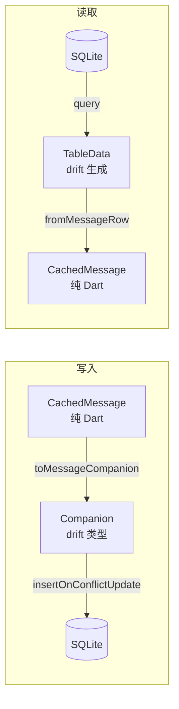

```dart
// CachedMessage（纯 Dart）→ CachedMessagesTableCompanion（drift）
CachedMessagesTableCompanion toMessageCompanion(CachedMessage m) { ... }

// CachedMessagesTableData（drift 生成）→ CachedMessage（纯 Dart）
CachedMessage fromMessageRow(CachedMessagesTableData row) { ... }

// 会话、好友同理
```

## 7. SyncEngine

同步引擎，订阅 WsClient 的事件流，将实时数据写入本地。只依赖 `LocalStore` 接口，不知道底层是 drift 还是其他实现。

### 职责

1. **实时同步**：监听 WS 事件，写入本地
   - `chatMessageStream` → upsert 消息
   - `conversationUpdateStream` → 更新会话（未读数、最后消息）
   - `friendAcceptedStream` → 新增好友
   - `friendRemovedStream` → 删除好友

> 注意：SyncEngine 只处理他人发来的消息（chatMessageStream）。自发消息的缓存写入由 ChatCubit 在收到 MessageAck 后完成——因为 ACK 只包含 messageId 和 seq，完整的消息内容（content、extra、senderName 等）只有 ChatCubit 内存中有。

2. **重连同步**：监听连接状态，disconnected → authenticated 时触发
   - 拉取会话列表，和本地 diff
   - 拉取好友列表，和本地 diff
   - 对每个有缓存的会话，取本地 maxSeq，用 `after_seq` 拉差量消息

3. **首次登录**：本地数据库为空时
   - 拉取会话列表写入本地
   - 对每个会话拉取最近消息写入本地

4. **回调通知**：同步完成后通过回调通知上层 Cubit 刷新（参考腾讯 IM SDK 模式）

### 实时消息写入

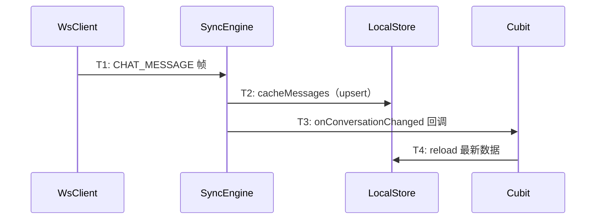

### 自发消息 ACK 写入

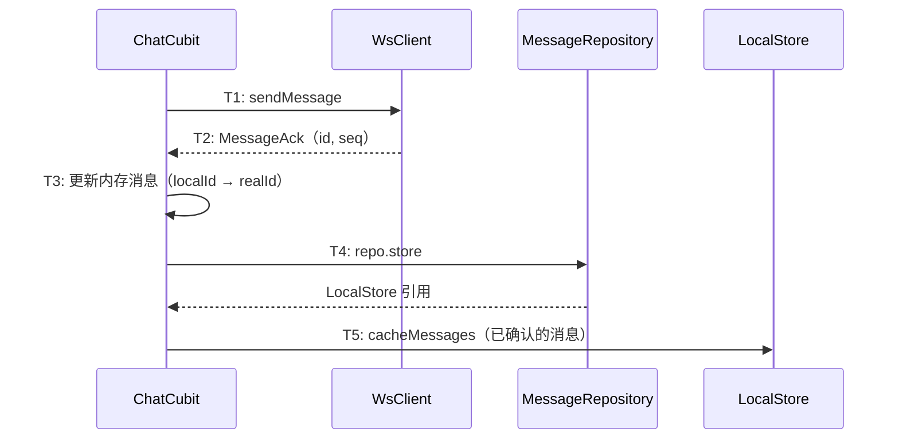

> ChatCubit 通过 `_repository.store` 获取 LocalStore 引用（MessageRepository 在登录时已被注入 store）。这样 ChatCubit 不需要自己持有 LocalStore 字段，也不需要修改构造函数。

### 回调机制

```dart
class SyncEngine {
  final LocalStore _store;
  final WsClient _wsClient;
  final Dio _dio;

  /// 回调：会话数据变更时触发
  void Function()? onConversationChanged;

  /// 回调：好友数据变更时触发
  void Function()? onFriendListChanged;

  /// 回调：消息数据变更时触发（携带会话 ID）
  void Function(String conversationId)? onMessagesChanged;

  SyncEngine({
    required LocalStore store,
    required WsClient wsClient,
    required Dio dio,
    this.onConversationChanged,
    this.onFriendListChanged,
    this.onMessagesChanged,
  });

  void start();   // 开始监听
  void dispose(); // 释放订阅
}
```

SyncEngine 每次写入 LocalStore 后，调用对应的回调。上层 Cubit 不需要知道 LocalStore 的存在，只需要在 home_page 注册回调即可。

### 冷启动时序

冷启动时 Cubit 和 SyncEngine 之间有一个短暂的时间窗口：

1. `initCache()` → 打开数据库 → SyncEngine.start()
2. home_page 创建 Cubit → 注册 SyncEngine 回调
3. Cubit.loadConversations() → 从本地读（可能是旧数据）
4. SyncEngine 后台同步完成 → 回调 → Cubit 自动 reload

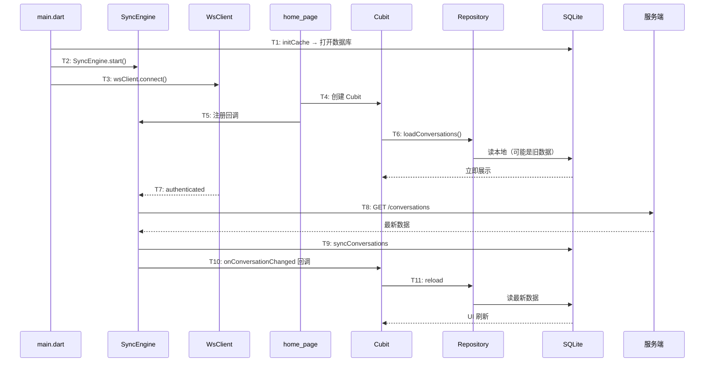

Repository 的 fallback 策略保证首次启动不白屏：本地为空时自动 fallback 到 HTTP。

### 重连同步流程

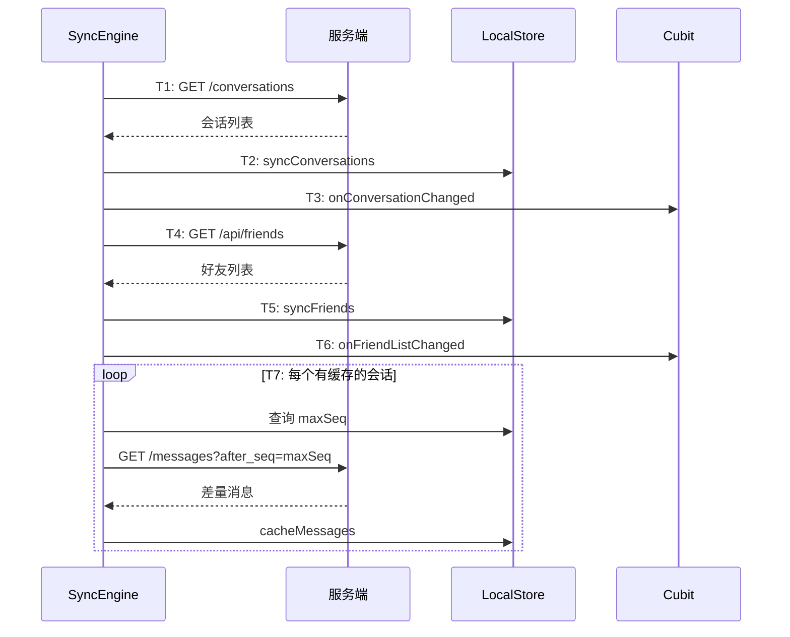

## 8. Repository 层改造

三个 Repository 的读取方法从 Dio 切到 LocalStore。写入操作（发消息、创建会话等）仍走 HTTP。

### 读取策略：本地优先 + 空数据 fallback

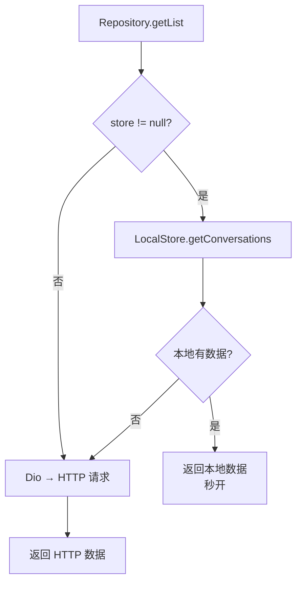

```dart
// 本地有数据 → 直接返回（秒开）
// 本地为空（首次登录）→ fallback HTTP（不白屏）
Future<List<Conversation>> getList(...) async {
  if (_store != null) {
    final cached = await _store!.getConversations(...);
    if (cached.isNotEmpty) return cached.map(_fromCached).toList();
  }
  // fallback: HTTP
  final res = await _dio.get('/conversations', ...);
  return ...;
}
```

三个 Repository 都遵循这个模式。`setStore()` 方法在登录后由 `initCache()` 注入。`store` getter 供外部获取引用。

## 9. 初始化流程

### main.dart

登录成功后初始化缓存，SyncEngine 通过全局引用暴露给 home_page 注册回调：

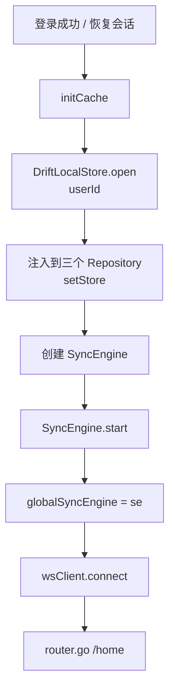

```dart
SyncEngine? globalSyncEngine; // 模块级变量

Future<void> initCache() async {
  final userId = sessionCubit.state.user!.userId;
  final localStore = await DriftLocalStore.open(userId);

  // 注入到 Repository
  conversationRepo.setStore(localStore);
  messageRepo.setStore(localStore);
  friendRepo.setStore(localStore);

  // 启动同步引擎
  syncEngine = SyncEngine(store: localStore, wsClient: wsClient, dio: httpClient.dio);
  syncEngine.start();
  globalSyncEngine = syncEngine;
}
```

### home_page.dart

页面创建 Cubit 后，注册 SyncEngine 回调：

```dart
_convCubit = ConversationListCubit(...)..loadConversations();
context.read<FriendCubit>().loadFriends();

// 注册 SyncEngine 回调
final se = globalSyncEngine;
if (se != null) {
  se.onConversationChanged = () => _convCubit.loadConversations();
  se.onFriendListChanged = () => context.read<FriendCubit>().loadFriends();
}
```

### sqlite3 hooks 配置

`sqlite3` 包 v3 默认从 GitHub 下载预编译库，release 构建时可能因网络问题失败。在主项目 `pubspec.yaml` 中配置使用 `sqlite3_flutter_libs` 提供的系统库：

```yaml
hooks:
  user_defines:
    sqlite3:
      source: system
```

## 10. 技术决策

| 决策 | 方案 | 理由 |
|------|------|------|
| 存储层抽象 | LocalStore 接口 + DriftLocalStore 实现 | 上层不绑定 ORM，未来可替换 |
| ORM | drift（当前实现） | Flutter 生态最成熟，类型安全，reactive query，代码生成 |
| 数据库隔离 | per-user 文件 | 切换用户无需清理，文件名含 userId |
| 写入策略 | upsert（insertOnConflictUpdate） | 幂等，WS 推送和增量同步写同一条消息不会重复 |
| 变更通知 | SyncEngine 回调 | 参考腾讯 IM SDK：同步引擎持有回调，同步完成后直接通知 Cubit |
| Repository 改造 | 可选 LocalStore 注入 + 空数据 fallback HTTP | 本地有数据秒开，首次登录不白屏 |
| 时间存储 | 毫秒时间戳（INTEGER） | SQLite 没有原生 DateTime，整数比较和排序更高效 |
| extra 字段 | TEXT（JSON 字符串） | 灵活，不同消息类型的 extra 结构不同 |
| 数据库损坏 | 删除重建 | 缓存数据可从服务端重新拉取，不需要修复 |
| 首次登录检测 | 查询 cached_conversations 是否为空 | 空表 = 首次登录，触发全量拉取 |
| 模型隔离 | 纯 Dart 模型在 models/，drift 类型封锁在 drift/ | 上层模块不 import drift 的任何类型 |

## 11. 变更范围

### 新建

| 文件 | 说明 |
|------|------|
| `flash_im_cache/` 整个模块 | models + LocalStore 接口 + drift 实现 + SyncEngine |

### 修改

| 文件 | 变更 |
|------|------|
| `flash_im_conversation/conversation_repository.dart` | 新增 LocalStore 注入，读取优先本地，空数据 fallback HTTP |
| `flash_im_chat/message_repository.dart` | 新增 LocalStore 注入，读取优先本地，空数据 fallback HTTP |
| `flash_im_friend/friend_repository.dart` | 新增 LocalStore 注入，读取优先本地，空数据 fallback HTTP |
| `flash_im_conversation/pubspec.yaml` | 新增 flash_im_cache 依赖 |
| `flash_im_chat/pubspec.yaml` | 新增 flash_im_cache 依赖 |
| `flash_im_friend/pubspec.yaml` | 新增 flash_im_cache 依赖 |
| `client/pubspec.yaml` | 新增 flash_im_cache 依赖 + sqlite3 hooks 配置 |
| `client/lib/main.dart` | 初始化 DriftLocalStore + SyncEngine + 全局引用 |
| `client/lib/src/home/view/home_page.dart` | 注册 SyncEngine 回调 |

### 不修改

| 文件 | 原因 |
|------|------|
| WsClient | SyncEngine 订阅它的 Stream，不改它 |
| ConversationListCubit | WS 事件处理逻辑保留，SyncEngine 通过回调触发 reload |
| FriendCubit | 同上 |

### 补充修改（自发消息缓存）

| 文件 | 变更 |
|------|------|
| `flash_im_chat/message_repository.dart` | 新增 `LocalStore? get store` getter，暴露 store 引用供 ChatCubit 使用 |
| `flash_im_chat/chat_cubit.dart` | `_handleMessageAck` 中 ACK 确认后通过 `_repository.store` 将消息写入本地缓存；新增 `flash_im_cache` import |

## 12. 验收标准

| 验收条件 | 验收方式 |
|----------|----------|
| 打开 app 瞬间看到会话列表（不等 HTTP） | 手动测试：断网后打开 app |
| 进入聊天页瞬间看到历史消息 | 手动测试：断网后进入聊天 |
| 收到新消息后退出再进入，消息仍在 | 手动测试 |
| 自己发送的消息退出再进入，消息仍在 | 手动测试：发送消息 → 退出聊天页 → 重新进入 |
| 离线后重连，自动补齐缺失消息 | 手动测试：断网 → 另一端发消息 → 恢复网络 |
| 首次登录全量拉取后本地有数据 | 手动测试：清除 app 数据后登录 |
| 上层模块不 import drift 的任何类型 | 代码审查 |
| flutter analyze 无错误 | 命令行验证 |
