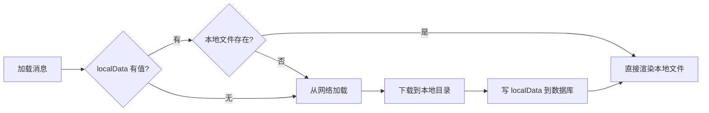
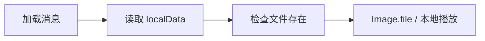
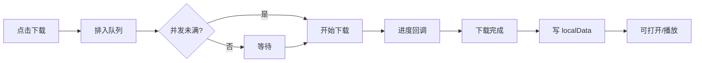
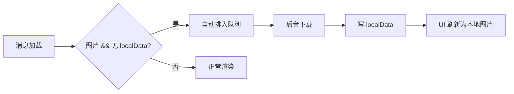
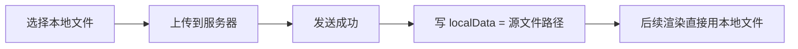

# 文件缓存机制 — 功能分析

## 概述

当前文件类消息（图片、语音、视频、文件）每次展示都从网络加载，下载后的本地路径不持久化。关闭聊天页再打开，同一个文件要重新下载。本次迭代建立文件缓存机制：下载后持久化本地路径到消息数据库，下次展示直接从本地加载。

---

## 一、交互链

### 场景 1：首次查看文件类消息

**用户故事**：作为闪讯用户，我打开聊天看到一张图片/一段语音/一个视频，App 应该自动下载并在本地保存，下次不再重复下载。

打开聊天 → 加载消息列表 → 检查该消息的 localData → 无本地缓存 → 从网络下载（图片自动、文件手动触发）→ 保存到 `{appSupportDir}/UserData/{userId}/{类型}/` → 写 localData 到数据库 → 渲染本地文件。

### 场景 2：再次查看已缓存的消息

**用户故事**：作为闪讯用户，我之前看过的图片/语音/文件，再次打开聊天时应该立即显示，不用等网络。

打开聊天 → 加载消息列表 → 检查 localData → 有值 → 检查文件是否存在 → 存在 → 直接 Image.file / 本地播放 / 打开文件。

### 场景 3：文件下载（手动触发）

**用户故事**：作为闪讯用户，我收到一个文件消息，点击下载按钮后能看到进度，下载完直接打开。

点击下载 → 排入下载队列 → 队列调度（并发控制）→ 下载中显示进度 → 下载完成 → 写 localData → 可打开。

### 场景 4：图片消息自动下载

**用户故事**：作为闪讯用户，图片消息应该自动下载，不需要我手动点击。

消息加载 → 发现是图片类型且无 localData → 自动排入下载队列 → 后台下载 → 完成后从 loading 切换为本地图片。

### 场景 5：本地发送的文件直接标记

**用户故事**：作为闪讯用户，我发送的图片/语音/视频/文件本来就在我的设备上，发送成功后不应该再从服务器下载回来。

选择文件发送 → 上传成功 → 将本地源文件路径（或复制到 UserData 目录后的路径）直接写入 localData → 该消息永远从本地加载。

---

## 二、逻辑树

### 事件流：文件下载与缓存

| 时刻 | 事件 | 处理 | 产生的新事件 |
|------|------|------|-------------|
| T1 | 消息渲染，检测 localData | 解析 JSON，检查 path 字段 | 有/无本地缓存 |
| T2a | 无缓存 + 图片类型 | 自动提交到 FileCacheManager.getFile(url) | 排入下载队列 |
| T2b | 无缓存 + 文件/视频类型 | 等用户点击下载按钮 | 手动触发 |
| T3 | 下载队列调度 | 检查并发数 < maxConcurrent → 开始下载 | HTTP 下载开始 |
| T4 | 下载进行中 | 流式写入本地文件，回调进度 | UI 更新进度条 |
| T5 | 下载完成 | 文件存入 `UserData/{userId}/{type}/{messageId}.ext` | 文件落盘 |
| T6 | 写 localData | 更新 CachedMessagesTable.localData = JSON | 数据库更新 |
| T7 | 通知 UI | Stream/回调通知气泡组件刷新 | 渲染本地文件 |

### 事件流：本地发送文件标记

| 时刻 | 事件 | 处理 | 产生的新事件 |
|------|------|------|-------------|
| T1 | 用户选择本地文件发送 | 记录本地源文件路径 | 上传开始 |
| T2 | 上传成功，消息确认 | 将源文件路径写入 localData（或先复制到 UserData 目录） | 数据库更新 |
| T3 | 后续渲染该消息 | localData 有值 → 直接用本地文件 | 无需下载 |

### 事件流：URL 去重

| 时刻 | 事件 | 处理 | 产生的新事件 |
|------|------|------|-------------|
| T1 | 请求下载 URL=A | 检查 _downloading Map | URL 不在进行中 → 开始下载 |
| T2 | 再次请求下载 URL=A | 检查 _downloading Map | URL 已在进行中 → 共享同一个 Future |
| T3 | URL=A 下载完成 | 从 _downloading Map 移除 | 所有等待者都拿到结果 |

### 状态流转

| 实体 | 触发事件 | 前状态 | 后状态 |
|------|---------|--------|--------|
| 文件缓存条目 | 首次请求下载 | none | downloading |
| 文件缓存条目 | 下载完成 + 写 localData | downloading | cached |
| 文件缓存条目 | 文件被清理（手动/系统） | cached | none（localData 清除） |
| 下载队列 | 提交新任务 | idle | queued / downloading |
| 下载队列 | 任务完成 | downloading | idle（取下一个） |

---

## 三、功能编号与网络定位

### 本次新增节点

| 编号 | 功能节点 | 层级 | 模块 | 简介 |
|------|---------|------|------|------|
| F-18 | 文件缓存管理器 | 前端基础层 | flash_im_cache (cache_manager/) | 下载队列 + 并发控制 + URL 去重 + 本地路径持久化 |

### 前置依赖

| 依赖节点 | 依赖方式 | 是否已有 |
|----------|---------|---------|
| I-14 本地数据库 | CachedMessagesTable 加 localData 列 | ✅（需加列） |
| F-15 LocalStore | 写入/读取 localData 字段 | ✅（需扩展） |
| P-12~P-14 图片/视频/文件气泡 | 渲染时检查 localData | ✅（需改造） |

### 边界接口

| 接口 | 定义方 | 消费方 | 说明 |
|------|--------|--------|------|
| FileCacheManager（抽象） | flash_im_cache | ChatCubit / 气泡组件 | getFile(url) → 本地路径 |
| DownloadFunction 回调 | 使用方注入 | FileCacheManager | 实际下载能力（dio.download） |
| CachedMessagesTable.localData | flash_im_cache_drift | FileCacheManager / LocalStore | JSON 字段存储本地文件信息 |

---

## 四、结论

- **开发顺序**：数据库加列 → FileCacheManager 接口+实现 → 图片气泡改造（自动下载）→ 文件/视频/语音气泡改造（手动触发+进度）→ ChatCubit 集成
- **复杂度集中点**：
  - 并发队列 + URL 去重（参考 flutter_cache_manager 的 WebHelper 模式）
  - localData JSON 设计（需兼容未来扩展：缩略图路径、转码状态等）
  - 气泡组件改造（从 Image.network 改为优先 Image.file，需处理加载态切换）
- **暂不实现**：
  - 缓存大小限制 / 自动清理（当前阶段用户量小，不需要 LRU）
  - 缩略图独立缓存（图片直接缓存原图）
  - 断点续传（文件不会太大，限制 50MB，重新下载可接受）
  - 后台预下载（只在消息可见时触发）

### 补充说明（实现阶段新增）

- **视频封面图自动缓存**：视频消息加载时同时缓存 thumbnail_url，localData 扩展为 `{path, thumbnail_path, cached_at}`
- **音频消息自动缓存**：音频文件较小，加载时自动后台下载
- **桌面端右键菜单**：文件已缓存时增加「另存为」和「打开文件夹」操作
- **桌面端文件点击**：已缓存直接打开，未缓存立即下载后打开
- **桌面端视频点击**：已缓存系统播放器打开，未缓存下载后打开
- **发送大小限制**：图片/视频/文件 ≤ 50MB，音频 ≤ 2 分钟，可配置（FileSendLimits）
