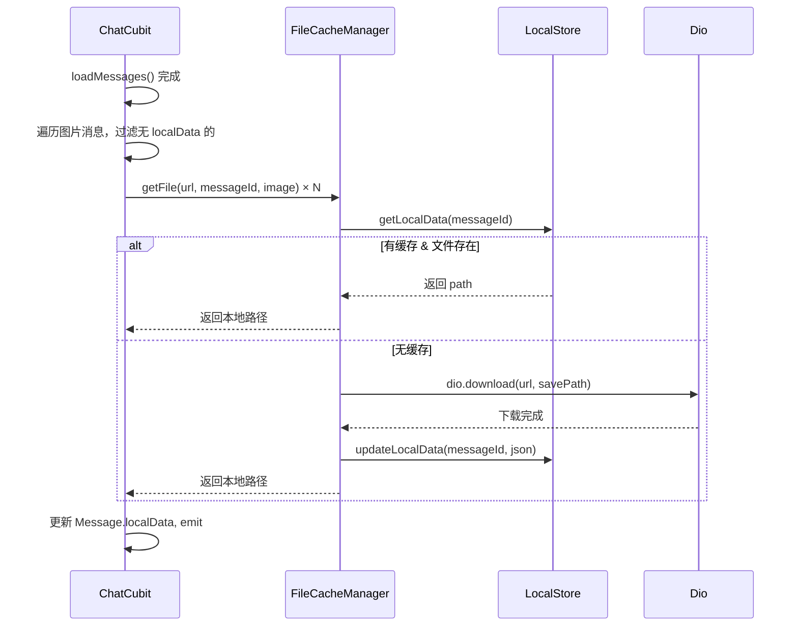
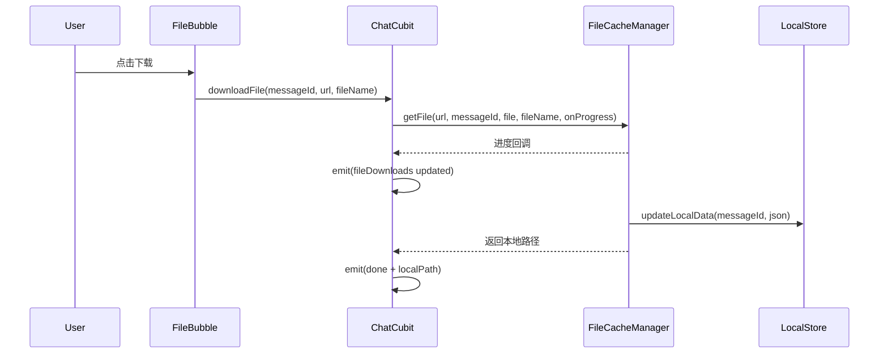
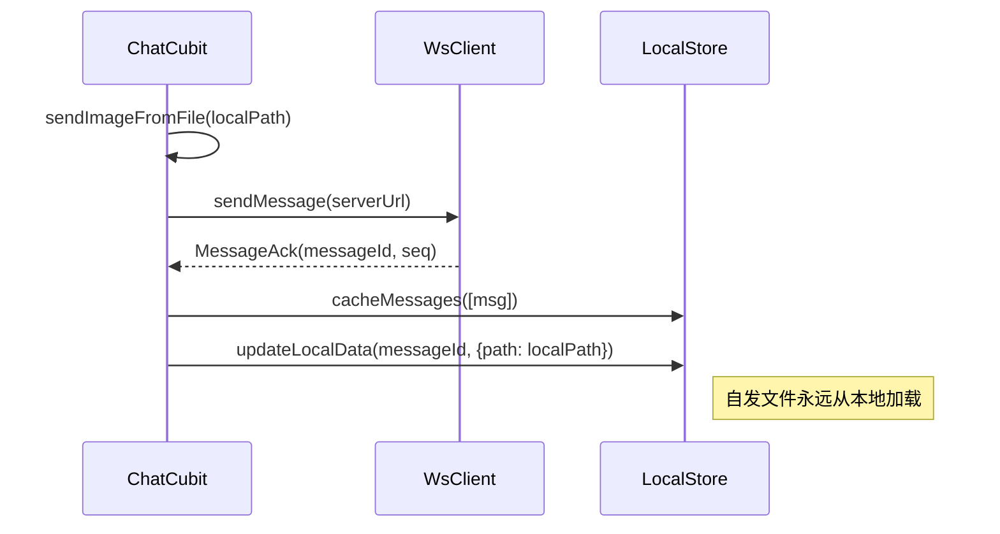
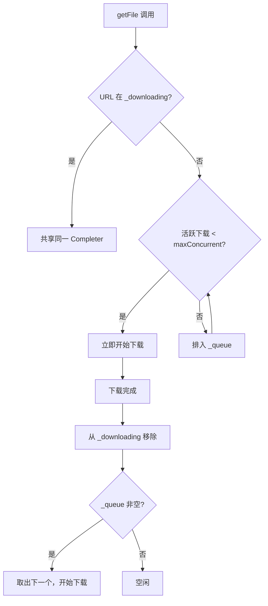

# 文件缓存机制 — 前端设计报告

> 关联设计：[im/cache v0.0.2 分析](../analysis.md)

## 1. 目标

- 下载后将文件本地路径持久化到数据库 `localData` 字段，下次直接从本地加载
- 提供 `FileCacheManager` 下载队列：并发控制 + URL 去重 + 进度回调
- 图片/音频消息自动下载；文件消息手动触发下载后缓存；视频封面自动缓存
- 本地发送的文件直接将源路径写入 `localData`，不二次下载
- 气泡组件改造：优先 `Image.file` / 本地路径播放，fallback 网络加载
- 桌面端增强：右键菜单「另存为 / 打开文件夹」、文件点击直接打开、视频点击系统播放
- 发送大小限制：图片/视频/文件 ≤ 50MB，音频 ≤ 2 分钟（可配置）

## 2. 现状分析

### 已有能力

| 能力 | 位置 | 状态 |
|------|------|------|
| 消息本地缓存（CachedMessagesTable） | flash_im_cache_drift | ✅ |
| LocalStore 抽象 + DriftLocalStore 实现 | flash_im_cache / _drift | ✅ |
| ChatFileMixin 文件发送/下载 | flash_im_chat/logic | ✅ |
| FileDownloadInfo 下载状态管理 | chat_state.dart | ✅ |
| 图片/视频/文件/语音气泡 | flash_im_chat/view/bubble/ | ✅ |

### 存在问题

1. **无本地路径持久化**：`CachedMessagesTable` 没有 `localData` 列，下载后的路径只在 ChatCubit 内存 `fileDownloads` Map 中，退出即丢失。
2. **每次重复下载**：同一张图片每次打开聊天都从网络重新加载。
3. **文件下载存临时目录**：`ChatFileMixin._getDownloadDir()` 用 `getTemporaryDirectory()`，系统可能随时清理。
4. **无并发控制**：多图片同时触发下载时没有队列管理。
5. **本地发送无标记**：发送图片/文件后，消息 content 从本地路径变为服务器 URL，后续渲染走网络。

## 3. 数据模型与接口

### 数据模型

#### CachedMessagesTable 新增列

```sql
ALTER TABLE cached_messages_table ADD COLUMN local_data TEXT;
```

`localData` 存储 JSON，结构：

```json
{
  "path": "/data/user/0/.../UserData/123/image/msg_abc.jpg",
  "thumbnail_path": "/data/user/0/.../UserData/123/image/msg_abc_thumb.jpg",
  "cached_at": 1718000000000
}
```

| 决策 | 理由 |
|------|------|
| 单列 JSON 而非独立表 | 1:1 关系，无需 JOIN，KISS |
| path + thumbnail_path + cached_at | 视频需要存封面路径，图片/音频/文件只用 path |
| 不存文件大小/格式 | 已在 message.extra 中，无需冗余 |

#### CachedMessage 模型扩展

```dart
class CachedMessage {
  // ... 现有字段 ...
  final String? localData; // 新增：JSON 字符串
}
```

#### FileCacheManager 核心类

```dart
/// 文件缓存管理器
///
/// 下载队列 + 并发控制 + URL 去重 + 本地路径持久化。
/// 位于 flash_im_cache 包（纯 Dart + dart:io，不依赖 Flutter/drift）。
/// 注意：依赖 dart:io（File 类），Web 平台不适用（本版本暂不支持 Web 缓存）。
abstract class FileCacheManager {
  /// 获取文件本地路径。
  /// 如已缓存且文件存在，直接返回路径；否则排入下载队列。
  /// [onProgress] 下载进度回调 0.0~1.0
  Future<String> getFile({
    required String url,
    required String messageId,
    required FileCategory category,
    String? fileName,
    void Function(double)? onProgress,
  });

  /// 直接写入 localData（发送场景：文件已在本地，无需下载）
  Future<void> markLocal({
    required String messageId,
    required String localPath,
  });

  /// 手动清除某消息的本地缓存
  Future<void> clearCache(String messageId);

  /// 释放资源
  void dispose();
}

enum FileCategory { image, video, audio, file }
```

| 决策 | 理由 |
|------|------|
| 去掉 batchCheckLocal | 批量预检由 LocalStore.batchGetLocalData 完成，FCM 不重复封装 |
| 新增 markLocal | 发送场景需要直接标记本地路径，无需经过下载队列 |
| 标注 dart:io 依赖 | 明确 Web 平台不适用，避免误解"纯 Dart"的含义 |

### 接口契约

本功能纯前端，无新增 API。复用现有文件 URL 即可。

## 4. 核心流程

### 流程 1：图片消息自动缓存

图片自动下载的触发时机：在 `ChatCubit.loadMessages()` 完成后，遍历消息列表，对所有图片类型且无 localData 的消息批量调用 `FileCacheManager.getFile()`。不在 Widget build 中触发（避免 StatelessWidget 发起异步）。



### 流程 2：文件消息手动下载



### 流程 3：发送文件时直接标记



### 流程 4：下载队列并发控制



## 5. 项目结构与技术决策

### 项目结构

```
flash_im_cache/lib/src/
├── models/
│   └── cached_message.dart          # +localData 字段
├── local_store.dart                  # +updateLocalData() 方法
├── file_cache_manager.dart           # [新增] 抽象接口 + FileCategory + DownloadFunction
├── file_cache_manager_impl.dart      # [新增] 队列实现（dart:io，原生平台）
└── noop_file_cache_manager.dart      # [新增] 空实现（Web 平台，所有方法 no-op）

flash_im_cache_drift/lib/src/
├── database/tables/
│   └── cached_messages_table.dart    # +localData 列
├── database/app_database.dart        # schemaVersion 2→3, migration
├── dao/message_dao.dart              # +updateLocalData(), +getLocalData()
└── converters.dart                   # localData 字段映射

flash_im_chat/lib/src/
├── logic/
│   ├── chat_cubit.dart               # 注入 FileCacheManager + baseUrl, 图片/视频封面/音频自动缓存
│   └── chat_file_mixin.dart          # downloadFile 改用 FCM; 发送后写 localData; FileSendLimits 校验
└── view/
    ├── bubble/
    │   ├── image_bubble.dart         # 优先本地路径渲染
    │   ├── video_bubble.dart         # 缩略图优先本地
    │   ├── audio_bubble.dart         # 音频路径优先本地
    │   ├── file_bubble.dart          # 下载完成后标记本地
    │   └── message_bubble.dart       # 解析 localData + debug 面板 + 右键菜单传 localPath
    ├── desktop_context_menu.dart     # [改造] +localPath, 已缓存时显示另存为/打开文件夹
    └── chat_page.dart                # [改造] 文件/视频点击行为、_safeSend 限制提示

main.dart                             # globalFileCacheManager 初始化 + 注入
home_actions_mixin.dart               # ChatCubit 创建时传入 fileCacheManager + baseUrl
```

### 职责划分

```
ImageBubble / FileBubble (View)
    ↓ 读 localData / 请求下载
ChatCubit + ChatFileMixin (Logic)
    ↓ 调用 FileCacheManager
FileCacheManager (Service)
    ↓ 队列管理 + 下载 + 持久化
LocalStore (Data)
    ↓ updateLocalData / getLocalData
DriftLocalStore → MessageDao (Infra)
```

- View 层**不直接调用** FileCacheManager，通过 Cubit 中转（保持分层一致性）
- FileCacheManager 通过构造注入 `DownloadFunction` 和 `LocalStore`，不依赖 dio / drift
- 图片自动缓存在 `loadMessages()` 完成后由 Cubit 触发，不在 Widget build 中发起异步

### 技术决策

| 决策 | 方案 | 理由 |
|------|------|------|
| FileCacheManager 放置位置 | flash_im_cache 包 | 纯 Dart + dart:io，不依赖 Flutter/drift，可单测（Web 平台不适用） |
| Web 平台兼容 | 提供 `NoOpFileCacheManager` 空实现 | Web 平台无 dart:io，给空实现避免条件编译，getFile 直接返回原始 URL |
| 下载能力注入方式 | 构造函数传入 `Future<void> Function(String url, String savePath, {void Function(double)?})` | 解耦 dio，方便 mock |
| 并发数 | maxConcurrent = 3 | 移动端带宽有限，3 个够用 |
| 存储路径 | `{appSupportDir}/UserData/{userId}/{category}/{messageId}.{ext}` | 不会被系统清理，按用户隔离 |
| URL 去重 | `Map<String, Completer<String>>` | 同一 URL 多处请求共享一个下载 Future |
| localData 更新时机 | 下载完成后立即写 | 保证即使 App 闪退，已下载的文件不丢 |

### 第三方依赖

| 依赖 | 用途 | 已有/需新增 |
|------|------|------------|
| dio | HTTP 下载 | ✅ 已有 |
| path_provider | 获取 appSupportDir | ✅ 已有 |
| path | 文件路径操作 | ✅ 已有 |
| drift / drift_flutter | 数据库 | ✅ 已有 |

无需新增依赖。

## 6. 调试支持

### 双击消息 Debug 面板

桌面端双击消息气泡弹出的 debug 面板中，新增 `localData` 信息展示：

- **localData**：原始 JSON 字符串（无值时显示 `null`）
- **本地路径**：解析后的 path 值
- **缓存时间**：cached_at 格式化为可读时间
- **文件存在**：检查本地文件是否实际存在（✅ / ❌）

便于开发调试时快速确认缓存状态，无需手动查数据库。

## 7. 验收标准

| 验收条件 | 验收方式 |
|----------|----------|
| 编译通过 | `flutter analyze` 无 error |
| 数据库迁移成功 | App 启动无崩溃，schema_version=3 |
| 图片消息首次打开后缓存 | 第二次打开聊天页，Network tab 无图片请求 |
| 视频封面图自动缓存 | 打开聊天后视频缩略图从本地加载 |
| 音频消息自动缓存 | 打开聊天后语音可断网播放 |
| 文件下载后写 localData | 查看 SQLite 数据库 localData 列有值 |
| 并发控制生效 | 同时 10 张图片，最多 3 个并行下载 |
| URL 去重 | 同一图片 URL 只下载一次 |
| 发送图片后 localData 标记 | 发送后退出重进，图片从本地加载 |
| 文件不存在时 fallback 网络 | 手动删除缓存文件后重新打开，自动重新下载 |
| 桌面端右键菜单 | 已缓存文件右键显示「另存为」「打开文件夹」 |
| 桌面端文件点击 | 已缓存直接打开，未缓存下载后打开 |
| 桌面端视频点击 | 已缓存系统播放器打开，未缓存下载后打开 |
| 发送超限提示 | 发送 >50MB 文件弹出 toast 提示 |
| Debug 面板显示 localData | 双击消息可看到本地路径、缓存时间、文件存在状态 |

## 8. 暂不实现

| 功能 | 理由 |
|------|------|
| 缓存大小限制 / LRU 清理 | 当前用户量小，不需要自动清理 |
| 断点续传 | 文件限制 50MB，重下载可接受 |
| 后台预下载 | 只在消息可见时触发，避免浪费流量 |
