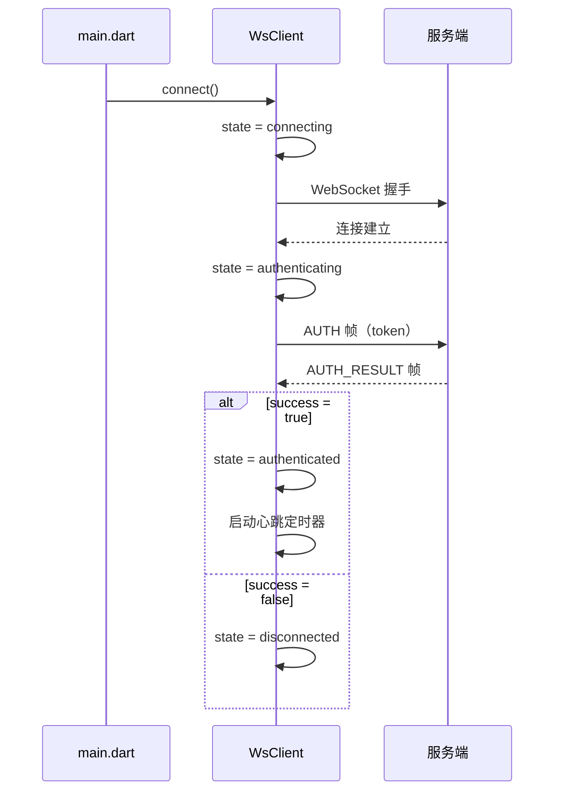
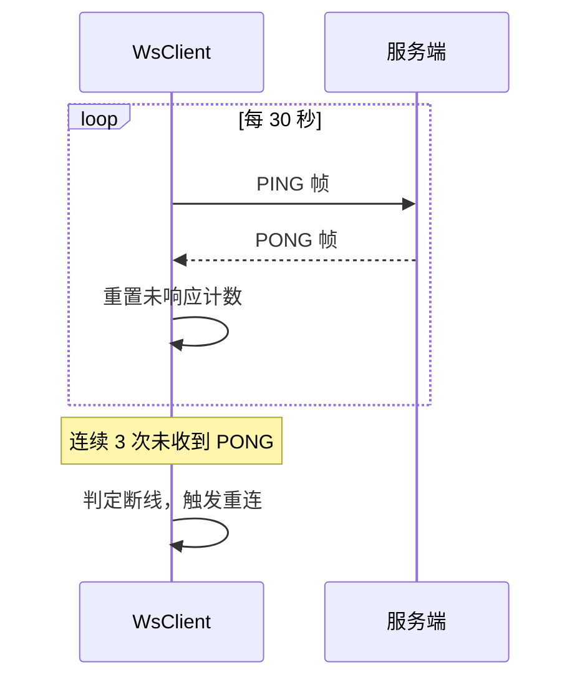
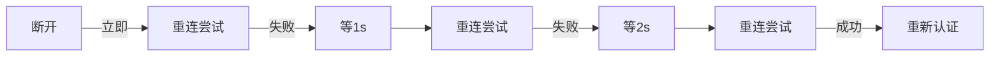
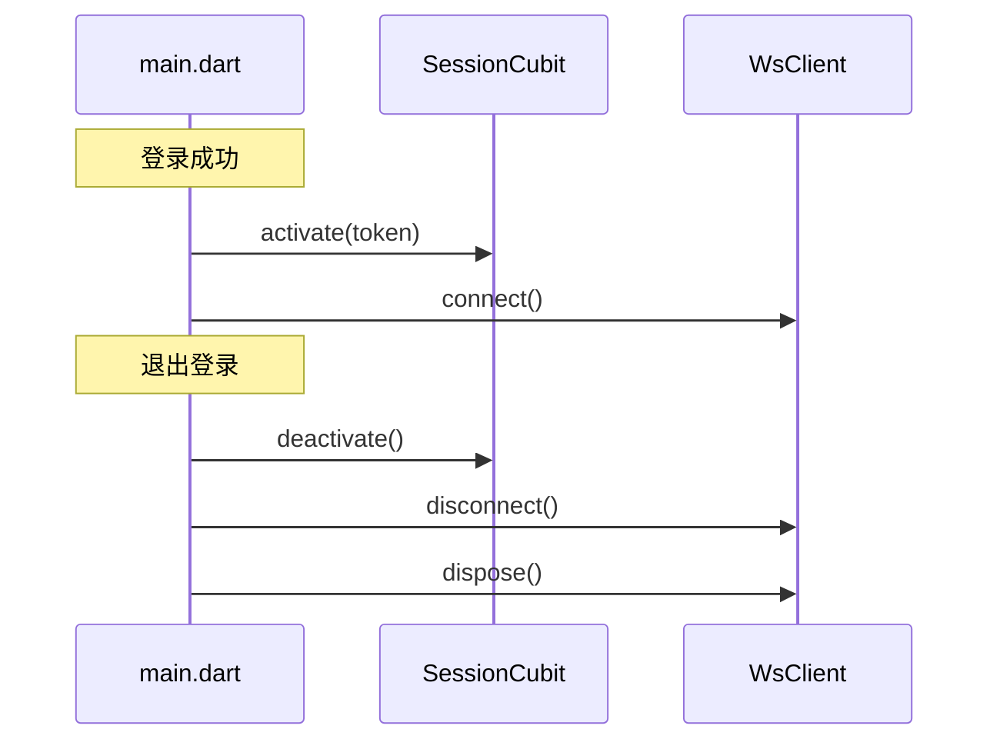

---
module: im-core
version: v0.0.1
date: 2026-03-28
tags: [websocket, protobuf, 连接管理, 心跳, 重连, flutter]
---

# IM Core — 客户端设计报告

> 关联设计：[im-proto v0.0.1 client](../../../proto/v0.0.1/client/design.md) | [im-core v0.0.1 server](../server/design.md)

## 1. 目标

- 在 flash_im_core 模块的 logic 层实现 WebSocket 管理器（WsClient）
- 实现 Protobuf 帧协议通信（替代旧的 JSON 文本）
- 实现帧内认证（连接后自动发送 AUTH 帧）
- 实现心跳保活（定时 PING，监测 PONG）
- 实现断线自动重连（指数退避策略）
- 在 data 层添加 IM 配置（ImConfig）
- 在 main.dart 中集成：登录后连接，退出时断开
- 在 view 层提供连接状态指示器组件（WsStatusIndicator），主界面顶部展示连接状态

## 2. 现状分析

### 已有能力

- flash_im_core 模块已创建（标准 Flutter package），三层架构就位
- data/proto/ 下已有 Protobuf 生成代码（WsFrame、WsFrameType、AuthRequest、AuthResult）
- SessionCubit 已有 activate/deactivate 机制，可在登录/退出时触发连接/断开
- HttpClient 已有 tokenProvider 闭包模式，WsClient 可复用同样的模式获取 Token

### 需要解决的问题

- logic 层为空，没有 WebSocket 管理器
- 没有心跳机制和重连逻辑
- main.dart 中没有任何 WebSocket 相关代码

## 3. 数据模型与接口

### 核心数据类

| 类 | 位置 | 说明 |
|----|------|------|
| ImConfig | data/im_config.dart | WebSocket 地址、心跳间隔、重连参数 |
| WsClient | logic/ws_client.dart | WebSocket 管理器 |
| WsConnectionState | logic/ws_client.dart | 连接状态枚举 |

### WsStatusIndicator 组件

连接状态指示器，放在主界面顶部。监听 WsClient 的 stateStream，根据状态显示不同样式：

| 状态 | 显示 |
|------|------|
| disconnected | 红色条："连接已断开，正在重连..." |
| connecting | 橙色条："正在连接..." |
| authenticating | 橙色条："正在认证..." |
| authenticated | 不显示（隐藏） |

点击断开状态的条可以手动触发重连。authenticated 状态下指示器完全隐藏，不占空间。

### WsConnectionState 枚举

| 值 | 说明 |
|----|------|
| disconnected | 未连接 |
| connecting | 正在连接 |
| authenticating | 已连接，正在发送 AUTH 帧 |
| authenticated | 认证成功，可收发消息 |

### ImConfig

| 字段 | 类型 | 默认值 | 说明 |
|------|------|--------|------|
| wsUrl | String | 从 AppConfig 构建 | WebSocket 地址 |
| heartbeatInterval | Duration | 30 秒 | 心跳间隔 |
| heartbeatTimeout | int | 3 | 连续未收到 PONG 的次数上限 |
| reconnectBaseDelay | Duration | 1 秒 | 重连基础延迟 |
| reconnectMaxDelay | Duration | 30 秒 | 重连最大延迟 |

### WsClient 对外接口

| 方法/属性 | 说明 |
|----------|------|
| connect() | 建立连接并自动认证 |
| disconnect() | 主动断开连接 |
| sendFrame(WsFrame) | 发送帧 |
| stateStream | 连接状态流（Stream\<WsConnectionState\>） |
| frameStream | 收到的帧流（Stream\<WsFrame\>），业务层按 type 过滤 |
| dispose() | 释放所有资源 |

## 4. 核心流程

### 连接与认证



### 心跳与断线检测



### 断线重连（指数退避）



重连成功后自动重新发送 AUTH 帧。用户主动调用 disconnect() 时不触发重连。

### 与 main.dart 的集成



## 5. 项目结构与技术决策

### 项目结构

```
client/modules/flash_im_core/lib/
├── flash_im_core.dart              # barrel 导出
└── src/
    ├── data/
    │   ├── proto/                  # Protobuf 生成代码（已有）
    │   └── im_config.dart          # IM 配置
    ├── logic/
    │   └── ws_client.dart          # WebSocket 管理器
    └── view/
        └── ws_status_indicator.dart # 连接状态指示器组件
```

### 职责划分

| 层 | 文件 | 职责 |
|----|------|------|
| data | im_config.dart | 配置参数，纯数据 |
| data | proto/ | Protobuf 编解码，自动生成 |
| logic | ws_client.dart | 连接管理、认证、心跳、重连、帧收发、事件分发 |
| view | ws_status_indicator.dart | 连接状态指示器，监听 stateStream，展示当前连接状态 |

WsClient 不依赖任何 UI 组件，不依赖 SessionCubit。它通过 tokenProvider 闭包获取 Token，与认证模块解耦。

### 关键设计决策

| 决策 | 方案 | 理由 |
|------|------|------|
| Token 获取 | tokenProvider 闭包 | 与 HttpClient 一致，不依赖 SessionCubit |
| 事件分发 | StreamController.broadcast | 多个监听者可同时订阅，页面级订阅/取消订阅 |
| 帧流 | 暴露原始 WsFrame 流 | 业务层自行按 type 过滤，WsClient 不关心业务语义 |
| 重连策略 | 指数退避（1s → 2s → 4s → ... → 30s） | 快速恢复 + 避免风暴 |
| WebSocket 库 | web_socket_channel | Flutter 生态主流，已在项目中验证过 |
| 生命跨度 | 会话级（登录创建，退出销毁） | 第 17 篇的设计原则 |

### 第三方依赖

| 依赖 | 用途 | 已有/需新增 |
|------|------|-----------|
| protobuf | Protobuf 运行时 | 已有 |
| web_socket_channel | WebSocket 连接 | 需新增 |

### barrel 导出更新

flash_im_core.dart 需要新增导出：

- `ImConfig`
- `WsClient`
- `WsConnectionState`
- `WsStatusIndicator`

## 6. 验收标准

- 登录后自动连接 WebSocket，stateStream 输出 authenticated
- 心跳正常运行（PING 帧定时发出，收到 PONG 帧，控制台有日志）
- 断开网络后自动重连，重连成功后重新认证，状态恢复为 authenticated
- 退出登录后连接断开（调用 disconnect），不再触发重连，后端打印断开日志
- 消息 Tab 顶部栏显示用户头像（圆形白色外框）+ 昵称 + 连接状态圆点
- 底部导航栏为自定义样式（白色背景 + 顶部细线 + 主色高亮）
- `flutter analyze` 零 error

## 7. 暂不实现

> 给 AI 编码画红线，防止过度发挥。

| 功能 | 理由 |
|------|------|
| 消息相关事件流（messageStream 等） | 属于消息收发版本，当前只暴露原始 frameStream |
| 会话更新流、好友事件流 | 属于后续功能版本 |
| 多端登录管理 | 客户端不需要管理，服务端负责 |
