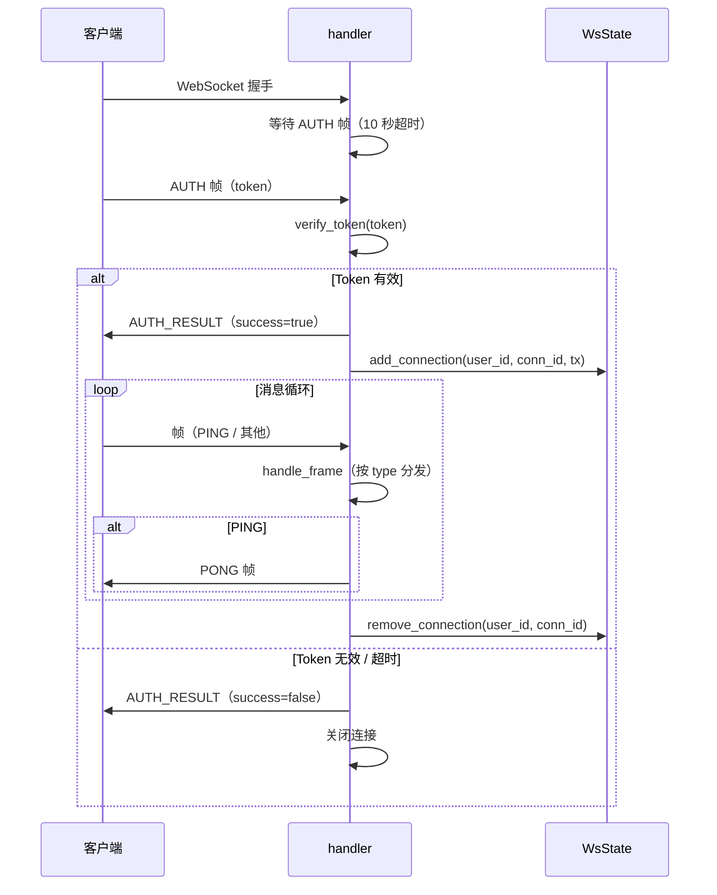

# IM Core — 服务端设计报告

> 关联设计：[im-proto v0.0.1 server](../../../proto/v0.0.1/server/design.md) | [im-core v0.0.1 client](../client/design.md)

## 1. 目标

- 在 im-ws crate 中实现 Protobuf 帧协议的 WebSocket 连接处理
- 实现帧内认证（AUTH 帧替代 JSON 首消息认证）
- 实现心跳机制（PING/PONG 帧）
- 实现帧分发器骨架（当前只处理 PING，后续版本扩展）
- 在 main.rs 中注册新的 WebSocket 路由 `/ws/im`
- 删除旧的 server/src/ws/ 目录（JSON 聊天室已被新协议替代）

## 2. 现状分析

### 已有能力

- im-ws crate 已创建，包含 proto 生成代码（WsFrame、WsFrameType、AuthRequest、AuthResult）
- flash-core 已有 `verify_token()` 函数，可直接复用于 Protobuf 认证
- server/src/ws/auth.rs 已有 JSON 首消息认证的完整实现（10 秒超时、数据库查询用户），可参考流程
- AppState 已有 `db: PgPool`

### 需要解决的问题

- im-ws 目前只有 proto 定义，没有任何业务逻辑
- AppState 中的 `chat_tx: broadcast::Sender<String>` 是旧的 JSON 广播通道，新协议不使用
- 没有在线用户表，无法知道谁在线、无法定向推送
- 没有心跳机制，连接断开无法及时感知

## 4. 核心流程

### 连接处理流程



### 心跳流程

客户端发送 PING 帧，服务端回复 PONG 帧。服务端不主动发心跳，只被动响应。心跳超时检测由客户端负责。

## 5. 项目结构与技术决策

### 项目结构

```
server/modules/im-ws/
├── Cargo.toml
├── build.rs
└── src/
    ├── lib.rs                  # 模块入口，导出 handler/proto
    ├── proto.rs                # Protobuf 生成代码（已有）
    ├── generated/
    │   └── im.rs               # prost 生成（已有）
    ├── handler.rs              # WebSocket 连接处理（认证→消息循环→断开）
    └── dispatcher.rs           # 帧分发器（按 type 路由到处理函数）
```

### 职责划分

| 文件 | 职责 |
|------|------|
| handler.rs | 管理单条连接的生命周期：握手 → 认证 → 消息循环 → 断开 |
| dispatcher.rs | 帧分发：根据 WsFrameType 调用对应的处理逻辑 |

调用关系：`handler → dispatcher`。

### 与 main.rs 的集成

需要在 main.rs 中：
1. 注册路由 `GET /ws/im` → ws_handler

### 关键设计决策

| 决策 | 方案 | 理由 |
|------|------|------|
| 认证方式 | 复用 flash-core 的 verify_token | 不重复实现 JWT 验证逻辑 |
| 路由路径 | `/ws/im` | 与旧的 `/ws/chat_room` 区分，新旧共存 |

### 第三方依赖

| 依赖 | 用途 | 已有/需新增 |
|------|------|-----------|
| prost | Protobuf 编解码 | 已有（im-ws） |
| axum（ws 特性） | WebSocket 支持 | 需新增到 im-ws |
| tokio | 异步运行时、mpsc、RwLock、timeout | 需新增到 im-ws |
| futures | SinkExt/StreamExt（WebSocket 读写分离） | 需新增到 im-ws |
| uuid | 连接 ID 生成 | 需新增到 im-ws |
| flash-core | verify_token、PgPool | 需新增到 im-ws |

im-ws 的 Cargo.toml 需要扩展依赖，使用 workspace 共享版本。

## 6. 暂不实现

| 功能 | 理由 |
|------|------|
| 在线用户表（WsState） | 消息转发时才需要，属于消息收发版本 |
| 消息处理（CHAT_MESSAGE） | 属于消息收发版本，dispatcher 中预留分支但不实现 |
| 同步处理（SYNC_REQUEST） | 属于离线同步版本 |
| 用户上下线广播 | 属于在线状态版本，add/remove_connection 返回 is_first/is_last 但不广播 |
| 从数据库查询用户信息 | 认证只需要 user_id（从 JWT 提取），不需要查库 |
