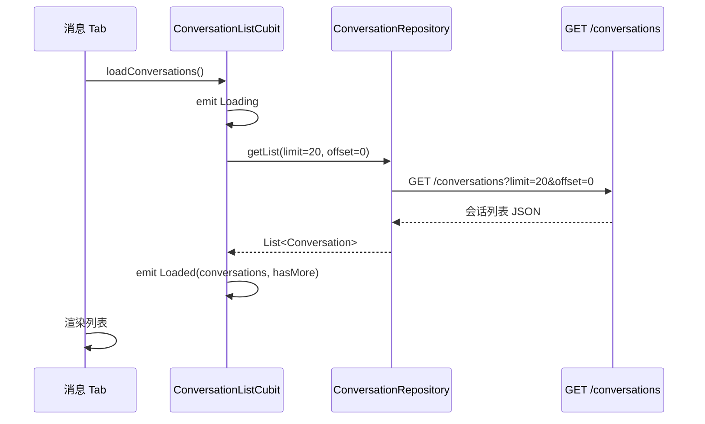
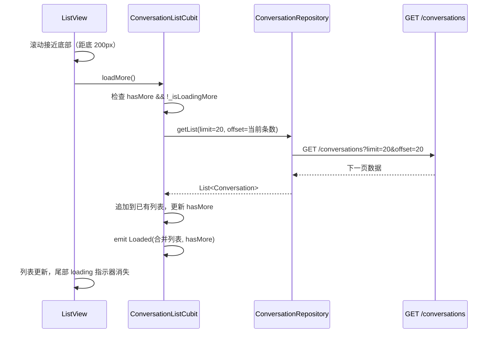
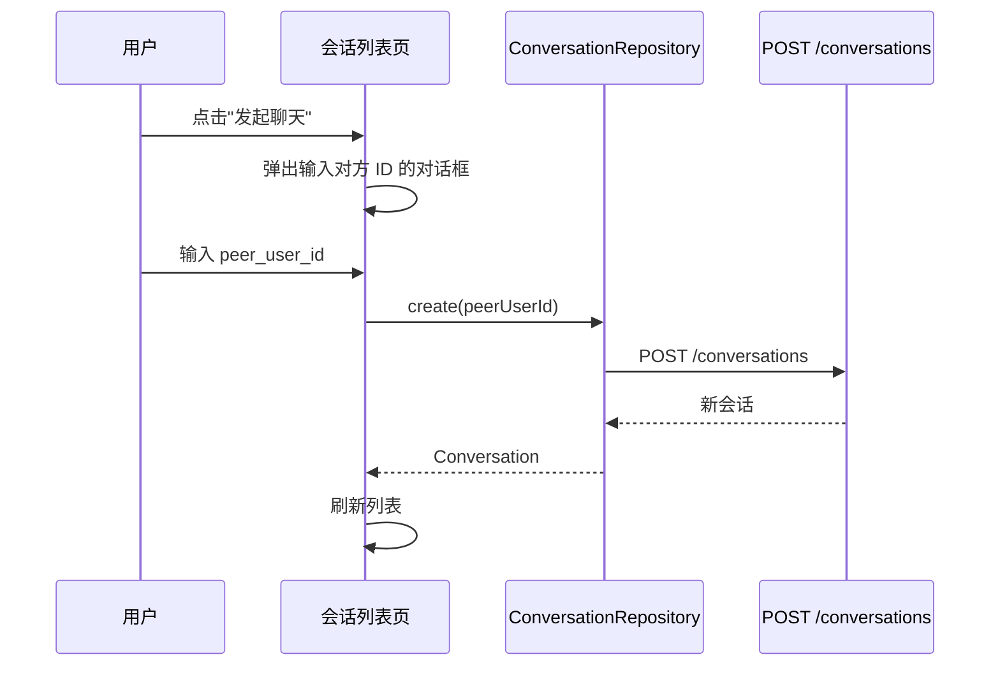

# IM Core v0.0.2 — 客户端设计报告

> 关联设计：[im-core v0.0.2 server](../server/design.md) | [im-core v0.0.1 client](../../v0.0.1/client/design.md)

## 1. 目标

- 新增 flash_im_conversation 模块（三层架构：data/logic/view）
- 实现会话列表页面，替换消息 Tab 的"暂无消息"占位
- 会话列表展示：对方头像、昵称、最后消息预览、时间

会话数据由后端种子数据预填，本版本不提供创建会话的前端入口。

## 2. 现状分析

- flash_im_core v0.0.1 已实现 WebSocket 连接管理
- HomePage 消息 Tab 当前是"暂无消息"占位文字
- 没有会话相关的模块和数据模型
- HttpClient 已封装 Dio + Token 自动注入

## 3. 数据模型与接口

### 核心数据类

| 类 | 位置 | 说明 |
|----|------|------|
| Conversation | data/conversation.dart | 会话数据模型 |
| ConversationRepository | data/conversation_repository.dart | 会话 API 调用 |
| ConversationListCubit | logic/conversation_list_cubit.dart | 会话列表状态管理 |
| ConversationListState | logic/conversation_list_state.dart | 列表状态（loading/loaded/error） |
| ConversationListPage | view/conversation_list_page.dart | 会话列表页面 |

### Conversation 模型

| 字段 | 类型 | 说明 |
|------|------|------|
| id | String | 会话 UUID |
| type | int | 0:单聊 1:群聊 |
| name | String? | 群聊名称 |
| peerUserId | String? | 单聊对方 ID |
| peerNickname | String? | 单聊对方昵称 |
| peerAvatar | String? | 单聊对方头像 |
| lastMessageAt | DateTime? | 最后消息时间 |
| lastMessagePreview | String? | 最后消息预览 |
| unreadCount | int | 未读数 |
| createdAt | DateTime | 创建时间 |

### ConversationListState

| 状态 | 说明 |
|------|------|
| ConversationListInitial | 初始状态 |
| ConversationListLoading | 加载中 |
| ConversationListLoaded(conversations, hasMore) | 加载成功，hasMore 标记是否有下一页 |
| ConversationListError(message) | 加载失败 |

## 4. 核心流程

### 加载会话列表



### 分页加载更多



分页策略：
- 每页 20 条（`_pageSize = 20`）
- `_isLoadingMore` 锁防止并发请求
- 返回条数 < pageSize 时 hasMore=false
- 列表尾部有 loading 指示器（hasMore 时显示）
- 下拉刷新重置为第一页

### 创建私聊会话



创建会话是临时方案（直接输入用户 ID），后续由好友系统接管。

## 5. 项目结构与技术决策

### 项目结构

```
client/modules/flash_im_conversation/  # 新增 package（flutter create）
└── lib/
    ├── flash_im_conversation.dart     # barrel 导出
    └── src/
        ├── data/
        │   ├── conversation.dart      # Conversation 模型
        │   └── conversation_repository.dart  # API 调用
        ├── logic/
        │   ├── conversation_list_cubit.dart  # 列表状态管理
        │   └── conversation_list_state.dart  # 状态定义
        └── view/
            ├── conversation_list_page.dart   # 会话列表页
            └── conversation_tile.dart        # 单条会话组件
```

### 职责划分

| 层 | 文件 | 职责 |
|----|------|------|
| data | conversation.dart | 数据模型，fromJson |
| data | conversation_repository.dart | HTTP 调用（Dio） |
| logic | conversation_list_cubit.dart | 加载列表、创建会话、刷新 |
| logic | conversation_list_state.dart | 状态枚举 |
| view | conversation_list_page.dart | 列表页面，BlocBuilder 渲染 |
| view | conversation_tile.dart | 单条会话：头像 + 昵称 + 预览 + 时间 + 未读 |

### 关键设计决策

| 决策 | 方案 | 理由 |
|------|------|------|
| 状态管理 | Cubit（不用 Event 模式） | 与项目其他模块一致 |
| 网络请求 | 通过 Dio（从 main.dart 注入） | 复用 HttpClient 的 Token 注入 |
| 模块创建 | flutter create --template=package | 标准 Flutter package |
| 会话列表位置 | 替换 HomePage 消息 Tab 的占位 | 自然集成 |

### 第三方依赖

| 依赖 | 用途 | 已有/需新增 |
|------|------|-----------|
| dio | HTTP 请求 | 需新增到 flash_im_conversation |
| flutter_bloc | 状态管理 | 需新增到 flash_im_conversation |
| equatable | 状态值比较 | 需新增到 flash_im_conversation |
| flash_session | UserAvatar 组件复用 | 需新增到 flash_im_conversation |

## 6. 测试体系

### 测试架构

```
client/
├── test/
│   ├── .env                          # 测试环境变量（token，gitignore）
│   ├── login_for_test.dart           # 登录脚本，生成 .env
│   └── test_env.dart                 # 共享工具类，读取 .env
└── modules/flash_im_conversation/test/
    ├── conversation_test.dart         # 数据模型单元测试
    ├── conversation_list_cubit_test.dart  # Cubit 逻辑单元测试（Mock）
    └── conversation_api_test.dart     # 集成测试（真实网络请求）
```

### 单元测试（Mock）

使用 `mocktail` mock ConversationRepository，`bloc_test` 验证 Cubit 状态流转：

| 测试用例 | 验证内容 |
|----------|----------|
| Conversation.fromJson 解析 | JSON 字段映射正确 |
| 缺省字段默认值 | unreadCount=0, isPinned=false 等 |
| displayName 单聊/群聊/回退 | 显示名称逻辑 |
| loadConversations 成功（不足一页） | hasMore=false |
| loadConversations 成功（刚好一页） | hasMore=true |
| loadConversations 失败 | emit Error 状态 |
| loadMore 追加数据 | 列表合并，hasMore 更新 |
| hasMore=false 时不再请求 | 不触发额外 API 调用 |
| loadMore 失败不丢数据 | 保持已有列表不变 |
| deleteConversation | 列表减少一条 |

### 集成测试（真实网络请求）

通过 `client/test/.env` 中的 token 直接调用后端 API，验证端到端数据正确性：

| 测试用例 | 验证内容 |
|----------|----------|
| 获取第一页 | 返回 20 条，字段非空 |
| 分页加载全部 | 3 页共 51 条，ID 不重复 |
| 超出范围 | 返回空列表 |
| 创建会话幂等 | 重复创建返回相同 ID |
| 删除会话 | 列表减少一条 |

### 测试环境准备

```bash
# 1. 确保后端已启动、种子数据已导入
# 2. 生成测试 token（有效期 7 天）
cd client
dart test/login_for_test.dart

# 3. 运行全部测试
cd modules/flash_im_conversation
flutter test

# 4. 仅运行单元测试（不需要后端）
flutter test test/conversation_test.dart test/conversation_list_cubit_test.dart

# 5. 仅运行集成测试（需要后端）
flutter test test/conversation_api_test.dart
```

### 测试依赖

| 依赖 | 用途 |
|------|------|
| bloc_test ^9.1.7 | Cubit 状态流测试 |
| mocktail ^1.0.4 | Mock Repository |
| flutter_test (SDK) | 基础测试框架 |

## 7. 验收标准

- 登录后消息 Tab 显示会话列表（种子数据预填的会话）
- 每条会话显示对方头像（identicon + 颜色）、昵称、最后消息预览、时间
- 会话列表按最后消息时间倒序排列
- 滚动到底部自动加载更多（每页 20 条，共 51 条分 3 页加载）
- 加载更多时尾部显示 loading 指示器
- 下拉刷新重置为第一页
- 单元测试全部通过（12 个）
- 集成测试全部通过（5 个）
- `flutter analyze` 零 error

## 8. 暂不实现

| 功能 | 理由 |
|------|------|
| 创建会话入口 | 本版本通过种子数据预填，后续由好友系统接管 |
| 点击会话进入聊天页 | 属于消息收发版本 |
| 未读数显示 | 需要消息收发配合，本版本始终为 0 |
| 会话实时更新（WebSocket 推送） | 属于后续版本 |
| 左滑删除/置顶 | 属于后续版本 |
