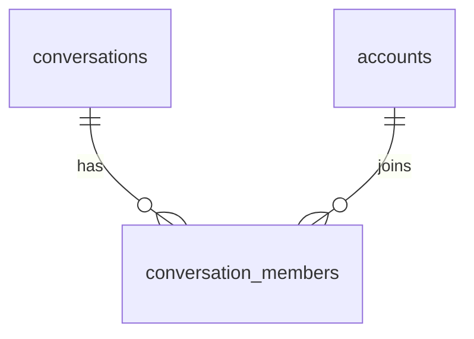
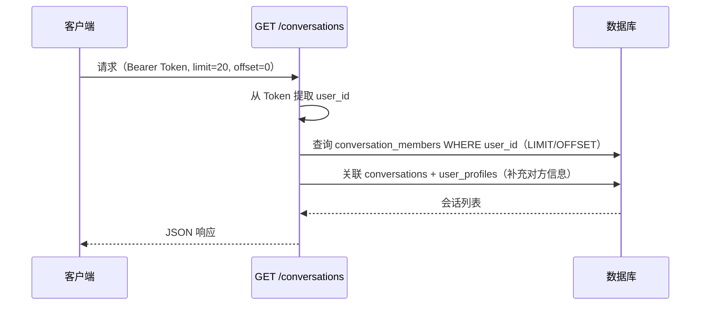

# IM Core v0.0.2 — 服务端设计报告

> 关联设计：[im-core v0.0.1 server](../../v0.0.1/server/design.md) | [im-core v0.0.2 client](../client/design.md)

## 1. 目标

- 新增数据库迁移：conversations、conversation_members、conversation_seq 表
- 新增种子数据迁移：批量创建测试用户和私聊会话
- 新增 im-conversation crate：会话列表查询
- 新增 HTTP 接口：GET /conversations（会话列表）
- 在 main.rs 中注册路由

本版本只做会话管理和列表查询，不涉及消息收发。创建会话通过种子数据完成，不提供创建接口。

## 2. 现状分析

- im-ws v0.0.1 已实现 Protobuf 帧认证和心跳
- 数据库已有 accounts、user_profiles 等认证相关表
- 没有会话表，前端消息 Tab 显示"暂无消息"占位

## 3. 数据模型与接口

### 数据库表

```sql
-- 会话表
CREATE TABLE conversations (
    id UUID PRIMARY KEY DEFAULT gen_random_uuid(),
    type SMALLINT NOT NULL DEFAULT 0,       -- 0:单聊 1:群聊
    name VARCHAR(100),                       -- 群聊名称，单聊为 null
    avatar VARCHAR(500),                     -- 群头像
    owner_id BIGINT,                         -- 群主
    last_message_at TIMESTAMPTZ,
    last_message_preview VARCHAR(100),
    created_at TIMESTAMPTZ NOT NULL DEFAULT NOW(),
    updated_at TIMESTAMPTZ NOT NULL DEFAULT NOW()
);

CREATE INDEX idx_conversations_type ON conversations(type);
CREATE INDEX idx_conversations_last_message ON conversations(last_message_at DESC);

-- 会话成员表
CREATE TABLE conversation_members (
    conversation_id UUID NOT NULL,
    user_id BIGINT NOT NULL,
    unread_count INT NOT NULL DEFAULT 0,
    last_read_seq BIGINT NOT NULL DEFAULT 0,
    is_deleted BOOLEAN NOT NULL DEFAULT FALSE,
    is_pinned BOOLEAN NOT NULL DEFAULT FALSE,
    is_muted BOOLEAN NOT NULL DEFAULT FALSE,
    joined_at TIMESTAMPTZ NOT NULL DEFAULT NOW(),
    PRIMARY KEY (conversation_id, user_id)
);

CREATE INDEX idx_conversation_members_user ON conversation_members(user_id);

-- 注：conversation_seq 表和 messages 表在消息收发版本创建，本版本不需要
```

### ER 关系图



### 关键设计决策

| 决策 | 方案 | 理由 |
|------|------|------|
| 会话 ID | UUID | 分布式友好 |
| 成员表联合主键 | (conversation_id, user_id) | 天然去重 |
| 未读计数 | 每成员独立 | 不同用户未读数不同 |
| conversation_seq | 本版本建表但不使用 | 为消息收发版本预留 |
| is_deleted/is_pinned/is_muted | 本版本建字段但不使用 | 为后续功能预留 |

### HTTP 接口

#### POST /conversations — 创建私聊会话

请求（需 Bearer Token）：
```json
{ "peer_user_id": 123 }
```

响应：
```json
{
  "id": "uuid",
  "type": 0,
  "peer_user_id": "123",
  "peer_nickname": "橘橙",
  "peer_avatar": "https://...",
  "created_at": "2026-03-29T..."
}
```

逻辑：
- 检查 peer_user_id 是否存在
- 查询两人之间是否已有私聊会话（type=0）
- 已有则返回已有的，不重复创建
- 新建时同时创建两条 conversation_members

#### GET /conversations — 获取会话列表

请求（需 Bearer Token）：

| 参数 | 类型 | 默认值 | 说明 |
|------|------|--------|------|
| limit | int | 20 | 每页条数 |
| offset | int | 0 | 偏移量 |

示例：`GET /conversations?limit=20&offset=0`

响应：
```json
[
  {
    "id": "uuid",
    "type": 0,
    "name": null,
    "peer_user_id": "123",
    "peer_nickname": "张三",
    "peer_avatar": "https://...",
    "last_message_at": "2026-03-29T...",
    "last_message_preview": "你好",
    "unread_count": 3,
    "created_at": "2026-03-29T..."
  }
]
```

逻辑：
- 查询当前用户参与的所有会话（通过 conversation_members）
- 单聊会话补充对方的昵称和头像（关联 user_profiles）
- 按 last_message_at 倒序排列（无消息的排最后）
- 支持 limit/offset 分页，默认每页 20 条

#### DELETE /conversations/:id — 删除会话

请求（需 Bearer Token，路径参数 conversation_id）

响应：
```json
{ "message": "会话已删除" }
```

逻辑：
- 校验当前用户是否是该会话的成员
- 将 conversation_members 中该用户的 is_deleted 设为 true
- 不删除会话本身和对方的成员记录（对方仍可看到）
- 后续对方发消息时可恢复（is_deleted 重置为 false）

### 种子数据

使用中国传统色名作为测试用户体系。种子数据配置文件放在 `scripts/database/im_seed/` 目录下，通过脚本批量创建。

用户数据：
- id=1 系统助手
- id=2~8 七个主色代表（朱红、橘橙、藤黄、碧螺春绿、天蓝、景泰蓝、葡萄紫）
- id=9~53 其余 45 个传统色用户（银红、胭脂红、樱桃红...牵牛紫）
- 手机号格式：`1380001xxxx`，默认密码：`111111`
- 头像使用 identicon（由用户 ID 自动生成）

会话数据：
- 为朱红（id=2）创建与其他 51 人的私聊会话（共 51 个会话）
- 部分会话预填 last_message_preview 和 last_message_at，模拟有消息的状态
- 每个会话同时创建 conversation_members（双方）

用手机号 13800010001 登录朱红后，会话列表能看到 51 条私聊会话。

## 4. 核心流程

### 获取会话列表



## 5. 项目结构与技术决策

### 项目结构

```
server/modules/im-conversation/     # 新增 crate
├── Cargo.toml
└── src/
    ├── lib.rs                      # 模块入口，导出 router
    ├── models.rs                   # Conversation、ConversationMember 结构体
    ├── repository.rs               # 数据库操作
    ├── service.rs                  # 业务逻辑
    └── routes.rs                   # HTTP 路由（POST/GET /conversations）

server/migrations/
└── 20260329_002_conversations.sql  # 新增迁移文件
```

### 职责划分

| 文件 | 职责 |
|------|------|
| models.rs | 数据结构定义（Conversation、ConversationListItem、CreateConversationRequest） |
| repository.rs | 数据库操作（find_private、create、list_by_user） |
| service.rs | 业务逻辑（create_private、get_list） |
| routes.rs | HTTP 路由处理器 |

### 第三方依赖（im-conversation 需新增）

| 依赖 | 用途 |
|------|------|
| flash-core | AppState、JWT 验证 |
| axum（workspace） | HTTP 路由 |
| sqlx（workspace） | 数据库操作 |
| serde / serde_json（workspace） | 序列化 |
| uuid | UUID 处理 |
| chrono（workspace） | 时间处理 |

## 6. 暂不实现

| 功能 | 理由 |
|------|------|
| messages 表 | 属于消息收发版本 |
| 消息发送/接收 | 属于消息收发版本 |
| 在线用户表（WsState） | 消息转发时才需要 |
| 群聊创建 | conversations.type 已预留，本版本只做私聊 |
| 会话置顶/免打扰/删除 | 字段已预留，本版本不实现 |
| 未读计数更新 | 需要消息收发配合，本版本 unread_count 始终为 0 |
