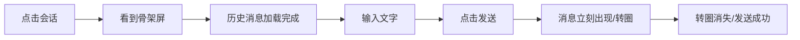
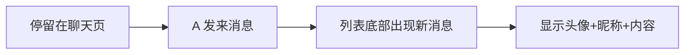
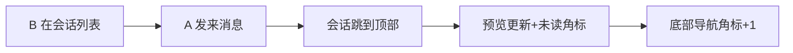
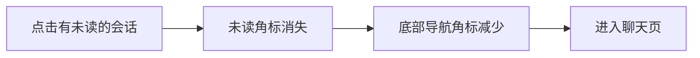
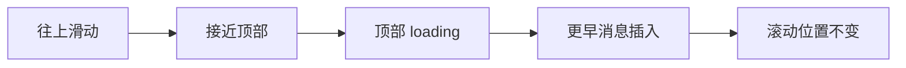
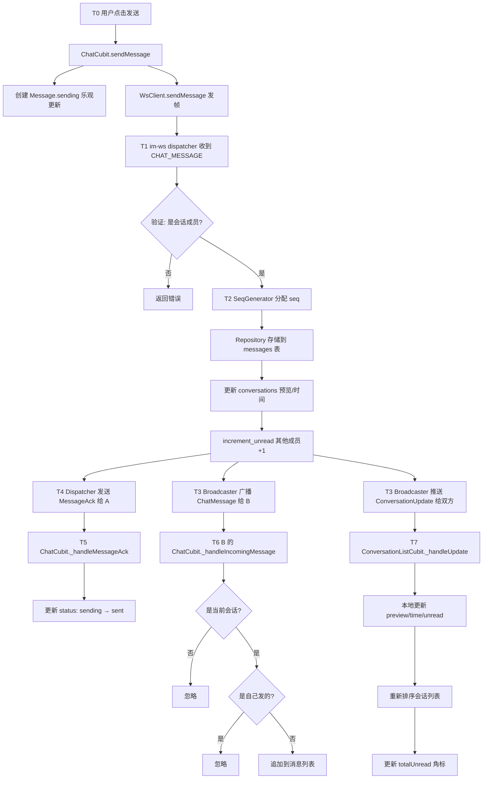
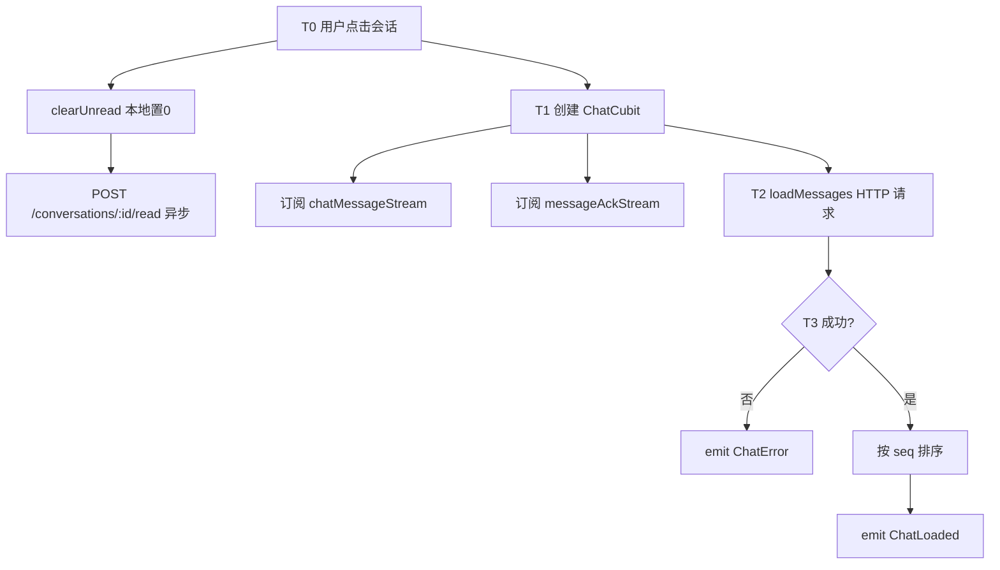
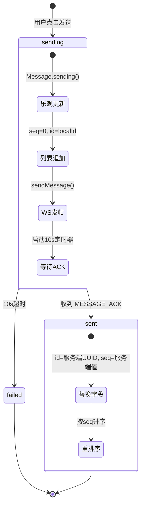
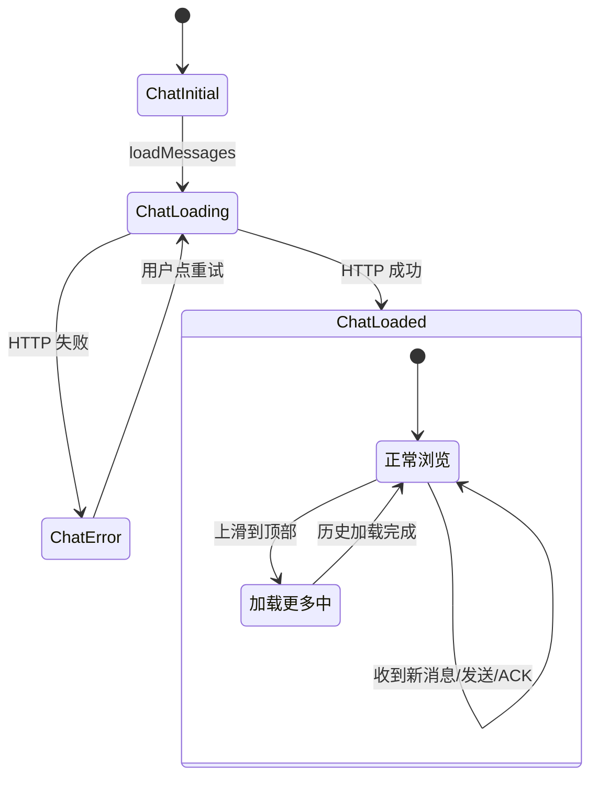

# IM Core v0.0.3 消息收发 — 功能分析

## 概述

实现两个用户之间的文本消息收发完整链路。后端：消息存储、序列号生成、ACK 确认、实时广播、会话更新推送、历史消息查询。前端：聊天页面、消息气泡、乐观发送、实时接收、历史加载、未读数管理。

---

## 一、交互链

### 场景 1：发送消息

**用户故事**：作为用户 A，我想给用户 B 发一条文字消息，以便和 B 进行沟通。

A 在会话列表中点击与 B 的会话，进入聊天页。页面显示骨架屏，随后加载出历史消息。A 在底部输入框输入文字，点击发送按钮。消息立刻出现在列表底部（带发送中标记）。片刻后标记消失，表示发送成功。

### 场景 2：接收消息

**用户故事**：作为用户 B，我想实时看到 A 发来的消息，以便及时回复。

B 正在与 A 的聊天页中。A 发了一条消息，B 的消息列表底部立刻出现这条新消息，带有 A 的头像和昵称。

### 场景 3：会话列表未读更新

**用户故事**：作为用户 B，我不在聊天页时收到消息，我想在会话列表看到未读提醒，以便知道有新消息。

B 在首页会话列表。A 给 B 发了一条消息。B 的会话列表中，与 A 的会话自动跳到最顶部，预览文字更新为最新消息内容，头像右上角出现红色未读角标。底部导航"消息"Tab 的角标数字加 1。

### 场景 4：进入聊天清除未读

**用户故事**：作为用户 B，我点进有未读消息的会话后，我希望未读数自动清零，以便角标不再打扰我。

B 点击有未读角标的会话进入聊天页。该会话的未读角标立刻消失，底部导航角标数字相应减少。

### 场景 5：加载历史消息

**用户故事**：作为用户，我想往上滑动查看更早的聊天记录，以便回顾之前的对话。

用户在聊天页往上滑动，接近顶部时自动触发加载。顶部出现 loading 指示器，加载完成后更早的消息插入到列表顶部，用户的滚动位置不变。

---

## 二、逻辑树

### 事件流：发送消息（全链路）

| 时刻 | 事件 | 处理 | 产生的新事件 |
|------|------|------|-------------|
| T0 | 用户点击发送 | ChatCubit 创建 Message.sending()，追加到列表 | WS 发出 CHAT_MESSAGE 帧 |
| T1 | im-ws 收到 CHAT_MESSAGE | dispatcher 解析 SendMessageRequest | 调用 service.send() |
| T2 | service.send 执行 | 验证成员 → SeqGenerator 分配 seq → 存储 messages → 更新 conversations 预览 → increment_unread | 触发广播 + ACK |
| T3 | broadcaster 广播 | ChatMessage 帧发给 B，ConversationUpdate 帧发给 A 和 B | B 端收到新消息事件 |
| T4 | dispatcher 发 ACK | MessageAck(id, seq) 帧发给 A | A 端收到 ACK 事件 |
| T5 | A 收到 ACK | ChatCubit 匹配 pending，更新 id/seq/status | 消息状态 sending → sent |
| T6 | B 收到 ChatMessage | ChatCubit 过滤（当前会话 + 非自己），追加到列表 | 列表刷新 |
| T7 | AB 收到 ConversationUpdate | ConversationListCubit 更新 preview/time/unread，重排序 | 角标刷新 |

异常流：T2 验证失败（非会话成员）→ 返回 500 → A 不会收到 ACK → T0 的 10s 定时器超时 → status 变 failed。

### 事件流：进入聊天页

| 时刻 | 事件 | 处理 | 产生的新事件 |
|------|------|------|-------------|
| T0 | 用户点击会话 | clearUnread 本地置 0，异步 POST /read | 角标立刻减少 |
| T1 | 创建 ChatCubit | 订阅 chatMessageStream + messageAckStream | emit ChatLoading |
| T2 | loadMessages | HTTP GET /conversations/:id/messages | — |
| T3 | HTTP 返回 | 按 seq 排序 | emit ChatLoaded |

异常流：T3 HTTP 失败 → emit ChatError → 用户点重试 → 回到 T2。

### 状态流转

| 实体 | 触发事件 | 前状态 | 后状态 |
|------|---------|--------|--------|
| Message | 用户点击发送 | (不存在) | sending (seq=0, id=localId) |
| Message | 收到 MESSAGE_ACK | sending | sent (seq=服务端值, id=服务端UUID) |
| Message | 10s 超时 | sending | failed |
| ChatState | loadMessages() | ChatInitial | ChatLoading |
| ChatState | HTTP 成功 | ChatLoading | ChatLoaded |
| ChatState | HTTP 失败 | ChatLoading | ChatError |
| ChatState | 用户点重试 | ChatError | ChatLoading |
| ChatState | 上滑到顶部 | ChatLoaded (isLoadingMore=false) | ChatLoaded (isLoadingMore=true) |
| ChatState | 历史加载完成 | ChatLoaded (isLoadingMore=true) | ChatLoaded (isLoadingMore=false) |
| 会话未读数(前端) | CONVERSATION_UPDATE 帧 | unread=0 | unread=N |
| 会话未读数(前端) | 用户进入聊天页 | unread=N | unread=0 (本地立刻) |
| 会话未读数(后端) | increment_unread | unread_count=0 | unread_count=N |
| 会话未读数(后端) | POST /read | unread_count=N | unread_count=0 (异步) |

前端和后端的未读数是最终一致的。前端先改本地（UI 立刻响应），再异步通知后端。后端请求失败时，下次打开 App 从后端重新拉取，自动修正。

---

## 三、功能编号与网络定位

### 本次新增节点

| 编号 | 功能节点 | 层级 | 简介 |
|------|---------|------|------|
| I-08 | 在线用户管理 | 基础设施 | WsState 用 channel 管理在线连接，支持按 userId 推送 |
| I-09 | 帧分发器 | 基础设施 | dispatcher 按帧类型分发处理，CHAT_MESSAGE → service.send → ACK |
| D-04 | 未读数管理 | 领域 | increment_unread 发消息时给其他成员+1 |
| D-05 | 标记已读 | 领域 | POST /conversations/:id/read 将 unread_count 置 0 |
| D-06 | 消息存储 | 领域 | 验证成员身份，存储消息到 messages 表 |
| D-07 | 序列号生成 | 领域 | conversation_seq 原子递增，保证 seq 唯一有序 |
| D-08 | 消息广播 | 领域 | 通过 MessageBroadcaster trait 推送 ChatMessage 帧给接收方 |
| D-09 | 历史消息查询 | 领域 | GET /conversations/:id/messages，基于 seq 分页 |
| D-10 | 会话更新推送 | 领域 | 推送 ConversationUpdate 帧，含 preview/time/unread/total_unread |
| F-06 | WsClient 帧分发 | 前端基础 | 按帧类型分发到 chatMessage/messageAck/conversationUpdate 三条 Stream |
| F-07 | 共享头像组件 | 前端基础 | AvatarWidget 统一入口，identicon/网络图片/占位自动切换 |
| P-03 | 会话实时更新 | 前端业务 | 监听 conversationUpdateStream，本地更新 preview/time/unread 并重排序 |
| P-04 | 未读角标 | 前端业务 | 头像右上角角标 + 底部导航 totalUnread 角标 |
| P-05 | 清除未读 | 前端业务 | 进入聊天页时本地立刻置 0，异步通知后端 |
| P-06 | 历史消息加载 | 前端业务 | HTTP 拉取 + reverse ListView + shrinkWrap 动态切换 |
| P-07 | 消息发送 | 前端业务 | 乐观更新 + WS 发帧 + 10s 超时标记 failed |
| P-08 | 实时接收 | 前端业务 | 监听 chatMessageStream，过滤当前会话/非自己/去重后追加 |
| P-09 | 状态流转 | 前端业务 | 监听 messageAckStream，匹配 pending 更新 sending → sent |.kiro\steering\feature-analyst.md

### 前置依赖

| 依赖节点 | 依赖方式 | 是否已有 |
|----------|---------|---------|
| I-01 flash-core | 数据库连接池 | ✅ |
| D-01~D-03 im-conversation | 调接口：update_last_message, increment_unread, get_member_ids, is_member | ✅ 需扩展 |
| I-05~I-07 im-ws | WebSocket 连接、帧编解码 | ✅ 需重构 |
| F-04~F-05 flash_im_core | WsClient 连接与认证 | ✅ 需扩展 |
| F-02 flash_session | 当前用户信息 | ✅ |
| ws.proto / message.proto | 共享协议 | ✅ 需扩展 |

### 边界接口

| 接口/协议 | 定义方 | 消费方 | 敏感度 |
|-----------|--------|--------|--------|
| message.proto ChatMessage | proto | D-08, I-09, P-08 | 高 |
| message.proto SendMessageRequest | proto | P-07, I-09 | 高 |
| message.proto MessageAck | proto | I-09, P-09 | 中 |
| message.proto ConversationUpdate | proto | D-10, P-03 | 高 |
| GET /conversations/:id/messages | D-09 | P-06 | 中 |
| POST /conversations/:id/read | D-05 | P-05 | 低 |
| MessageBroadcaster trait | D-08 | I-08 | 高 |

---

## 四、结论

- 开发顺序：proto 扩展 → 数据库迁移 → im-message 模块 → im-ws 重构 → 后端集成验证 → 前端 WsClient 帧分发 → flash_shared → flash_im_chat → 会话列表联动 → 全局主题 → 编译验证
- 复杂度集中在：im-ws 的 channel 模式重构（从简单分发器变成完整通信枢纽）、ChatCubit 的多事件源合并（HTTP + WS + 乐观更新）
- 风险点：message.proto 是前后端共享的，改字段需要同时更新 Rust/Dart/Python 三端代码
- 暂不实现：图片/文件消息、消息撤回、已读回执、本地缓存、离线同步
