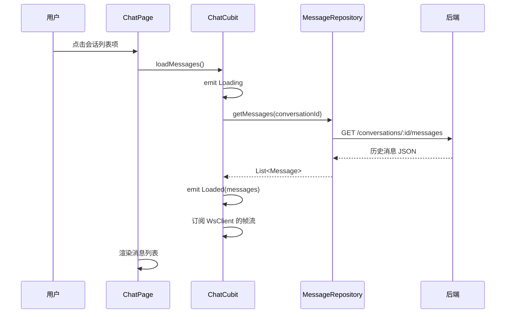
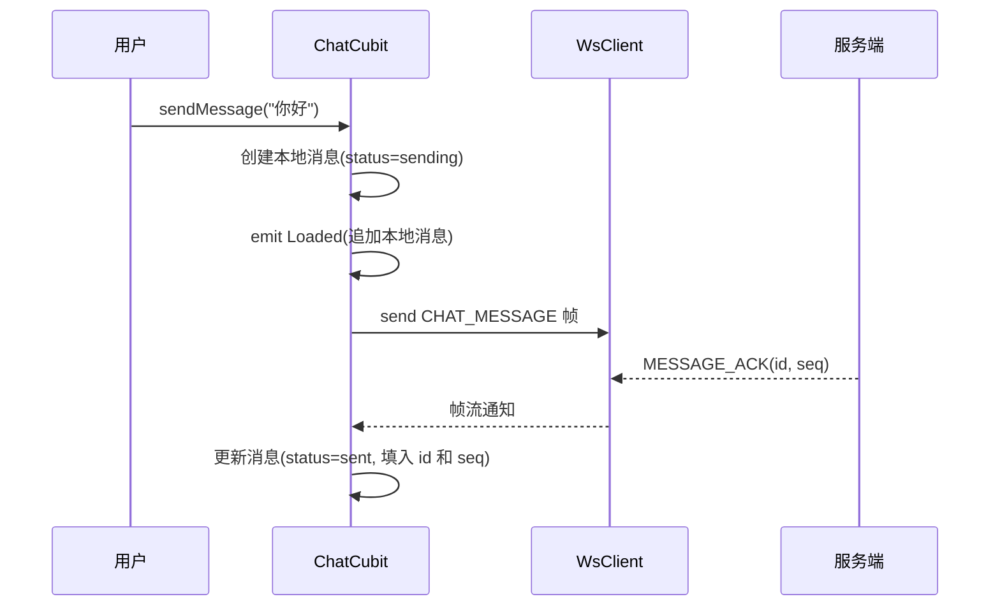
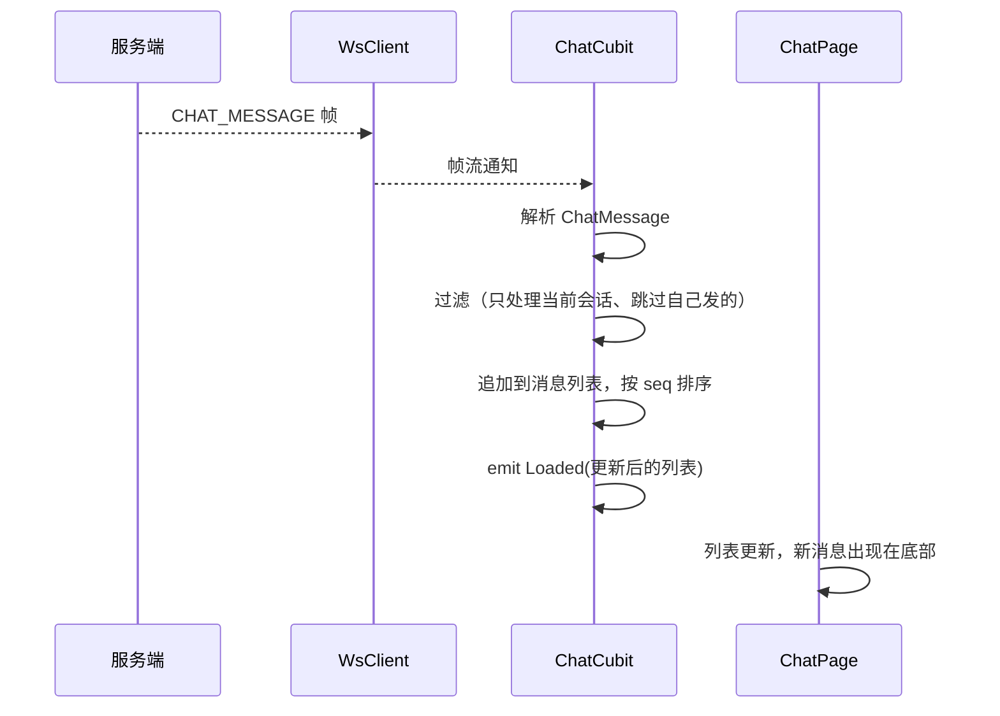
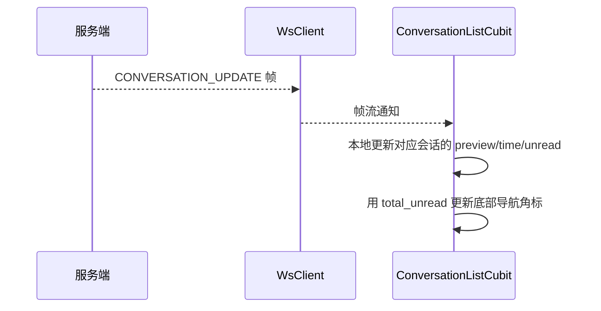

# IM Core v0.0.3 — 客户端设计报告

> 关联设计：[im-core v0.0.3 server](../server/design.md) | [im-core v0.0.2 client](../../v0.0.2/client/design.md)

## 1. 目标

- 新增 flash_im_chat 模块（三层架构：data/logic/view）
- 实现聊天页面：消息列表、输入框、发送按钮
- 通过 WebSocket 发送文本消息（CHAT_MESSAGE 帧）
- 实时接收对方消息（监听 chatMessageStream）
- 接收 MESSAGE_ACK 更新消息状态（sending → sent）
- 接收 CONVERSATION_UPDATE 更新会话列表
- 通过 HTTP 加载历史消息（基于 seq 分页）
- 消息乐观更新（先显示再确认）
- 从会话列表点击进入聊天页
- 进入聊天页后，将该会话的未读数置 0，并通知 ConversationListCubit 更新（减少 totalUnread）

本版本只支持文本消息，不涉及图片/文件/语音。

## 2. 现状分析

- flash_im_core v0.0.1 已实现 WsClient（连接、认证、心跳、重连）
- flash_im_conversation v0.0.2 已实现会话列表页
- 后端 v0.0.3 已实现消息收发链路（存储、ACK、广播、会话更新）
- WsClient 目前只暴露原始帧流，没有按帧类型分发
- 点击会话列表项目前无响应（onTap 为空）

## 3. 数据模型与接口

### 核心数据类

| 类 | 位置 | 说明 |
|----|------|------|
| Message | data/message.dart | 消息数据模型 |
| MessageRepository | data/message_repository.dart | 历史消息 HTTP 查询 |
| ChatCubit | logic/chat_cubit.dart | 聊天页状态管理 |
| ChatState | logic/chat_state.dart | 状态定义 |
| ChatPage | view/chat_page.dart | 聊天页面 |
| MessageBubble | view/message_bubble.dart | 消息气泡组件 |
| ChatInput | view/chat_input.dart | 输入框组件 |

### Message 模型

| 字段 | 类型 | 说明 |
|------|------|------|
| id | String | 消息 ID（本地临时 ID 或服务端 UUID） |
| conversationId | String | 会话 ID |
| senderId | String | 发送者 ID |
| senderName | String | 发送者昵称 |
| senderAvatar | String? | 发送者头像 |
| seq | int | 序列号（发送中时为 0） |
| content | String | 消息内容 |
| status | MessageStatus | sending / sent / failed |
| createdAt | DateTime | 创建时间 |

### MessageStatus

| 状态 | 说明 |
|------|------|
| sending | 已发送，等待 ACK |
| sent | 收到 ACK，已确认 |
| failed | 超时未收到 ACK |

### ChatState

| 状态 | 说明 |
|------|------|
| ChatInitial | 初始状态 |
| ChatLoading | 加载中 |
| ChatLoaded | 加载成功（messages, hasMore, isLoadingMore） |
| ChatError | 加载失败 |

### HTTP 接口

| 接口 | 用途 |
|------|------|
| GET /conversations/:id/messages?before_seq=&limit= | 历史消息查询 |

## 4. 核心流程

### 打开聊天页



### 发送消息（乐观更新）



### 接收消息



### 会话列表联动



## 5. 项目结构与技术决策

### 项目结构

```
client/modules/flash_shared/              # 新增 package（跨模块共享组件）
└── lib/
    ├── flash_shared.dart                 # barrel 导出
    └── src/
        ├── identicon_avatar.dart         # IdenticonPainter + IdenticonAvatar
        └── avatar_widget.dart            # AvatarWidget（统一头像入口）

client/modules/flash_im_chat/             # 新增 package
└── lib/
    ├── flash_im_chat.dart                # barrel 导出
    └── src/
        ├── data/
        │   ├── message.dart              # Message 模型
        │   └── message_repository.dart   # HTTP 历史消息查询
        ├── logic/
        │   ├── chat_cubit.dart           # 聊天页状态管理
        │   └── chat_state.dart           # 状态定义
        └── view/
            ├── chat_page.dart            # 聊天页面
            ├── message_bubble.dart       # 消息气泡
            └── chat_input.dart           # 输入框

client/modules/flash_im_core/             # 修改
└── lib/src/logic/
    └── ws_client.dart                    # 新增帧类型分发（chatMessageStream 等）
```

### flash_shared 模块

跨模块共享的 UI 组件，从 flash_session 中提取，避免 flash_im_chat 强依赖 flash_session。

| 组件 | 说明 |
|------|------|
| IdenticonPainter | 基于 seed 生成 5x5 对称方块图案的 CustomPainter |
| IdenticonAvatar | 包装 IdenticonPainter 的 Widget，支持 size/borderRadius |
| AvatarWidget | 统一头像入口：`identicon:xxx` → IdenticonAvatar，`http(s)://` → 网络图片，空 → 占位图标 |

依赖关系：`flash_im_chat → flash_shared`，`flash_session` 也可迁移到依赖 flash_shared（暂未改动）。

### WsClient 帧分发扩展

WsClient 需要把收到的帧按 type 分发到不同的 Stream：

| 帧类型 | Stream | 消费者 |
|--------|--------|--------|
| CHAT_MESSAGE | chatMessageStream | ChatCubit |
| MESSAGE_ACK | messageAckStream | ChatCubit |
| CONVERSATION_UPDATE | conversationUpdateStream | ConversationListCubit |
| AUTH_RESULT | （内部处理） | WsClient |
| PONG | （内部处理） | 心跳逻辑 |

### 关键设计决策

| 决策 | 方案 | 理由 |
|------|------|------|
| 消息列表方向 | ListView reverse: true | 最新消息在底部，往上滚加载历史 |
| 历史消息分页 | before_seq | 新消息不影响分页位置 |
| 发送消息 | 乐观更新 + ACK 确认 | 用户体验流畅，不用等网络往返 |
| 消息排序 | 按 seq 升序 | 不依赖时间戳，服务端保证有序 |
| 帧分发 | StreamController.broadcast | 多个 Cubit 可以同时监听 |
| 聊天页生命周期 | 打开时订阅，关闭时取消 | 避免内存泄漏 |
| 加载状态 | 骨架屏（Shimmer） | 比 loading 圈更自然，保持页面结构感 |
| 消息不足一屏 | shrinkWrap + Align topCenter | 消息少时靠顶显示，≤15 条时启用，超过后切回普通滚动避免性能问题 |

### UI 设计细节

#### 全局主题（app.dart）

| 属性 | 值 | 说明 |
|------|------|------|
| seedColor | `#3B82F6` | 全局主色调 |
| scaffoldBackgroundColor | `#EDEDED` | 全局 Scaffold 背景灰色，避免页面转场时白色闪烁 |
| AppBar backgroundColor | `#EDEDED` | 与首页一致的灰色 AppBar |
| AppBar elevation | 0 | 无阴影 |
| AppBar scrolledUnderElevation | 0 | 滚动时不变色 |
| AppBar surfaceTintColor | transparent | 禁用 Material 3 色调覆盖 |
| AppBar titleTextStyle | 17px, bold, black | 标题样式 |
| AppBar centerTitle | true | 标题居中 |

#### 聊天页

| 元素 | 样式 | 说明 |
|------|------|------|
| body 背景 | 白色 Container 包裹 | 消息内容区白色，与灰色 AppBar 区分 |
| 状态栏 | AnnotatedRegion 透明 + dark 图标 | 统一状态栏风格 |

#### 消息气泡（MessageBubble）

| 元素 | 样式 |
|------|------|
| 垂直间距 | 8px |
| 圆角（大） | 12px |
| 圆角（尖角） | 4px（自己发的右下角，对方发的左下角） |
| 自己发的背景 | `#3B82F6`（蓝色），白色文字 |
| 对方发的背景 | `#F0F0F0`（浅灰），黑色文字 |
| 头像 | AvatarWidget 36px，borderRadius 4 |
| 昵称 | 11px，`#999999`，仅对方消息显示 |
| sending 状态 | 12px CircularProgressIndicator |
| failed 状态 | 14px 红色感叹号图标 |

### 第三方依赖

| 依赖 | 用途 | 已有/需新增 |
|------|------|-----------|
| dio | HTTP 请求 | 需新增到 flash_im_chat |
| flutter_bloc | 状态管理 | 需新增到 flash_im_chat |
| equatable | 状态值比较 | 需新增到 flash_im_chat |
| shimmer | 骨架屏加载效果 | 需新增到 flash_im_chat |
| flash_im_core | WsClient、Protobuf 编解码 | 需新增到 flash_im_chat |
| flash_shared | AvatarWidget 头像组件 | 新建模块，flash_im_chat 依赖 |

## 6. 验收标准

| 验收条件 | 验收方式 |
|----------|----------|
| 点击会话列表进入聊天页 | 手动操作 |
| 聊天页显示历史消息 | 手动操作 |
| 输入文字点击发送，消息立刻出现在列表（乐观更新） | 手动操作 |
| 发送后消息状态从 sending 变为 sent | 观察 UI 变化 |
| 对方实时收到消息 | 两台设备/模拟器测试 |
| 往上滚动加载更早的历史消息 | 手动操作 |
| 发消息后会话列表的预览和时间更新 | 观察会话列表 |
| 底部导航消息 Tab 显示总未读数角标 | 观察角标变化 |
| 进入聊天页后该会话未读数归零，角标数字减少 | 观察会话列表和角标 |
| flutter analyze 零 error | `flutter analyze` |

## 7. 暂不实现

| 功能 | 理由 |
|------|------|
| 图片/文件/语音消息 | 需要文件上传模块 |
| 消息撤回 | 属于后续版本 |
| 已读回执 | 属于后续版本 |
| 消息搜索 | 属于后续版本 |
| 本地缓存（SQLite） | 属于后续版本 |
| 新消息提示（"有新消息"浮层） | 本版本先自动滚到底部 |
| 消息发送失败重试 | 本版本先不做 |
| 消息长按菜单（复制/删除/撤回） | 属于后续版本 |
