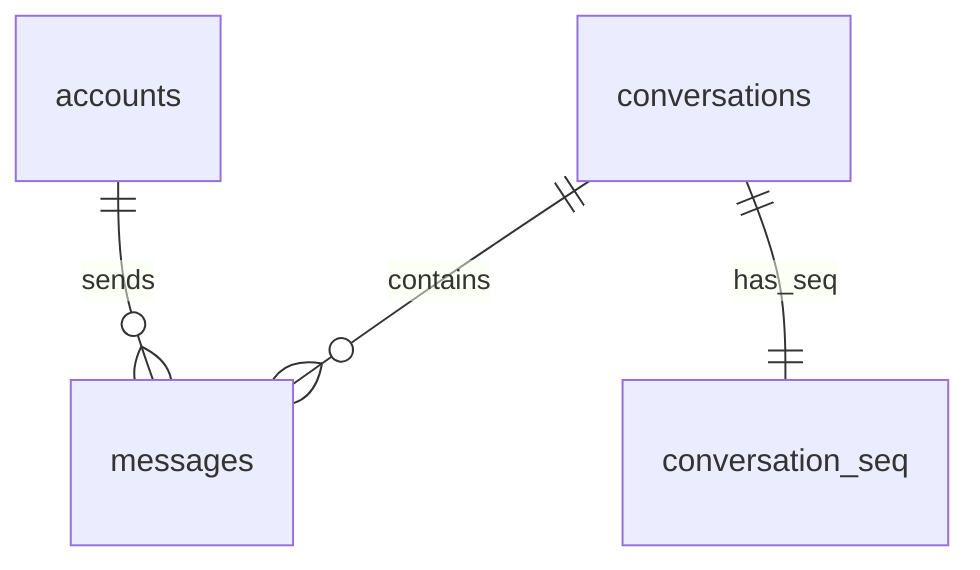
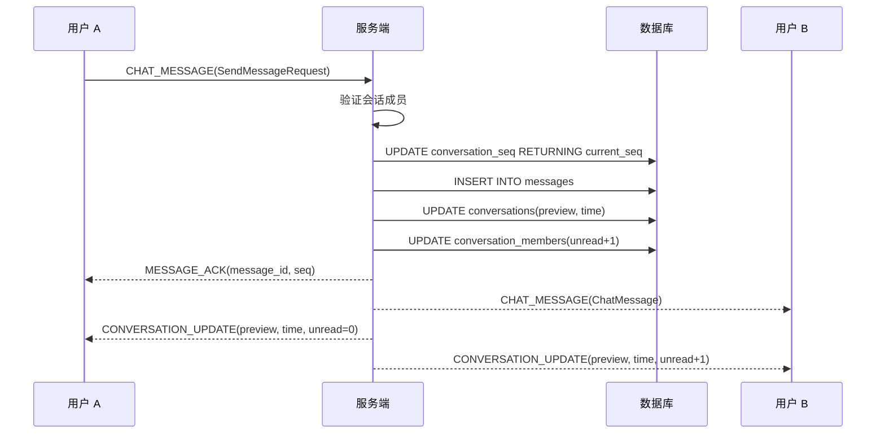

# IM Core v0.0.3 — 服务端设计报告

> 关联设计：[im-core v0.0.2 server](../../v0.0.2/server/design.md) | [im-core v0.0.3 client](../client/design.md)

## 1. 目标

- 新增数据库迁移：messages 表、conversation_seq 表
- 新增 im-message crate：消息存储、序列号生成、历史查询
- 扩展 ws.proto：新增 CHAT_MESSAGE、MESSAGE_ACK 帧类型
- 新增 message.proto：ChatMessage、SendMessageRequest、MessageAck 等消息结构
- 扩展 im-ws 帧分发器：处理 CHAT_MESSAGE 帧（存储 + 广播 + ACK）
- 新增 HTTP 接口：GET /conversations/:id/messages（历史消息查询）
- 更新 conversations 表的 last_message_preview 和 last_message_at
- 更新 conversation_members 表的 unread_count

本版本实现文本消息的完整收发链路，不涉及图片/文件等富媒体消息。

## 2. 现状分析

- im-ws v0.0.1 已实现 Protobuf 帧认证和心跳，帧分发器只处理 PING
- im-conversation v0.0.2 已实现会话创建、列表查询、软删除
- ws.proto 已定义 PING/PONG/AUTH/AUTH_RESULT 四种帧类型
- 没有消息表，没有消息相关的帧类型

## 3. 数据模型

### 数据库表

```sql
-- 消息表
CREATE TABLE messages (
    id UUID PRIMARY KEY DEFAULT gen_random_uuid(),
    conversation_id UUID NOT NULL REFERENCES conversations(id),
    sender_id BIGINT NOT NULL,
    seq BIGINT NOT NULL,
    type SMALLINT NOT NULL DEFAULT 0,       -- 0:文本 1:图片 2:系统 3:视频 4:文件 5:语音
    content TEXT NOT NULL,
    extra JSONB,                             -- 扩展信息（图片宽高、文件大小等）
    status SMALLINT NOT NULL DEFAULT 0,      -- 0:正常 1:已撤回 2:已删除
    created_at TIMESTAMPTZ NOT NULL DEFAULT NOW()
);

CREATE INDEX idx_messages_conversation_seq ON messages(conversation_id, seq DESC);
CREATE INDEX idx_messages_conversation_created ON messages(conversation_id, created_at DESC);

-- 会话序列号表（原子递增）
CREATE TABLE conversation_seq (
    conversation_id UUID PRIMARY KEY REFERENCES conversations(id),
    current_seq BIGINT NOT NULL DEFAULT 0
);
```

### ER 关系



### 关键设计决策

| 决策 | 方案 | 理由 |
|------|------|------|
| 消息 ID | UUID | 分布式友好，和 conversations 保持一致 |
| 序列号 | 每会话独立递增 | 支持增量同步，不依赖全局序列 |
| 序列号生成 | UPDATE ... RETURNING 原子操作 | 并发安全，无需应用层加锁 |
| 消息类型 | SMALLINT 枚举 | 和 conversations.type 保持一致 |
| extra 字段 | JSONB | 不同消息类型的扩展信息，表结构不变 |
| 索引 | (conversation_id, seq DESC) | 历史消息查询按 seq 倒序 |
| 消息内容 | TEXT 而非 VARCHAR | 不限制长度 |

## 4. 协议扩展

### ws.proto 新增帧类型

| type | 编号 | 方向 | 用途 |
|------|------|------|------|
| CHAT_MESSAGE | 4 | 双向 | 发送/接收聊天消息 |
| MESSAGE_ACK | 5 | 服务端 → 客户端 | 消息确认（含 ID 和 seq） |
| CONVERSATION_UPDATE | 6 | 服务端 → 客户端 | 会话变更推送（预览、时间、未读数） |

### message.proto 新增消息结构

| 消息 | 字段 | 说明 |
|------|------|------|
| ChatMessage | id, conversation_id, sender_id, seq, type, content, extra, status, created_at | 完整消息 |
| SendMessageRequest | conversation_id, type, content, extra, client_id | 发送请求 |
| MessageAck | message_id, seq | 发送确认 |
| ConversationUpdate | conversation_id, last_message_preview, last_message_at, unread_count | 会话变更推送，前端本地更新列表，不需要重新拉取 |

## 5. 接口设计

### WebSocket 帧处理

#### CHAT_MESSAGE 帧（客户端 → 服务端）

payload 为 SendMessageRequest 的 Protobuf 编码。

处理流程：
1. 从 payload 解析 SendMessageRequest
2. 验证发送者是会话成员
3. 生成序列号（conversation_seq 原子递增）
4. 存储消息到 messages 表
5. 更新 conversations.last_message_preview 和 last_message_at
6. 给其他成员的 conversation_members.unread_count 加 1
7. 构造 ChatMessage，封装成 CHAT_MESSAGE 帧广播给会话成员（排除发送者）
8. 构造 MessageAck，封装成 MESSAGE_ACK 帧回复给发送者



### HTTP 接口

#### GET /conversations/:id/messages — 历史消息查询

请求（需 Bearer Token）：

| 参数 | 类型 | 默认值 | 说明 |
|------|------|--------|------|
| before_seq | int | MAX | 获取此序列号之前的消息 |
| limit | int | 50 | 每页条数，最大 100 |

响应：
```json
[
  {
    "id": "uuid",
    "conversation_id": "uuid",
    "sender_id": "123",
    "sender_name": "朱红",
    "sender_avatar": "identicon:1:FF461F",
    "seq": 42,
    "msg_type": 0,
    "content": "你好",
    "extra": null,
    "status": 0,
    "created_at": "2026-03-30T..."
  }
]
```

逻辑：
- 验证当前用户是会话成员
- 查询 messages 表，WHERE seq < before_seq，ORDER BY seq DESC，LIMIT
- 关联 user_profiles 补充发送者昵称和头像
- 使用 seq 分页而非 offset（新消息不影响分页位置）

## 6. 核心流程

### 序列号生成

```sql
-- 尝试递增已有记录
UPDATE conversation_seq
SET current_seq = current_seq + 1
WHERE conversation_id = $1
RETURNING current_seq;

-- 如果不存在，插入新记录（处理并发）
INSERT INTO conversation_seq (conversation_id, current_seq)
VALUES ($1, 1)
ON CONFLICT (conversation_id)
DO UPDATE SET current_seq = conversation_seq.current_seq + 1
RETURNING current_seq;
```

### 消息广播

im-message 定义 MessageBroadcaster trait，im-ws 实现它：

```rust
trait MessageBroadcaster: Send + Sync {
    async fn broadcast_message(&self, message: &Message, member_ids: &[i64], exclude_sender: bool);
}
```

im-message 不直接依赖 im-ws，通过 trait 解耦。im-server（主入口）负责把 im-ws 的实现注入到 im-message 的 service 中。

## 7. 项目结构

```
server/modules/im-message/          # 新增 crate
├── Cargo.toml
└── src/
    ├── lib.rs                       # 模块入口
    ├── models.rs                    # Message、NewMessage、MessageWithSender、MessageQuery
    ├── repository.rs                # 数据库操作（create、find_before、find_latest）
    ├── seq.rs                       # SeqGenerator（序列号原子递增）
    ├── broadcast.rs                 # MessageBroadcaster trait + NoopBroadcaster
    ├── service.rs                   # 业务逻辑（send、get_history）
    └── routes.rs                    # HTTP 路由（GET /conversations/:id/messages）

server/modules/im-ws/src/
    ├── proto.rs                     # Protobuf 生成代码
    ├── handler.rs                   # WebSocket 连接处理（重构：channel 模式 + select 双向循环）
    ├── dispatcher.rs                # 帧分发（重写：持有 MessageService，处理 CHAT_MESSAGE）
    ├── state.rs                     # 新增：在线用户管理（mpsc channel）
    └── broadcaster.rs               # 新增：WsBroadcaster（实现 MessageBroadcaster trait）

proto/
    ├── ws.proto                     # 扩展：新增 CHAT_MESSAGE(4)、MESSAGE_ACK(5)、CONVERSATION_UPDATE(6)
    └── message.proto                # 新增：ChatMessage、SendMessageRequest、MessageAck、ConversationUpdate

server/migrations/
    └── 20260330_003_messages.sql    # 新增：messages + conversation_seq 表

docs/features/im/core/v0.0.3/test/
    ├── ws_chat_test.py              # WebSocket 全链路测试（Python + protobuf + websockets）
    └── proto/                       # 生成的 Python protobuf 代码（gitignored）
```

### 职责划分

| 文件 | 职责 |
|------|------|
| im-message/models.rs | Message、NewMessage、MessageWithSender、MessageQuery |
| im-message/repository.rs | 消息 CRUD、历史查询（基于 seq 分页） |
| im-message/seq.rs | SeqGenerator：原子递增序列号 |
| im-message/broadcast.rs | MessageBroadcaster trait + NoopBroadcaster |
| im-message/service.rs | send（完整发送流程）、get_history（历史查询） |
| im-message/routes.rs | HTTP 路由（GET /conversations/:id/messages） |
| im-ws/handler.rs | WebSocket 连接处理（channel 模式 + select 双向循环） |
| im-ws/dispatcher.rs | 帧分发：CHAT_MESSAGE → send → ACK |
| im-ws/state.rs | 在线用户管理（mpsc unbounded channel） |
| im-ws/broadcaster.rs | WsBroadcaster：ChatMessage 广播 + ConversationUpdate 推送 |
| im-conversation/service.rs | 新增 4 个方法：update_last_message、increment_unread、get_member_ids、is_member |

### 第三方依赖（im-message 需新增）

| 依赖 | 用途 |
|------|------|
| flash-core | AppState、JWT 验证 |
| im-conversation | 会话成员验证、更新预览和未读数 |
| axum（workspace） | HTTP 路由 |
| sqlx（workspace） | 数据库操作 |
| serde / serde_json（workspace） | 序列化 |
| uuid | UUID 处理 |
| chrono（workspace） | 时间处理 |
| async-trait | MessageBroadcaster trait |

## 8. 验收标准

### 测试工具

WebSocket 使用 Protobuf 二进制帧，GUI 工具无法直接编解码。编写 Python WebSocket 测试客户端 `scripts/test/ws_chat_test.py`，自动完成完整链路测试：

```
1. 登录两个用户（朱红、橘橙），获取 token
2. 分别建立 WebSocket 连接
3. 发送 AUTH 帧完成认证
4. 用户 A 发送 CHAT_MESSAGE 帧
5. 验证 A 收到 MESSAGE_ACK
6. 验证 B 收到 CHAT_MESSAGE
7. 验证双方收到 CONVERSATION_UPDATE
8. 通过 HTTP 查询历史消息验证持久化
```

依赖：`websockets`（WebSocket 客户端）+ `protobuf`（编解码）

### 验收条件

| 验收条件 | 验收方式 | 结果 |
|----------|----------|------|
| workspace 编译通过 | `cargo build` | ✅ |
| 两个用户通过 WebSocket 发送文本消息，对方实时收到 | ws_chat_test.py step 5 | ✅ |
| 发送消息后收到 MESSAGE_ACK（含 message_id 和 seq） | ws_chat_test.py step 4 | ✅ |
| 发送消息后 conversations 表预览和时间更新 | ws_chat_test.py step 7 | ✅ |
| 发送消息后对方 unread_count 加 1 | ws_chat_test.py step 6 | ✅ |
| 历史消息查询按 seq 倒序返回 | ws_chat_test.py step 7 | ✅ |
| before_seq 分页正确 | conversation_message.py | 待验证 |
| 序列号严格递增 | ws_chat_test.py step 8 (seq=1→2) | ✅ |
| 发消息后双方收到 CONVERSATION_UPDATE | ws_chat_test.py step 6 | ✅ |
| WebSocket 全链路测试通过 | `python ws_chat_test.py` | ✅ ALL PASSED |
| Link Test Writer 接口文档 | `python conversation_message.py` | 待验证 |

## 9. 暂不实现

| 功能 | 理由 |
|------|------|
| 图片/文件消息 | 需要文件上传模块，属于后续版本 |
| 消息撤回 | 属于后续版本 |
| 消息删除（per-user） | 属于后续版本 |
| 已读回执 | 属于后续版本 |
| 消息搜索 | 属于后续版本 |
| 消息置顶 | 属于后续版本 |
| 增量同步（SyncRequest/SyncResponse） | 属于后续版本 |
| client_id 去重 | 当前版本先不做，后续加 |
