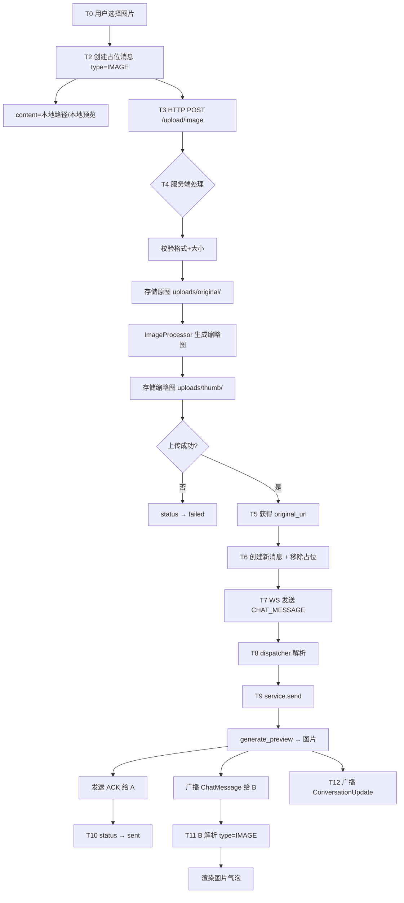

# 富媒体消息（图片/视频/文件） — 功能分析

## 概述

在现有文本消息基础上，增加图片、视频、文件三种消息类型的支持。用户可以在聊天中发送和接收图片、视频、文件，接收方可以预览图片/视频、下载文件。

核心挑战：需要新建文件上传/存储基础设施（当前项目没有任何文件上传能力），同时扩展消息模型、协议、前后端处理链路。

---

## 一、交互链

### 场景 1：发送图片/拍照

**用户故事**：作为用户 A，我想在聊天中发送一张图片给 B，以便用图片表达我想说的内容。

A 点击输入框旁的"+"按钮，弹出功能面板（照片、拍照、视频、文件）。A 点击"照片"从相册选择，或点击"拍照"用相机拍摄。选择/拍摄完成后，图片立刻出现在消息列表底部（带上传进度指示），上传完成后进度消失，片刻后发送成功。


### 场景 2：发送视频

**用户故事**：作为用户 A，我想在聊天中发送一段视频给 B，以便分享视频内容。

A 点击"+"按钮，点击"视频"，从相册选择一段视频。选择后，视频消息立刻出现在列表底部（显示缩略图 + 上传进度）。上传完成后进度消失，发送成功后缩略图上显示播放按钮和时长。


### 场景 3：发送文件

**用户故事**：作为用户 A，我想在聊天中发送一个文件给 B，以便传递文档资料。

A 点击"+"按钮，点击"文件"，打开系统文件选择器。选择文件后，文件消息立刻出现在列表底部（文件名 + 图标 + 上传进度）。上传完成后进度消失，发送成功后显示文件信息卡片。


### 场景 4：查看图片

**用户故事**：作为用户 B，我想查看 A 发来的图片，以便了解图片内容。

B 看到图片消息（缩略图），点击后全屏预览（支持缩放），点击返回关闭。


### 场景 5：播放视频

**用户故事**：作为用户 B，我想播放 A 发来的视频，以便观看视频内容。

B 看到视频消息（缩略图 + 播放按钮 + 时长），点击后跳转视频播放页全屏播放。


### 场景 6：下载文件

**用户故事**：作为用户 B，我想下载 A 发来的文件，以便在本地查看。

B 看到文件消息（文件名 + 大小 + 类型图标），点击后下载并用系统应用打开。


---

## 二、逻辑树

### 事件流：发送图片消息（全链路）

| 时刻 | 事件 | 处理 | 产生的新事件 |
|------|------|------|-------------|
| T0 | 用户在功能面板点击"照片" | 调用 ImagePicker.pickImage(source: gallery) | 系统相册选择器打开 |
| T1 | 用户选择图片，返回本地路径 | ChatCubit.sendImageFromFile(filePath) | — |
| T2 | 创建本地占位消息 | Message.sending(type=image, content=本地路径)，追加到列表 | 触发上传 |
| T3 | HTTP POST /api/upload/image | multipart/form-data 上传图片文件，dio onSendProgress 回调更新 uploadProgress | — |
| T4 | 服务端处理上传 | 校验格式(jpg/png/gif/webp) + 大小(≤10MB) → 存储原图到 uploads/original/{yyyy/mm}/{uuid}.{ext} → ImageProcessor 生成缩略图(max 200px, webp) → 存储到 uploads/thumb/ | 返回 {original_url, thumbnail_url, width, height, size, format} |
| T5 | 上传成功 | ChatCubit 调用 sendImageMessage(original_url) | — |
| T6 | 创建新本地消息 + 移除占位 | Message.sending(type=image, content=original_url)，记录 pendingMessages[clientId]=localId | WS 发出 CHAT_MESSAGE 帧 |
| T7 | WS 发送 SendMessageRequest | type=IMAGE, content=original_url, extra=空 | 服务端处理 |
| T8 | 服务端 dispatcher 收到帧 | 解析 SendMessageRequest，构造 NewMessage(msg_type=Image, content=url) | 调用 service.send() |
| T9 | service.send 执行 | 验证成员 → seq → 存储(type=1) → generate_preview → 返回 "[图片]" → 更新会话预览 → 广播 + ACK | 同文本消息 |
| T10 | A 收到 ACK | 更新 status: sending → sent，移除占位消息 | — |
| T11 | B 收到 ChatMessage | 解析 type=IMAGE，content 为图片 URL，渲染图片气泡 | — |
| T12 | 会话更新 | ConversationUpdate.preview = "[图片]" | 会话列表更新 |

异常流：
- T3 上传失败 → status 变 failed，用户可点击重试（重新上传 + 发送）
- T7 WS 发送后 10s 无 ACK → status 变 failed（图片已上传成功，重试只需重发 WS 帧）



### 事件流：发送视频消息（全链路）

| 时刻 | 事件 | 处理 | 产生的新事件 |
|------|------|------|-------------|
| T0 | 用户在功能面板点击"视频" | 调用 ImagePicker.pickVideo(source: gallery) | 系统选择器打开 |
| T1 | 用户选择视频，返回本地路径 | ChatCubit.sendVideoFromFile(filePath, thumbPath, durationMs) | — |
| T1.5 | 客户端提取视频信息 | VideoThumbnailService.extractVideoInfo(filePath)：用 fc_native_video_thumbnail 提取首帧缩略图(384px, jpeg)，用 video_player 提取时长(ms) | 得到 thumbnailPath + durationMs |
| T2 | 创建本地占位消息 | Message.sending(type=video, content=缩略图本地路径)，追加到列表 | 触发上传 |
| T3 | HTTP POST /api/upload/video | multipart/form-data：video(视频文件) + thumbnail(缩略图jpeg) + duration_ms + width + height，onSendProgress 回调更新 uploadProgress | — |
| T4 | 服务端处理上传 | 校验格式(mp4/mov/avi) + 大小(≤50MB) → 存储视频到 uploads/video/{yyyy/mm}/{uuid}.{ext} → 存储缩略图到 uploads/thumb/{yyyy/mm}/{uuid}.jpg | 返回 {video_url, thumbnail_url, duration_ms, width, height, file_size} |
| T5 | 上传成功 | 更新本地消息 content=video_url, extra=VideoExtra | — |
| T6 | WS 发送 SendMessageRequest | type=VIDEO, content=video_url, extra=VideoExtra JSON bytes | 服务端处理 |
| T7 | 服务端处理 | 同图片，generate_preview → "[视频]" | 广播 + ACK |
| T8 | A 收到 ACK | status → sent | — |
| T9 | B 收到 ChatMessage | 解析 type=VIDEO，从 extra 取 thumbnail_url/duration_ms，渲染视频气泡 | — |

异常流：
- T3 上传失败 → status 变 failed，清除上传进度
- 视频上传超时设为 30s（比文本的 10s 更长）

### 事件流：发送文件消息（全链路）

| 时刻 | 事件 | 处理 | 产生的新事件 |
|------|------|------|-------------|
| T0 | 用户在功能面板点击"文件" | 调用 FilePicker.platform.pickFiles() | 系统文件选择器打开 |
| T1 | 用户选择文件，返回本地路径 | ChatCubit.sendFileFromPicker(filePath) | — |
| T2 | 创建本地占位消息 | Message.sending(type=file, content=文件名, extra={file_name, file_type})，追加到列表 | 触发上传 |
| T3 | HTTP POST /api/upload/file | multipart/form-data 上传文件，onSendProgress 回调更新 uploadProgress | — |
| T4 | 服务端处理上传 | 校验大小(≤50MB) → 存储到 uploads/file/{yyyy/mm}/{uuid}.{ext} | 返回 {file_url, file_name, file_size, file_type} |
| T5 | 上传成功 | 更新本地消息 content=file_url, extra=FileExtra | — |
| T6 | WS 发送 SendMessageRequest | type=FILE, content=file_url, extra=FileExtra JSON bytes | 服务端处理 |
| T7 | 服务端处理 | generate_preview → "[文件]" | 广播 + ACK |
| T8 | A 收到 ACK | status → sent | — |
| T9 | B 收到 ChatMessage | 解析 type=FILE，从 extra 取 file_name/file_size/file_type，渲染文件卡片 | — |

### 事件流：文件上传处理（服务端 app-storage）

| 时刻 | 事件 | 处理 | 产生的新事件 |
|------|------|------|-------------|
| T0 | 收到 POST /api/upload/{type} | axum Multipart 解析，提取文件字段 | — |
| T1 | 校验文件 | 图片：格式白名单(jpg/png/gif/webp) + ≤10MB；视频：格式白名单(mp4/mov/avi) + ≤50MB；文件：≤50MB | 不合法返回 400 |
| T2 | 生成存储路径 | `uploads/{type}/{yyyy}/{mm}/{uuid}.{ext}` | — |
| T3 | 写入磁盘 | tokio::fs::write 写入 | — |
| T4 | 图片额外处理 | ImageProcessor：image crate 解码 → 获取宽高 → Lanczos3 缩放到 max 200px → 编码为 webp → 写入 thumb/ | — |
| T5 | 返回响应 | 图片：{original_url, thumbnail_url, width, height, size, format}；视频：{video_url, thumbnail_url, duration_ms, width, height, file_size}；文件：{file_url, file_name, file_size, file_type} | — |

### 状态流转

| 实体 | 触发事件 | 前状态 | 后状态 |
|------|---------|--------|--------|
| Message(图片) | 用户选择图片 | (不存在) | sending (type=image, content=本地路径, uploadProgress=0) |
| Message(图片) | 上传进度回调 | sending (uploadProgress=N%) | sending (uploadProgress=N+1%) |
| Message(图片) | 上传完成 | sending (content=本地路径) | sending (content=服务端URL, uploadProgress=null)，同时创建新消息移除占位 |
| Message(图片) | 上传失败 | sending | failed |
| Message(图片) | 收到 ACK | sending | sent |
| Message(视频) | 用户选择视频 | (不存在) | sending (type=video, content=缩略图本地路径, uploadProgress=0) |
| Message(视频) | 上传进度回调 | sending (uploadProgress=N%) | sending (uploadProgress=N+1%) |
| Message(视频) | 上传完成 | sending | sending (content=video_url, extra=VideoExtra, uploadProgress=null) |
| Message(视频) | 上传失败 | sending | failed |
| Message(视频) | 收到 ACK | sending | sent |
| Message(文件) | 用户选择文件 | (不存在) | sending (type=file, content=文件名, extra={file_name, file_type}, uploadProgress=0) |
| Message(文件) | 上传进度回调 | sending (uploadProgress=N%) | sending (uploadProgress=N+1%) |
| Message(文件) | 上传完成 | sending | sending (content=file_url, extra=FileExtra, uploadProgress=null) |
| Message(文件) | 上传失败 | sending | failed |
| Message(文件) | 收到 ACK | sending | sent |
| 文件(服务端) | POST /upload/image | (不存在) | 已存储(original/ + thumb/) |
| 文件(服务端) | POST /upload/video | (不存在) | 已存储(video/ + thumb/) |
| 文件(服务端) | POST /upload/file | (不存在) | 已存储(file/) |

补充说明：
- 上传进度通过 dio 的 onSendProgress 回调获取（count/total），存储在 ChatState.uploadProgress(double? 0.0~1.0) 中
- 图片气泡上传中时在缩略图上叠加半透明遮罩 + 圆形进度指示器
- 视频气泡上传中时在缩略图上叠加半透明遮罩 + 圆形进度指示器
- 文件气泡上传中时在卡片底部显示线性进度条
- uploadProgress=null 表示不在上传中，uploadProgress 有值表示上传中
- 图片发送采用"占位→上传→替换→WS发送"两步模式
- 视频/文件发送采用"占位→上传→更新占位→WS发送"一步模式（不移除占位，直接更新 content 和 extra）
- 视频/文件的 ACK 超时设为 30s（上传耗时更长）
- 上传失败时，重试需要重新上传文件（不同于文本消息的纯 WS 重发）

---

## 三、功能编号与网络定位

### 本次新增节点

| 编号 | 功能节点 | 层级 | 简介 |
|------|---------|------|------|
| I-10 | 文件存储服务 (app-storage) | 基础设施 | 本地磁盘存储 + 图片处理(image crate) + 缩略图生成(webp)，StorageService + StorageConfig |
| I-11 | 文件上传 API | 基础设施 | POST /api/upload/image、/api/upload/video、/api/upload/file，multipart 解析 + 鉴权 |
| I-12 | 静态文件服务 | 基础设施 | tower-http ServeDir 挂载 uploads/ 目录，GET /uploads/{path} 访问已上传文件 |
| D-12 | 富媒体消息存储 | 领域 | 扩展 NewMessage 支持 msg_type + extra，存储媒体元数据到 messages.extra(JSONB) |
| D-13 | 消息预览生成 | 领域 | generate_preview() 根据 msg_type 返回 "[图片]"/"[视频]"/"[文件]"，更新会话列表预览 |
| F-08 | 视频信息提取 | 前端基础 | VideoThumbnailService：fc_native_video_thumbnail 提取首帧 + video_player 提取时长 |
| P-11 | 功能面板 (MorePanel) | 前端业务 | 输入框"+"按钮，弹出 2×2 网格面板：照片/拍照/视频/文件 |
| P-12 | 图片消息气泡 | 前端业务 | 薄边框+圆角裁剪，max 250×300，点击全屏预览 |
| P-13 | 视频消息气泡 | 前端业务 | 缩略图 + 半透明播放按钮 + 底部渐变遮罩时长，点击跳转播放页 |
| P-14 | 文件消息气泡 | 前端业务 | 白底边框卡片 237px，文件名+大小+类型图标(按扩展名着色) |
| P-15 | 图片发送流程 | 前端业务 | ImagePicker → 占位消息 → HTTP上传 → WS发送 → ACK确认 |
| P-16 | 视频发送流程 | 前端业务 | ImagePicker → 提取缩略图+时长 → 占位消息 → HTTP上传(视频+缩略图) → WS发送 → ACK确认 |
| P-17 | 文件发送流程 | 前端业务 | FilePicker → 占位消息 → HTTP上传 → WS发送 → ACK确认 |
| P-18 | 视频播放页 | 前端业务 | 全屏视频播放器，支持暂停/拖动进度 |
| P-19 | 图片全屏预览 | 前端业务 | 全屏图片查看，支持缩放/滑动 |

### 前置依赖

| 依赖节点 | 依赖方式 | 是否已有 |
|----------|---------|---------|
| I-01 flash-core | 数据库连接池、JWT 验证、ApiResponse/AppError | ✅ |
| I-08 在线用户管理 | WsState 推送 | ✅ |
| I-09 帧分发器 | dispatcher 处理 CHAT_MESSAGE | ✅ 需扩展（传递 type/extra 到 NewMessage） |
| D-06 消息存储 | service.send() | ✅ 需扩展（NewMessage 增加 msg_type/extra） |
| D-08 消息广播 | broadcaster 广播 ChatMessage | ✅ 需扩展（传递 extra 字段） |
| D-09 历史消息查询 | HTTP 返回含 type/extra | ✅ 已有（msg_type/extra 字段已在 SQL 查询中） |
| F-06 WsClient 帧分发 | chatMessageStream | ✅ 无需改动 |
| P-07 消息发送 | ChatCubit.sendMessage | ✅ 需扩展（新增 sendImageFromFile/sendVideoFromFile/sendFileFromPicker） |
| P-08 实时接收 | ChatCubit._handleIncomingMessage | ✅ 需扩展（解析 type/extra） |
| message.proto | MessageType 枚举 + extra 字段 | ✅ 需扩展（IMAGE=1, VIDEO=2, FILE=3） |
| tower-http | 静态文件服务 | ✅ 已在 Cargo.toml（features=["fs"]） |

### 边界接口

| 接口/协议 | 定义方 | 消费方 | 敏感度 |
|-----------|--------|--------|--------|
| POST /api/upload/image | I-11 | P-14 (客户端上传图片) | 高（需鉴权 + 大小限制 10MB） |
| POST /api/upload/video | I-11 | P-15 (客户端上传视频) | 高（需鉴权 + 大小限制 50MB + DefaultBodyLimit） |
| POST /api/upload/file | I-11 | P-16 (客户端上传文件) | 高（需鉴权 + 大小限制 50MB + DefaultBodyLimit） |
| GET /uploads/{path} | I-12 (静态文件服务) | 客户端（图片/视频/文件加载） | 中 |
| message.proto MessageType 枚举 | proto | D-11, P-14~P-16, P-11~P-13 | 高（前后端共享，改动需同步 Rust/Dart） |
| message.proto ChatMessage.extra | proto | D-11, D-08, P-11~P-13 | 高 |
| message.proto SendMessageRequest | proto | P-14~P-16, I-09 | 高 |
| NewMessage 结构体 | D-11 | I-09 (dispatcher) | 中（增加 msg_type/extra 字段） |
| StorageService trait | I-10 | I-11 (API 层调用) | 中 |
| ImageProcessor | I-10 | I-10 (upload_image 内部调用) | 低 |

### 媒体元数据格式约定

存储在 messages.extra(JSONB) 和 proto ChatMessage.extra(bytes, JSON 编码) 中：

```json
// 图片：extra 可选，图片 URL 存在 content 中
// content = "/uploads/original/2026/04/uuid.jpg"
// 图片不需要 extra，URL 在 content 中

// 视频
{
  "thumbnail_url": "/uploads/thumb/2026/04/uuid.jpg",
  "duration_ms": 15000,
  "width": 1280,
  "height": 720,
  "file_size": 10485760
}

// 文件
{
  "file_name": "报告.pdf",
  "file_size": 1048576,
  "file_url": "/uploads/file/2026/04/uuid.pdf",
  "file_type": "pdf"
}
```

### 服务端存储目录结构

```
uploads/
├── original/          # 原图
│   └── {yyyy}/{mm}/
│       └── {uuid}.{ext}
├── thumb/             # 缩略图（图片 webp + 视频首帧 jpg）
│   └── {yyyy}/{mm}/
│       └── {uuid}.{webp|jpg}
├── video/             # 视频文件
│   └── {yyyy}/{mm}/
│       └── {uuid}.{ext}
└── file/              # 普通文件
    └── {yyyy}/{mm}/
        └── {uuid}.{ext}
```

---

## 四、结论

- 开发顺序建议：
  1. I-10/I-11/I-12 后端文件存储模块（全新 crate app-storage，无依赖冲突，可独立开发验证）
  2. D-11/D-12 扩展消息模型（NewMessage 增加 msg_type/extra，generate_preview 函数，dispatcher 传递字段）
  3. proto 扩展 MessageType 枚举（IMAGE=1, VIDEO=2, FILE=3）
  4. P-10 前端功能面板 UI（ChatInput 改造，添加"+"按钮和 MorePanel）
  5. P-14 + P-11 图片发送 + 图片气泡（最简单的媒体类型，先跑通全链路）
  6. P-18 图片全屏预览
  7. F-08 + P-15 + P-12 + P-17 视频发送 + 视频气泡 + 播放页（依赖缩略图提取服务）
  8. P-16 + P-13 文件发送 + 文件气泡
  9. 全链路联调

- 复杂度集中在：
  - 后端 app-storage 模块（全新基础设施：multipart 解析、image crate 图片处理、缩略图生成、目录管理、静态文件服务挂载）
  - 视频缩略图提取（客户端侧：fc_native_video_thumbnail + video_player 两个原生插件协作）
  - 客户端上传 + 乐观更新的状态管理（占位消息 → 上传 → 替换/更新 → WS 发送 → ACK，比纯文本多了上传环节）

- 关键设计决策：
  - 视频缩略图由客户端提取并上传，服务端不依赖 ffmpeg（避免服务端安装额外依赖）
  - 图片缩略图由服务端 image crate 生成 webp 格式（体积小、质量好）
  - 文件上传和消息发送是两步操作（先上传获取 URL，再通过 WS 发送消息帧），解耦存储和通信
  - 上传 URL 使用相对路径（/uploads/...），客户端拼接 baseUrl 访问

- 暂不实现：
  - 语音消息（交互模式完全不同，需要录音 UI + 按住说话 + 播放器管理，单独版本处理）
  - 图片压缩/多分辨率（先传原图 + 服务端生成缩略图，后续优化）
  - 视频转码（先传原始格式，后续按需转码）
  - 文件断点续传（先做简单的一次性上传）
  - 云存储（先用本地磁盘 + tower-http 静态文件服务，后续可切换到 OSS/S3）
