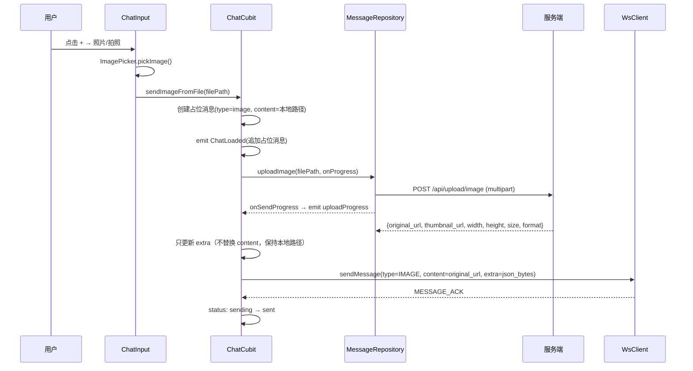
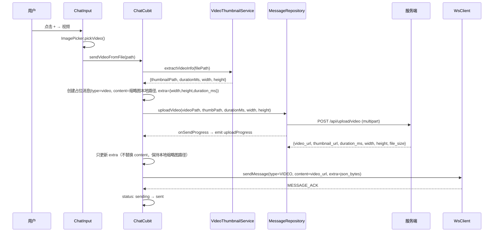
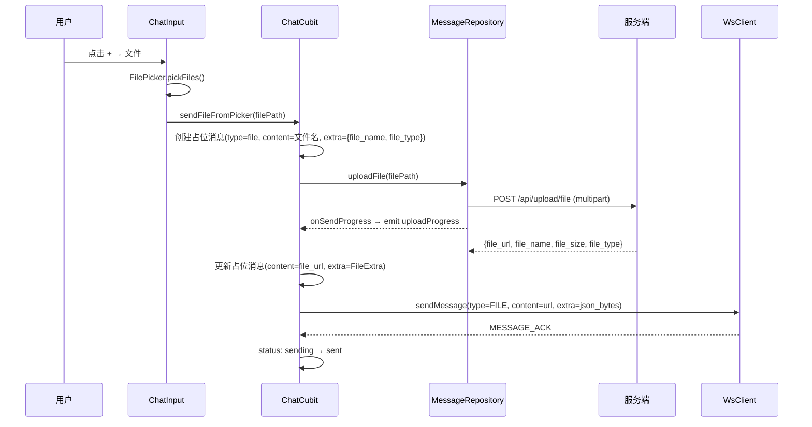
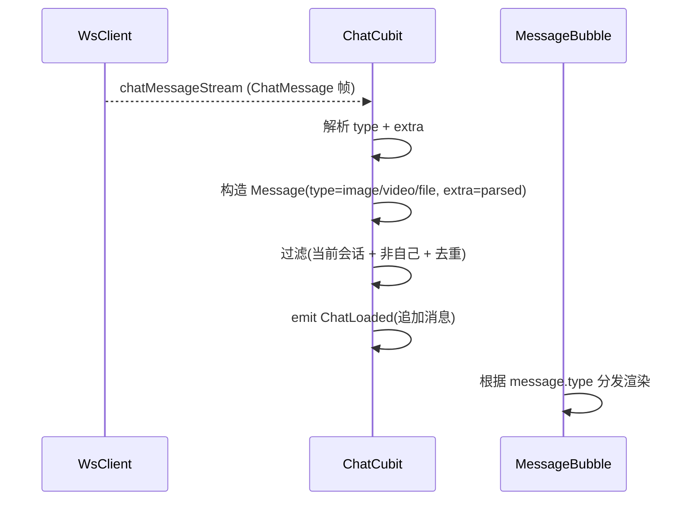
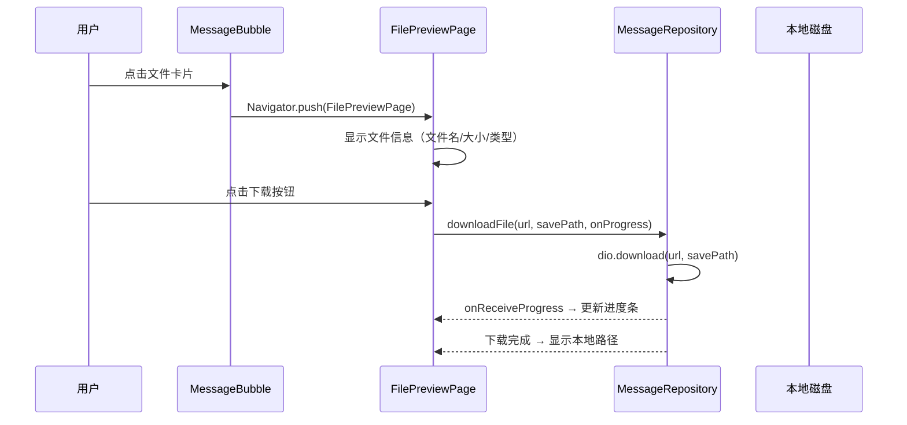

# IM Core v0.0.4_media — 客户端设计报告

> 关联设计：[im-core v0.0.4_media server](../server/design.md) | [im-core v0.0.3 client](../../v0.0.3/client/design.md) | [im-core v0.0.4_media analysis](../analysis.md)

## 1. 目标

- 扩展 Message 模型：新增 type（text/image/video/file）和 extra 字段
- 扩展 WsClient.sendMessage：支持 type 和 extra 参数
- 扩展 ChatCubit：新增 sendImageFromFile / sendVideoFromFile / sendFileFromPicker 方法
- 扩展 MessageRepository：新增 uploadImage / uploadVideo / uploadFile 方法
- 改造 ChatInput：新增"+"按钮 + 功能面板（照片/拍照/视频/文件）
- 扩展 MessageBubble：按消息类型分发渲染（文本气泡/图片/视频/文件卡片）
- 新增图片全屏预览页
- 新增视频播放页
- 新增文件预览页：显示文件信息 + 下载进度 + 下载按钮
- 扩展 MessageRepository：新增 downloadFile 方法
- ChatState 新增 uploadProgress 字段 + fileDownloads Map（文件下载状态）
- Android manifest 新增 `usesCleartextTraffic=true`（允许 HTTP 明文流量，video_player 需要）

本版本不涉及语音消息、本地缓存、消息撤回。

## 2. 现状分析

- flash_im_chat v0.0.3 已实现文本消息完整链路（发送、接收、历史加载、乐观更新、ACK 确认）
- Message 模型只有 content(String) 和 status(sending/sent/failed)，没有消息类型和扩展信息
- WsClient.sendMessage 硬编码 type=TEXT，不支持传入 type 和 extra
- ChatInput 只有文本输入框 + 发送按钮，没有附件入口
- MessageBubble 只渲染文本气泡，没有按类型分发
- MessageRepository 只有 getMessages（HTTP 历史查询），没有上传能力
- ChatState 没有上传进度字段
- 后端 v0.0.4_media 已完成：三个上传接口 + MessageType 扩展 + extra 传递 + generate_preview
- proto message.pb.dart 已包含 MessageType.IMAGE/VIDEO/FILE 枚举（proto 编译后自动生成）

## 3. 数据模型与接口

### Message 模型扩展

| 字段 | 类型 | 说明 |
|------|------|------|
| id | String | 已有 |
| conversationId | String | 已有 |
| senderId | String | 已有 |
| senderName | String | 已有 |
| senderAvatar | String? | 已有 |
| seq | int | 已有 |
| content | String | 已有（文本内容 / 媒体 URL） |
| status | MessageStatus | 已有 |
| createdAt | DateTime | 已有 |
| type | MessageType | 新增：text / image / video / file |
| extra | Map\<String, dynamic\>? | 新增：媒体元数据 JSON |

#### MessageType 枚举

```dart
enum MessageType { text, image, video, file }
```

#### extra 格式约定

图片：`{width, height, size, format, thumbnail_url}`
视频：`{thumbnail_url, duration_ms, width, height, file_size}`
文件：`{file_name, file_size, file_url, file_type}`

#### 便捷 getter

```dart
bool get isImage => type == MessageType.image;
bool get isVideo => type == MessageType.video;
bool get isFile => type == MessageType.file;
VideoExtra? get videoExtra => ...;  // 从 extra 解析
FileExtra? get fileExtra => ...;    // 从 extra 解析
```

#### VideoExtra / FileExtra 数据类

```dart
class VideoExtra {
  final String thumbnailUrl;
  final int durationMs;
  final int width, height, fileSize;
  String get formattedDuration => ...;  // "1:23"
}

class FileExtra {
  final String fileName, fileUrl, fileType;
  final int fileSize;
  String get formattedSize => ...;  // "1.5 MB"
}
```

### ChatState 扩展

ChatLoaded 新增字段：

| 字段 | 类型 | 说明 |
|------|------|------|
| uploadProgress | double? | 上传进度 0.0~1.0，null 表示不在上传中 |
| fileDownloads | Map\<String, FileDownloadInfo\> | 文件下载状态表，key=messageId |

FileDownloadInfo 数据类：

| 字段 | 类型 | 说明 |
|------|------|------|
| status | FileDownloadStatus | idle / downloading / done / error |
| progress | double | 下载进度 0.0~1.0 |
| localPath | String? | 下载完成后的本地路径 |
| error | String? | 错误信息 |

```dart
enum FileDownloadStatus { idle, downloading, done, error }
```

ChatCubit 提供方法：
- `void downloadFile(String messageId, String fileUrl, String fileName)` — 发起下载，更新 fileDownloads
- `FileDownloadInfo? getDownloadInfo(String messageId)` — 查询某条消息的下载状态

文件气泡从 ChatState.fileDownloads[messageId] 读取状态，显示：
- idle / null：显示下载图标
- downloading：显示进度条
- done：显示已下载标记
- error：显示错误图标

FilePreviewPage 也从 ChatCubit 读状态，点击下载调用 ChatCubit.downloadFile()。

### WsClient.sendMessage 扩展

当前签名：
```dart
void sendMessage({required String conversationId, required String content, String? clientId})
```

改为：
```dart
void sendMessage({
  required String conversationId,
  required String content,
  MessageType type = MessageType.TEXT,
  List<int>? extra,
  String? clientId,
})
```

### MessageRepository 新增方法

| 方法 | 参数 | 返回 | 说明 |
|------|------|------|------|
| uploadImage | String filePath, {onProgress?} | ImageUploadResult | POST /api/upload/image，multipart |
| uploadVideo | String videoPath, String thumbPath, int durationMs, {width?, height?, onProgress?} | VideoUploadResult | POST /api/upload/video，multipart |
| uploadFile | String filePath, {onProgress?} | FileUploadResult | POST /api/upload/file，multipart |
| downloadFile | String url, String savePath, {onProgress?} | String (本地路径) | dio.download，下载文件到本地 |

上传方法支持 dio 的 onSendProgress 回调。

| 决策 | 方案 | 理由 |
|------|------|------|
| 上传方法放在 MessageRepository | 不新建 StorageRepository | 上传和消息发送紧密耦合，放一起减少跨层调用 |
| 上传进度放在 ChatState | 不用独立 Stream | 进度只在聊天页有意义，跟随 ChatLoaded 状态 |
| Message.type 用自定义枚举 | 不直接用 proto MessageType | 隔离 proto 依赖，Message 模型不 import flash_im_core |
| 自己发的图片始终显示本地文件 | 不替换 content 为服务端 URL | 避免本地→网络切换时的闪烁，本地图片加载更快 |
| 上传蒙层在进度 100% 后消失 | 不等 ACK 才消失 | 上传完成后用户感知已完成，ACK 只是状态确认 |
| sending 状态始终显示左侧 loading | 不受 uploadProgress 影响 | 上传中和等待 ACK 阶段都需要 loading 指示 |
| 图片占位用 extra 宽高撑尺寸 | Stack 叠加占位+网络图片 | 避免网络图片加载前尺寸为 0 的布局跳动 |
| 文件气泡未下载时灰色调 | 点击进预览页而非直接下载 | 给用户确认机会，避免误触下载 |
| 文件下载状态由 ChatCubit 管理 | fileDownloads Map 通过 emit 通知 | 气泡和预览页共享同一份状态 |

## 4. 核心流程

### 发送图片消息



注意：自己发的图片 content 始终保持本地文件路径，UI 用 Image.file 显示，避免本地→网络切换闪烁。WS 发送时 content 用服务端 URL。

### 发送视频消息



注意：自己发的视频 content 始终保持本地缩略图路径，UI 用 Image.file 显示。WS 发送时 content 用服务端 video_url。

### 发送文件消息



### 接收富媒体消息



### 文件下载



## 5. 项目结构与技术决策

### 项目结构

```
client/modules/flash_im_chat/lib/src/
├── data/
│   ├── message.dart              # 修改：新增 MessageType, type, extra, VideoExtra, FileExtra
│   ├── message_repository.dart   # 修改：新增 uploadImage/uploadVideo/uploadFile/downloadFile
│   └── video_thumbnail_service.dart # 新增：提取视频缩略图、时长、宽高
├── logic/
│   ├── chat_cubit.dart           # 修改：新增 sendImageFromFile/sendVideoFromFile/sendFileFromPicker
│   └── chat_state.dart           # 修改：ChatLoaded 新增 uploadProgress, fileDownloads
└── view/
    ├── chat_page.dart            # 修改：传递 baseUrl 给 MessageBubble
    ├── chat_input.dart           # 修改：新增 + 按钮 + 功能面板
    ├── message_bubble.dart       # 修改：按 type 分发渲染
    ├── image_preview_page.dart   # 新增：图片全屏预览（InteractiveViewer）
    ├── video_player_page.dart    # 新增：视频播放页（video_player）
    └── file_preview_page.dart    # 新增：文件预览页（文件信息 + 下载进度 + 下载按钮）

client/modules/flash_im_core/lib/src/logic/
    └── ws_client.dart            # 修改：sendMessage 新增 type/extra 参数
```

### 职责划分

```
ChatInput（视图层）
├── 文本输入 + 发送按钮（已有）
├── + 按钮 → 功能面板（新增）
│   ├── 照片 → ImagePicker.pickImage(gallery)
│   ├── 拍照 → ImagePicker.pickImage(camera)
│   ├── 视频 → ImagePicker.pickVideo(gallery)
│   └── 文件 → FilePicker.pickFiles()
└── 回调：onSendText / onSendImage / onSendVideo / onSendFile

ChatCubit（逻辑层）
├── sendMessage(text)                    已有
├── sendImageFromFile(filePath)          新增：上传 → WS 发送
├── sendVideoFromFile(filePath)          新增：提取缩略图 → 上传 → WS 发送
├── sendFileFromPicker(filePath)         新增：上传 → WS 发送
├── _handleIncomingMessage(frame)        修改：解析 type/extra
└── _handleMessageAck(frame)             不变

MessageRepository（数据层）
├── getMessages(conversationId)          已有
├── uploadImage(filePath)                新增
├── uploadVideo(videoPath, thumbPath, durationMs)  新增
└── uploadFile(filePath)                 新增

MessageBubble（视图层）
├── isText → 文本气泡（已有）
├── isImage → 图片气泡（新增）→ 点击进入 ImagePreviewPage
├── isVideo → 视频气泡（新增）→ 点击进入 VideoPlayerPage
└── isFile → 文件卡片（新增）→ 点击进入 FilePreviewPage（文件信息 + 下载）
```

### 技术决策

| 决策 | 方案 | 理由 |
|------|------|------|
| 图片选择 | image_picker | Flutter 官方插件，支持相册 + 相机 |
| 文件选择 | file_picker | 支持任意文件类型，跨平台 |
| 视频缩略图提取 | fc_native_video_thumbnail | 原生实现，性能好，不依赖 ffmpeg |
| 视频时长提取 | video_player | 初始化后读取 duration 和 size（宽高），用完即销毁 |
| 图片全屏预览 | InteractiveViewer | Flutter 内置，支持缩放/平移，无需第三方库 |
| 视频播放 | video_player | Flutter 官方插件 |
| 网络图片加载 | Image.network | 先用内置方案，后续可换 cached_network_image |
| 功能面板 | AnimatedContainer | 底部弹出面板，与键盘互斥 |

### 第三方依赖

| 依赖 | 版本 | 用途 | 已有/需新增 |
|------|------|------|-----------|
| dio | ^5.8.0+1 | HTTP 请求 + multipart 上传 | ✅ 已有 |
| flutter_bloc | ^8.1.6 | 状态管理 | ✅ 已有 |
| equatable | ^2.0.7 | 状态值比较 | ✅ 已有 |
| shimmer | ^3.0.0 | 骨架屏 | ✅ 已有 |
| flash_im_core | path | WsClient、Protobuf | ✅ 已有 |
| flash_shared | path | AvatarWidget | ✅ 已有 |
| image_picker | ^1.1.2 | 图片/视频选择 | 🆕 需新增 |
| file_picker | ^8.1.7 | 文件选择 | 🆕 需新增 |
| video_player | ^2.9.2 | 视频播放 + 时长提取 | 🆕 需新增 |
| fc_native_video_thumbnail | ^2.1.1 | 视频缩略图提取 | 🆕 需新增 |
| path_provider | ^2.1.5 | 临时目录（缩略图/下载） | 🆕 需新增 |

## 6. 验收标准

| 验收条件 | 验收方式 |
|----------|----------|
| flutter analyze 零 error | `flutter analyze` |
| 点击 + 按钮弹出功能面板（照片/拍照/视频/文件） | 手动操作 |
| 选择图片后消息立刻出现（带上传进度） | 手动操作 |
| 图片上传完成后发送成功（sending → sent） | 手动操作 |
| 点击图片消息进入全屏预览（可缩放） | 手动操作 |
| 选择视频后消息立刻出现（缩略图 + 上传进度） | 手动操作 |
| 视频发送成功后显示播放按钮 + 时长 | 手动操作 |
| 点击视频消息进入播放页 | 手动操作 |
| 选择文件后消息立刻出现（文件名 + 图标 + 上传进度） | 手动操作 |
| 文件发送成功后显示文件卡片 | 手动操作 |
| 点击文件卡片进入文件预览页 | 手动操作 |
| 文件预览页显示文件名/大小/类型 | 手动操作 |
| 点击下载按钮显示下载进度 | 手动操作 |
| 下载完成后显示本地路径 | 手动操作 |
| 接收方实时收到图片/视频/文件消息并正确渲染 | 两台设备测试 / Python 脚本发送 |
| 会话列表预览显示 [图片]/[视频]/[文件] | 发送媒体消息后观察会话列表 |
| 历史消息加载正确渲染各类型消息 | 退出聊天页重新进入 |
| 上传失败时消息标记为 failed | 断网测试 |

## 7. 暂不实现

| 功能 | 理由 |
|------|------|
| 语音消息 | 交互模式不同（录音 UI + 按住说话），单独版本 |
| 图片压缩 | 先传原图，后续优化 |
| 视频转码 | 先传原始格式 |
| 消息长按菜单（复制/转发/删除） | 后续版本 |
| 本地缓存（SQLite） | 后续版本 |
| cached_network_image | 先用 Image.network，后续按需切换 |
| 上传取消 | 先做一次性上传，取消功能后续加 |
