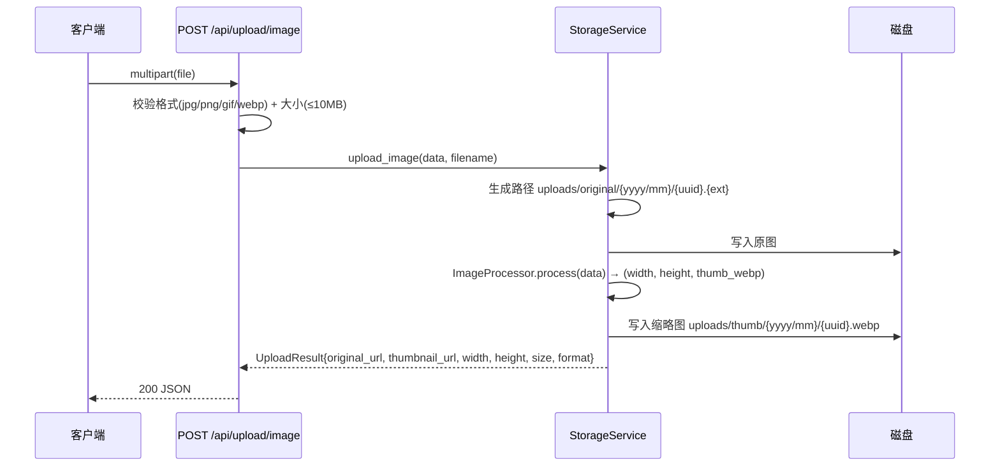
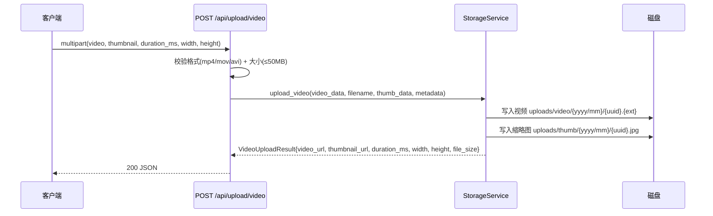
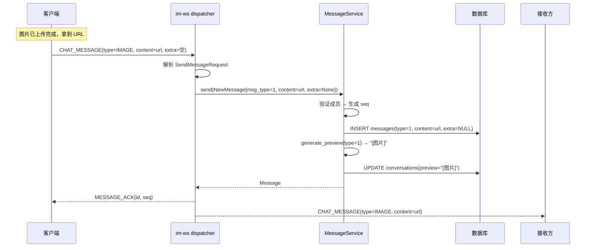

# IM Core v0.0.4_media — 服务端设计报告

> 关联设计：[im-core v0.0.3 server](../../v0.0.3/server/design.md) | [im-core v0.0.4_media analysis](../analysis.md)

## 1. 目标

- 新增 app-storage crate：本地文件存储、图片缩略图生成、文件上传 API
- 新增三个上传接口：POST /api/upload/image、/api/upload/video、/api/upload/file
- 挂载静态文件服务：GET /uploads/{path} 访问已上传文件
- 扩展 im-message：NewMessage 支持 msg_type + extra 字段
- 扩展 dispatcher：从 SendMessageRequest 中提取 type/extra 传递给 NewMessage
- 扩展 broadcaster：广播 ChatMessage 时传递 extra 字段
- 新增 generate_preview()：根据消息类型生成会话预览（"[图片]"/"[视频]"/"[文件]"）
- 扩展 proto MessageType 枚举：IMAGE=1, VIDEO=2, FILE=3

本版本不涉及客户端改动。

## 2. 现状分析

- im-message v0.0.3 已实现文本消息完整链路（存储、seq、ACK、广播、历史查询）
- messages 表已有 `type SMALLINT` 和 `extra JSONB` 字段，但代码中未使用
- NewMessage 结构体只有 conversation_id / sender_id / content 三个字段，没有 msg_type 和 extra
- repository.create() 的 INSERT SQL 没有写入 type 和 extra 列（使用数据库默认值 type=0, extra=NULL）
- dispatcher 从 SendMessageRequest 中只取了 conversation_id 和 content，忽略了 type 和 extra
- broadcaster 广播 ChatMessage 时 extra 字段写死为 `vec![]`
- service.send() 的预览生成逻辑只处理文本截断，没有按消息类型分支
- proto message.proto 中 MessageType 枚举只有 TEXT=0
- 项目没有任何文件上传/存储能力
- main.rs 已使用 tower-http ServeDir 挂载 static/ 目录，可复用同样的方式挂载 uploads/
- workspace Cargo.toml 已有 tower-http（features=["fs"]）依赖

## 3. 数据模型与接口

### 数据模型

数据库表无需变更。messages 表已有 type 和 extra 字段：

```sql
-- 已有，无需迁移
type SMALLINT NOT NULL DEFAULT 0,       -- 0:文本 1:图片 2:视频 3:文件
extra JSONB,                             -- 扩展信息（图片宽高、视频时长、文件名等）
```

#### Rust 模型变更

NewMessage 扩展：

| 字段 | 类型 | 说明 |
|------|------|------|
| conversation_id | Uuid | 会话 ID（已有） |
| sender_id | i64 | 发送者 ID（已有） |
| content | String | 消息内容（已有） |
| msg_type | i16 | 消息类型（新增，默认 0） |
| extra | Option\<serde_json::Value\> | 扩展信息（新增） |

#### 消息类型枚举

| 值 | 类型 | content 含义 | extra 含义 |
|----|------|-------------|-----------|
| 0 | TEXT | 文本内容 | 无 |
| 1 | IMAGE | 图片 URL | `{width, height, size, format, thumbnail_url}` |
| 2 | VIDEO | 视频 URL | `{thumbnail_url, duration_ms, width, height, file_size}` |
| 3 | FILE | 文件 URL | `{file_name, file_size, file_url, file_type}` |

| 决策 | 方案 | 理由 |
|------|------|------|
| 视频缩略图由客户端上传 | 客户端提取首帧 + 上传 | 服务端不依赖 ffmpeg，降低部署复杂度 |
| extra 用 JSONB | 不同类型的扩展信息结构不同 | 灵活，不需要改表结构 |

#### Proto 扩展

message.proto MessageType 枚举新增：

```protobuf
enum MessageType {
  TEXT = 0;
  IMAGE = 1;
  VIDEO = 2;
  FILE = 3;
}
```

### 接口契约

#### POST /api/upload/image — 上传图片

需要 Bearer Token 鉴权。

请求：`multipart/form-data`

| 字段 | 类型 | 必填 | 说明 |
|------|------|------|------|
| file | File | 是 | 图片文件（jpg/jpeg/png/gif/webp） |

响应 200：
```json
{
  "original_url": "/uploads/original/2026/04/uuid.jpg",
  "thumbnail_url": "/uploads/thumb/2026/04/uuid.webp",
  "width": 1920,
  "height": 1080,
  "size": 245760,
  "format": "jpg"
}
```

错误：
- 400：缺少文件 / 格式不支持 / 文件过大（>10MB）
- 401：未认证
- 500：存储失败

#### POST /api/upload/video — 上传视频

需要 Bearer Token 鉴权。Body 大小限制 50MB。

请求：`multipart/form-data`

| 字段 | 类型 | 必填 | 说明 |
|------|------|------|------|
| video | File | 是 | 视频文件（mp4/mov/avi） |
| thumbnail | File | 是 | 缩略图文件（jpeg，客户端提取的首帧） |
| duration_ms | String | 是 | 视频时长（毫秒） |
| width | String | 否 | 视频宽度（默认 0） |
| height | String | 否 | 视频高度（默认 0） |

响应 200：
```json
{
  "video_url": "/uploads/video/2026/04/uuid.mp4",
  "thumbnail_url": "/uploads/thumb/2026/04/uuid.jpg",
  "duration_ms": 15000,
  "width": 1280,
  "height": 720,
  "file_size": 10485760
}
```

错误：
- 400：缺少视频/缩略图/时长 / 格式不支持 / 文件过大（>50MB）
- 401：未认证
- 500：存储失败

#### POST /api/upload/file — 上传文件

需要 Bearer Token 鉴权。Body 大小限制 50MB。

请求：`multipart/form-data`

| 字段 | 类型 | 必填 | 说明 |
|------|------|------|------|
| file | File | 是 | 任意文件 |

响应 200：
```json
{
  "file_url": "/uploads/file/2026/04/uuid.pdf",
  "file_name": "报告.pdf",
  "file_size": 1048576,
  "file_type": "pdf"
}
```

错误：
- 400：缺少文件 / 文件过大（>50MB）
- 401：未认证
- 500：存储失败

#### GET /uploads/{path} — 静态文件访问

无需鉴权。tower-http ServeDir 直接挂载 uploads/ 目录。

## 4. 核心流程

### 图片上传



### 视频上传



### 富媒体消息发送（以图片为例）



### generate_preview 逻辑

```
match msg_type {
    1 => "[图片]"
    2 => "[视频]"
    3 => "[文件]"
    _ => 文本截断（前50字符）
}
```

## 5. 项目结构与技术决策

### 项目结构

```
server/modules/app-storage/              # 新增 crate
├── Cargo.toml
└── src/
    ├── lib.rs                           # 模块入口，导出 StorageService
    ├── service.rs                       # StorageService：upload_image/upload_video/upload_file
    ├── image.rs                         # ImageProcessor：解码、获取宽高、生成缩略图(webp)
    └── api.rs                           # HTTP 路由：upload_image/upload_video/upload_file

server/modules/im-message/src/
    ├── models.rs                        # 修改：NewMessage 增加 msg_type/extra
    ├── repository.rs                    # 修改：create() SQL 写入 type/extra
    ├── service.rs                       # 修改：send() 使用 generate_preview()
    └── (其余不变)

server/modules/im-ws/src/
    ├── dispatcher.rs                    # 修改：从 SendMessageRequest 提取 type/extra
    └── broadcaster.rs                   # 修改：广播时传递 extra 字段

proto/
    └── message.proto                    # 修改：MessageType 新增 IMAGE=1, VIDEO=3, FILE=4

server/uploads/                          # 新增：文件存储根目录
    ├── original/                        # 原图
    ├── thumb/                           # 缩略图
    ├── video/                           # 视频
    └── file/                            # 普通文件

server/src/main.rs                       # 修改：注册 storage 路由 + 挂载 uploads/ 静态服务
server/Cargo.toml                        # 修改：workspace members 新增 app-storage
```

### 职责划分

```
app-storage（独立 crate，不依赖 IM 业务）
├── StorageService        → 文件存储核心逻辑（路径生成、写入、删除）
├── ImageProcessor        → 图片处理（解码、缩放、webp 编码）
└── api.rs                → HTTP 路由（multipart 解析、校验、调用 service）

im-message（修改）
├── NewMessage            → 增加 msg_type / extra 字段
├── repository.create()   → SQL 写入 type / extra
└── service.send()        → generate_preview() 按类型生成预览

im-ws（修改）
├── dispatcher            → 从 proto 提取 type/extra → NewMessage
└── broadcaster           → ChatMessage.extra 传递实际值
```

调用方向：`main.rs → app-storage::api` / `im-ws::dispatcher → im-message::service → im-message::repository`

app-storage 与 im-message 无依赖关系，完全独立。

### 技术决策

| 决策 | 方案 | 理由 |
|------|------|------|
| 图片缩略图 | 服务端 image crate 生成 webp | 体积小质量好，客户端无需额外处理 |
| 视频缩略图 | 客户端提取首帧上传 | 服务端不依赖 ffmpeg，降低部署复杂度 |
| 存储方式 | 本地磁盘 + tower-http ServeDir | 开发阶段最简方案，后续可切换云存储 |
| 存储路径 | uploads/{type}/{yyyy}/{mm}/{uuid}.{ext} | 按类型和日期分目录，避免单目录文件过多 |
| 上传接口分离 | 图片/视频/文件三个独立接口 | 校验规则不同（格式白名单、大小限制），视频需要额外字段（缩略图、时长） |
| Body 大小限制 | 图片默认 10MB，视频默认 50MB，文件默认 50MB | 通过环境变量 UPLOAD_MAX_IMAGE_SIZE / UPLOAD_MAX_VIDEO_SIZE / UPLOAD_MAX_FILE_SIZE 配置，axum DefaultBodyLimit 按路由设置 |
| 错误处理 | StorageError 枚举 + thiserror | 结构化错误，便于 API 层转换为 HTTP 状态码 |
| app-storage 独立 | 不依赖 im-message | 通用存储能力，未来头像上传等也可复用 |

### 第三方依赖

| 依赖 | 版本 | 用途 | 已有/需新增 |
|------|------|------|-----------|
| axum | workspace | HTTP 路由、Multipart 解析 | ✅ 已有 |
| tokio | workspace | 异步文件 IO | ✅ 已有 |
| serde / serde_json | workspace | JSON 序列化 | ✅ 已有 |
| uuid | 1 | 生成文件名 | ✅ 已有 |
| chrono | workspace | 日期路径生成 | ✅ 已有 |
| tower-http | workspace (features=["fs"]) | 静态文件服务 | ✅ 已有 |
| image | 0.25 | 图片解码、缩放、webp 编码 | 🆕 需新增（app-storage） |
| thiserror | 2 | 结构化错误类型 | 🆕 需新增（app-storage） |

## 6. 验收标准

| 验收条件 | 验收方式 |
|----------|----------|
| workspace 编译通过 | `cargo build` |
| 上传图片返回 original_url + thumbnail_url + 宽高 | `curl -F "file=@test.jpg" http://localhost:9600/api/upload/image` |
| 上传视频返回 video_url + thumbnail_url + 时长 | `curl -F "video=@test.mp4" -F "thumbnail=@thumb.jpg" -F "duration_ms=5000" http://localhost:9600/api/upload/video` |
| 上传文件返回 file_url + file_name + file_size | `curl -F "file=@test.pdf" http://localhost:9600/api/upload/file` |
| 上传后文件可通过 GET /uploads/{path} 访问 | 浏览器访问返回的 URL |
| 图片缩略图为 webp 格式，max 200px | 检查 uploads/thumb/ 目录文件 |
| 超大文件被拒绝（图片>10MB，视频/文件>50MB） | curl 上传大文件，返回 400 |
| 不支持的格式被拒绝 | curl 上传 .exe 作为图片，返回 400 |
| 发送图片消息，messages 表 type=1 | 通过 WS 发送 type=IMAGE 消息后查询数据库 |
| 发送视频消息，messages 表 type=2，extra 含 thumbnail_url | 通过 WS 发送 type=VIDEO 消息后查询数据库 |
| 发送文件消息，messages 表 type=3，extra 含 file_name | 通过 WS 发送 type=FILE 消息后查询数据库 |
| 会话预览显示 "[图片]"/"[视频]"/"[文件]" | 发送媒体消息后查询 conversations.last_message_preview |
| 接收方收到的 ChatMessage 帧包含正确的 type 和 extra | Python WS 测试脚本验证 |
| 历史消息查询返回 msg_type 和 extra 字段 | GET /conversations/:id/messages 验证 JSON |

## 7. 暂不实现

| 功能 | 理由 |
|------|------|
| 语音消息 | 交互模式不同（录音 UI），单独版本处理 |
| 图片压缩/多分辨率 | 先传原图 + 服务端生成缩略图，后续优化 |
| 视频转码 | 先传原始格式，后续按需 |
| 文件断点续传 | 先做一次性上传 |
| 云存储（OSS/S3） | 先用本地磁盘，后续可替换 StorageService 实现 |
| 上传鉴权（Bearer Token 校验） | 当前上传接口暂不校验 token，后续统一加中间件 |
| 文件删除 API | 暂不暴露删除接口，后续按需 |
