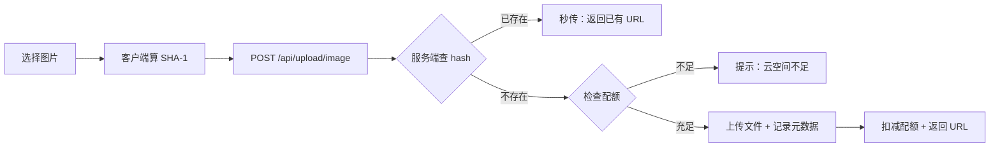

# 云资源管理系统 — 功能分析

## 概述

在现有 app-storage 文件存储模块基础上，重构为一套自建 OSS 存储服务 + 用户云资源管理系统。核心目标：

1. **存储层抽象**：引入 `StorageBackend` trait，当前实现本地文件系统，未来可切换 S3
2. **文件去重（秒传）**：基于 SHA-1 hash 去重，相同文件只存一份；两步秒传（先 check hash → 命中则跳过上传）
3. **文件元数据管理**：`file_objects` 表记录所有文件的 hash、大小、路径、引用计数
4. **用户云资源配额**：每用户默认 100MB 云空间，上传前检查余量，作为未来付费点
5. **配额实时通知**：上传成功后通过 WS 推送 STORAGE_QUOTA_UPDATE 帧，前端实时更新云空间卡片

> 访问控制（签名 URL / 防盗链）暂不实现，继续使用 ServeDir 静态文件服务。UUID 文件名本身不可猜测，安全性够用。

---

## 一、交互链

### 场景 1：发送图片（含去重/配额检查）

**用户故事**：作为用户 A，我想发送一张图片，系统自动去重、检查配额，确保我不浪费云空间。

用户选择图片后，客户端计算文件 SHA-1 hash，携带 hash 请求上传。服务端查 file_objects 表，若 hash 已存在则直接返回 URL（秒传）；若不存在则检查用户配额余量，余量不足返回错误提示"云空间不足"，余量充足则接受上传、存储文件、记录元数据、扣减配额。



### 场景 2：在"我的"页面查看云资源概览

**用户故事**：作为用户，我想在"我的"页面一眼看到云空间用了多少、还剩多少，不用跳转就能感知用量。

用户切换到底部 Tab "我的"页面，在个人信息卡片下方看到一个"云空间"卡片，显示已用量/总量（如 "62MB / 100MB"）和一个进度条。进度条按类型分色填充（图片绿色、视频蓝色、音频橙色、文件灰色）。点击卡片可进入云空间详情页查看按类型的明细列表。


### 场景 2b：云空间详情页

**用户故事**：作为用户，我想查看各类型文件的具体占用情况，以便决定是否需要清理。

用户从"我的"页面点击云空间卡片进入详情页。页面顶部是圆环图（总用量占比），下方分类展示：图片 xx MB、视频 xx MB、音频 xx MB、文件 xx MB。每项右侧显示文件数量。底部有"清理建议"按钮（未来版本）。


### 场景 3：云资源不足时的引导

**用户故事**：作为用户，当我上传文件被拒绝时，我想知道原因并有扩容途径。

用户上传文件时配额不足，客户端弹出提示："云空间已满（已用 98MB / 100MB），请清理或升级空间"。用户可选择进入云空间管理页面清理文件，或（未来）购买扩容。


### 场景 4：访问文件（保持现有方式）

**用户故事**：作为消息接收方，我想正常查看图片/视频/文件。

接收方看到图片消息，消息中包含文件的静态 URL（/uploads/...），客户端直接通过 ServeDir 加载，与现有逻辑一致。


> 签名 URL / 防盗链机制留待上云时再实现。

---

## 二、逻辑树

### 事件流：文件上传（含去重 + 配额）

| 时刻 | 事件 | 处理 | 产生的新事件 |
|------|------|------|-------------|
| T0 | 客户端选择文件 | 读取文件数据，计算 SHA-1 hash | — |
| T1 | POST /api/upload/{type}（multipart: file + hash） | 解析 multipart，提取 hash、文件数据 | — |
| T2 | 查询 file_objects WHERE hash = $1 | 若找到：ref_count += 1，直接返回已有 file_key + URL | 秒传完成 |
| T3 | 若未找到：查询 user_storage_quota WHERE user_id = $1 | 计算 used_bytes + file_size 是否 > quota_bytes | — |
| T4 | 配额不足 | 返回 403 {code: QUOTA_EXCEEDED, used, quota} | 客户端弹提示 |
| T5 | 配额充足：写入存储 | StorageBackend.put(path, data)；图片额外生成缩略图 | — |
| T6 | 写入 file_objects 记录 | INSERT (hash, storage_path, size, mime_type, width, height, duration_ms, ref_count=1, uploader_id) | — |
| T7 | 更新 user_storage_quota | UPDATE used_bytes += file_size | — |
| T8 | 返回响应 | {file_key, url, thumbnail_url, width, height, size} | 客户端继续发送消息 |

### 事件流：文件访问

保持现有 ServeDir 静态文件服务不变，客户端直接通过 `/uploads/{path}` 访问文件。

### 事件流：查询云资源用量

| 时刻 | 事件 | 处理 | 产生的新事件 |
|------|------|------|-------------|
| T0 | GET /api/storage/quota | 解析 JWT 获取 user_id | — |
| T1 | 查询 user_storage_quota | 获取 used_bytes, quota_bytes | — |
| T2 | 查询 file_objects 按类型聚合 | SELECT mime_category, SUM(size), COUNT(*) FROM file_objects WHERE uploader_id = $1 GROUP BY mime_category | — |
| T3 | 返回响应 | {used_bytes, quota_bytes, breakdown: {image: {size, count}, video: {...}, ...}} | — |

### 状态流转

| 实体 | 触发事件 | 前状态 | 后状态 |
|------|---------|--------|--------|
| file_objects 记录 | 首次上传 | 不存在 | created（ref_count=1） |
| file_objects 记录 | 相同 hash 再次上传（秒传） | ref_count=N | ref_count=N+1 |
| file_objects 记录 | 消息被删除/撤回 | ref_count=N | ref_count=N-1 |
| file_objects 记录 | ref_count 归零 | ref_count=0 | 待清理（可保留一段时间后物理删除） |
| user_storage_quota | 注册时 | 不存在 | created（used=0, quota=100MB） |
| user_storage_quota | 上传成功 | used=X | used=X+file_size |
| user_storage_quota | 文件物理删除 | used=X | used=X-file_size |
| 文件（物理） | StorageBackend.put | 不存在 | 已存储 |
| 文件（物理） | 清理任务（ref_count=0 超过保留期） | 已存储 | 已删除 |

异常处理：
- 上传写盘成功但 DB 写入失败 → 需要在事务中保证原子性（先写 DB 再写盘，失败回滚）
- 配额扣减后上传失败 → 回滚配额
- 签名 URL 过期 → 客户端重新请求签名 URL

---

## 三、功能编号与网络定位

### 本次新增节点

| 编号 | 功能节点 | 层级 | 简介 |
|------|---------|------|------|
| I-22 | StorageBackend 存储抽象 | 基础设施 | trait 定义 put/get/delete/exists，LocalFs 实现 |
| I-23 | 文件元数据服务 | 基础设施 | file_objects 表 CRUD，hash 查重，引用计数管理 |
| D-43 | 用户云配额管理 | 领域 | user_storage_quota 表，配额检查/扣减/查询/按类型统计 |
| D-44 | 文件去重（秒传） | 领域 | 上传前 hash 查重，已有则引用计数+1 直接返回 |
| D-45 | 文件引用追踪 | 领域 | file_references 表记录文件-消息-会话关联，支持查看资源被哪些消息引用 |
| P-76 | 云空间卡片（"我的"页） | 前端业务 | "我的"Tab 内展示已用/总量进度条，点击进入详情 |
| P-77 | 云空间详情页 | 前端业务 | 圆环图 + 按类型分类用量明细 |
| P-78 | 配额不足提示 | 前端业务 | 上传被拒时弹出空间不足引导 |

### 前置依赖

| 依赖节点 | 依赖方式 | 是否已有 |
|----------|---------|---------|
| I-01 flash-core（AppState、JWT） | 共享数据 | ✅ |
| I-10 文件存储服务（StorageService） | 重构为 StorageBackend trait | ✅ 需重构 |
| I-11 文件上传 API | 重构：增加 hash 参数、配额检查 | ✅ 需重构 |
| I-12 静态文件服务（ServeDir） | 保留，不变 | ✅ |
| I-13 AppError | 新增 QUOTA_EXCEEDED 错误类型 | ✅ |
| D-06 消息存储 | 消息存储时关联 file_key | ✅ 需扩展 |
| D-40 消息撤回 | 撤回时触发 ref_count-1 | ✅ 需扩展 |
| 注册流程 | 注册时创建 user_storage_quota 记录 | ✅ 需扩展 |

### 边界接口

| 接口/协议 | 定义方 | 消费方 | 敏感度 |
|-----------|--------|--------|--------|
| POST /api/upload/image | I-23 + D-43 + D-44 | 客户端（上传图片） | 高（鉴权 + 配额 + 大小限制） |
| POST /api/upload/video | I-23 + D-43 + D-44 | 客户端（上传视频） | 高（鉴权 + 配额 + 大小限制） |
| POST /api/upload/file | I-23 + D-43 + D-44 | 客户端（上传文件） | 高（鉴权 + 配额 + 大小限制） |
| GET /api/storage/quota | D-43 | 客户端（查询用量） | 低（只读） |
| GET /uploads/{path}（ServeDir） | I-12 | 客户端（下载文件） | 低（保持现有） |
| StorageBackend trait | I-22 | I-23（上传/下载服务） | 中 |
| file_objects 表 | I-23 | D-44, D-45, D-43 | 高 |
| user_storage_quota 表 | D-43 | I-23（上传时检查） | 高 |

### 数据库设计概要

```sql
-- 文件对象表（全局去重，一个 hash 只存一条）
CREATE TABLE file_objects (
    id          BIGSERIAL    PRIMARY KEY,
    hash        VARCHAR(40)  NOT NULL UNIQUE,  -- SHA-1 hex
    storage_path VARCHAR(500) NOT NULL,         -- 相对路径 original/2026/06/uuid.jpg
    size        BIGINT       NOT NULL,          -- 文件字节数
    mime_type   VARCHAR(100) NOT NULL,          -- image/jpeg, video/mp4...
    mime_category VARCHAR(20) NOT NULL,         -- image, video, audio, file
    width       INT,                            -- 图片/视频宽度
    height      INT,                            -- 图片/视频高度
    duration_ms BIGINT,                         -- 音频/视频时长
    thumb_path  VARCHAR(500),                   -- 缩略图路径
    ref_count   INT          NOT NULL DEFAULT 1,
    uploader_id BIGINT       NOT NULL REFERENCES accounts(id),
    created_at  TIMESTAMPTZ  NOT NULL DEFAULT NOW()
);

CREATE INDEX idx_file_objects_hash ON file_objects(hash);
CREATE INDEX idx_file_objects_uploader ON file_objects(uploader_id);

-- 用户云存储配额表
CREATE TABLE user_storage_quota (
    user_id     BIGINT       PRIMARY KEY REFERENCES accounts(id),
    used_bytes  BIGINT       NOT NULL DEFAULT 0,
    quota_bytes BIGINT       NOT NULL DEFAULT 104857600,  -- 100MB
    updated_at  TIMESTAMPTZ  NOT NULL DEFAULT NOW()
);

-- 文件引用关系表（记录哪条消息引用了哪个文件）
CREATE TABLE file_references (
    id              BIGSERIAL   PRIMARY KEY,
    file_id         BIGINT      NOT NULL REFERENCES file_objects(id),
    message_id      UUID        NOT NULL REFERENCES messages(id),
    user_id         BIGINT      NOT NULL REFERENCES accounts(id),
    created_at      TIMESTAMPTZ NOT NULL DEFAULT NOW()
);

CREATE INDEX idx_file_refs_file ON file_references(file_id);
CREATE INDEX idx_file_refs_message ON file_references(message_id);
```

**file_references 的作用**：
- 查某个文件被哪些消息引用：`WHERE file_id = $1`
- 查某个文件出现在哪些会话：`SELECT DISTINCT conversation_id WHERE file_id = $1`
- `file_objects.ref_count` 作为 `COUNT(*)` 的冗余缓存，加速判断是否可清理
- 云空间详情页可展示"在 N 个会话中使用"

### 上传接口决策：方案 B（保持三入口，共享 service 层）

保留现有三个上传路由不变：
- `POST /api/upload/image` — 图片（multipart: file + hash）
- `POST /api/upload/video` — 视频（multipart: video + thumbnail + hash + metadata）
- `POST /api/upload/file` — 文件（multipart: file + hash）

三个 handler 各自解析参数，但统一调用 service 层的公共方法：
1. `check_dedup(hash)` — 查 file_objects，已有则 ref_count+1 直接返回
2. `check_quota(user_id, file_size)` — 查 user_storage_quota，超额则拒绝
3. `store_file(data, path)` — 调用 StorageBackend.put 写盘
4. `record_metadata(...)` — 写入 file_objects 表
5. `deduct_quota(user_id, file_size)` — 扣减配额

前端改动最小：三个 upload 方法各自多传一个 `hash` 字段即可。

**选择理由**：视频上传参数（thumbnail + duration + width + height）与图片/文件差异大，合并为一个接口会让参数混杂不清晰。

---

## 四、结论

### 开发顺序建议

1. **I-22 StorageBackend trait + LocalFs 实现** — 纯抽象层，不影响现有功能
2. **I-23 file_objects 表 + 元数据服务** — 数据库迁移 + repository + service
3. **D-43 user_storage_quota 表 + 配额管理** — 数据库迁移 + 配额检查逻辑
4. **D-44 重构上传 API**（合并 hash 去重 + 配额检查） — 替换现有 3 个上传接口为统一入口
5. **D-45 引用计数联动** — 消息删除/撤回时触发 ref_count-1
6. **P-76 + P-77 + P-78 前端云空间卡片 + 详情页 + 配额提示** — UI 展示

### 复杂度集中点

- **上传事务一致性**：配额扣减、file_objects 写入、实际文件写盘三者的原子性保证
- **引用计数准确性**：消息转发、多人引用同一文件时的计数维护
- **前端 hash 计算**：大文件（视频 50MB）在客户端算 SHA-1 的性能问题，可能需要分块或后台 isolate

### 暂不实现

- **签名 URL / 防盗链**：UUID 文件名不可猜测，当前安全性够用，留待上云时实现
- **付费扩容**：预留 quota_bytes 字段可后端调整，前端付费购买逻辑后续版本
- **文件物理清理任务**：ref_count=0 后的定时清理 cron job，先标记不删除
- **分布式存储**：StorageBackend trait 已为 S3 实现预留接口，但本版本只做 LocalFs
- **客户端缓存 LRU 清理**：属于前端优化，不在本次范围
