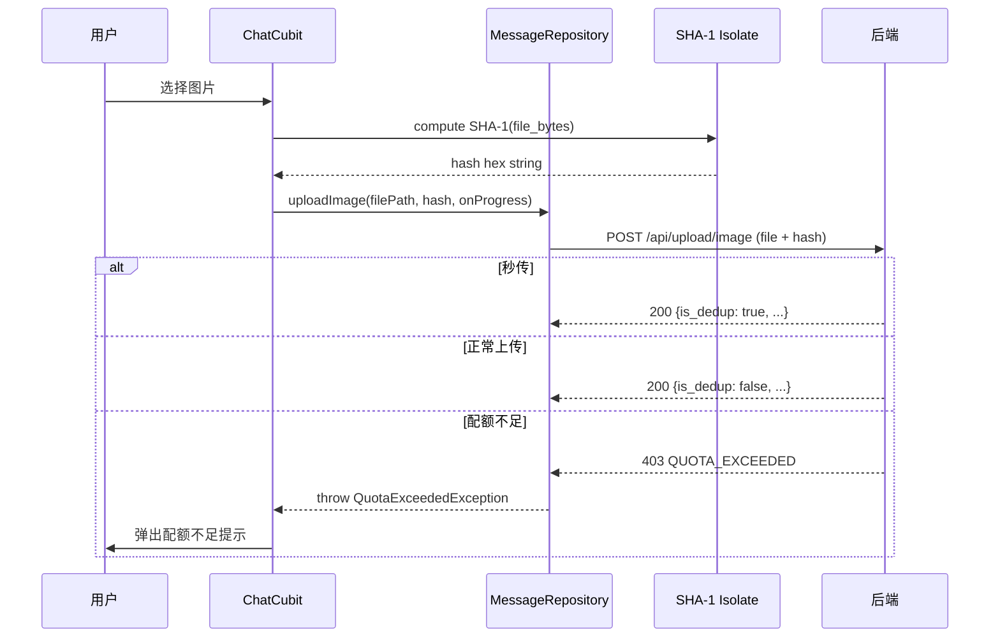
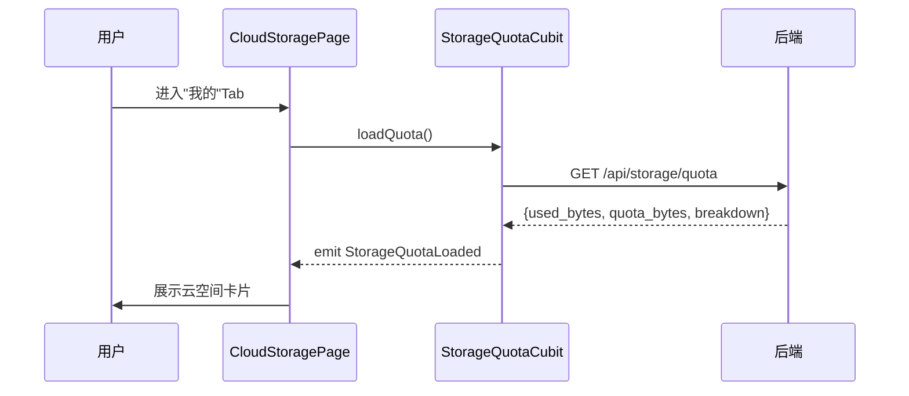

# 云资源管理 — 客户端设计报告

> 关联设计：[app-storage 服务端 v0.0.6](../server/design.md) | [富媒体消息 v0.0.4](../../v0.0.4_media/analysis.md)

## 1. 目标

- 上传文件时计算 SHA-1 hash，先调 check 接口秒传检查，命中则零上传直接发消息
- 未命中时正常上传，随请求发送 hash，支持服务端去重
- 处理服务端返回的 `QUOTA_EXCEEDED` 错误，弹出配额不足提示
- 在"我的"页面新增"云空间"卡片，展示已用量/总量 + 分色进度条（蓝图片/黄视频/红音频/绿文件）
- 新增"云空间详情页"，展示圆环图 + 按类型分类用量
- 监听 WS `STORAGE_QUOTA_UPDATE` 帧，实时更新配额显示

## 2. 现状分析

### 已有能力

- `flash_im_chat` 模块的 `MessageRepository` 有 3 个上传方法：uploadImage / uploadVideo / uploadFile
- 上传时已有进度回调（dio onSendProgress）
- "我的"页面（`ProfilePage`）已有列表式布局，可直接插入新卡片

### 需要改动

- 3 个上传方法需新增 hash 参数
- 需要一个 SHA-1 计算工具（大文件用 isolate 避免卡 UI）
- 需要处理 403 QUOTA_EXCEEDED 响应
- 需要新增配额查询接口调用
- 需要新增云空间 UI 组件

## 3. 数据模型与接口

### 客户端数据类

```dart
/// 云空间配额信息
class StorageQuota {
  final int usedBytes;
  final int quotaBytes;
  final Map<String, CategoryUsage> breakdown;

  double get usagePercent => usedBytes / quotaBytes;
  String get usedFormatted => _formatBytes(usedBytes);
  String get quotaFormatted => _formatBytes(quotaBytes);
}

/// 分类用量
class CategoryUsage {
  final int size;
  final int count;

  String get sizeFormatted => _formatBytes(size);
}
```

### 调用的后端接口

| 接口 | 用途 |
|------|------|
| GET /api/storage/check?hash=xxx | 秒传检查（200=已存在，404=需上传） |
| POST /api/upload/image (新增 hash 字段) | 图片上传 |
| POST /api/upload/video (新增 hash 字段) | 视频上传 |
| POST /api/upload/file (新增 hash 字段) | 文件上传 |
| GET /api/storage/quota | 查询配额用量 |
| WS STORAGE_QUOTA_UPDATE 帧 | 实时配额变更通知 |

### 错误处理

服务端返回 403 且 body 含 `"code": "QUOTA_EXCEEDED"` 时：
- 解析 `used_bytes` 和 `quota_bytes`
- 弹出 SnackBar 或 Dialog 提示"云空间不足（已用 xx / xx），请清理或升级"

## 4. 核心流程

### 上传 + hash 计算



### 云空间页面数据加载



## 5. 项目结构与技术决策

### 项目结构

上传 hash 改动在现有模块 `flash_im_chat` 内完成；云空间 UI 放在 app 层 `home/profile/` 下：

```
client/lib/src/home/profile/
├── profile_page.dart              # 现有"我的"页面，新增云空间卡片
├── cloud_storage_card.dart        # 云空间卡片组件（进度条 + 已用/总量）
└── cloud_storage_page.dart        # 云空间详情页（圆环图 + 分类列表）

client/modules/flash_im_chat/lib/src/data/
├── file_hash.dart                 # computeFileSha1(path)，Isolate 内计算
├── message_repository.dart        # 现有，3 个 upload 方法加 hash 参数
└── storage_repository.dart        # 新增：配额查询 API 调用
```

### 职责划分

```
ProfilePage (View)
  └── CloudStorageCard (Widget)
        └── 点击 → CloudStoragePage

CloudStoragePage (View)
  └── StorageQuotaCubit (Logic)
        └── StorageRepository (Data)
              └── GET /api/storage/quota

ChatCubit (Logic，现有)
  └── sendImageFromFile / sendVideoFromFile / sendFileFromPicker
        ├── computeFileSha1(path)   ← file_hash.dart (Isolate)
        └── uploadImage(path, hash) ← MessageRepository
```

### 技术决策

| 决策 | 方案 | 理由 |
|------|------|------|
| SHA-1 计算 | `flash_im_chat` 内 `file_hash.dart`，用 `crypto` 包 + `Isolate.run` | 就几行代码，不值得单独建包；Isolate 避免大文件卡 UI |
| 秒传策略 | 上传前先 GET /api/storage/check?hash=xxx&size=xxx，命中跳过上传 | 秒传时零文件传输，节省带宽 |
| 配额预检 | check 接口同时检查配额，不足直接 403 拦截（在占位消息创建之前） | 避免用户看到进度条走完才失败 |
| 公共预检方法 | `_preUploadCheck(filePath, size)` 封装 hash 计算 + check 调用 | 4 个 send 方法统一调用，不重复代码 |
| 配额状态管理 | 简单 Cubit（StorageQuotaCubit） | 只有加载/加载中/错误三个状态，不需要复杂架构 |
| 配额实时更新 | 监听 WS storageQuotaStream → 收到后 loadQuota() | 多端同步，用户感知即时 |
| 云空间卡片位置 | ProfilePage 的"我的名片"和"设置"之间 | 用户进"我的"就能看到，不用翻菜单 |
| 配额不足提示 | SnackBar + 跳转链接 | 轻量不打断操作，可点击进入云空间页 |
| 圆环图实现 | CustomPainter 或 fl_chart | 依项目已有依赖决定，优先 CustomPainter 减少新依赖 |

### 第三方依赖

| 依赖 | 用途 | 已有/需新增 |
|------|------|------------|
| crypto | SHA-1 计算 | 需新增到 flash_im_chat 的 pubspec（crypto: ^3.0.6） |
| dio | HTTP 请求 | ✅ 已有 |
| flutter_bloc | 状态管理 | ✅ 已有 |

## 6. 验收标准

| 验收条件 | 验收方式 |
|----------|----------|
| 编译通过 | `flutter analyze` 无错误 |
| 上传图片时请求 body 包含 hash 字段 | 抓包验证 |
| 相同图片二次发送时服务端返回 is_dedup=true | 日志确认 |
| 配额不足时弹出提示 | 设置 quota=1MB 后发送大图 |
| "我的"页面显示云空间卡片 | 手动操作验证 |
| 云空间卡片显示正确的已用/总量 | 对比 GET /api/storage/quota 返回值 |
| 云空间详情页按类型展示用量 | 上传不同类型文件后验证 |
| 大文件（50MB）SHA-1 计算不卡 UI | 发送视频时 UI 流畅无掉帧 |

## 7. 暂不实现

| 功能 | 理由 |
|------|------|
| 云空间文件列表/删除 | 本版本只展示统计，文件管理下版本 |
| 付费扩容 UI | 付费系统未设计 |
| 缓存 LRU 清理 | 前端缓存管理单独版本处理 |
| 桌面端云空间适配 | 移动端先做，桌面端后续跟进 |
