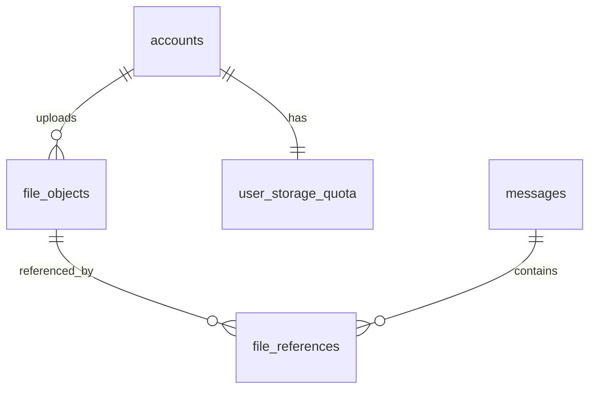
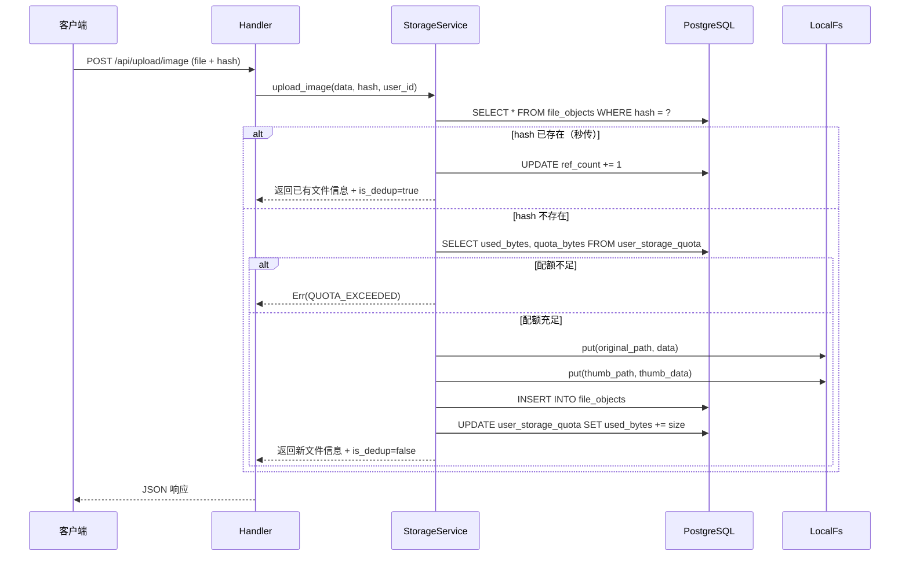
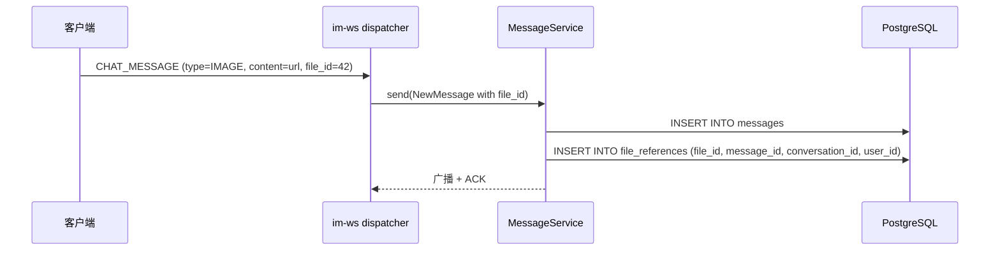
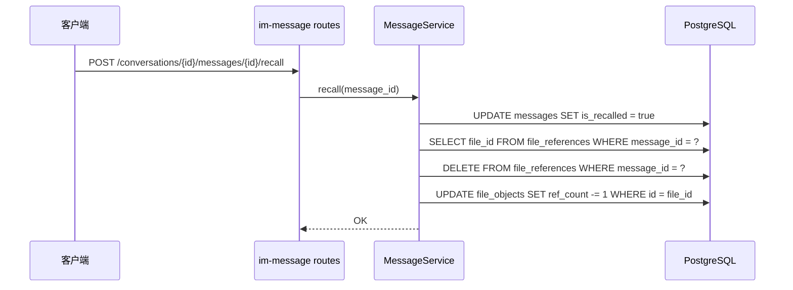
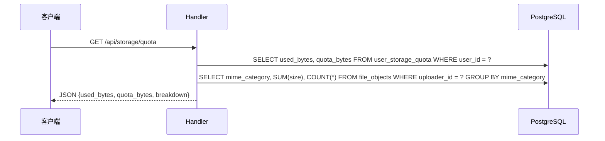

# app-storage 重构 — 服务端设计报告

> 关联设计：[富媒体消息 v0.0.4 服务端](../../v0.0.4_media/analysis.md)

## 1. 目标

- 引入 `StorageBackend` trait 抽象存储层，当前实现 LocalFs，预留 S3 扩展
- 基于 SHA-1 hash 实现文件去重（秒传）
- 新增 `file_objects` 表管理文件元数据和引用计数
- 新增 `user_storage_quota` 表实现用户云空间配额（默认 100MB）
- 新增 `file_references` 表追踪文件被哪些消息/会话引用
- 提供配额查询 API，支持按文件类型分类统计
- 保留现有三个上传接口不变，service 层共享去重/配额逻辑
- 新增 `GET /api/storage/check` 秒传检查接口（客户端上传前先查 hash）
- 上传成功后通过 WS 推送 `STORAGE_QUOTA_UPDATE` 帧，客户端实时更新配额显示

## 2. 现状分析

### 已有能力

- `app-storage` 模块：StorageService + ImageProcessor + 3 个上传 API
- 本地磁盘存储：uploads/{original,thumb,video,file}/{yyyy/mm}/{uuid}.{ext}
- tower-http ServeDir 对外提供静态文件访问
- 图片缩略图自动生成（image crate，Lanczos3，WebP 400px）

### 存在问题

- 无文件元数据记录（上传后只有磁盘文件，无 DB 记录）
- 无去重（同一文件发 10 次 = 存 10 份）
- 无用户配额（可无限上传）
- 无引用计数（消息删除后文件成为孤儿）
- 无法追踪文件被谁引用

### 基础设施就绪

- PostgreSQL 数据库 ✅
- JWT 鉴权中间件 ✅
- AppError 统一错误处理 ✅
- axum + tokio 异步框架 ✅

## 3. 数据模型与接口

### 数据模型

```sql
-- 文件对象表
CREATE TABLE file_objects (
    id            BIGSERIAL    PRIMARY KEY,
    hash          VARCHAR(40)  NOT NULL UNIQUE,
    storage_path  VARCHAR(500) NOT NULL,
    size          BIGINT       NOT NULL,
    mime_type     VARCHAR(100) NOT NULL,
    mime_category VARCHAR(20)  NOT NULL,  -- image / video / audio / file
    width         INT,
    height        INT,
    duration_ms   BIGINT,
    thumb_path    VARCHAR(500),
    ref_count     INT          NOT NULL DEFAULT 1,
    uploader_id   BIGINT       NOT NULL REFERENCES accounts(id),
    created_at    TIMESTAMPTZ  NOT NULL DEFAULT NOW()
);

-- 用户云存储配额表
CREATE TABLE user_storage_quota (
    user_id     BIGINT       PRIMARY KEY REFERENCES accounts(id),
    used_bytes  BIGINT       NOT NULL DEFAULT 0,
    quota_bytes BIGINT       NOT NULL DEFAULT 104857600,
    updated_at  TIMESTAMPTZ  NOT NULL DEFAULT NOW()
);

-- 文件引用关系表
CREATE TABLE file_references (
    id              BIGSERIAL   PRIMARY KEY,
    file_id         BIGINT      NOT NULL REFERENCES file_objects(id),
    message_id      UUID        NOT NULL REFERENCES messages(id),
    user_id         BIGINT      NOT NULL REFERENCES accounts(id),
    created_at      TIMESTAMPTZ NOT NULL DEFAULT NOW()
);
```



| 决策 | 理由 |
|------|------|
| hash 用 VARCHAR(40) 存 SHA-1 hex | 40 字符够短，去重场景不需要 SHA-256 的安全性 |
| ref_count 冗余字段 | 避免每次判断是否可清理都 COUNT file_references |
| mime_category 冗余字段 | 按类型聚合统计时避免 LIKE 匹配 mime_type |
| quota 默认 100MB | 作为免费额度，字段可调支持未来付费扩容 |
| file_references 独立表 | 支持反查"文件被哪些消息引用"，不只是一个计数器 |

### 接口契约

#### POST /api/upload/image

请求：multipart/form-data
- `file`: 图片文件（必选）
- `hash`: SHA-1 hex 字符串（必选）

响应 200：
```json
{
  "file_id": 42,
  "original_url": "/uploads/original/2026/06/uuid.jpg",
  "thumbnail_url": "/uploads/thumb/2026/06/uuid.webp",
  "width": 1920,
  "height": 1080,
  "size": 2048000,
  "format": "jpg",
  "is_dedup": false
}
```

秒传响应 200（is_dedup=true 时 file 字段可不传）：
```json
{
  "file_id": 42,
  "original_url": "/uploads/original/2026/06/uuid.jpg",
  "thumbnail_url": "/uploads/thumb/2026/06/uuid.webp",
  "width": 1920,
  "height": 1080,
  "size": 2048000,
  "format": "jpg",
  "is_dedup": true
}
```

#### POST /api/upload/video

请求：multipart/form-data
- `video`: 视频文件（必选，秒传时可不传）
- `thumbnail`: 封面图片（必选，秒传时可不传）
- `hash`: SHA-1 hex（必选）
- `duration_ms`: 时长毫秒（必选）
- `width`: 视频宽度（必选）
- `height`: 视频高度（必选）

响应 200：
```json
{
  "file_id": 43,
  "video_url": "/uploads/video/2026/06/uuid.mp4",
  "thumbnail_url": "/uploads/thumb/2026/06/uuid.jpg",
  "duration_ms": 15000,
  "width": 1280,
  "height": 720,
  "file_size": 10485760,
  "is_dedup": false
}
```

#### POST /api/upload/file

请求：multipart/form-data
- `file`: 文件（必选，秒传时可不传）
- `hash`: SHA-1 hex（必选）

响应 200：
```json
{
  "file_id": 44,
  "file_url": "/uploads/file/2026/06/uuid.pdf",
  "file_name": "report.pdf",
  "file_size": 1048576,
  "file_type": "pdf",
  "is_dedup": false
}
```

#### GET /api/storage/quota

响应 200：
```json
{
  "used_bytes": 65011712,
  "quota_bytes": 104857600,
  "breakdown": {
    "image": { "size": 30000000, "count": 45 },
    "video": { "size": 25000000, "count": 3 },
    "audio": { "size": 5000000, "count": 12 },
    "file":  { "size": 5011712, "count": 8 }
  }
}
```

#### GET /api/storage/check?hash=xxx&size=xxx

秒传检查 + 配额预检。客户端上传前先调此接口：
- `hash`（必选）：文件 SHA-1 hex
- `size`（可选）：文件字节数，传入时同时检查配额是否充足

响应 200（hash 已存在，秒传）：
```json
{
  "exists": true,
  "file_id": 42,
  "url": "/uploads/original/2026/06/uuid.jpg",
  "thumb_url": "/uploads/thumb/2026/06/uuid.webp",
  "size": 2048000,
  "width": 1920,
  "height": 1080,
  "duration_ms": null,
  "mime_type": "image/jpg"
}
```

响应 403（配额不足）：
```json
{
  "code": "QUOTA_EXCEEDED",
  "message": "云空间不足",
  "used_bytes": 100000000,
  "quota_bytes": 104857600
}
```

响应 404（hash 不存在，配额充足，可以上传）：
```json
{"exists": false}
```

#### 错误响应

配额不足 403（自定义 JSON 响应，不走 AppError 标准格式）：
```json
{
  "code": "QUOTA_EXCEEDED",
  "message": "云空间不足",
  "used_bytes": 100000000,
  "quota_bytes": 104857600
}
```

实现方式：在 service 层返回自定义错误类型 `StorageError::QuotaExceeded { used, quota }`，api 层 match 后返回 `(StatusCode::FORBIDDEN, Json(...))` 而非 AppError。

## 4. 核心流程

### 上传流程（以图片为例）



### 消息发送时记录引用



### 消息撤回时减引用



### 配额查询



## 5. 项目结构与技术决策

### 项目结构

```
server/modules/app-storage/
├── Cargo.toml
└── src/
    ├── lib.rs              # 模块导出
    ├── backend/
    │   ├── mod.rs          # StorageBackend trait 定义
    │   └── local_fs.rs     # LocalFs 实现
    ├── image.rs            # ImageProcessor（保留现有）
    ├── model.rs            # 数据结构定义（FileObject, Quota, FileReference）
    ├── repository.rs       # 数据库访问层（file_objects, quota, references CRUD）
    ├── service.rs          # 业务逻辑层（去重、配额检查、上传编排）
    └── api.rs              # HTTP handler（3 个上传接口 + 配额查询）
```

### 职责划分

```
api.rs (Handler)
  ├── 解析 multipart 参数
  ├── 提取 JWT user_id
  └── 调用 service 方法，构造响应

service.rs (StorageService)
  ├── check_dedup(hash) → Option<FileObject>
  ├── check_quota(user_id, size) → Result<()>
  ├── store_and_record(...) → FileObject  // 写盘 + 写 DB + 扣配额
  ├── add_reference(file_id, message_id, conversation_id, user_id)
  ├── remove_reference(message_id)       // 撤回/删除时
  └── get_quota_info(user_id) → QuotaInfo

repository.rs (数据访问)
  ├── find_by_hash(hash) → Option<FileObject>
  ├── insert_file_object(...) → FileObject
  ├── increment_ref_count(id)
  ├── decrement_ref_count(id)
  ├── get_quota(user_id) → Quota
  ├── update_quota_used(user_id, delta)
  ├── insert_reference(...)
  ├── delete_references_by_message(message_id)
  └── get_usage_breakdown(user_id) → Vec<CategoryUsage>

backend/mod.rs (StorageBackend trait)
  ├── async fn put(path, data) → Result<()>
  ├── async fn get(path) → Result<Vec<u8>>
  ├── async fn delete(path) → Result<()>
  └── async fn exists(path) → Result<bool>
```

### 技术决策

| 决策 | 方案 | 理由 |
|------|------|------|
| 存储抽象 | trait StorageBackend | 本地文件系统和 S3 统一接口，未来切换零改动 |
| 去重算法 | SHA-1 | 40 字符 hex，计算快，碰撞概率可忽略（Git 同方案） |
| 秒传策略 | 两步（先 check hash → 再传文件） | 命中时零文件传输，节省带宽和服务器 IO |
| 上传接口数量 | 保持 3 个入口 | 视频参数与图片/文件差异大，合并不清晰 |
| 配额初始化时机 | 用户注册时 INSERT | 避免上传时 UPSERT 竞态 |
| 事务策略 | DB 操作包在事务中，文件写盘在事务提交后 | 失败可回滚 DB，孤儿文件可定期清理 |
| ref_count 维护 | 写 file_references + 更新冗余字段 | 支持反查引用详情，同时保留快速判断能力 |
| 配额实时通知 | WS 推送 STORAGE_QUOTA_UPDATE 帧 | 多端实时同步，用户感知配额变化 |

### 第三方依赖

| 依赖 | 用途 | 已有/需新增 |
|------|------|------------|
| axum | HTTP 框架 | ✅ 已有 |
| tokio | 异步运行时 | ✅ 已有 |
| sqlx | 数据库访问 | ✅ 已有（workspace） |
| image | 图片处理/缩略图 | ✅ 已有 |
| uuid | 文件命名 | ✅ 已有 |
| sha1 | SHA-1 hash 计算 | 需新增（sha1 = "0.10"） |
| thiserror | 错误定义 | ✅ 已有 |
| prost | Protobuf 编码（主 binary） | 需新增（prost = "0.13"） |

## 6. 验收标准

| 验收条件 | 验收方式 |
|----------|----------|
| 编译通过 | `cargo build` 无错误 |
| 上传图片返回 file_id + is_dedup 字段 | curl 上传测试 |
| 相同文件二次上传返回 is_dedup=true，不重复存储 | curl 同一文件上传两次，检查磁盘文件数 |
| 配额超限返回 403 QUOTA_EXCEEDED | 设置 quota=1MB 后上传 2MB 文件 |
| GET /api/storage/quota 返回正确用量 | 上传后查询，比对数值 |
| file_references 正确记录引用 | 发送消息后查表验证 |
| 消息撤回后 ref_count 减 1 | 撤回消息后查 file_objects 表 |
| 新注册用户自动创建 quota 记录 | 注册后查 user_storage_quota 表 |

## 7. 暂不实现

| 功能 | 理由 |
|------|------|
| 签名 URL / 防盗链 | UUID 不可猜测，留待上云时实现 |
| 付费扩容接口 | 字段已预留，付费系统另行设计 |
| 文件物理清理 cron | ref_count=0 先保留，定期清理后续版本 |
| S3Backend 实现 | trait 已定义，本版本只实现 LocalFs |
| 断点续传 | 当前文件限制 50MB，一次性上传够用 |
