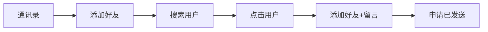
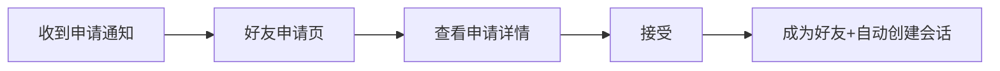
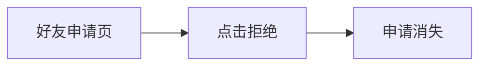
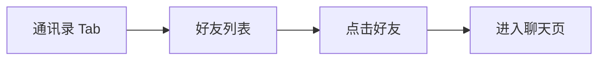
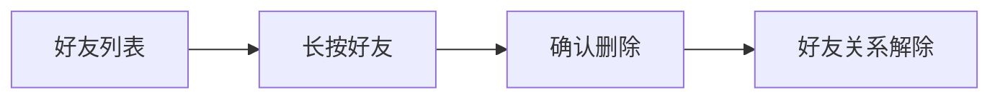

# 好友关系 — 功能分析

## 概述

实现完整的好友系统：搜索用户、发送好友申请（附留言）、接受/拒绝申请、好友列表、删除好友。好友申请和接受通过 WebSocket 实时推送通知，接受好友后自动创建私聊会话并发送打招呼消息。

---

## 一、交互链

### 场景 1：搜索用户并发送好友申请

**用户故事**：作为用户 A，我想搜索并添加用户 B 为好友，以便和 B 建立联系。

A 在通讯录页面点击"添加好友"入口，进入用户搜索页。输入 B 的昵称或手机号，搜索结果列表中找到 B，点击 B 的头像进入 B 的个人资料页。点击"添加好友"按钮，弹出申请留言输入框（可选），点击发送。页面提示"申请已发送"。

### 场景 2：接收好友申请并接受

**用户故事**：作为用户 B，我想查看并处理收到的好友申请，以便决定是否添加对方为好友。

B 收到 WS 推送的好友申请通知（通讯录 Tab 出现红点）。B 点击通讯录 Tab，进入好友申请页面，看到 A 的申请（头像+昵称+留言）。B 点击"接受"，A 和 B 成为好友，系统自动创建私聊会话并发送打招呼消息。B 的好友列表中出现 A，会话列表中出现与 A 的私聊。

### 场景 3：拒绝好友申请

**用户故事**：作为用户 B，我想拒绝不认识的人的好友申请，以便保护自己的社交圈。

B 在好友申请页面看到陌生人的申请，点击"拒绝"。申请从列表中消失，对方不会收到拒绝通知。

### 场景 4：查看好友列表

**用户故事**：作为用户，我想查看我的好友列表，以便找到想聊天的人。

用户在底部导航点击"通讯录"Tab，进入好友列表页。列表显示所有好友（头像+昵称），点击某个好友可以进入与该好友的聊天页。

### 场景 5：删除好友

**用户故事**：作为用户 A，我想删除好友 B，以便清理不再联系的人。

A 在好友列表中长按 B，弹出确认对话框，点击"确定删除"。B 从 A 的好友列表中消失，双方的好友关系解除。B 会收到好友删除的 WS 通知，B 的好友列表中 A 也消失。

---

## 二、逻辑树

### 事件流：发送好友申请

| 时刻 | 事件 | 处理 | 产生的新事件 |
|------|------|------|-------------|
| T0 | A 点击"添加好友" | 前端调用 POST /api/friends/requests | — |
| T1 | 服务端收到请求 | 校验：不能加自己、目标用户存在、不是已有好友、没有待处理申请 | — |
| T2 | 校验通过 | INSERT friend_requests(status=pending) | 触发 WS 通知 |
| T3 | WS 推送 | FRIEND_REQUEST 帧推送给 B（含申请者昵称/头像/留言） | B 端收到通知 |
| T4 | B 端收到 | FriendRequestCubit 更新申请列表，通讯录 Tab 显示红点 | — |

异常流：
- T1 校验失败 → 返回 400（已发送过/已是好友/不能加自己）
- B 不在线 → WS 通知丢失，B 下次打开申请页时通过 HTTP 拉取

### 事件流：接受好友申请

| 时刻 | 事件 | 处理 | 产生的新事件 |
|------|------|------|-------------|
| T0 | B 点击"接受" | 前端调用 POST /api/friends/requests/:id/accept | — |
| T1 | 服务端处理 | 校验权限（只有 to_user 能接受）+ 校验状态（必须是 pending） | — |
| T2 | 更新申请状态 | UPDATE friend_requests SET status=accepted | — |
| T3 | 创建好友关系 | INSERT friend_relations 双向（A→B 和 B→A），事务保证原子性 | — |
| T4 | 自动创建会话 | 调用 ConversationService.create_private(A, B) | 会话创建 |
| T5 | 发送打招呼消息 | 以申请者身份发送消息（留言内容或默认"我们已经是好友了"） | 消息广播 |
| T6 | WS 通知 A | FRIEND_ACCEPTED 帧推送给 A（含 B 的昵称/头像） | A 端更新好友列表 |
| T7 | 会话更新通知 | CONVERSATION_UPDATE 帧推送给双方 | 双方会话列表刷新 |

### 事件流：删除好友

| 时刻 | 事件 | 处理 | 产生的新事件 |
|------|------|------|-------------|
| T0 | A 删除好友 B | 前端调用 DELETE /api/friends/:id | — |
| T1 | 服务端处理 | 校验好友关系存在 | — |
| T2 | 删除关系 | DELETE friend_relations 双向（A→B 和 B→A），事务保证 | — |
| T3 | WS 通知双方 | FRIEND_REMOVED 帧分别推送给 A 和 B | 双方更新好友列表 |

### 状态流转

| 实体 | 触发事件 | 前状态 | 后状态 |
|------|---------|--------|--------|
| FriendRequest | A 发送申请 | (不存在) | pending |
| FriendRequest | B 接受 | pending | accepted |
| FriendRequest | B 拒绝 | pending | rejected |
| FriendRelation | B 接受申请 | (不存在) | 双向关系建立 |
| FriendRelation | A 删除好友 | 双向关系存在 | (删除) |
| Conversation | B 接受申请 | (不存在) | 私聊会话创建 |

---

## 三、功能编号与网络定位

### 本次新增节点

| 编号 | 功能节点 | 层级 | 简介 |
|------|---------|------|------|
| D-14 | 好友申请管理 | 领域 | 发送/接受/拒绝好友申请，friend_requests 表，状态流转 |
| D-15 | 好友关系管理 | 领域 | 双向好友关系 CRUD，friend_relations 表，事务保证原子性 |
| D-16 | 好友实时通知 | 领域 | WS 推送 FRIEND_REQUEST/FRIEND_ACCEPTED/FRIEND_REMOVED 帧 |
| D-17 | 用户搜索 | 领域 | 按昵称/手机号搜索用户（非好友搜索，是全局用户搜索） |
| F-09 | 好友 WS 流分发 | 前端基础 | WsClient 新增 friendRequestStream/friendAcceptedStream/friendRemovedStream |
| P-20 | 好友列表页 | 前端业务 | 通讯录 Tab，显示好友列表，点击进入聊天页 |
| P-21 | 好友申请页 | 前端业务 | 收到的/发送的申请列表，接受/拒绝操作 |
| P-22 | 用户搜索页 | 前端业务 | 搜索用户 + 发送好友申请入口 |
| P-23 | 好友申请通知 | 前端业务 | 收到申请时通讯录 Tab 红点提示 |

### 前置依赖

| 依赖节点 | 依赖方式 | 是否已有 |
|----------|---------|---------|
| I-01 flash-core | AppState、数据库连接池 | ✅ |
| I-04 用户资料管理 | 查询用户昵称/头像 | ✅ |
| I-05~I-09 im-ws | WS 连接、帧分发、在线用户管理 | ✅ 需扩展（新增三种帧类型） |
| D-01 会话创建 | 接受好友后自动创建私聊会话 | ✅ |
| D-06 消息存储 | 接受好友后发送打招呼消息 | ✅ |
| F-06 WsClient 帧分发 | 新增好友相关 Stream | ✅ 需扩展 |
| proto ws.proto | 新增 FRIEND_REQUEST/FRIEND_ACCEPTED/FRIEND_REMOVED 帧类型 | ✅ 需扩展 |

### 边界接口

| 接口/协议 | 定义方 | 消费方 | 敏感度 |
|-----------|--------|--------|--------|
| POST /api/friends/requests | D-14 | P-22 (发送申请) | 高 |
| GET /api/friends/requests/received | D-14 | P-21 (收到的申请) | 中 |
| GET /api/friends/requests/sent | D-14 | P-21 (发送的申请) | 中 |
| POST /api/friends/requests/:id/accept | D-14 | P-21 (接受) | 高 |
| POST /api/friends/requests/:id/reject | D-14 | P-21 (拒绝) | 中 |
| GET /api/friends | D-15 | P-20 (好友列表) | 中 |
| DELETE /api/friends/:id | D-15 | P-20 (删除好友) | 高 |
| GET /api/users/search | D-17 | P-22 (搜索用户) | 中 |
| WS FRIEND_REQUEST 帧 | D-16 | F-09 → P-23 | 高 |
| WS FRIEND_ACCEPTED 帧 | D-16 | F-09 → P-20 | 高 |
| WS FRIEND_REMOVED 帧 | D-16 | F-09 → P-20 | 中 |

---

## 四、结论

- 开发顺序建议：
  1. 数据库迁移（friend_requests + friend_relations 两张表）
  2. proto 扩展（ws.proto 新增三种帧类型 + friend.proto）
  3. 后端 im-friend crate（service + repository + api）
  4. 后端 im-ws 扩展（dispatcher 新增好友通知推送方法）
  5. 后端用户搜索接口（flash-user 扩展或独立）
  6. 前端 WsClient 扩展（新增三条好友 Stream）
  7. 前端 flash_im_friend 模块（好友列表页 + 申请页 + 搜索页）
  8. 底部导航新增"通讯录"Tab
  9. 全链路联调

- 复杂度集中在：
  - 接受好友后的连锁操作（更新申请状态 → 创建双向关系 → 创建会话 → 发送消息 → 通知双方），需要事务和错误处理
  - WS 通知的三种帧类型和前端三条 Stream 的消费
  - 好友列表和申请列表的实时更新（WS 通知触发 Cubit 状态变更）

- 暂不实现：
  - 好友备注（给好友设置备注名）
  - 好友分组
  - 黑名单
  - 好友搜索（在已有好友中搜索，区别于用户搜索）
  - 好友数量限制
