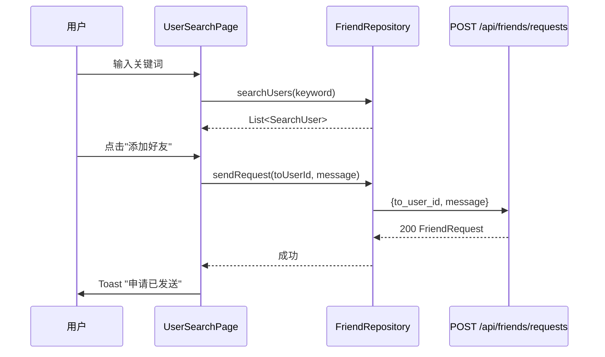
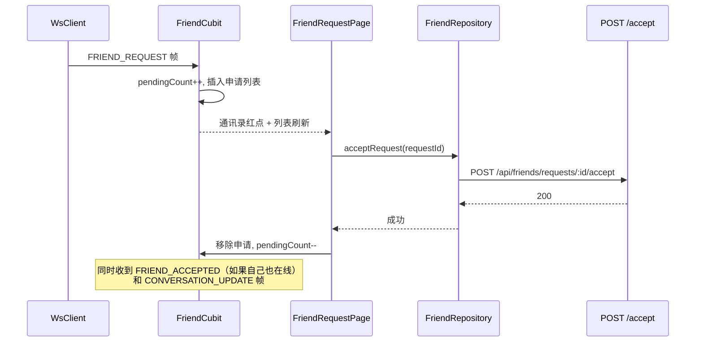
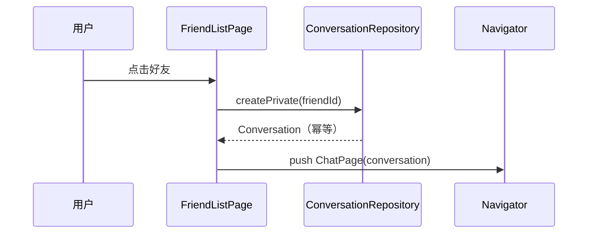

# IM Friend v0.0.1 — 客户端设计报告

> 关联设计：[im-friend v0.0.1 server](../server/design.md) | [im-friend v0.0.1 analysis](../analysis.md) | [im-core v0.0.3 client](../../core/v0.0.3/client/design.md)

## 1. 目标

- 新增 flash_im_friend 模块：好友列表页 + 好友申请页 + 用户搜索页
- 扩展 WsClient：新增三条好友 Stream（FRIEND_REQUEST / FRIEND_ACCEPTED / FRIEND_REMOVED）
- 重新生成 Dart proto 文件（ws.proto 新增帧类型和通知消息）
- 改造 HomePage 底部导航"通讯录"Tab：从占位文本变为真实的好友列表
- 通讯录 Tab 红点：收到好友申请时显示未读数

## 2. 现状分析

- WsClient 已有 chatMessageStream / messageAckStream / conversationUpdateStream 三条分发流，按 WsFrameType switch 分发，扩展模式清晰
- HomePage 底部导航已有三个 Tab（消息/通讯录/我），通讯录 Tab 当前是占位文本 `暂无联系人`
- flash_im_conversation 模块（Cubit + Repository + View）是成熟的参考模板
- Dart proto 文件由 protoc + dart plugin 生成，ws.proto 已更新但 Dart 侧尚未重新生成
- Dio HttpClient 已有 token 拦截器，新模块直接复用
- AvatarWidget / IdenticonAvatar 等共享组件已在 flash_shared 中

## 3. 数据模型与接口

### 数据模型

```dart
/// 好友申请
class FriendRequest {
  final String id;
  final String fromUserId;
  final String toUserId;
  final String? message;
  final int status;        // 0:pending 1:accepted 2:rejected
  final String nickname;   // 申请者/被申请者昵称
  final String? avatar;
  final DateTime createdAt;
  final DateTime updatedAt;
}

/// 好友（带用户信息）
class Friend {
  final String friendId;
  final String nickname;
  final String? avatar;
  final String? bio;
  final DateTime createdAt;
}

/// 搜索结果用户
class SearchUser {
  final String id;
  final String nickname;
  final String? avatar;
}
```

### 接口契约（HTTP）

| 方法 | 路径 | 说明 |
|------|------|------|
| GET | /api/users/search?keyword=&limit= | 搜索用户 |
| POST | /api/friends/requests | 发送好友申请 |
| GET | /api/friends/requests/received?limit=&offset= | 收到的申请 |
| GET | /api/friends/requests/sent?limit=&offset= | 发送的申请 |
| POST | /api/friends/requests/:id/accept | 接受申请 |
| POST | /api/friends/requests/:id/reject | 拒绝申请 |
| GET | /api/friends?limit=&offset= | 好友列表 |
| DELETE | /api/friends/:id | 删除好友 |
| DELETE | /api/friends/requests/:id | 删除申请记录 |

### WS 帧（proto 已定义，需重新生成 Dart）

| 帧类型 | 编号 | Payload 消息 | 前端消费方 |
|--------|------|-------------|-----------|
| FRIEND_REQUEST | 7 | FriendRequestNotification | FriendCubit |
| FRIEND_ACCEPTED | 8 | FriendAcceptedNotification | FriendCubit |
| FRIEND_REMOVED | 9 | FriendRemovedNotification | FriendCubit |

## 4. 核心流程

### 发送好友申请



### 接收并处理好友申请



### 好友列表 → 进入聊天



## 5. 项目结构与技术决策

### 项目结构

```
client/modules/flash_im_friend/
├── lib/
│   ├── flash_im_friend.dart              # 模块入口，导出公开 API
│   └── src/
│       ├── data/
│       │   ├── friend.dart                # Friend / FriendRequest / SearchUser 模型
│       │   └── friend_repository.dart     # HTTP 接口调用
│       ├── logic/
│       │   ├── friend_cubit.dart          # 好友列表 + 申请 + WS 通知状态管理
│       │   └── friend_state.dart          # 状态定义
│       ├── utils/
│       │   └── pinyin_helper.dart         # 拼音工具（字母索引用）
│       └── view/
│           ├── add_friend_page.dart       # 添加朋友主页（微信风格：搜索入口 + 功能入口 + 个人二维码）
│           ├── friend_list_page.dart      # 好友列表（通讯录 Tab 内容）
│           ├── friend_request_page.dart   # 好友申请列表（TabBar：收到/发送）
│           ├── friend_detail_page.dart    # 好友详情页（微信风格）
│           ├── add_friend_page.dart      # 添加朋友主页（搜索入口+功能入口+二维码）
│           ├── user_search_page.dart      # 用户搜索（独立搜索页，从 AddFriendPage 跳转进入）
│           ├── indexed_contact_list.dart  # 带字母索引的联系人列表
│           └── friend_tile.dart           # 好友列表项组件
├── pubspec.yaml
└── test/
```

### 职责划分

```
View（FriendListPage / FriendRequestPage / UserSearchPage）
  ↓ 读状态 / 触发操作
FriendCubit（状态管理）
  ↓ 调用 Repository / 监听 WsClient Stream
FriendRepository（HTTP 调用）    WsClient（WS 帧分发）
```

- FriendCubit 是核心：管理好友列表、申请列表、未读数、WS 实时更新
- FriendRepository 只做 HTTP 调用，不持有状态
- WsClient 扩展三条 Stream，FriendCubit 订阅消费
- UserSearchPage 相对独立，内部管理搜索状态，调用 FriendRepository

### 技术决策

| 决策 | 方案 | 理由 |
|------|------|------|
| 状态管理 | Cubit（不用 Event 模式） | 与项目现有模式一致（ChatCubit、ConversationListCubit） |
| 好友列表和申请共用一个 Cubit | FriendCubit 管理两个列表 | 未读数需要跨页面同步，拆开反而复杂 |
| 搜索页独立管理状态 | UserSearchPage 内部 StatefulWidget | 搜索是临时操作，不需要持久化状态 |
| 点击好友进入聊天 | 先 POST /conversations（幂等），再 push ChatPage | 复用已有的会话创建逻辑，不需要额外存储好友-会话映射 |
| 通讯录字母索引 | IndexedContactList + lpinyin | 微信风格，拼音首字母分组 + 右侧索引栏 + 吸顶标题 |
| 点击好友 → 详情页 | FriendDetailPage（非直接进聊天） | 对齐微信交互：详情页展示信息 + 发消息/删除好友 |
| 好友申请页 TabBar | 好友申请 / 我的申请 两个 Tab | 对齐微信，收到和发送分开展示 |
| 申请历史侧滑删除 | Dismissible + DELETE /api/friends/requests/:id | 清理不需要的申请记录 |
| proto 重新生成 | protoc + dart plugin | ws.proto 已更新，需要重新生成 Dart 文件以获取新帧类型和通知消息类 |

### 第三方依赖

| 依赖 | 用途 | 已有/需新增 |
|------|------|-----------|
| flutter_bloc | Cubit 状态管理 | ✅ 已有 |
| dio | HTTP 请求 | ✅ 已有 |
| lpinyin | 中文拼音转换（字母索引） | 🆕 新增 ^2.0.3 |
| qr_flutter | 二维码生成（个人名片） | 🆕 新增 ^4.1.0 |
| flash_im_core | WsClient、proto 类型 | ✅ 已有，需扩展 |
| flash_shared | AvatarWidget、FlashSearchBar、FlashSearchInput | ✅ 已有 |
| qr_flutter | 二维码生成（AddFriendPage 底部个人二维码） | 🆕 新增 ^4.1.0 |
| flash_session | SessionCubit（获取当前用户） | ✅ 已有 |
| flash_im_conversation | ConversationRepository（点击好友进入聊天） | ✅ 已有 |
| flash_im_chat | ChatCubit / ChatPage | ✅ 已有 |

## 6. 验收标准

| 验收条件 | 验收方式 |
|----------|----------|
| flutter analyze 无错误 | `flutter analyze` |
| 通讯录 Tab 显示好友列表 | 手动操作验证 |
| 搜索用户并发送好友申请 | 手动操作验证 |
| 收到好友申请时通讯录红点 | 两台设备/模拟器验证 |
| 接受申请后双方好友列表更新 | 手动操作验证 |
| 接受后自动出现私聊会话 | 切换到消息 Tab 验证 |
| 点击好友进入聊天页 | 手动操作验证 |
| 删除好友后列表更新 | 手动操作验证 |
| WS 断线重连后好友列表正确 | 手动断网再恢复验证 |

## 7. 暂不实现

| 功能 | 理由 |
|------|------|
| 好友备注 | 后续版本 |
| 好友分组 | 后续版本 |
| 好友搜索（在好友中搜索） | 后续版本，列表量小时不需要 |
| 申请消息推送（系统通知栏） | 后续版本，当前仅 WS 在线推送 |
| 好友在线状态 | 后续版本 |

## 8. 实现变更记录

| 变更 | 原设计 | 实际实现 | 理由 |
|------|--------|---------|------|
| 通讯录布局 | 简单 ListView | IndexedContactList（拼音字母索引 + 吸顶标题 + 右侧索引栏） | 对齐微信风格，新增 lpinyin 依赖 |
| 点击好友交互 | 直接进入聊天页 | 先进好友详情页（FriendDetailPage），再从详情页发消息 | 对齐微信交互流程 |
| 好友申请页 | 单列表显示收到的申请 | TabBar 双 Tab（好友申请 / 我的申请） | 对齐微信，展示发送的申请状态 |
| 通讯录顶部入口 | 仅"好友申请"一个入口 | 三个入口：新的朋友 + 群通知 + 我的群聊（后两个占位） | 对齐微信布局，为后续群聊预留 |
| 新增好友详情页 | 未规划 | FriendDetailPage（头像+昵称+签名 + 发消息/删除好友） | 微信风格必备页面 |
| 新增删除申请接口 | 未规划 | DELETE /api/friends/requests/:id + 侧滑删除 | 清理申请历史 |
| FriendState 新增 sentRequests | 未规划 | FriendState 新增 sentRequests 字段，FriendCubit 新增 loadSentRequests() 和 deleteRequest() | 支持"我的申请"Tab 和侧滑删除 |
| 新增 AddFriendPage | 未规划 | 新增 add_friend_page.dart（微信风格添加朋友主页：搜索入口 + 扫一扫占位 + 创建群聊占位 + 底部个人二维码） | 对齐微信"添加朋友"页面，统一添加好友入口 |
| UserSearchPage 入口变更 | 通讯录"+"按钮直接跳转 UserSearchPage | 通讯录"+"按钮跳转 AddFriendPage，再从 AddFriendPage 进入 UserSearchPage | AddFriendPage 作为中间页，承载更多功能入口 |
| 新增共享搜索组件 | 未规划 | flash_shared 新增 FlashSearchBar + FlashSearchInput 共享组件 | 搜索栏样式统一复用 |
| FriendRequestPage AppBar | 仅标题"好友申请" | AppBar 新增"添加朋友"文字按钮（onAddFriendTap 回调） | 方便从申请页快速跳转添加朋友 |
| 搜索 hint 文字 | 默认搜索提示 | 改为"闪讯号 / 手机号 / 昵称" | 对齐服务端三种匹配方式，引导用户输入 |
| 新增 qr_flutter 依赖 | 未规划 | 新增 qr_flutter ^4.1.0 | AddFriendPage 底部展示个人二维码 |
