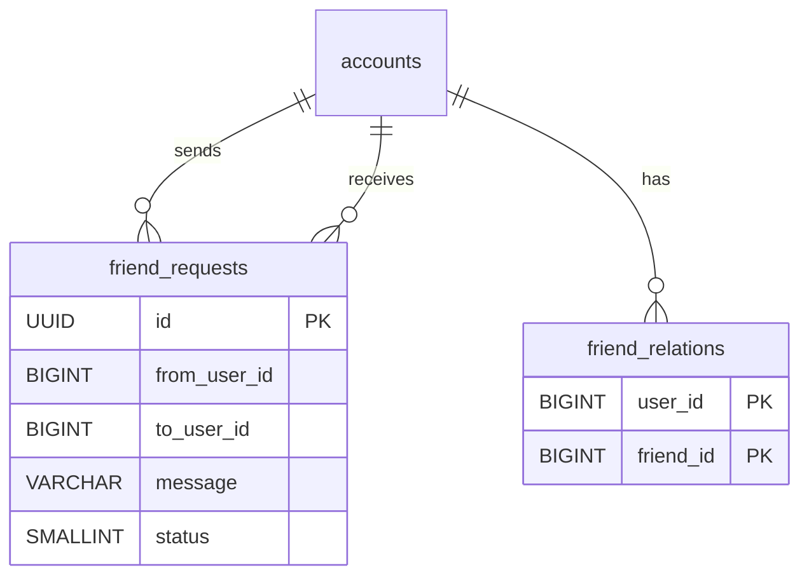
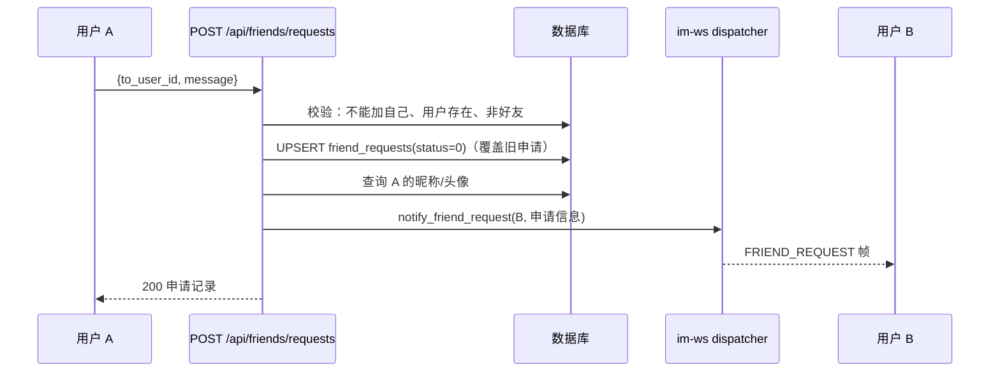
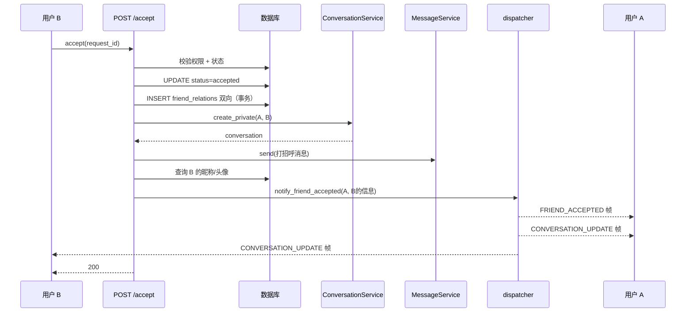
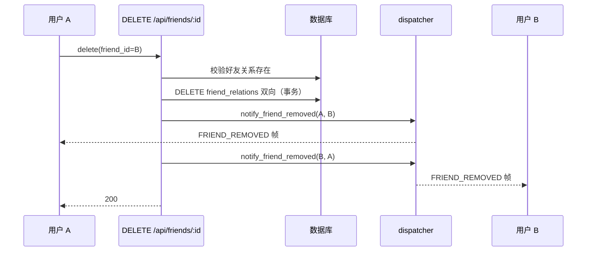

# IM Friend v0.0.1 — 服务端设计报告

> 关联设计：[im-friend v0.0.1 analysis](../analysis.md) | [im-core v0.0.3 server](../../core/v0.0.3/server/design.md)

## 1. 目标

- 新增 im-friend crate：好友申请管理 + 好友关系管理
- 新增数据库迁移：friend_requests 表 + friend_relations 表
- 新增 8 个好友 HTTP 接口：发送/接受/拒绝申请、查询收到/发送的申请、好友列表、删除好友、删除申请记录
- 新增 2 个用户 HTTP 接口：GET /api/users/search + GET /api/users/:id（扩展 flash-user）
- 扩展 ws.proto：新增 FRIEND_REQUEST / FRIEND_ACCEPTED / FRIEND_REMOVED 帧类型
- 扩展 im-ws dispatcher：新增三个好友通知推送方法
- 接受好友后自动创建私聊会话 + 发送打招呼消息

## 2. 现状分析

- im-conversation 已实现会话创建（create_private），可直接调用
- im-message 已实现消息发送（service.send），可直接调用
- im-ws 已实现 WsState（在线用户管理）和 dispatcher（帧分发），需扩展推送方法
- ws.proto 已有 7 种帧类型（PING~CONVERSATION_UPDATE），需新增 3 种
- flash-user 已有用户资料 CRUD，但没有搜索接口
- 项目没有好友相关的表和模块

## 3. 数据模型与接口

### 数据库表

```sql
-- 好友申请表
CREATE TABLE friend_requests (
    id UUID PRIMARY KEY DEFAULT gen_random_uuid(),
    from_user_id BIGINT NOT NULL,
    to_user_id BIGINT NOT NULL,
    message VARCHAR(200),              -- 申请留言
    status SMALLINT NOT NULL DEFAULT 0, -- 0:待处理 1:已接受 2:已拒绝
    created_at TIMESTAMPTZ NOT NULL DEFAULT NOW(),
    updated_at TIMESTAMPTZ NOT NULL DEFAULT NOW(),
    UNIQUE(from_user_id, to_user_id)
);

CREATE INDEX idx_friend_requests_to_user ON friend_requests(to_user_id, status);
CREATE INDEX idx_friend_requests_from_user ON friend_requests(from_user_id, status);

-- 好友关系表（双向存储）
CREATE TABLE friend_relations (
    user_id BIGINT NOT NULL,
    friend_id BIGINT NOT NULL,
    created_at TIMESTAMPTZ NOT NULL DEFAULT NOW(),
    PRIMARY KEY (user_id, friend_id)
);

CREATE INDEX idx_friend_relations_friend ON friend_relations(friend_id);
```



| 决策 | 方案 | 理由 |
|------|------|------|
| 好友关系双向存储 | 每对好友插入两条记录（A→B 和 B→A） | 查询"我的好友列表"只需 WHERE user_id=$1，不需要 OR 条件，索引友好 |
| 申请表 UNIQUE 约束 | (from_user_id, to_user_id) | 防止重复申请，同一对用户只能有一条申请记录 |
| 申请状态用 SMALLINT | 0=待处理 1=已接受 2=已拒绝 | 简单，和消息状态风格一致 |

### Rust 模型

```rust
// 好友申请状态
enum FriendRequestStatus { Pending=0, Accepted=1, Rejected=2 }

// 好友申请
struct FriendRequest { id, from_user_id, to_user_id, message, status, created_at, updated_at }

// 好友关系
struct FriendRelation { user_id, friend_id, created_at }

// 带用户信息的好友（API 响应）
struct FriendWithProfile { friend_id, nickname, avatar, bio, created_at }

// 带用户信息的好友申请（API 响应）
struct FriendRequestWithProfile { request(flatten), nickname, avatar }

// 好友服务错误
enum FriendError {
    UserNotFound, RequestNotFound, RelationNotFound,
    AlreadyFriends, CannotAddSelf, Forbidden,
    Database(sqlx::Error)
}
```

### Proto 扩展

ws.proto 新增帧类型：

```protobuf
enum WsFrameType {
  // ... 已有 0~6 ...
  FRIEND_REQUEST = 7;
  FRIEND_ACCEPTED = 8;
  FRIEND_REMOVED = 9;
}

message FriendRequestNotification {
  string request_id = 1;
  string from_user_id = 2;
  string nickname = 3;
  string avatar = 4;
  string message = 5;
  int64 created_at = 6;
}

message FriendAcceptedNotification {
  string friend_id = 1;
  string nickname = 2;
  string avatar = 3;
  int64 created_at = 4;
}

message FriendRemovedNotification {
  string friend_id = 1;
}
```

### 接口契约

所有接口的错误响应均为 JSON body `{"error": "具体原因"}`，包含可读的错误描述。

#### POST /api/friends/requests — 发送好友申请

请求（需 Bearer Token）：
```json
{ "to_user_id": "2", "message": "你好，我是朱红" }
```

响应 200：
```json
{ "data": { "id": "uuid", "from_user_id": "1", "to_user_id": "2", "message": "...", "status": 0, "created_at": "..." } }
```

重复申请采用 upsert 策略：同一对用户重复发送时覆盖旧申请（更新留言和状态），不返回错误。用户可修改留言重新发送，对齐微信行为。

错误：400（不能加自己/已是好友）、404（用户不存在）

#### GET /api/friends/requests/received — 收到的申请

请求：`?limit=20&offset=0`

响应 200：
```json
{ "data": [{ "id": "uuid", "from_user_id": "1", "to_user_id": "2", "message": "...", "status": 0, "nickname": "朱红", "avatar": "..." }] }
```

#### GET /api/friends/requests/sent — 发送的申请

同上格式，nickname/avatar 是被申请者的信息。

#### POST /api/friends/requests/:id/accept — 接受申请

响应 200：`{ "data": null }`

副作用：创建双向好友关系 → 自动创建私聊会话 → 发送打招呼消息 → WS 通知申请者

错误：403（不是被申请者/申请不是 pending）、404（申请不存在）

#### POST /api/friends/requests/:id/reject — 拒绝申请

响应 200：`{ "data": null }`

#### GET /api/friends — 好友列表

请求：`?limit=20&offset=0`

响应 200：
```json
{ "data": [{ "friend_id": "2", "nickname": "橘橙", "avatar": "...", "bio": "...", "created_at": "..." }] }
```

#### DELETE /api/friends/:id — 删除好友

响应 200：`{ "data": null }`

副作用：删除双向关系 → WS 通知双方

#### DELETE /api/friends/requests/:id — 删除申请记录

响应 200：`{ "data": null }`

说明：删除指定的好友申请记录（无论状态），仅申请的发送方或接收方可操作。用于侧滑删除清理申请历史。

错误：403（非申请相关方）、404（申请不存在）

#### GET /api/users/search — 搜索用户

请求：`?keyword=朱红&limit=20`

支持三种匹配方式：
- 昵称模糊匹配（ILIKE）
- 手机号精确匹配（JOIN auth_credentials）
- 闪讯号（用户 ID）精确匹配

响应 200：
```json
{ "data": [{ "id": "1", "nickname": "朱红", "avatar": "..." }] }
```

支持三种匹配方式（任一命中即返回）：
1. 昵称模糊匹配：`nickname ILIKE '%keyword%'`
2. 手机号精确匹配：`JOIN auth_credentials`，`identifier = keyword`
3. 闪讯号精确匹配：`account_id = keyword`（需 keyword 可解析为整数）

SQL WHERE 条件：`nickname ILIKE $1 OR c.identifier = $2 OR a.id = $3`

#### GET /api/users/:id — 获取用户资料

请求：路径参数 `:id` 为用户 ID（需 Bearer Token）

响应 200：
```json
{ "data": { "id": "1", "nickname": "朱红", "avatar": "...", "signature": "..." } }
```

错误：404（用户不存在）

说明：返回指定用户的公开资料（昵称、头像、签名），用于搜索结果点击后展示完整用户信息。

## 4. 核心流程

### 发送好友申请



### 接受好友申请（连锁操作）



### 删除好友



## 5. 项目结构与技术决策

### 项目结构

```
server/modules/im-friend/              # 新增 crate
├── Cargo.toml
└── src/
    ├── lib.rs                         # 模块入口，导出 FriendService + router
    ├── models.rs                      # 数据模型：FriendRequest, FriendRelation, FriendError 等
    ├── repository.rs                  # 数据库操作：申请 CRUD、关系 CRUD、好友查询
    ├── service.rs                     # 业务逻辑：send_request, accept, reject, delete, get_friends
    └── api.rs                         # HTTP 路由：8 个好友接口

server/modules/flash-user/src/
    └── routes.rs                      # 修改：新增 GET /api/users/search + GET /api/users/:id

server/modules/im-ws/src/
    └── dispatcher.rs                  # 修改：新增 notify_friend_request/accepted/removed

proto/
    └── ws.proto                       # 修改：新增帧类型 + 通知消息结构

server/migrations/
    └── 20260407_004_friends.sql       # 新增：friend_requests + friend_relations 表

server/src/main.rs                     # 修改：注册 im-friend 路由，注入依赖
server/Cargo.toml                      # 修改：workspace members 新增 im-friend
```

### 职责划分

```
im-friend（独立 crate）
├── FriendRepository    → 数据库操作（申请/关系的 CRUD）
├── FriendService       → 业务逻辑（校验 + 调用 repo）
└── api.rs              → HTTP 路由（解析请求 + 调用 service + 触发 WS 通知）

api.rs 持有 FriendApiState：
├── service: Arc<FriendService>
├── dispatcher: Option<Arc<MessageDispatcher>>     → 用于 WS 推送
├── conv_service: Option<Arc<ConversationService>> → 用于接受后创建会话
└── msg_service: Option<Arc<MessageService>>       → 用于接受后发送消息
```

调用方向：`api.rs → FriendService → FriendRepository`，`api.rs → dispatcher`（WS 通知），`api.rs → ConversationService + MessageService`（接受后连锁操作）

im-friend 依赖 flash-core（AppState）和 im-ws（dispatcher 类型），不依赖 im-conversation 和 im-message（通过 api.rs 的 Option 注入，解耦）。

### 技术决策

| 决策 | 方案 | 理由 |
|------|------|------|
| im-friend 独立 crate | 不放在 im-conversation 里 | 好友是独立领域，和会话没有从属关系 |
| 接受后的连锁操作放在 api.rs | 不放在 service 里 | service 只管好友领域，会话和消息是跨域操作，由 api 层编排 |
| dispatcher 通过 Option 注入 | 不让 im-friend 强依赖 im-ws | 测试时可以不注入 dispatcher |
| 用户搜索放在 flash-user | 不放在 im-friend | 搜索用户是通用能力，不只是好友场景用 |
| 好友关系双向存储 | 不用单条记录 + OR 查询 | 查询性能好，索引友好 |
| 申请表 UNIQUE(from, to) | 同一对用户只能有一条申请 | 防止重复申请，简化逻辑 |

### 第三方依赖

| 依赖 | 版本 | 用途 | 已有/需新增 |
|------|------|------|-----------|
| flash-core | path | AppState、JWT | ✅ 已有 |
| im-ws | path | dispatcher 类型 | ✅ 已有 |
| im-conversation | path | ConversationService（api 层注入） | ✅ 已有 |
| im-message | path | MessageService（api 层注入） | ✅ 已有 |
| axum | workspace | HTTP 路由 | ✅ 已有 |
| sqlx | workspace | 数据库操作 | ✅ 已有 |
| uuid | 1 | 申请 ID | ✅ 已有 |
| thiserror | 2 | FriendError | ✅ 已有（workspace） |

## 6. 验收标准

| 验收条件 | 验收方式 |
|----------|----------|
| workspace 编译通过 | `cargo build` |
| 发送好友申请成功 | curl POST /api/friends/requests |
| 重复申请 upsert 覆盖 | curl 重复发送，返回 200 |
| 接受申请后双方成为好友 | 查询 friend_relations 表 |
| 接受后自动创建私聊会话 | 查询 conversations 表 |
| 接受后发送打招呼消息 | 查询 messages 表 |
| 好友列表返回正确 | curl GET /api/friends |
| 删除好友后双向关系消失 | 查询 friend_relations 表 |
| WS 推送好友申请通知 | Python 测试脚本验证 |
| WS 推送好友接受通知 | Python 测试脚本验证 |
| WS 推送好友删除通知 | Python 测试脚本验证 |
| 用户搜索返回结果 | curl GET /api/users/search?keyword=朱红 |

## 7. 暂不实现

| 功能 | 理由 |
|------|------|
| 好友备注 | 后续版本，friend_relations 表可加 remark 列 |
| 好友分组 | 后续版本 |
| 黑名单 | 后续版本，需要独立的 blocked_users 表 |
| 好友搜索（在好友中搜索） | 后续版本，repository 已预留 search_friends 方法签名 |
| 好友数量限制 | 后续版本 |
| 申请过期机制 | 后续版本，可加定时任务清理过期申请 |
