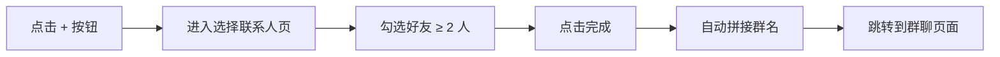
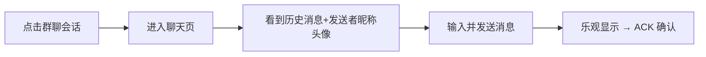
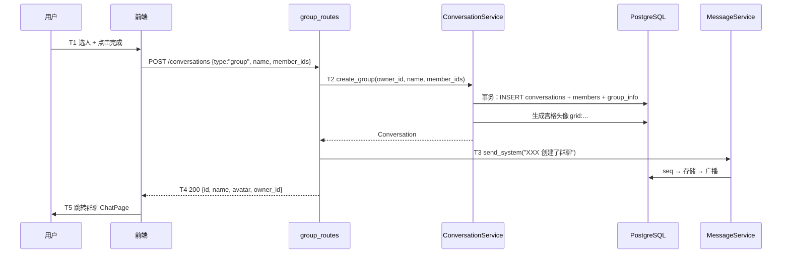
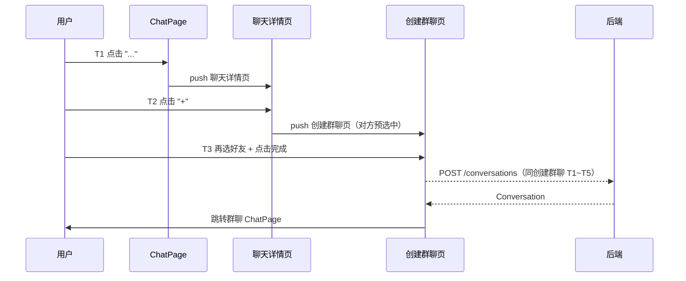
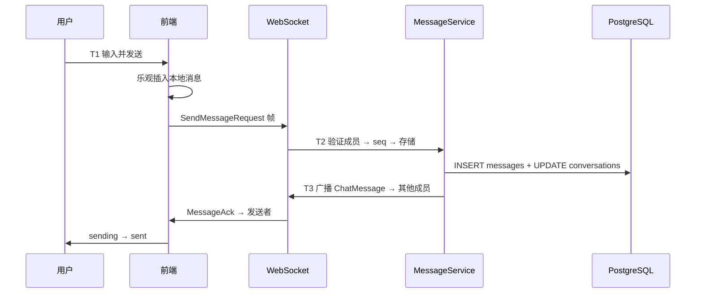

# 群聊 — 创建与加入 — 功能分析

## 概述

本次实现群聊的最小可用版本，覆盖三条链路：创建群聊（选人建群）、从单聊发起群聊（聊天详情页邀请第三者）、群聊消息收发。

当前系统已有完整的单聊链路和好友体系。数据库 `conversations` 表已预留 `type=1`、`name`/`avatar`/`owner_id` 字段，`conversation_members` 天然支持多成员，消息发送链路（`MessageService.send` → 验证成员 → seq → 存储 → 广播）已是多成员兼容的，`ChatMessage` protobuf 已有 `sender_name`/`sender_avatar` 字段。

---

## 一、交互链

### 场景 1：创建群聊

**用户故事**：作为用户，我想从好友中选人创建群聊，以便和多个人同时沟通。

用户在消息 Tab 右上角点击"+"按钮，选择"发起群聊"，进入选择联系人页面。页面顶部是 FlashSearchBar 搜索框，下方是按字母分组的好友列表（带右侧索引栏）。用户勾选至少 2 个好友，已选的人以头像横条显示在搜索框下方（点击可取消）。右上角显示"完成(N)"。点击完成，群名由前端自动拼接（≤3 人用顿号连接，>3 人取前三 + "等"），调用 `POST /conversations`（type=group），成功后跳转到群聊 ChatPage。

### 场景 2：从单聊发起群聊

**用户故事**：作为用户，我正在和某人单聊，想拉更多人进来一起聊。

用户在单聊 ChatPage 右上角点击"..."按钮，进入聊天详情页。详情页显示当前聊天对象的头像和昵称，下方有"邀请更多人"（"+"按钮）。点击后进入选择联系人页，当前聊天对象已预选中（勾选状态，不可取消）。用户再勾选至少 1 个其他好友，点击完成。群名自动拼接，创建成功后跳转到新的群聊 ChatPage。

### 场景 3：查看我的群聊

**用户故事**：作为用户，我想查看自己加入的所有群聊，以便快速找到并进入某个群。

用户在通讯录 Tab 点击"群聊"入口，进入我的群聊页面。页面顶部是 FlashSearchBar 搜索栏，下方展示已加入的群聊列表（群头像 + 群名）。输入关键词可本地过滤群名。点击某个群聊直接进入 ChatPage。

### 场景 4：群聊消息收发

**用户故事**：作为群成员，我想在群聊中发送和接收消息。

用户从会话列表点击群聊会话（type=1），进入聊天页面。标题显示群名称。他人消息左侧显示发送者头像，气泡上方显示发送者昵称。自己的消息靠右，不显示昵称头像。发送流程与单聊完全一致（乐观更新 → WS 发送 → ACK 确认）。

---

## 二、逻辑树

### 事件流：创建群聊

| 时刻 | 事件 | 处理 | 产生的新事件 |
|------|------|------|-------------|
| T1 | 用户点击"完成" | 前端 `POST /conversations`，body: `{ type: "group", name, member_ids }` | HTTP 请求到达后端 |
| T2 | 后端收到请求 | 校验：群名非空、成员数 ≥ 2 且 ≤ 200。事务内：插入 conversations（type=1, name, owner_id）→ 逐个插入 conversation_members（群主 + 成员，ON CONFLICT 恢复 is_deleted）→ 初始化 group_info（join_verification=false）→ 生成宫格头像（查前 9 个成员头像拼接 `grid:url1,url2,...`） | 群聊创建成功 |
| T3 | 系统消息 | 调用 `send_system` 发送"XXX 创建了群聊"，走完整消息流程 | 所有成员收到系统消息 |
| T4 | 返回响应 | 返回完整 Conversation 对象（含 id, name, avatar, owner_id） | 前端收到响应 |
| T5 | 前端处理 | 跳转 ChatPage，本地会话列表插入新会话 | 页面跳转 |

### 事件流：从单聊发起群聊

| 时刻 | 事件 | 处理 | 产生的新事件 |
|------|------|------|-------------|
| T1 | 用户在单聊页点击"..." | 前端跳转到聊天详情页，传入 conversation 信息（peerUserId, peerNickname, peerAvatar） | 详情页展示 |
| T2 | 用户点击"+"邀请更多人 | 前端跳转到创建群聊页，`initialSelectedIds = { peerUserId }`，预选中且不可取消 | 创建群聊页展示 |
| T3 | 用户选人+点击完成 | 同"创建群聊"事件流 T1~T5，member_ids 包含预选的 peerUserId + 新选的好友 | 群聊创建成功，跳转 ChatPage |

### 事件流：群聊消息（复用现有链路，无改动）

| 时刻 | 事件 | 处理 | 产生的新事件 |
|------|------|------|-------------|
| T1 | 用户发送消息 | 前端乐观插入 → WS `SendMessageRequest` | 帧到达后端 |
| T2 | dispatcher → MessageService.send | 验证成员 → seq → 存储 → 更新 preview/time → unread+1 | 消息持久化 |
| T3 | 广播 | ChatMessage 帧（含 sender_name/sender_avatar）→ 除发送者外的在线成员；ConversationUpdate 帧 → 所有成员；MessageAck → 发送者 | 各端收到推送 |

### 状态流转

| 实体 | 触发事件 | 前状态 | 后状态 |
|------|---------|--------|--------|
| Conversation | POST /conversations (type=group) | 不存在 | type=1, name, owner_id, avatar=grid:... |
| ConversationMember | 创建群聊 | 不存在 | joined (unread=0, is_deleted=false) |
| group_info | 创建群聊 | 不存在 | join_verification=false（默认） |
| 本地消息 | 发送 → ACK | sending | sent |
| 本地消息 | 10s 超时 | sending | failed |

**异常回退**：
- 群聊创建失败：事务回滚，前端提示错误
- 消息发送失败：10s 超时标记 failed，可重试

---

## 三、功能编号与网络定位

### 本次新增节点

| 编号 | 功能节点 | 层级 | 简介 |
|------|---------|------|------|
| D-18 | 群聊创建 | 领域 | 扩展 POST /conversations 支持 type=group，事务创建群+成员+group_info+宫格头像 |
| P-28 | 创建群聊页 | 前端业务 | 微信风格选人页：已选头像横条 + FlashSearchBar + 字母索引分组 + 自动拼接群名 |
| P-29 | 我的群聊页 | 前端业务 | 通讯录"群聊"入口 → 已加入群聊列表 + 本地过滤搜索 |
| P-31 | 单聊详情页 | 前端业务 | 显示对方信息 + "+"邀请更多人入口，跳转创建群聊页并预选对方 |
| P-32 | 群聊消息气泡适配 | 前端业务 | 群聊中他人消息显示 sender_name 和 sender_avatar |
| P-33 | 群聊会话列表适配 | 前端业务 | 群聊显示群名称，解析 grid: 头像（或默认群图标） |

### 前置依赖

| 依赖节点 | 依赖方式 | 是否已有 |
|----------|---------|---------|
| D-01 会话创建 | 扩展（新增 group 分支） | ✅ 需扩展 |
| D-06~D-10 消息链路 | 调接口（完全复用） | ✅ 已有 |
| D-15 好友关系管理 | 共享数据（创建群聊页复用好友列表） | ✅ 已有 |
| P-06~P-09 聊天页 | 扩展（群聊气泡适配） | ✅ 需扩展 |
| P-01 会话列表 | 扩展（群聊显示适配） | ✅ 需扩展 |
| P-20 好友列表页 | 共享数据 | ✅ 已有 |

### 边界接口

| 接口/协议 | 定义方 | 消费方 | 说明 |
|-----------|--------|--------|------|
| POST /conversations (type=group) | D-18 | P-28 | 扩展现有接口 |
| GET /conversations?type=1 | D-02 | P-29 | 扩展现有接口，type 过滤 |
| conversations.avatar (grid:...) | D-18 | P-33 | 宫格头像格式约定 |
| group_info 表 | D-18 | — | 新增数据库表 |
| POST /conversations/{id}/messages | D-06 | 脚本/测试 | 新增 HTTP 发消息接口 |
| 系统用户 (id=999999999) | 迁移脚本 | D-18 | 系统消息发送者 |

---

## 四、结论

- **开发顺序**：数据库迁移（group_info）→ D-18 群聊创建 → P-28~P-33 前端页面 → 群聊消息收发验证
- **复杂度集中点**：D-18 事务内批量操作 + 宫格头像生成；P-28 创建群聊页的微信风格交互（字母索引 + 已选横条 + 自动群名）
