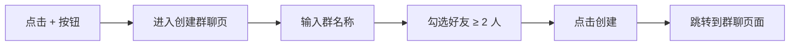
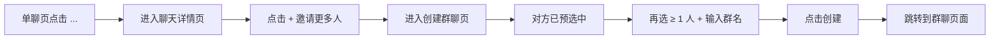
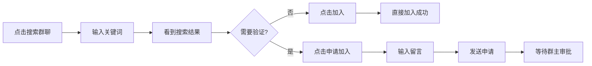
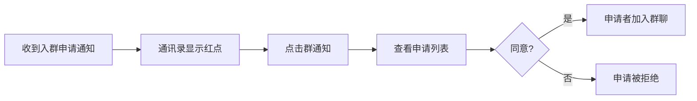
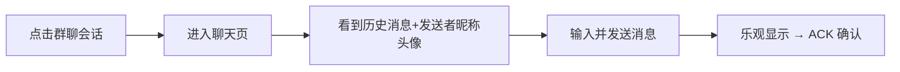

# 群聊 — 创建与加入 — 功能分析

## 概述

本次实现群聊的最小可用版本，覆盖四条链路：创建群聊（选人建群）、从单聊发起群聊（聊天详情页邀请第三者）、加入群聊（搜索群 → 申请 → 群主审批）、群聊消息收发。群管理（踢人/退群/转让/解散/群公告等）留下一章。

当前系统已有完整的单聊链路和好友体系。数据库 `conversations` 表已预留 `type=1`、`name`/`avatar`/`owner_id` 字段，`conversation_members` 天然支持多成员，消息发送链路（`MessageService.send` → 验证成员 → seq → 存储 → 广播）已是多成员兼容的，`ChatMessage` protobuf 已有 `sender_name`/`sender_avatar` 字段。

参考项目（`docs/ref/flash_im-main`）的关键设计：
- 统一 `POST /conversations`，通过 `type` 字段区分单聊/群聊
- `group_info` 扩展表存放群配置（入群验证开关等），创建群聊时自动初始化
- `group_join_requests` 表管理入群申请（status: 0 待处理 / 1 已接受 / 2 已拒绝）
- 申请入群时检查 `group_info.join_verification`：关闭则直接加入，开启则创建申请记录
- WS 帧类型 `GROUP_JOIN_REQUEST` 推送入群申请通知给群主
- 宫格头像：`grid:url1,url2,...` 格式，取前 9 个成员头像拼接
- 前端 `CreateGroupPage`：群名输入 + 好友列表多选 + `initialSelectedIds` 支持预选（从单聊发起时传入对方 ID）+ 返回 `CreateGroupResult`
- 前端 `SearchGroupPage`：关键词搜索 + 防抖 + 申请入群对话框
- 前端 `GroupNotificationsPage`：群主查看/处理所有待处理入群申请

---

## 一、交互链

### 场景 1：创建群聊

**用户故事**：作为用户，我想从好友中选人创建群聊，以便和多个人同时沟通。

用户在消息 Tab 右上角点击"+"按钮，进入创建群聊页面。页面上方是群名称输入框（必填），下方展示好友列表，每个好友右侧有圆形复选框。用户勾选至少 2 个好友，右上角显示"创建(N)"。点击创建，调用 `POST /conversations`（type=group），成功后跳转到群聊 ChatPage。

### 场景 2：从单聊发起群聊

**用户故事**：作为用户，我正在和某人单聊，想拉更多人进来一起聊。

用户在单聊 ChatPage 右上角点击"..."按钮，进入聊天详情页。详情页显示当前聊天对象的头像和昵称，下方有"邀请更多人"（"+"按钮）。点击后进入创建群聊页，当前聊天对象已预选中（勾选状态，不可取消）。用户再勾选至少 1 个其他好友，输入群名称，点击创建。创建成功后跳转到新的群聊 ChatPage。

### 场景 3：搜索并申请加入群聊

**用户故事**：作为用户，我想搜索并加入一个已有的群聊，以便参与群内讨论。

用户在通讯录 Tab 点击"搜索群聊"入口，进入搜索页面。输入群名关键词，300ms 防抖后发起搜索。搜索结果显示群头像、群名（高亮匹配）、成员数。已加入的群显示"已加入"灰色标签。未加入的群：若无需验证显示"加入"按钮，需验证显示"申请加入"按钮。

点击"加入"：直接加入，提示"已成功加入群聊"。
点击"申请加入"：弹出对话框，可输入留言（可选），点击"发送申请"后提示"申请已发送，等待群主审批"。

### 场景 4：群主处理入群申请

**用户故事**：作为群主，我想审批入群申请，以便控制谁能加入我的群。

群主收到 WS 推送的 `GROUP_JOIN_REQUEST` 通知，通讯录 Tab 的"群通知"入口显示红点角标。点击进入群通知页面，看到申请者头像、昵称、申请加入的群名、留言。每条申请右侧有"拒绝"和"同意"按钮。点击"同意"后申请者自动加入群聊，点击"拒绝"则申请被驳回。

### 场景 5：群聊消息收发

**用户故事**：作为群成员，我想在群聊中发送和接收消息。

用户从会话列表点击群聊会话（type=1），进入聊天页面。标题显示群名称。他人消息左侧显示发送者头像，气泡上方显示发送者昵称。自己的消息靠右，不显示昵称头像。发送流程与单聊完全一致（乐观更新 → WS 发送 → ACK 确认）。

---

## 二、逻辑树

### 事件流：创建群聊

| 时刻 | 事件 | 处理 | 产生的新事件 |
|------|------|------|-------------|
| T1 | 用户点击"创建" | 前端 `POST /conversations`，body: `{ type: "group", name, member_ids }` | HTTP 请求到达后端 |
| T2 | 后端收到请求 | 校验：群名非空、成员数 ≥ 2 且 ≤ 200。事务内：插入 conversations（type=1, name, owner_id）→ 逐个插入 conversation_members（群主 + 成员，ON CONFLICT 恢复 is_deleted）→ 初始化 group_info（join_verification=false）→ 生成宫格头像（查前 9 个成员头像拼接 `grid:url1,url2,...`） | 群聊创建成功 |
| T3 | 返回响应 | 返回完整 Conversation 对象（含 id, name, avatar, owner_id） | 前端收到响应 |
| T4 | 前端处理 | 跳转 ChatPage，本地会话列表插入新会话 | 页面跳转 |

### 事件流：从单聊发起群聊

| 时刻 | 事件 | 处理 | 产生的新事件 |
|------|------|------|-------------|
| T1 | 用户在单聊页点击"..." | 前端跳转到聊天详情页，传入 conversation 信息（peerUserId, peerNickname, peerAvatar） | 详情页展示 |
| T2 | 用户点击"+"邀请更多人 | 前端跳转到创建群聊页，`initialSelectedIds = { peerUserId }`，预选中且不可取消 | 创建群聊页展示 |
| T3 | 用户选人+输入群名+点击创建 | 同"创建群聊"事件流 T1~T4，member_ids 包含预选的 peerUserId + 新选的好友 | 群聊创建成功，跳转 ChatPage |

### 事件流：搜索并申请入群

| 时刻 | 事件 | 处理 | 产生的新事件 |
|------|------|------|-------------|
| T1 | 用户输入关键词 | 前端 300ms 防抖后 `GET /conversations/search?keyword=xxx` | HTTP 请求 |
| T2 | 后端搜索 | `WHERE c.type = 1 AND c.name ILIKE '%keyword%'`，关联查 member_count、is_member、join_verification | 返回 `GroupSearchResult[]` |
| T3 | 用户点击"加入"或"申请加入" | 前端 `POST /conversations/{id}/join`，body: `{ message? }` | HTTP 请求 |
| T4 | 后端处理申请 | 校验：群存在且 type=1、用户非成员、无待处理申请。查 group_info.join_verification：false → 直接 add_member + 刷新宫格头像，返回 `{ auto_approved: true }`；true → 插入 group_join_requests（status=0），返回 `{ auto_approved: false, owner_id, group_name }` | 加入成功或申请已创建 |
| T5 | 需审批时 | 后端通过 WS 推送 `GROUP_JOIN_REQUEST` 帧给群主（含 request_id, from_user_id, nickname, avatar, message, conversation_id, group_name） | 群主收到通知 |

### 事件流：群主处理入群申请

| 时刻 | 事件 | 处理 | 产生的新事件 |
|------|------|------|-------------|
| T1 | 群主点击"同意"或"拒绝" | 前端 `POST /conversations/{id}/join-requests/{rid}/handle`，body: `{ approved: bool }` | HTTP 请求 |
| T2 | 后端处理 | 校验：申请 status=0、操作者是群主。同意 → update status=1 + add_member + 刷新宫格头像；拒绝 → update status=2 | 申请已处理 |

### 事件流：群聊消息（复用现有链路，无改动）

| 时刻 | 事件 | 处理 | 产生的新事件 |
|------|------|------|-------------|
| T1 | 用户发送消息 | 前端乐观插入 → WS `SendMessageRequest` | 帧到达后端 |
| T2 | dispatcher → MessageService.send | 验证成员 → seq → 存储 → 更新 preview/time → unread+1 | 消息持久化 |
| T3 | 广播 | ChatMessage 帧（含 sender_name/sender_avatar）→ 除发送者外的在线成员；ConversationUpdate 帧 → 所有成员；MessageAck → 发送者 | 各端收到推送 |

### 状态流转

| 实体 | 触发事件 | 前状态 | 后状态 |
|------|---------|--------|--------|
| Conversation | POST /conversations (type=group) | 不存在 | type=1, name, owner_id, avatar=grid:... |
| ConversationMember | 创建群聊 / 同意入群 | 不存在 | joined (unread=0, is_deleted=false) |
| group_info | 创建群聊 | 不存在 | join_verification=false（默认） |
| GroupJoinRequest | POST /join（需审批） | 不存在 | status=0 (待处理) |
| GroupJoinRequest | 群主同意 | status=0 | status=1 (已接受) |
| GroupJoinRequest | 群主拒绝 | status=0 | status=2 (已拒绝) |
| 本地消息 | 发送 → ACK | sending | sent |
| 本地消息 | 10s 超时 | sending | failed |

**异常回退**：
- 群聊创建失败：事务回滚，前端提示错误
- 重复申请：后端返回"已发送过入群申请"错误
- 已是成员：后端返回"已经是群成员"错误
- 消息发送失败：10s 超时标记 failed，可重试

---

## 三、功能编号与网络定位

### 本次新增节点

| 编号 | 功能节点 | 层级 | 简介 |
|------|---------|------|------|
| D-18 | 群聊创建 | 领域 | 扩展 POST /conversations 支持 type=group，事务创建群+成员+group_info+宫格头像 |
| D-19 | 群搜索 | 领域 | GET /conversations/search，按群名模糊搜索，返回成员数/是否已加入/是否需验证 |
| D-20 | 入群申请 | 领域 | POST /conversations/{id}/join，无需验证直接加入，需验证创建申请+WS通知群主 |
| D-21 | 入群审批 | 领域 | POST /conversations/{id}/join-requests/{rid}/handle，群主同意/拒绝 |
| D-22 | 群主入群通知查询 | 领域 | GET /conversations/my-join-requests，聚合当前用户作为群主的所有待处理申请 |
| P-28 | 创建群聊页 | 前端业务 | 群名输入 + 好友多选 + initialSelectedIds 预选支持 + 创建 |
| P-29 | 搜索群聊页 | 前端业务 | 关键词搜索 + 防抖 + 申请入群对话框 |
| P-30 | 群通知页 | 前端业务 | 群主查看/处理入群申请列表 |
| P-31 | 单聊详情页 | 前端业务 | 显示对方信息 + "+"邀请更多人入口，跳转创建群聊页并预选对方 |
| P-32 | 群聊消息气泡适配 | 前端业务 | 群聊中他人消息显示 sender_name 和 sender_avatar |
| P-33 | 群聊会话列表适配 | 前端业务 | 群聊显示群名称，解析 grid: 头像（或默认群图标） |
| F-10 | 群通知WS流分发 | 前端基础 | WsClient 新增 GROUP_JOIN_REQUEST 帧类型分发 |

### 前置依赖

| 依赖节点 | 依赖方式 | 是否已有 |
|----------|---------|---------|
| D-01 会话创建 | 扩展（新增 group 分支） | ✅ 需扩展 |
| D-06~D-10 消息链路 | 调接口（完全复用） | ✅ 已有 |
| D-15 好友关系管理 | 共享数据（创建群聊页复用好友列表） | ✅ 已有 |
| I-08 在线用户管理 | 调接口（WS 推送入群通知） | ✅ 已有 |
| I-09 帧分发器 | 扩展（新增 GROUP_JOIN_REQUEST 帧处理） | ✅ 需扩展 |
| F-06 WsClient 帧分发 | 扩展（新增 groupJoinRequestStream） | ✅ 需扩展 |
| P-06~P-09 聊天页 | 扩展（群聊气泡适配） | ✅ 需扩展 |
| P-01 会话列表 | 扩展（群聊显示适配） | ✅ 需扩展 |
| P-20 好友列表页 | 共享数据 | ✅ 已有 |

### 边界接口

| 接口/协议 | 定义方 | 消费方 | 说明 |
|-----------|--------|--------|------|
| POST /conversations (type=group) | D-18 | P-28 | 扩展现有接口 |
| GET /conversations/search?keyword= | D-19 | P-29 | 新增接口 |
| POST /conversations/{id}/join | D-20 | P-29 | 新增接口 |
| POST /conversations/{id}/join-requests/{rid}/handle | D-21 | P-30 | 新增接口 |
| GET /conversations/my-join-requests | D-22 | P-30 | 新增接口 |
| GROUP_JOIN_REQUEST（WS 帧） | D-20 | F-10 → P-30 | 新增帧类型 |
| conversations.avatar (grid:...) | D-18 | P-33 | 宫格头像格式约定 |
| group_info 表 | D-18 | D-20 | 新增数据库表 |
| group_join_requests 表 | D-20 | D-21, D-22 | 新增数据库表 |
| POST /conversations/{id}/messages | D-06 | 脚本/测试 | 新增 HTTP 发消息接口 |
| 系统用户 (id=999999999) | 迁移脚本 | D-18 | 系统消息发送者 |

---

## 四、结论

- **开发顺序**：数据库迁移（group_info + group_join_requests）→ D-18 群聊创建 → D-19 群搜索 → D-20 入群申请 → D-21 入群审批 → D-22 群主通知查询 → F-10 WS 帧分发 → P-28 创建群聊页 → P-31 单聊详情页 → P-29 搜索群聊页 → P-30 群通知页 → P-32 群聊气泡适配 → P-33 会话列表适配
- **复杂度集中点**：D-18 事务内批量操作 + 宫格头像生成；D-20 入群申请的分支逻辑（验证/不验证）+ WS 通知；P-28 创建群聊页的 initialSelectedIds 预选锁定交互；P-29 搜索防抖 + 申请对话框交互
- **暂不实现**：群成员管理（邀请/踢人/退群/转让/解散）、群公告、群设置、@提醒、已读回执——均属群管理域，下一章处理
