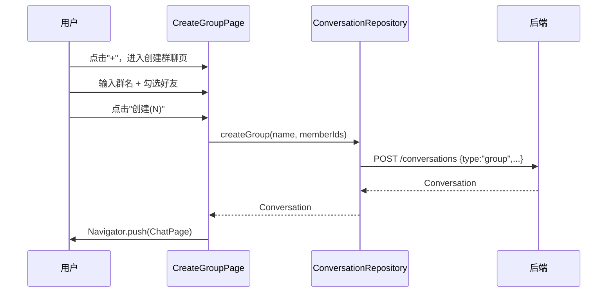
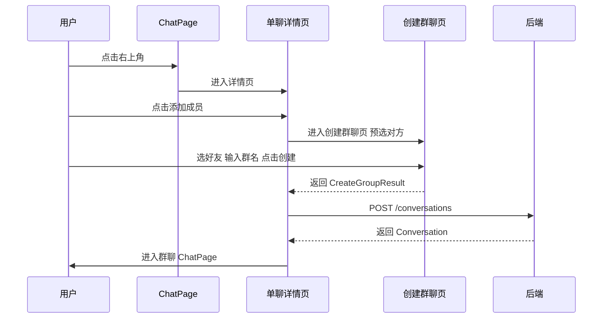
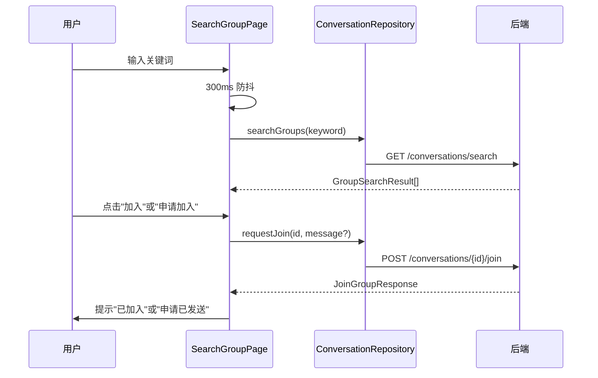
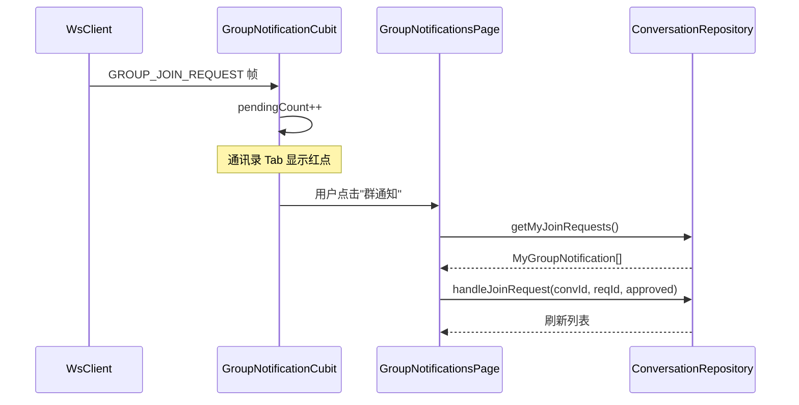

# 群聊（创建与加入） — 客户端设计报告

> 关联设计：[服务端设计](../server/design.md) | [功能分析](../analysis.md)

## 1. 目标

- 创建群聊页：群名输入 + 好友多选 + `initialSelectedIds` 预选支持（从单聊详情页发起）
- 单聊详情页：显示对方信息 + "+"按钮跳转创建群聊页（预选对方）
- 搜索群聊页：关键词搜索 + 防抖 + 申请入群对话框（区分需验证/不需验证）
- 群通知页：群主查看/处理入群申请列表
- 群聊消息气泡适配：群聊中他人消息显示 sender_name（当前已显示，需确认群聊场景正确）
- 群聊会话列表适配：群聊显示群名称 + 默认群图标（grid: 宫格头像后续增强）
- WsClient 新增 GROUP_JOIN_REQUEST 帧分发
- ChatPage 右上角按钮：单聊显示"..."进入详情页，群聊显示群图标（暂不实现群详情页）

## 2. 现状分析

### 已有能力

- `flash_im_conversation`：ConversationRepository（createPrivate/getList/delete/markRead/getById）、ConversationListCubit（分页+实时更新）、ConversationListPage、ConversationTile
- `flash_im_chat`：ChatCubit（消息收发+乐观更新+ACK）、ChatPage、MessageBubble（已显示 senderName/senderAvatar）
- `flash_im_core`：WsClient（连接/认证/心跳/帧分发），已有 chatMessageStream/messageAckStream/conversationUpdateStream/friendRequestStream/friendAcceptedStream/friendRemovedStream
- `flash_im_friend`：FriendCubit（好友列表+申请管理）、FriendListPage、FriendDetailPage
- `flash_shared`：AvatarWidget 共享组件
- Protobuf：proto 已生成 `GroupJoinRequestNotification` 和 `GROUP_JOIN_REQUEST` 帧类型（任务 2 已完成）
- Conversation 模型已有 `type` 字段（0=单聊, 1=群聊）、`displayName`/`displayAvatar` getter

### 缺失

- 无创建群聊页面
- 无单聊详情页
- ConversationRepository 无 `createGroup`/`searchGroups`/`requestJoin`/`handleJoinRequest`/`getMyJoinRequests` 方法
- WsClient 无 `groupJoinRequestStream`
- ConversationTile 的头像只用 `peerAvatar`，群聊时应用 `displayAvatar`（conversations.avatar）
- ChatPage 右上角无按钮
- 无群通知页面
- 无群通知角标

## 3. 数据模型与接口

### 客户端新增模型

```dart
/// 群搜索结果
class GroupSearchResult {
  final String id;
  final String? name;
  final String? avatar;
  final int memberCount;
  final bool isMember;
  final bool joinVerification;
}

/// 入群申请响应
class JoinGroupResponse {
  final bool autoApproved;
  final String? ownerId;
  final String? groupName;
}

/// 我的群通知项（群主视角）
class MyGroupNotification {
  final String id;
  final int userId;
  final String conversationId;
  final String? message;
  final int status;
  final String nickname;
  final String? avatar;
  final String? groupName;
  final DateTime createdAt;
}
```

### ConversationRepository 新增方法

```dart
/// 创建群聊
Future<Conversation> createGroup({required String name, required List<int> memberIds});

/// 搜索群聊
Future<List<GroupSearchResult>> searchGroups(String keyword, {int limit = 20});

/// 申请入群
Future<JoinGroupResponse> requestJoin(String conversationId, {String? message});

/// 处理入群申请
Future<void> handleJoinRequest(String conversationId, String requestId, {required bool approved});

/// 获取我的群通知
Future<List<MyGroupNotification>> getMyJoinRequests({int limit = 20, int offset = 0});
```

### 接口对应

| 客户端方法 | 后端接口 |
|-----------|---------|
| createGroup | POST /conversations (type=group) |
| searchGroups | GET /conversations/search?keyword= |
| requestJoin | POST /conversations/{id}/join |
| handleJoinRequest | POST /conversations/{id}/join-requests/{rid}/handle |
| getMyJoinRequests | GET /conversations/my-join-requests |

## 4. 核心流程

### 创建群聊（从消息 Tab "+"按钮）



### 从单聊发起群聊



### 搜索并申请入群



### 群主处理入群申请



## 5. 项目结构与技术决策

### 变更范围

```
client/modules/
├── flash_shared/lib/src/
│   ├── group_avatar_widget.dart          # 新建：九宫格头像组件（解析 grid: 格式）
│   └── popup_menu_button.dart            # 新建：微信风格弹出菜单（WxPopupMenuButton）
├── flash_im_core/lib/src/
│   └── logic/ws_client.dart              # 修改：新增 groupJoinRequestStream
├── flash_im_conversation/lib/src/
│   ├── data/
│   │   ├── conversation_repository.dart  # 修改：新增 5 个群聊方法
│   │   ├── conversation.dart             # 修改：新增 isGroup getter
│   │   ├── group_models.dart             # 新建：GroupSearchResult/JoinGroupResponse/MyGroupNotification/SelectableMember
│   │   └── group_notification_cubit.dart # 新建：群通知状态管理
│   ├── logic/
│   │   └── conversation_list_cubit.dart  # 修复：_handleUpdate 群聊更新时保留 avatar
│   └── view/
│       ├── conversation_tile.dart        # 修改：群聊 grid: 宫格头像 + 默认群图标
│       ├── create_group_page.dart        # 新建：创建群聊页
│       ├── search_group_page.dart        # 新建：搜索群聊页
│       └── group_notifications_page.dart # 新建：群通知页
├── flash_im_chat/lib/src/
│   ├── data/message.dart                 # 修改：新增 isSystem getter
│   └── view/
│       ├── chat_page.dart                # 修改：右上角按钮 + isGroup/peerUserId/onAddMember 参数
│       ├── bubble/message_bubble.dart    # 修改：系统消息居中灰色标签样式
│       └── private_chat_info_page.dart   # 新建：单聊详情页
├── flash_im_friend/lib/src/
│   └── view/friend_list_page.dart        # 修改：新增群通知/搜索群聊回调参数

client/lib/src/
└── home/view/home_page.dart              # 修改：WxPopupMenuButton 弹出菜单 + GroupNotificationCubit + 群聊入口
```

### 职责划分

```
View (页面/组件)
  ↓ 用户交互
Cubit (状态管理)
  ↓ 业务逻辑
Repository (数据访问)
  ↓ HTTP / WS
后端 API / WsClient
```

- `CreateGroupPage`：纯 StatefulWidget，接收 `friends` 列表和 `initialSelectedIds`，返回 `CreateGroupResult`（群名+成员ID列表）。不直接调 API，由调用方（home_page）拿到结果后调 `ConversationRepository.createGroup`
- `SearchGroupPage`：StatefulWidget，内部管理搜索状态和防抖，直接调 `ConversationRepository`
- `GroupNotificationsPage`：StatefulWidget，直接调 `ConversationRepository`
- `GroupNotificationCubit`：跟踪待处理入群申请数量，监听 WS 通知自增，处理后自减
- `PrivateChatInfoPage`：StatelessWidget，显示对方信息 + "+"按钮

### 技术决策

| 决策 | 方案 | 理由 |
|------|------|------|
| CreateGroupPage 放哪个模块 | flash_im_conversation | 群聊是会话域的功能，且需要调 ConversationRepository |
| CreateGroupPage 的好友数据来源 | 由调用方传入 `List<Friend>` | 避免 flash_im_conversation 依赖 flash_im_friend |
| 单聊详情页放哪个模块 | flash_im_chat | 它是 ChatPage 的子页面，且参考项目也放在 im_chat 中 |
| 群通知角标 | GroupNotificationCubit 管理 pendingCount | 参照参考项目的 GroupNotificationCubit 模式 |
| 宫格头像 | GroupAvatarWidget 解析 grid: 前缀渲染九宫格 | 参照参考项目 GroupAvatar 组件，放在 flash_shared |
| 搜索防抖 | Timer 300ms | 参照参考项目 SearchGroupPage |
| 系统消息样式 | sender_id=999999999 时居中灰色标签 | 参照参考项目 _buildSystemMessage |
| 右上角菜单 | WxPopupMenuButton 弹出尖角气泡 | 微信风格，放在 flash_shared 通用组件 |
| ConversationListCubit 修复 | _handleUpdate 保留 avatar 字段 | 群聊收到新消息后 avatar 不丢失 |

### 第三方依赖

| 依赖 | 用途 | 已有/需新增 |
|------|------|-----------|
| flutter_bloc | 状态管理 | 已有 |
| dio | HTTP 请求 | 已有 |
| equatable | 值对象比较 | 已有 |

无需新增第三方依赖。

## 6. 验收标准

| 验收条件 | 验收方式 |
|----------|----------|
| 编译通过 | `flutter analyze` 无错误 |
| 创建群聊：选 2+ 好友 + 输入群名 → 创建成功 → 跳转群聊页 | 手动操作 |
| 从单聊详情页发起群聊：对方预选中 → 再选好友 → 创建成功 | 手动操作 |
| 群聊消息：群成员发消息，其他成员收到并显示发送者昵称 | 手动操作（多设备/多用户） |
| 会话列表：群聊显示群名称和默认群图标 | 手动操作 |
| 搜索群聊：输入关键词 → 显示匹配结果 → 显示成员数/是否已加入 | 手动操作 |
| 入群（无需验证）：点击"加入" → 提示成功 → 搜索结果变为"已加入" | 手动操作 |
| 入群（需验证）：点击"申请加入" → 输入留言 → 提示"等待审批" | 手动操作 |
| 群主通知：收到申请后通讯录显示红点 → 进入群通知页 → 同意/拒绝 | 手动操作 |
| ChatPage 右上角：单聊显示"..."可进入详情页，群聊显示群图标 | 手动操作 |

## 7. 暂不实现

| 功能 | 理由 |
|------|------|
| 群详情页（群信息/成员列表/群设置） | 属于群管理域，下一章 |
| 群聊消息预览拼接发送者昵称 | 后端 generate_preview 不拼接昵称，与参考项目一致 |
| @提醒 | 依赖群成员列表，进阶功能 |
| 群消息已读回执 | 复杂度高，进阶功能 |
