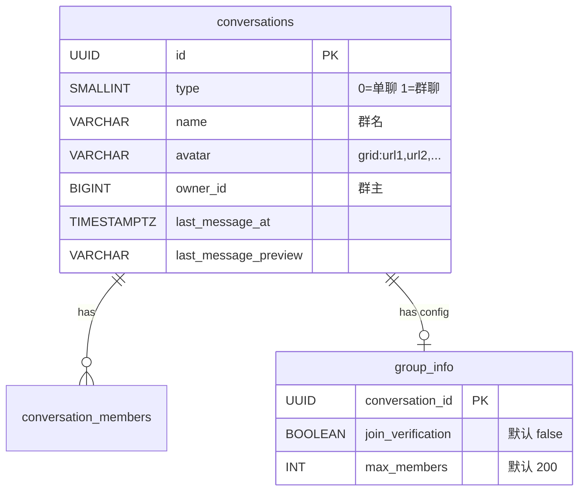
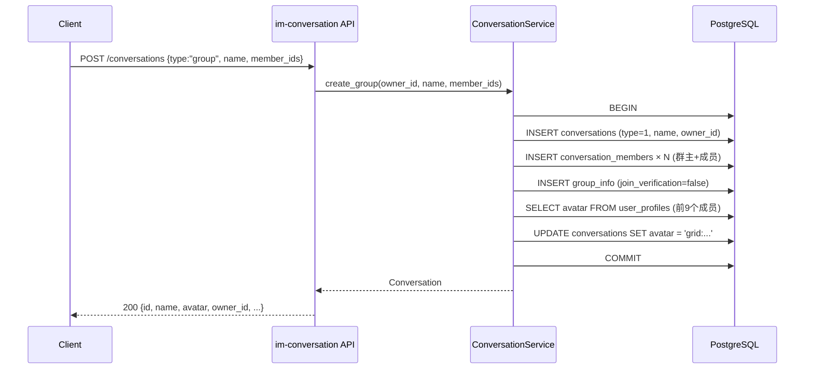

# 群聊（创建与加入） — 服务端设计报告

> 关联设计：[会话域 conversation.md](../../../../archiver/modules/conversation.md) | [消息域 message.md](../../../../archiver/modules/message.md) | [WS域 ws.md](../../../../archiver/modules/ws.md) | [功能分析 analysis.md](../analysis.md)

## 1. 目标

- 扩展 `POST /conversations` 支持 `type=group` 创建群聊（群名 + 成员 + 宫格头像 + group_info 初始化）
- 扩展 `GET /conversations` 支持 `type` 查询参数过滤（`type=1` 只返回群聊）
- 新增数据库表 `group_info`（群配置）
- 新增系统用户（id=999999999）+ `send_system` 方法，创建群聊时自动发送系统消息
- 新增 HTTP 发消息接口 `POST /conversations/{id}/messages`（方便脚本和测试）

## 2. 现状分析

### 已有能力

- `conversations` 表已预留 `type`（0=单聊, 1=群聊）、`name`、`avatar`、`owner_id` 字段
- `conversation_members` 表天然支持多成员，已有 `unread_count`、`is_deleted`、`is_pinned`、`is_muted`
- `MessageService.send()` 已是多成员兼容：验证成员 → seq → 存储 → 广播给所有成员
- `WsBroadcaster` 已支持多成员广播（`broadcast_message` + `broadcast_conversation_update`）
- `ChatMessage` protobuf 已有 `sender_name`/`sender_avatar` 字段
- `ConversationService` 已有 `create_private`、`get_list`、`get_by_id`、`delete_for_user`、`mark_read`、`get_member_ids`、`is_member`
- `ConversationRepository` 已有 `create_private`、`list_by_user`、`delete_for_user`
- `MessageDispatcher` 已有 `notify_friend_request`/`notify_friend_accepted`/`notify_friend_removed` 的 WS 推送模式可参照

### 缺失

- 无群聊创建逻辑（`create_group`）
- 无 `group_info` 表（群配置：入群验证开关等）
- `CreateConversationRequest` 模型不支持 `type` 字段（当前只有 `CreatePrivateRequest { peer_user_id }`）
- `ConversationService` 的 `get_list` 查询中，群聊的 name/avatar 需要直接用 conversations 表的值（当前只处理了单聊的 peer 信息补充）
- 宫格头像生成逻辑不存在

### 基础设施就绪

- PostgreSQL 数据库已就绪，迁移脚本放 `server/migrations/`
- Protobuf 编译链路已就绪（`im-ws/build.rs` → `proto/` → `src/generated/`）
- WS 推送链路已就绪（`MessageDispatcher` → `WsState.send_to_user`）
- `im-conversation` crate 已在 workspace 中注册

## 3. 数据模型与接口

### 数据模型

#### 新增表：group_info

```sql
-- server/migrations/20260412_005_group.sql

-- 群组扩展信息表
CREATE TABLE IF NOT EXISTS group_info (
    conversation_id UUID PRIMARY KEY,
    join_verification BOOLEAN NOT NULL DEFAULT FALSE,
    max_members INT NOT NULL DEFAULT 200,
    created_at TIMESTAMPTZ NOT NULL DEFAULT NOW(),
    updated_at TIMESTAMPTZ NOT NULL DEFAULT NOW()
);
```

#### ER 关系



#### 关键设计决策

| 决策 | 理由 |
|------|------|
| `group_info` 独立于 `conversations` 表 | 群配置字段只有群聊需要，不污染通用会话表；后续扩展（群公告、全员禁言等）只改 group_info |
| `join_verification` 默认 false | 新建群聊默认无需审批，降低使用门槛 |
| `max_members` 默认 200 | MVP 阶段 200 足够，后续可调整 |
| 宫格头像用 `grid:url1,url2,...` 字符串 | 不额外建表，avatar 字段复用；前端解析 `grid:` 前缀渲染九宫格 |
| 入群申请用独立表而非复用 friend_requests | 语义不同（好友是双向关系，入群是单向申请），字段也不同（conversation_id vs to_user_id） |

### 新增 Rust 模型

```rust
// im-conversation/src/models.rs 新增

/// 创建会话请求（统一单聊/群聊）
#[derive(Debug, Deserialize)]
pub struct CreateConversationRequest {
    #[serde(rename = "type")]
    pub conv_type: String,          // "private" | "group"
    pub peer_user_id: Option<i64>,  // 单聊必填
    pub name: Option<String>,       // 群聊必填
    pub member_ids: Option<Vec<i64>>, // 群聊必填
}

```

### 新增 Protobuf

### 接口契约

#### 接口一览

| 方法 | 路径 | 说明 | 状态 |
|------|------|------|------|
| POST | /conversations | 创建会话（扩展支持 group） | 扩展 |
| GET | /conversations | 会话列表（扩展支持 type 过滤） | 扩展 |
| POST | /conversations/{id}/messages | HTTP 发消息（走完整 send 链路） | 新增 |

#### POST /conversations（扩展）

请求：
```json
{
  "type": "group",
  "name": "周末爬山群",
  "member_ids": [1001, 1002, 1003]
}
```

成功响应 200：
```json
{
  "id": "uuid",
  "conv_type": 1,
  "name": "周末爬山群",
  "avatar": "grid:/uploads/a1.jpg,/uploads/a2.jpg,/uploads/a3.jpg",
  "owner_id": 1000,
  "created_at": "2026-04-12T10:00:00Z"
}
```

错误响应：
- 400：`{ "error": "群聊名称不能为空" }` / `{ "error": "群成员数量超过限制" }`

#### GET /conversations（扩展：type 过滤）

新增可选查询参数 `type`，传 `type=1` 只返回群聊，不传返回所有会话。

请求：`GET /conversations?type=1&limit=200`

成功响应 200：与现有会话列表响应格式一致。

## 4. 核心流程

### 创建群聊



业务规则：
- 群名不能为空
- member_ids 去重后 + 群主，总人数 ≥ 3 且 ≤ 200
- 群主自动加入，不需要在 member_ids 中包含自己
- 宫格头像取前 9 个成员（按 joined_at 排序）的头像拼接为 `grid:url1,url2,...`
- `group_info` 默认 `join_verification=false`

## 5. 项目结构与技术决策

### 变更范围

```
server/
├── migrations/
│   └── 20260412_005_group.sql          # 新增：group_info + 系统用户
├── modules/
│   └── im-group/src/                    # 新增：群聊独立 crate
│       ├── models.rs                    # 新增：CreateGroupRequest 等群聊模型
│       ├── repository.rs                # 新增：create_group 事务 + build_grid_avatar
│       ├── service.rs                   # 新增：create_group 校验 + 事务编排
│       ├── routes.rs                    # 新增：POST /groups（群聊创建入口）
│       └── lib.rs                       # 模块入口
│   └── im-conversation/src/
│       ├── routes.rs                    # 扩展：GET /conversations type 过滤
│       └── service.rs                   # 扩展：get_list 支持 conv_type 参数
│   └── im-message/src/
│       └── service.rs                   # 扩展：新增 send_system 方法
└── src/
    └── main.rs                          # 扩展：注册 im-group 路由
```

### 职责划分

im-group 是独立的 crate，和 im-friend 一样遵循三层架构：

```
routes.rs (HTTP 入口)
  ↓ 解析请求、提取 user_id
service.rs (业务逻辑)
  ↓ 校验、事务编排
repository.rs (数据访问)
  ↓ SQL 查询
```

- im-group 负责群聊的创建和管理（本版本只有创建）
- im-conversation 负责会话的通用能力（列表/详情/删除/已读/type 过滤）
- 两者共享 `conversations` 和 `conversation_members` 表，但职责不同

### 模块边界

im-group 需要访问 `conversations` 和 `conversation_members` 表（创建群聊），以及 `user_profiles` 表（宫格头像）。它不依赖 im-conversation 的 Service，直接操作数据库。创建群聊后需要调 `MessageService.send_system` 发系统消息，这个依赖通过 main.rs 组装注入。

### 技术决策

| 决策 | 方案 | 理由 |
|------|------|------|
| 群聊独立 crate | 新建 `im-group`，不放在 im-conversation 里 | 会话管通讯能力，群管群的事。和 im-friend 独立的理由一样——职责不同，生长方向不同 |
| 宫格头像存储 | `avatar` 字段存 `grid:url1,url2,...` 字符串 | 不额外建表，前端解析渲染；成员变动时刷新 |
| group_info 默认不创建 | 创建群聊时 INSERT group_info | 每个群聊都有配置行，查询时不需要 COALESCE 兜底 |
| 系统用户 id=999999999 | 迁移脚本预置，`send_system` 跳过成员校验 | 系统消息不属于任何用户，固定 ID 便于前端识别 |
| CreateConversationRequest.type 默认值 | serde default = "private" | 兼容旧客户端不传 type 字段 |

### 依赖关系

```
im-group → flash-core (AppState, JWT, PgPool)
im-group → im-message (MessageService，用于 send_system)
im-conversation → flash-core (AppState, JWT)
im-ws → im-message (MessageService)
main.rs → 组装所有模块
```

## 6. 验收标准

| 验收条件 | 验收方式 |
|----------|----------|
| 数据库迁移成功 | `python scripts/server/reset_db.py` 无报错 |
| 编译通过 | `cargo build` 无错误 |
| 创建群聊：3 人以上群聊创建成功，返回正确的 name/avatar/owner_id | `POST /conversations` 手动测试 |
| 创建群聊：群名为空返回 400 | `POST /conversations` 手动测试 |
| 会话列表：群聊显示群名和宫格头像，单聊不受影响 | `GET /conversations` 手动测试 |
| 会话列表 type 过滤：`type=1` 只返回群聊 | `GET /conversations?type=1` 手动测试 |
| 群聊消息收发：群成员发消息，其他成员收到 ChatMessage 帧 | WS 连接测试 |

## 7. 暂不实现

| 功能 | 理由 |
|------|------|
| 群成员管理（邀请/踢人） | 属于群管理域，下一章 |
| 退出群聊 | 属于群管理域，下一章 |
| 转让群主 | 属于群管理域，下一章 |
| 解散群聊 | 属于群管理域，下一章 |
| 群公告 | group_info 表已预留 announcement 扩展空间，下一章 |
| 群设置（全员禁言、仅群主管理等） | group_info 表可扩展字段，下一章 |
| 群成员列表查询 | 属于群管理域，下一章 |
| @提醒 | 依赖群成员列表，进阶功能 |
| 已读回执 | 复杂度高，进阶功能 |
| 消息撤回 | 进阶功能 |
