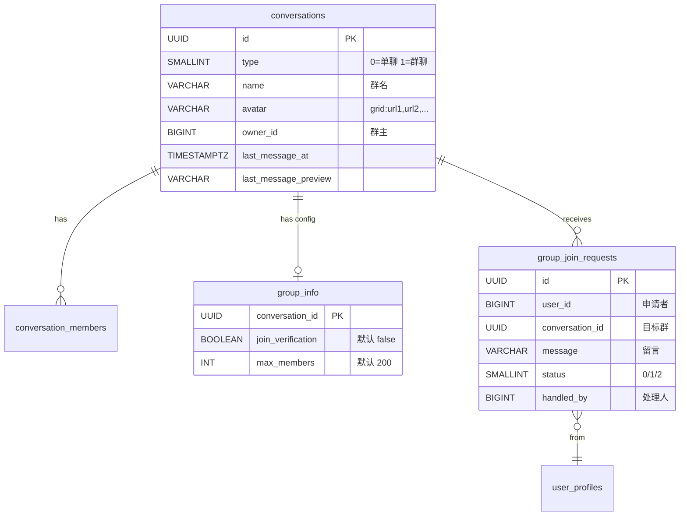
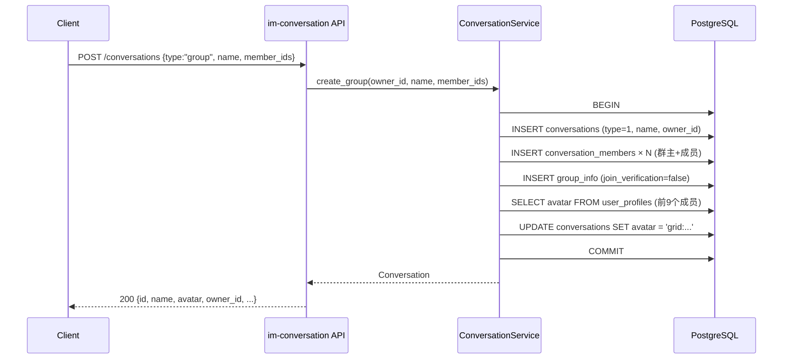
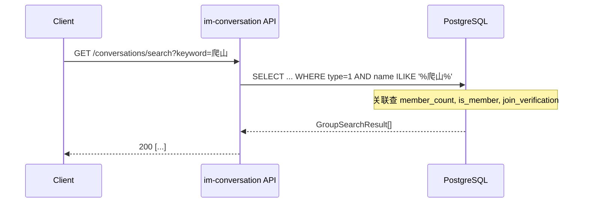
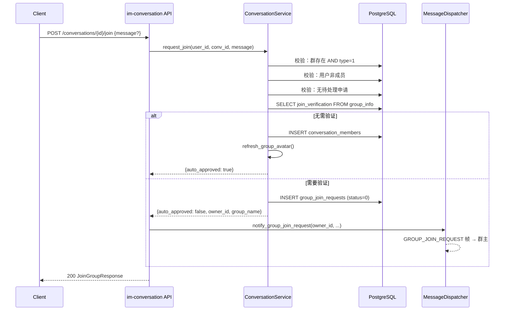
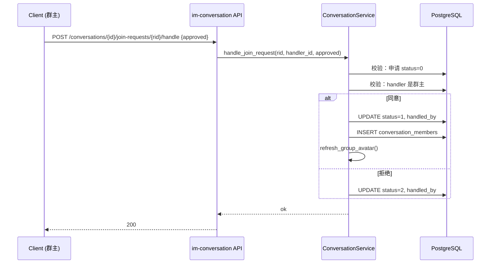

# 群聊（创建与加入） — 服务端设计报告

> 关联设计：[会话域 conversation.md](../../../../archiver/modules/conversation.md) | [消息域 message.md](../../../../archiver/modules/message.md) | [WS域 ws.md](../../../../archiver/modules/ws.md) | [功能分析 analysis.md](../analysis.md)

## 1. 目标

- 扩展 `POST /conversations` 支持 `type=group` 创建群聊（群名 + 成员 + 宫格头像 + group_info 初始化）
- 新增群搜索接口 `GET /conversations/search`（按群名模糊匹配）
- 新增入群申请接口 `POST /conversations/{id}/join`（无需验证直接加入 / 需验证创建申请 + WS 通知群主）
- 新增入群审批接口 `POST /conversations/{id}/join-requests/{rid}/handle`（群主同意/拒绝）
- 新增群主通知查询接口 `GET /conversations/my-join-requests`
- 新增 WS 帧类型 `GROUP_JOIN_REQUEST`，推送入群申请通知给群主
- 新增 Protobuf 消息 `GroupJoinRequestNotification`

## 2. 现状分析

### 已有能力

- `conversations` 表已预留 `type`（0=单聊, 1=群聊）、`name`、`avatar`、`owner_id` 字段
- `conversation_members` 表天然支持多成员，已有 `unread_count`、`is_deleted`、`is_pinned`、`is_muted`
- `MessageService.send()` 已是多成员兼容：验证成员 → seq → 存储 → 广播给所有成员
- `WsBroadcaster` 已支持多成员广播（`broadcast_message` + `broadcast_conversation_update`）
- `ChatMessage` protobuf 已有 `sender_name`/`sender_avatar` 字段
- `ConversationService` 已有 `create_private`、`get_list`、`get_by_id`、`delete_for_user`、`mark_read`、`get_member_ids`、`is_member`
- `ConversationRepository` 已有 `create_private`、`list_by_user`、`delete_for_user`
- `MessageDispatcher` 已有 `notify_friend_request`/`notify_friend_accepted`/`notify_friend_removed` 的 WS 推送模式可参照

### 缺失

- 无群聊创建逻辑（`create_group`）
- 无 `group_info` 表（群配置：入群验证开关等）
- 无 `group_join_requests` 表（入群申请记录）
- 无群搜索接口
- 无入群申请/审批接口
- 无 `GROUP_JOIN_REQUEST` WS 帧类型
- `CreateConversationRequest` 模型不支持 `type` 字段（当前只有 `CreatePrivateRequest { peer_user_id }`）
- `ConversationService` 的 `get_list` 查询中，群聊的 name/avatar 需要直接用 conversations 表的值（当前只处理了单聊的 peer 信息补充）
- 宫格头像生成逻辑不存在

### 基础设施就绪

- PostgreSQL 数据库已就绪，迁移脚本放 `server/migrations/`
- Protobuf 编译链路已就绪（`im-ws/build.rs` → `proto/` → `src/generated/`）
- WS 推送链路已就绪（`MessageDispatcher` → `WsState.send_to_user`）
- `im-conversation` crate 已在 workspace 中注册

## 3. 数据模型与接口

### 数据模型

#### 新增表：group_info

```sql
-- server/migrations/20260412_005_group.sql

-- 群组扩展信息表
CREATE TABLE IF NOT EXISTS group_info (
    conversation_id UUID PRIMARY KEY,
    join_verification BOOLEAN NOT NULL DEFAULT FALSE,
    max_members INT NOT NULL DEFAULT 200,
    created_at TIMESTAMPTZ NOT NULL DEFAULT NOW(),
    updated_at TIMESTAMPTZ NOT NULL DEFAULT NOW()
);

-- 入群申请表
CREATE TABLE IF NOT EXISTS group_join_requests (
    id UUID PRIMARY KEY DEFAULT gen_random_uuid(),
    user_id BIGINT NOT NULL,
    conversation_id UUID NOT NULL,
    message VARCHAR(200),
    status SMALLINT NOT NULL DEFAULT 0,  -- 0:待处理 1:已接受 2:已拒绝
    handled_by BIGINT,
    created_at TIMESTAMPTZ NOT NULL DEFAULT NOW(),
    updated_at TIMESTAMPTZ NOT NULL DEFAULT NOW()
);

CREATE INDEX IF NOT EXISTS idx_group_join_requests_conv
    ON group_join_requests(conversation_id, status);
CREATE INDEX IF NOT EXISTS idx_group_join_requests_user
    ON group_join_requests(user_id, status);
```

#### ER 关系



#### 关键设计决策

| 决策 | 理由 |
|------|------|
| `group_info` 独立于 `conversations` 表 | 群配置字段只有群聊需要，不污染通用会话表；后续扩展（群公告、全员禁言等）只改 group_info |
| `join_verification` 默认 false | 新建群聊默认无需审批，降低使用门槛 |
| `max_members` 默认 200 | 参考项目用 200/500，MVP 阶段 200 足够 |
| 宫格头像用 `grid:url1,url2,...` 字符串 | 不额外建表，avatar 字段复用；前端解析 `grid:` 前缀渲染九宫格 |
| 入群申请用独立表而非复用 friend_requests | 语义不同（好友是双向关系，入群是单向申请），字段也不同（conversation_id vs to_user_id） |

### 新增 Rust 模型

```rust
// im-conversation/src/models.rs 新增

/// 创建会话请求（统一单聊/群聊）
#[derive(Debug, Deserialize)]
pub struct CreateConversationRequest {
    #[serde(rename = "type")]
    pub conv_type: String,          // "private" | "group"
    pub peer_user_id: Option<i64>,  // 单聊必填
    pub name: Option<String>,       // 群聊必填
    pub member_ids: Option<Vec<i64>>, // 群聊必填
}

/// 群搜索结果
#[derive(Debug, Serialize, FromRow)]
pub struct GroupSearchResult {
    pub id: Uuid,
    pub name: Option<String>,
    pub avatar: Option<String>,
    pub member_count: i64,
    pub is_member: bool,
    pub join_verification: bool,
}

/// 入群申请
#[derive(Debug, Serialize, Deserialize, FromRow)]
pub struct GroupJoinRequest {
    pub id: Uuid,
    pub user_id: i64,
    pub conversation_id: Uuid,
    pub message: Option<String>,
    pub status: i16,
    pub handled_by: Option<i64>,
    pub created_at: DateTime<Utc>,
    pub updated_at: DateTime<Utc>,
}

/// 入群申请（带用户信息 + 群名）
#[derive(Debug, Serialize)]
pub struct MyJoinRequestItem {
    #[serde(flatten)]
    pub request: GroupJoinRequest,
    pub nickname: String,
    pub avatar: Option<String>,
    pub group_name: Option<String>,
}

/// 申请入群请求
#[derive(Debug, Deserialize)]
pub struct JoinGroupRequest {
    pub message: Option<String>,
}

/// 处理入群申请请求
#[derive(Debug, Deserialize)]
pub struct HandleJoinRequest {
    pub approved: bool,
}

/// 申请入群响应
#[derive(Debug, Serialize)]
pub struct JoinGroupResponse {
    pub auto_approved: bool,
    pub owner_id: Option<String>,
    pub group_name: Option<String>,
}

/// 群搜索查询参数
#[derive(Debug, Deserialize)]
pub struct SearchQuery {
    pub keyword: String,
    #[serde(default = "default_search_limit")]
    pub limit: i32,
}

fn default_search_limit() -> i32 { 20 }
```

### 新增 Protobuf

```protobuf
// proto/ws.proto 新增帧类型
enum WsFrameType {
  // ... 现有 0~9 ...
  GROUP_JOIN_REQUEST = 10;
}

// proto/ws.proto 新增消息
message GroupJoinRequestNotification {
  string request_id = 1;
  string from_user_id = 2;
  string nickname = 3;
  string avatar = 4;
  string message = 5;
  string conversation_id = 6;
  string group_name = 7;
  int64 created_at = 8;
}
```

### 接口契约

#### 接口一览

| 方法 | 路径 | 说明 | 状态 |
|------|------|------|------|
| POST | /conversations | 创建会话（扩展支持 group） | 扩展 |
| GET | /conversations/search | 搜索群聊 | 新增 |
| POST | /conversations/{id}/join | 申请入群 | 新增 |
| POST | /conversations/{id}/join-requests/{rid}/handle | 处理入群申请 | 新增 |
| GET | /conversations/my-join-requests | 我的群通知 | 新增 |
| POST | /conversations/{id}/messages | HTTP 发消息（走完整 send 链路） | 新增 |

#### POST /conversations（扩展）

请求：
```json
{
  "type": "group",
  "name": "周末爬山群",
  "member_ids": [1001, 1002, 1003]
}
```

成功响应 200：
```json
{
  "id": "uuid",
  "conv_type": 1,
  "name": "周末爬山群",
  "avatar": "grid:/uploads/a1.jpg,/uploads/a2.jpg,/uploads/a3.jpg",
  "owner_id": 1000,
  "created_at": "2026-04-12T10:00:00Z"
}
```

错误响应：
- 400：`{ "error": "群聊名称不能为空" }` / `{ "error": "群成员数量超过限制" }`

#### GET /conversations/search?keyword=爬山&limit=20

成功响应 200：
```json
[
  {
    "id": "uuid",
    "name": "周末爬山群",
    "avatar": "grid:...",
    "member_count": 15,
    "is_member": false,
    "join_verification": true
  }
]
```

#### POST /conversations/{id}/join

请求：
```json
{ "message": "我是小明的朋友" }
```

成功响应 200（无需验证，直接加入）：
```json
{ "auto_approved": true }
```

成功响应 200（需要验证）：
```json
{
  "auto_approved": false,
  "owner_id": "1000",
  "group_name": "周末爬山群"
}
```

错误响应：
- 404：`{ "error": "群聊不存在" }`
- 400：`{ "error": "已经是群成员" }` / `{ "error": "已发送过入群申请" }`

#### POST /conversations/{id}/join-requests/{rid}/handle

请求：
```json
{ "approved": true }
```

成功响应 200：
```json
{ "data": null }
```

错误响应：
- 403：`{ "error": "无权限操作" }`（非群主）

#### GET /conversations/my-join-requests?limit=20&offset=0

成功响应 200：
```json
[
  {
    "id": "request-uuid",
    "user_id": 1005,
    "conversation_id": "conv-uuid",
    "message": "我是小明的朋友",
    "status": 0,
    "nickname": "张三",
    "avatar": "/uploads/avatar.jpg",
    "group_name": "周末爬山群",
    "created_at": "2026-04-12T10:00:00Z"
  }
]
```

## 4. 核心流程

### 创建群聊



业务规则：
- 群名不能为空
- member_ids 去重后 + 群主，总人数 ≥ 3 且 ≤ 200
- 群主自动加入，不需要在 member_ids 中包含自己
- 宫格头像取前 9 个成员（按 joined_at 排序）的头像拼接为 `grid:url1,url2,...`
- `group_info` 默认 `join_verification=false`

### 搜索群聊



业务规则：
- 空关键词返回空列表
- `is_member` 通过子查询判断当前用户是否在 conversation_members 中
- `join_verification` 通过 LEFT JOIN group_info 获取，默认 false

### 申请入群



### 群主处理入群申请



## 5. 项目结构与技术决策

### 变更范围

```
server/
├── migrations/
│   └── 20260412_005_group.sql          # 新增：group_info + group_join_requests + 系统用户
├── modules/
│   └── im-conversation/src/
│       ├── models.rs                    # 扩展：新增群聊相关模型
│       ├── repository.rs                # 扩展：新增群聊 CRUD 方法
│       ├── service.rs                   # 扩展：新增 create_group / search / join / handle
│       └── routes.rs                    # 扩展：保留 list/get/delete/read 路由
│   └── im-message/src/
│       ├── service.rs                   # 扩展：新增 send_system 方法
│       └── routes.rs                    # 扩展：新增 POST /conversations/{id}/messages
│   └── im-ws/src/
│       └── dispatcher.rs                # 扩展：新增 notify_group_join_request
├── proto/
│   └── ws.proto                         # 扩展：新增 GROUP_JOIN_REQUEST + Notification
└── src/
    ├── group_routes.rs                  # 新增：群聊路由（创建+搜索+入群+审批+通知）
    └── main.rs                          # 扩展：注入 GroupApiState
```

### 职责划分

```
routes.rs (HTTP 入口)
  ↓ 解析请求、提取 user_id
service.rs (业务逻辑)
  ↓ 校验、事务编排、调用 repository
repository.rs (数据访问)
  ↓ SQL 查询
dispatcher.rs (WS 推送)
  ↓ 构造 Protobuf 帧、推送给目标用户
```

- `routes.rs` 负责 HTTP 层：解析参数、调用 service、构造响应、触发 WS 通知
- `service.rs` 负责业务逻辑：校验规则、事务编排、宫格头像生成
- `repository.rs` 负责纯数据访问：SQL 查询，不含业务判断
- `dispatcher.rs` 负责 WS 推送：构造 Protobuf 帧，调用 `WsState.send_to_user`

### 路由注册方式变更

当前 `im-conversation` 的路由通过 `Router<Arc<AppState>>` 注册，不携带 dispatcher。但入群申请需要 WS 推送，需要 dispatcher 注入。

参照 `im-friend` 的模式：创建 `ConversationApiState`，包含 `ConversationService` + `Option<Arc<MessageDispatcher>>`，群聊相关路由使用此 state。

```rust
// im-conversation/src/routes.rs
#[derive(Clone)]
pub struct ConversationApiState {
    pub service: Arc<ConversationService>,
    pub dispatcher: Option<Arc<MessageDispatcher>>,
}
```

原有的 `Router<Arc<AppState>>` 路由保持不变（list/get/delete/mark_read），新增的群聊路由使用 `ConversationApiState`。在 `main.rs` 中组装时注入 dispatcher。

### 技术决策

| 决策 | 方案 | 理由 |
|------|------|------|
| 统一创建接口 | 扩展 `POST /conversations` 加 `type` 字段 | 参考项目做法，避免接口碎片化 |
| 群聊路由注入 dispatcher | 新建 `ConversationApiState`，参照 `FriendApiState` 模式 | 入群申请需要 WS 推送，现有 `AppState` 不含 dispatcher |
| 宫格头像存储 | `avatar` 字段存 `grid:url1,url2,...` 字符串 | 不额外建表，前端解析渲染；成员变动时刷新 |
| 搜索用 ILIKE | `c.name ILIKE '%keyword%'` | MVP 阶段够用，数据量小；后续可加 pg_trgm 索引 |
| group_info 默认不创建 | 创建群聊时 INSERT group_info | 每个群聊都有配置行，查询时不需要 COALESCE 兜底 |
| 系统用户 id=999999999 | 迁移脚本预置，`send_system` 跳过成员校验 | 系统消息不属于任何用户，固定 ID 便于前端识别 |
| 创建群聊路由放 group_routes.rs | 顶层模块，同时访问 ConversationService + MessageService | im-conversation 不能依赖 im-message（循环依赖） |
| HTTP 发消息接口 | POST /conversations/{id}/messages，走 MessageService.send | 方便脚本和测试，不需要建 WS 连接 |
| CreateConversationRequest.type 默认值 | serde default = "private" | 兼容旧客户端不传 type 字段 |

### 依赖关系

```
im-conversation → flash-core (AppState, JWT)
im-conversation → im-ws (MessageDispatcher)  ← 新增依赖
im-ws → im-message (MessageService)
im-ws → im-conversation (无，避免循环)
main.rs → 组装所有模块
```

注意：`im-conversation` 新增对 `im-ws` 的依赖（需要 `MessageDispatcher` 类型）。但 `im-ws` 已依赖 `im-message`，`im-message` 不依赖 `im-conversation`，所以不会形成循环。

实际上更好的做法是：`im-conversation` 的 routes.rs 中 `ConversationApiState` 持有 `Arc<MessageDispatcher>`，但 `im-conversation` 的 Cargo.toml 只需要依赖 `im-ws`（获取 `MessageDispatcher` 类型）。或者，像 `im-friend` 一样，在 `api.rs` 中直接引用 `im_ws::dispatcher::MessageDispatcher`。

## 6. 验收标准

| 验收条件 | 验收方式 |
|----------|----------|
| 数据库迁移成功 | `python scripts/server/reset_db.py` 无报错 |
| 编译通过 | `cargo build` 无错误 |
| 创建群聊：3 人以上群聊创建成功，返回正确的 name/avatar/owner_id | `POST /conversations` 手动测试 |
| 创建群聊：群名为空返回 400 | `POST /conversations` 手动测试 |
| 会话列表：群聊显示群名和宫格头像，单聊不受影响 | `GET /conversations` 手动测试 |
| 群搜索：按关键词搜索返回匹配群聊，含 member_count/is_member/join_verification | `GET /conversations/search` 手动测试 |
| 入群（无需验证）：直接加入，返回 auto_approved=true | `POST /conversations/{id}/join` 手动测试 |
| 入群（需验证）：创建申请，返回 auto_approved=false，群主收到 WS 通知 | `POST /conversations/{id}/join` + WS 监听 |
| 重复申请：返回 400 "已发送过入群申请" | `POST /conversations/{id}/join` 手动测试 |
| 已是成员：返回 400 "已经是群成员" | `POST /conversations/{id}/join` 手动测试 |
| 群主审批同意：申请者加入群聊，宫格头像刷新 | `POST .../handle` + `GET /conversations` 验证 |
| 群主审批拒绝：申请状态变为 2 | `POST .../handle` 手动测试 |
| 群主通知查询：返回所有待处理申请（含申请者信息和群名） | `GET /conversations/my-join-requests` 手动测试 |
| 群聊消息收发：群成员发消息，其他成员收到 ChatMessage 帧 | WS 连接测试 |
| 非群主处理申请：返回 403 | `POST .../handle` 手动测试 |

## 7. 暂不实现

| 功能 | 理由 |
|------|------|
| 群成员管理（邀请/踢人） | 属于群管理域，下一章 |
| 退出群聊 | 属于群管理域，下一章 |
| 转让群主 | 属于群管理域，下一章 |
| 解散群聊 | 属于群管理域，下一章 |
| 群公告 | group_info 表已预留 announcement 扩展空间，下一章 |
| 群设置（全员禁言、仅群主管理等） | group_info 表可扩展字段，下一章 |
| 群成员列表查询 | 属于群管理域，下一章 |
| @提醒 | 依赖群成员列表，进阶功能 |
| 已读回执 | 复杂度高，进阶功能 |
| 消息撤回 | 进阶功能 |
| 群搜索的 pg_trgm 索引优化 | 当前数据量小，ILIKE 够用 |
