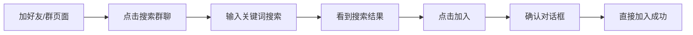
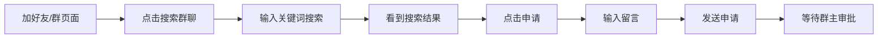
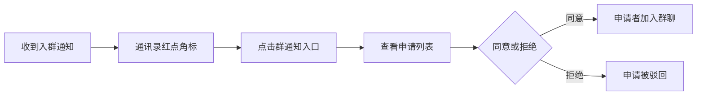
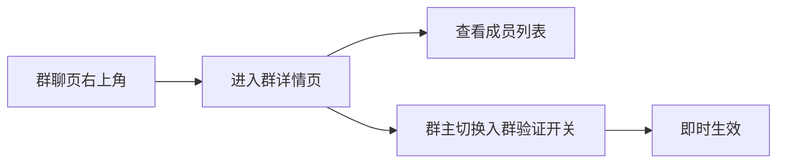
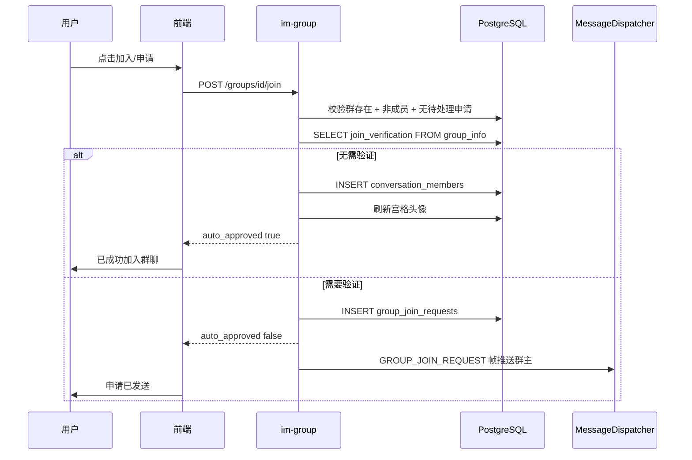

# 搜索加群与入群审批 — 功能分析

## 概述

v0.0.1 实现了群聊创建，用户只能通过"被邀请"的方式进入群聊。本次补全"主动加入"的链路：用户可以搜索公开群聊、申请入群，群主可以审批入群申请。

核心挑战有两个：一是入群申请的分支逻辑——同一个 `POST /groups/{id}/join` 接口要同时处理"无需验证直接加入"和"需要验证创建申请等待审批"两种场景；二是群主端的实时通知推送——入群申请需要通过 WS 帧实时送达群主，群主处理后结果也要通知申请者。

此外，本版还提供最小的群聊详情页：展示群成员列表，群主可切换入群验证开关。

---

## 一、交互链

### 场景 1：搜索并直接加入群聊（无需验证）

**用户故事**：作为用户，我想搜索并加入一个不需要审批的群聊，以便快速参与群聊讨论。

用户在通讯录 Tab 点击"加好友/群"（原"添加朋友"页面扩展），页面新增"搜索群聊"入口。点击进入 SearchGroupPage，顶部搜索栏输入关键词，300ms 防抖触发远程搜索，搜索结果展示匹配的群聊列表（群头像 + 群名 + 成员数 + 群号）。已加入的群显示"已加入"灰色标签，不可点击。未加入且无需验证的群显示"加入"蓝色按钮。点击"加入"后弹出确认对话框，确认后直接加入成功，Toast 提示"已成功加入群聊"，搜索结果中该群状态变为"已加入"。

### 场景 2：搜索并申请加入群聊（需验证）

**用户故事**：作为用户，我想申请加入一个需要审批的群聊，以便群主审核后我能参与讨论。

操作路径和场景 1 类似，但需要验证的群显示"申请"橙色按钮。点击后弹出对话框，包含一个可选的留言输入框（默认文案"请求加入群聊"）。点击"发送申请"后 Toast 提示"申请已发送，等待群主审批"，搜索结果中该群按钮变为"已申请"灰色标签。

### 场景 3：群主处理入群申请

**用户故事**：作为群主，我想审批入群申请，以便控制谁能加入我的群。

群主收到 WS 推送的入群申请通知（GROUP_JOIN_REQUEST 帧），通讯录 Tab 的"群通知"入口显示红点角标（未处理数量）。点击进入群通知页面，看到申请列表：每条显示申请者头像、昵称、申请加入的群名、留言内容。每条申请右侧有"拒绝"和"同意"两个按钮。点击"同意"后该条状态变为"已同意"，申请者自动加入群聊（群头像刷新）。点击"拒绝"则状态变为"已拒绝"。已处理的申请不再显示操作按钮。

### 场景 4：查看群详情与切换入群验证

**用户故事**：作为群主，我想查看群成员列表并控制入群验证开关，以便管理谁能加入我的群。

用户在群聊 ChatPage 右上角点击群图标，进入群聊详情页。页面展示群名、群号、群头像、成员列表（头像 + 昵称网格）。如果当前用户是群主，底部显示"入群验证"开关（Switch），可切换开启/关闭。切换后即时生效，Toast 提示"已开启入群验证"或"已关闭入群验证"。

---

## 二、逻辑树

### 事件流：搜索群聊

| 时刻 | 事件 | 处理 | 产生的新事件 |
|------|------|------|-------------|
| T1 | 用户输入关键词 | 前端 300ms 防抖后 `GET /groups/search?keyword=xxx` | HTTP 请求 |
| T2 | 后端搜索 | `WHERE c.type = 1 AND c.name ILIKE '%keyword%'`，关联查 member_count、当前用户 is_member、group_info.join_verification | 返回 GroupSearchResult 列表 |
| T3 | 前端渲染 | 根据 is_member / join_verification / has_pending_request 决定按钮状态：已加入 / 加入 / 申请 / 已申请 | 搜索结果展示 |

搜索结果中每个群的按钮状态由三个字段决定：

| is_member | has_pending_request | join_verification | 按钮状态 |
|-----------|--------------------|--------------------|---------|
| true | — | — | "已加入"（灰色，不可点击） |
| false | true | — | "已申请"（灰色，不可点击） |
| false | false | false | "加入"（蓝色） |
| false | false | true | "申请"（橙色） |

### 事件流：申请入群

| 时刻 | 事件 | 处理 | 产生的新事件 |
|------|------|------|-------------|
| T1 | 用户点击"加入"或"申请" | 前端 `POST /groups/{id}/join`，body: `{ message? }` | HTTP 请求 |
| T2 | 后端校验 | 群存在且 type=1、用户非成员、无待处理申请 | — |
| T3a | 无需验证（join_verification=false） | 直接 INSERT conversation_members + 刷新宫格头像 → 返回 `{ auto_approved: true }` | 用户立即加入 |
| T3b | 需要验证（join_verification=true） | INSERT group_join_requests（status=0）→ 返回 `{ auto_approved: false }` | 申请已创建 |
| T4 | 需审批时 | 后端通过 WS 推送 GROUP_JOIN_REQUEST 帧给群主 | 群主收到通知 |

### 事件流：群主处理入群申请

| 时刻 | 事件 | 处理 | 产生的新事件 |
|------|------|------|-------------|
| T1 | 群主点击"同意"或"拒绝" | 前端 `POST /groups/{id}/join-requests/{rid}/handle`，body: `{ approved: bool }` | HTTP 请求 |
| T2 | 后端校验 | 当前用户是群主、申请存在且 status=0 | — |
| T3a | 同意 | UPDATE status=1 + INSERT conversation_members + 刷新宫格头像 + 发系统消息"XXX 加入了群聊" | 申请者加入群聊 |
| T3b | 拒绝 | UPDATE status=2 | 申请被驳回 |

### 事件流：群主查询入群通知

| 时刻 | 事件 | 处理 | 产生的新事件 |
|------|------|------|-------------|
| T1 | 群主进入群通知页 | 前端 `GET /groups/join-requests` | HTTP 请求 |
| T2 | 后端查询 | 查当前用户作为群主的所有群的入群申请，关联查申请者昵称/头像、群名 | 返回 JoinRequestItem 列表 |

### 状态流转

| 实体 | 触发事件 | 前状态 | 后状态 |
|------|---------|--------|--------|
| GroupJoinRequest | POST /join（需审批） | 不存在 | status=0（待处理） |
| GroupJoinRequest | 群主同意 | status=0 | status=1（已同意） |
| GroupJoinRequest | 群主拒绝 | status=0 | status=2（已拒绝） |
| ConversationMember | 直接加入 / 群主同意 | 不存在 | joined（is_deleted=false） |
| conversations.avatar | 新成员加入 | grid:旧头像列表 | grid:新头像列表（刷新） |

**异常回退**：
- 重复申请：后端返回 400"已有待处理的入群申请"
- 已是成员：后端返回 400"已经是群成员"
- 非群主审批：后端返回 403"只有群主可以处理入群申请"
- 申请已处理：后端返回 400"该申请已处理"

---

## 三、功能编号与网络定位

### 本次新增节点

| 编号 | 功能节点 | 层级 | 简介 |
|------|---------|------|------|
| D-19 | 群搜索 | 领域 | GET /groups/search，按群名模糊搜索或群号精确匹配，返回成员数/是否已加入/是否需验证/是否已申请 |
| D-20 | 入群申请 | 领域 | POST /groups/{id}/join，无需验证直接加入，需验证创建申请 + WS 通知群主 |
| D-21 | 入群审批 | 领域 | POST /groups/{id}/join-requests/{rid}/handle，群主同意或拒绝 |
| D-22 | 入群通知查询 | 领域 | GET /groups/join-requests，聚合当前用户作为群主的所有入群申请 |
| F-10 | 群通知 WS 帧分发 | 前端基础 | WsClient 新增 GROUP_JOIN_REQUEST 帧类型，groupJoinRequestStream 分发 |
| P-34 | 群搜索与入群 | 前端业务 | SearchGroupPage，独立搜索群聊页：远程搜索 + 四种按钮状态 + 入群对话框 |
| P-35 | 群通知页 | 前端业务 | GroupNotificationsPage，群主查看和处理入群申请列表 |
| P-36 | 群通知角标 | 前端业务 | GroupNotificationCubit 管理 pendingCount，驱动通讯录 Tab 红点 |
| D-23 | 群成员查询与设置 | 领域 | GET /groups/{id}/detail 群详情（成员列表+群信息）+ PUT /groups/{id}/settings 群主切换入群验证 |
| P-37 | 群聊详情页 | 前端业务 | GroupChatInfoPage，展示群成员网格 + 群主可切换入群验证开关 |

### 前置依赖

| 依赖节点 | 依赖方式 | 是否已有 |
|----------|---------|---------|
| D-18 群聊创建 | 共享数据（group_info 表的 join_verification 字段） | ✅ 已有 |
| D-02 会话列表查询 | 扩展（搜索结果需要 member_count） | ✅ 已有 |
| I-08 在线用户管理 | 调接口（WS 推送入群通知给群主） | ✅ 已有 |
| I-09 帧分发器 | 扩展（新增 GROUP_JOIN_REQUEST 帧处理） | ✅ 需扩展 |
| F-06 WsClient 帧分发 | 扩展（新增 groupJoinRequestStream） | ✅ 需扩展 |
| P-25 添加朋友页 | 扩展（新增"搜索群聊"入口，页面标题改为"加好友/群"） | ✅ 需扩展 |

### 边界接口

| 接口/协议 | 定义方 | 消费方 | 说明 |
|-----------|--------|--------|------|
| GET /groups/search?keyword= | D-19 | P-34 | 新增接口 |
| POST /groups/{id}/join | D-20 | P-34 | 新增接口 |
| POST /groups/{id}/join-requests/{rid}/handle | D-21 | P-35 | 新增接口 |
| GET /groups/join-requests | D-22 | P-35 | 新增接口 |
| GROUP_JOIN_REQUEST（WS 帧） | D-20 | F-10 → P-36 | 新增帧类型 |
| GroupJoinRequestNotification（Protobuf） | D-20 | F-10 | 新增 proto 消息 |
| group_join_requests 表 | D-20 | D-21, D-22 | 新增数据库表 |
| GET /groups/{id}/detail | D-23 | P-37 | 新增接口 |
| PUT /groups/{id}/settings | D-23 | P-37 | 新增接口 |

---

## 四、结论

- **开发顺序**：数据库迁移（group_join_requests 表）→ Protobuf 定义（GROUP_JOIN_REQUEST 帧 + GroupJoinRequestNotification 消息）→ D-19 群搜索 → D-20 入群申请 → D-21 入群审批 → D-22 入群通知查询 → F-10 WS 帧分发扩展 → P-34 群搜索与入群 → P-35 群通知页 → P-36 群通知角标
- **复杂度集中点**：
  - D-20 入群申请的分支逻辑——同一个接口要处理"直接加入"和"创建申请等待审批"两种场景，且需要验证时还要触发 WS 推送
  - P-34 搜索结果的四种按钮状态（已加入/加入/申请/已申请）+ 300ms 防抖 + 入群确认/申请对话框
  - P-36 群通知角标的实时更新——WS 推送驱动 pendingCount 变化，需要和 HTTP 查询的初始值协调
- **和 v0.0.1 的关系**：所有新增接口放在 im-group crate 中（扩展 routes.rs），前端页面放在 flash_im_group 模块中。不影响 im-conversation 和 flash_im_conversation
