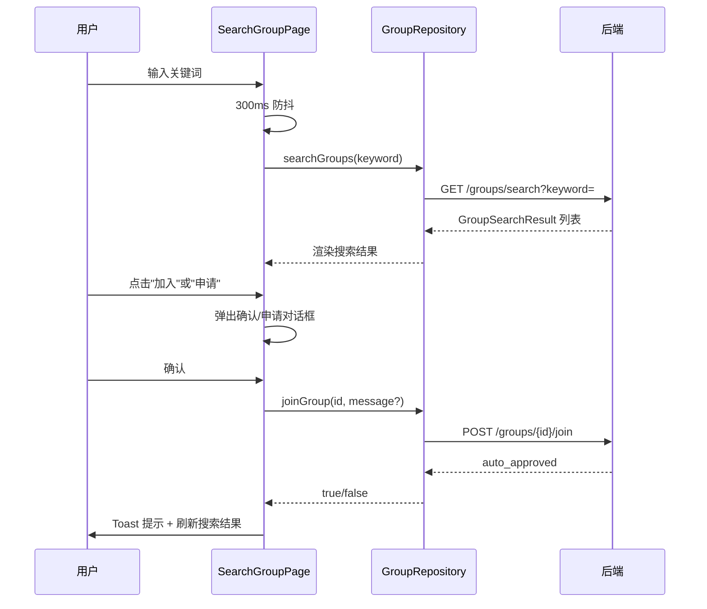
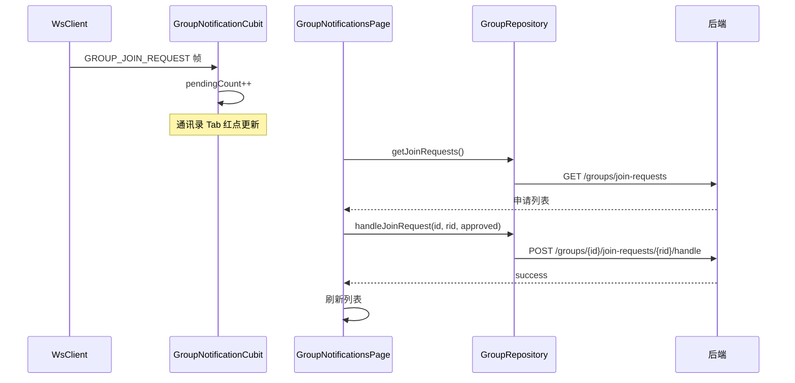

# 搜索加群与入群审批 — 客户端设计报告

> 关联设计：[服务端设计](../server/design.md) | [功能分析](../analysis.md) | [v0.0.1 客户端](../../v0.0.1/client/design.md)

## 1. 目标

- 搜索群聊页（SearchGroupPage）：防抖搜索 + 四种按钮状态（已加入/加入/申请/已申请）+ 入群确认/申请对话框
- 群通知页（GroupNotificationsPage）：群主查看和处理入群申请列表（同意/拒绝）
- 群通知角标（GroupNotificationCubit）：管理 pendingCount，驱动通讯录 Tab 红点
- WsClient 扩展：新增 GROUP_JOIN_REQUEST 帧类型分发 → groupJoinRequestStream
- AddFriendPage 扩展：标题改为"加好友/群"，新增"搜索群聊"入口
- GroupRepository 扩展：新增 searchGroups / joinGroup / handleJoinRequest / getJoinRequests 方法
- 群聊详情页（GroupChatInfoPage）：展示群成员网格 + 群号 + 群主可切换入群验证开关
- ChatPage 群聊右上角：点击进入群聊详情页（替换原来的 SnackBar 占位）

## 2. 现状分析

### 已有能力

- `flash_im_group`：GroupRepository（createGroup）、CreateGroupPage、MyGroupsPage、group_models（SelectableMember / CreateGroupResult）
- `flash_im_core`：WsClient 已有 friendRequestStream/friendAcceptedStream/friendRemovedStream 的分发模式
- `flash_im_friend`：AddFriendPage（"添加朋友"页面，含搜索入口 + 扫一扫 + 创建群聊入口）
- `flash_shared`：GroupAvatarWidget（九宫格头像）、FlashSearchBar、AvatarWidget
- `flash_im_conversation`：ConversationRepository（getList/createPrivate）、Conversation 模型
- home_page.dart：通讯录 Tab 已有"群聊"入口（跳转 MyGroupsPage）

### 缺失

- 无搜索群聊页面（SearchGroupPage）
- 无群通知页面（GroupNotificationsPage）
- 无群通知状态管理（GroupNotificationCubit）
- WsClient 无 GROUP_JOIN_REQUEST 帧分发
- GroupRepository 无搜索/入群/审批/查询方法
- AddFriendPage 无"搜索群聊"入口

## 3. 数据模型与接口

### 新增数据模型

```dart
/// 群搜索结果
class GroupSearchResult {
  final String id;
  final String? name;
  final String? avatar;
  final int? ownerId;
  final int groupNo;
  final int memberCount;
  final bool isMember;
  final bool joinVerification;
  final bool hasPendingRequest;
}

/// 入群申请列表项（群主视角）
class JoinRequestItem {
  final String id;
  final String conversationId;
  final String? groupName;
  final String? groupAvatar;
  final int userId;
  final String nickname;
  final String? avatar;
  final String? message;
  final int status;  // 0=待处理 1=已同意 2=已拒绝
  final DateTime createdAt;
}

/// 群通知状态
class GroupNotificationState {
  final List<JoinRequestItem> requests;
  final int pendingCount;
  final bool isLoading;
}
```

### GroupRepository 新增方法

```dart
/// 搜索群聊
Future<List<GroupSearchResult>> searchGroups(String keyword);

/// 申请入群，返回是否直接加入
Future<bool> joinGroup(String groupId, {String? message});

/// 群主审批入群申请
Future<void> handleJoinRequest(String groupId, String requestId, {required bool approved});

/// 查询入群申请列表
Future<List<JoinRequestItem>> getJoinRequests();

/// 获取群详情（群信息+成员列表）
Future<GroupDetail> getGroupDetail(String groupId);

/// 群主修改群设置
Future<void> updateGroupSettings(String groupId, {required bool joinVerification});
```

### 接口对应

| 客户端方法 | 后端接口 |
|-----------|---------|
| searchGroups | GET /groups/search?keyword= |
| joinGroup | POST /groups/{id}/join |
| handleJoinRequest | POST /groups/{id}/join-requests/{rid}/handle |
| getJoinRequests | GET /groups/join-requests |
| getGroupDetail | GET /groups/{id}/detail |
| updateGroupSettings | PUT /groups/{id}/settings |

## 4. 核心流程

### 搜索并入群



### 群主审批



## 5. 项目结构与技术决策

### 变更范围

```
client/modules/
├── flash_im_group/lib/src/
│   ├── data/
│   │   ├── group_repository.dart         # 扩展：新增 searchGroups / joinGroup / handleJoinRequest / getJoinRequests
│   │   └── group_models.dart             # 扩展：新增 GroupSearchResult / JoinRequestItem
│   ├── logic/
│   │   └── group_notification_cubit.dart # 新建：管理入群通知状态 + pendingCount
│   └── view/
│       ├── search_group_page.dart        # 新建：搜索群聊页
│       └── group_notifications_page.dart # 新建：群通知页（群主审批）
│       └── group_chat_info_page.dart     # 新建：群聊详情页（成员列表+入群验证开关）
├── flash_im_core/lib/src/
│   └── logic/ws_client.dart              # 扩展：新增 groupJoinRequestStream
├── flash_im_friend/lib/src/
│   └── view/add_friend_page.dart         # 扩展：标题改"加好友/群"，新增"搜索群聊"入口

client/lib/src/
└── home/view/home_page.dart              # 扩展：注入 GroupNotificationCubit + 通讯录"群通知"入口 + 红点角标
```

### 职责划分

```
SearchGroupPage (搜索 + 入群交互)
  ↓ 调用
GroupRepository (HTTP 请求)
  ↓
后端 /groups/search, /groups/{id}/join

GroupNotificationsPage (审批交互)
  ↓ 调用
GroupRepository (HTTP 请求)
  ↓
后端 /groups/join-requests, /groups/{id}/join-requests/{rid}/handle

GroupNotificationCubit (状态管理)
  ↑ 监听
WsClient.groupJoinRequestStream (WS 推送)
```

- SearchGroupPage 是纯 StatefulWidget，不用 Cubit（搜索状态是页面级的，不需要跨页面共享）
- GroupNotificationsPage 也是 StatefulWidget，进入时加载列表，操作后刷新
- GroupNotificationCubit 是应用级的，在 home_page 创建，监听 WS 推送驱动红点

### 技术决策

| 决策 | 方案 | 理由 |
|------|------|------|
| SearchGroupPage 不用 Cubit | StatefulWidget + setState | 搜索状态是页面级的，离开页面即销毁，不需要跨页面共享 |
| SearchGroupPage 搜索框 | 自定义输入框 + 右侧 loading 指示器 | 搜索时保留已有结果不闪烁，loading 只在搜索框右侧显示 |
| GroupNotificationCubit 应用级 | 在 home_page 创建，监听 WS | 红点角标需要跨 Tab 显示，必须是应用级状态 |
| 防抖 300ms | Timer + cancel | 避免每次按键都发请求 |
| 入群对话框区分两种 | joinVerification=true 显示留言输入框，false 只显示确认 | 减少不必要的交互步骤 |
| 搜索结果按钮状态 | 根据 isMember / hasPendingRequest / joinVerification 三个字段决定 | 后端一次查询返回所有状态，前端无需额外请求 |
| 群通知入口放通讯录 Tab | 和"群聊"入口平级 | 群主需要快速访问审批页面 |
| AddFriendPage 标题改"加好友/群" | 扩展现有页面，新增 `onSearchGroup` 回调 | 搜索群聊和搜索用户是同类操作（发现新联系），回调由 home_page 注入 |
| _joiningIds 防重复点击 | Set 记录正在申请中的群 ID | 网络请求期间禁止重复点击 |

### 第三方依赖

无需新增第三方依赖。

## 6. 验收标准

| 验收条件 | 验收方式 |
|----------|----------|
| 编译通过 | `flutter analyze` 无错误 |
| 搜索群聊：输入关键词 → 300ms 后显示结果 → 群名高亮 + 成员数 + 按钮状态正确 | 手动操作 |
| 搜索群聊：输入群号 → 精确匹配 | 手动操作 |
| 入群（无需验证）：点击"加入" → 确认对话框 → Toast"已成功加入群聊" → 按钮变"已加入" | 手动操作 |
| 入群（需验证）：点击"申请" → 留言对话框 → Toast"申请已发送" → 按钮变"已申请" | 手动操作 |
| 群通知：群主收到 WS 推送 → 通讯录红点 → 进入群通知页 → 看到申请列表 | 手动操作 |
| 群主审批：点击"同意" → Toast"已同意" → 列表刷新 | 手动操作 |
| 群主审批：点击"拒绝" → Toast"已拒绝" → 列表刷新 | 手动操作 |
| AddFriendPage：标题"加好友/群" + "搜索群聊"入口可跳转 | 手动操作 |
| 群聊详情页：群聊右上角点击 → 展示群名/群号/成员网格 | 手动操作 |
| 入群验证开关：群主可切换，非群主不显示开关 | 手动操作 |

## 7. 暂不实现

| 功能 | 理由 |
|------|------|
| 搜索结果分页 | 后端 LIMIT 20 足够 MVP |
| 群通知页分页 | 数据量小，一次加载全部 |
| 入群申请被拒后通知申请者 | 本版本不推送审批结果给申请者，下一版可加 |
| 群通知页已处理申请的展示 | 本版本只显示 status=0 的待处理申请，已处理的不展示 |
| 搜索历史记录 | 简化交互 |
