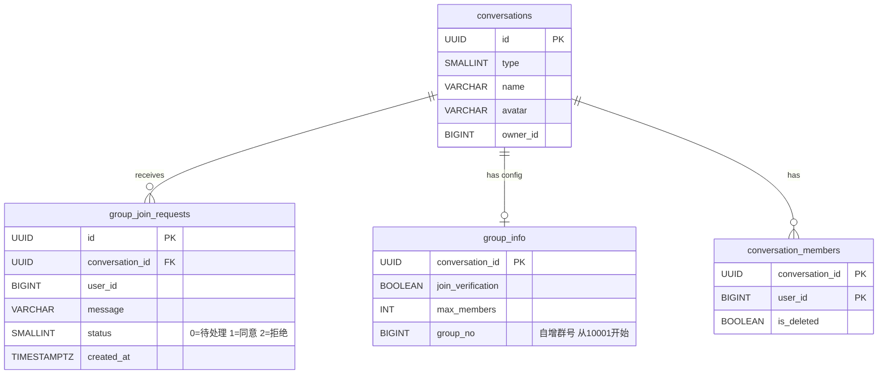
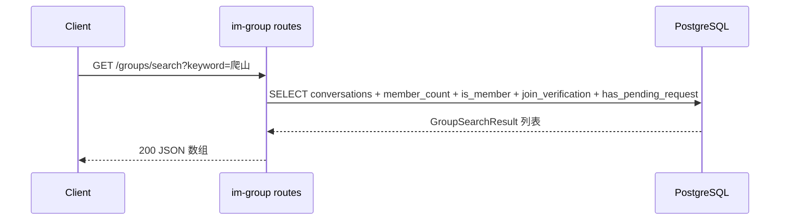
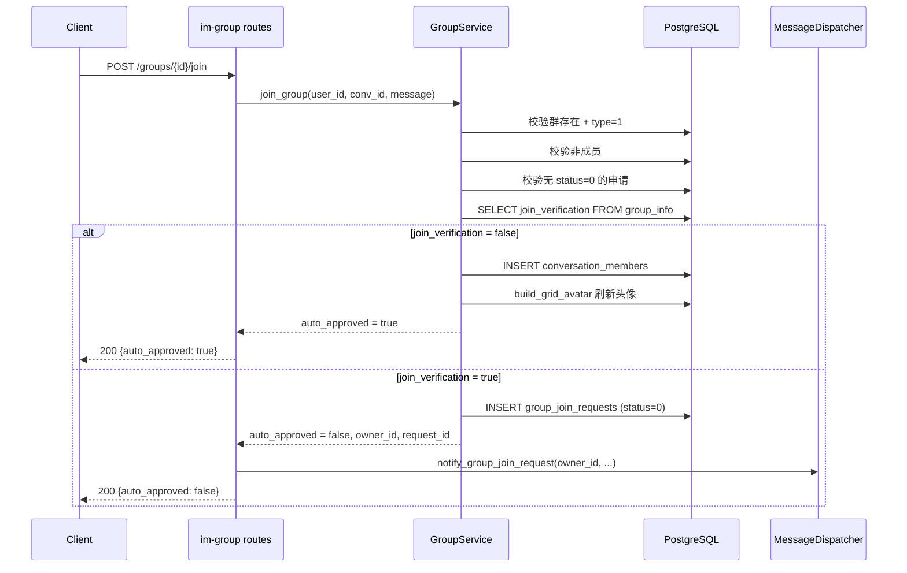
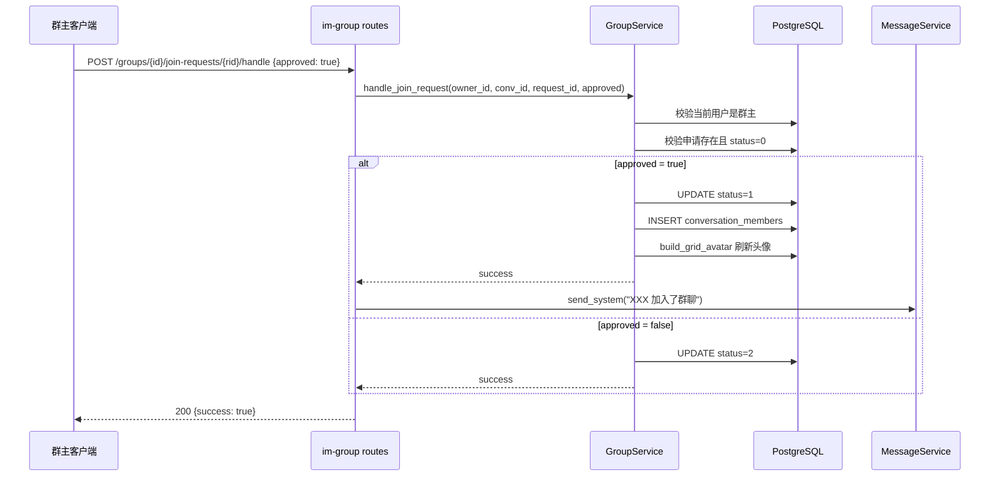

# 搜索加群与入群审批 — 服务端设计报告

> 关联设计：[群聊 v0.0.1 服务端](../../v0.0.1/server/design.md) | [功能分析 analysis.md](../analysis.md) | [WS域 ws.md](../../../../archiver/modules/ws.md)

## 1. 目标

- 新增 `GET /groups/search` 接口：按群名模糊搜索或群号精确匹配，返回成员数、是否已加入、是否需验证、是否已申请
- 新增 `POST /groups/{id}/join` 接口：入群申请，无需验证直接加入，需验证创建申请 + WS 通知群主
- 新增 `POST /groups/{id}/join-requests/{rid}/handle` 接口：群主审批（同意/拒绝）
- 新增 `GET /groups/join-requests` 接口：查询当前用户作为群主的所有入群申请
- 新增数据库表 `group_join_requests`（入群申请）
- 新增 Protobuf 帧类型 `GROUP_JOIN_REQUEST` + `GroupJoinRequestNotification` 消息
- 扩展 `MessageDispatcher`：新增 `notify_group_join_request` 方法
- 新增 `GET /groups/{id}/detail` 接口：群详情（群信息 + 成员列表）
- 新增 `PUT /groups/{id}/settings` 接口：群主切换入群验证开关

## 2. 现状分析

### 已有能力

- `im-group` crate 已有三层架构（routes → service → repository），当前只有 `POST /groups` 创建群聊
- `group_info` 表已有 `join_verification` 字段（默认 false），可直接用于判断是否需要审批
- `GroupRepository.build_grid_avatar()` 已实现宫格头像刷新，新成员加入后可复用
- `MessageService.send_system()` 已实现系统消息发送，审批通过后可发"XXX 加入了群聊"
- `MessageDispatcher` 已有 `notify_friend_request` 等 WS 推送模式，可参照实现 `notify_group_join_request`
- `WsState.send_to_user()` 已支持向指定用户推送 WS 帧
- `conversations` 表的 `owner_id` 字段可直接用于判断群主身份
- `conversation_members` 表的 `is_deleted` + `ON CONFLICT` 模式已验证可用

### 缺失

- 无 `group_join_requests` 表
- 无群搜索接口（按群名模糊查询 + 关联查成员数/是否已加入/是否已申请）
- 无入群申请逻辑（分支判断 join_verification → 直接加入 or 创建申请）
- 无入群审批逻辑（群主同意/拒绝 + 加成员 + 刷新头像 + 系统消息）
- Protobuf 无 `GROUP_JOIN_REQUEST` 帧类型
- `MessageDispatcher` 无群相关的通知方法

### 基础设施就绪

- PostgreSQL 数据库已就绪
- Protobuf 编译链路已就绪（`im-ws/build.rs`）
- WS 推送链路已就绪（`MessageDispatcher` → `WsState`）
- `im-group` crate 已在 workspace 中注册，`GroupApiState` 已注入 `GroupService` + `MessageService`

## 3. 数据模型与接口

### 数据模型

#### 扩展表：group_info（新增 group_no）

```sql
-- server/migrations/20260419_006_group_join.sql

-- 群号序列，从 10001 开始
CREATE SEQUENCE IF NOT EXISTS group_no_seq START WITH 10001;

-- 给 group_info 加群号字段
ALTER TABLE group_info ADD COLUMN IF NOT EXISTS group_no BIGINT UNIQUE DEFAULT nextval('group_no_seq');
```

群号在创建群聊时自动分配（`DEFAULT nextval`），用户可通过群号精确搜索群聊。

#### 新增表：group_join_requests

```sql
CREATE TABLE IF NOT EXISTS group_join_requests (
    id UUID PRIMARY KEY DEFAULT gen_random_uuid(),
    conversation_id UUID NOT NULL,
    user_id BIGINT NOT NULL,
    message VARCHAR(200),
    status SMALLINT NOT NULL DEFAULT 0,  -- 0=待处理 1=已同意 2=已拒绝
    created_at TIMESTAMPTZ NOT NULL DEFAULT NOW(),
    updated_at TIMESTAMPTZ NOT NULL DEFAULT NOW()
);

CREATE INDEX idx_group_join_requests_conv ON group_join_requests(conversation_id, status);
CREATE INDEX idx_group_join_requests_user ON group_join_requests(user_id, status);
```

#### ER 关系



#### 关键设计决策

| 决策 | 理由 |
|------|------|
| `group_join_requests` 独立表 | 和 `friend_requests` 语义不同（好友是双向关系，入群是单向申请），字段也不同（conversation_id vs to_user_id） |
| `status` 用 SMALLINT 而非 ENUM | 和项目其他表保持一致（conversations.type 也是 SMALLINT），扩展方便 |
| 不加 `UNIQUE(conversation_id, user_id)` | 允许同一用户对同一群有多条历史申请记录（被拒绝后可重新申请），通过业务逻辑限制"同时只有一条 status=0 的申请" |
| 搜索用 `ILIKE` 而非全文索引 | MVP 阶段数据量小，ILIKE 足够；后续可加 pg_trgm 索引优化 |
| 入群审批只允许群主 | 本版本不引入管理员角色，简化权限模型 |

### 新增 Rust 模型

```rust
// im-group/src/models.rs 新增

/// 入群申请请求
#[derive(Debug, Deserialize)]
pub struct JoinGroupRequest {
    pub message: Option<String>,
}

/// 入群审批请求
#[derive(Debug, Deserialize)]
pub struct HandleJoinRequest {
    pub approved: bool,
}

/// 群搜索结果项
#[derive(Debug, Serialize, FromRow)]
pub struct GroupSearchResult {
    pub id: Uuid,
    pub name: Option<String>,
    pub avatar: Option<String>,
    pub owner_id: Option<i64>,
    pub group_no: i64,
    pub member_count: i64,
    pub is_member: bool,
    pub join_verification: bool,
    pub has_pending_request: bool,
}

/// 入群申请列表项（群主视角）
#[derive(Debug, Serialize, FromRow)]
pub struct JoinRequestItem {
    pub id: Uuid,
    pub conversation_id: Uuid,
    pub group_name: Option<String>,
    pub group_avatar: Option<String>,
    pub user_id: i64,
    pub nickname: String,
    pub avatar: Option<String>,
    pub message: Option<String>,
    pub status: i16,
    pub created_at: DateTime<Utc>,
}

/// 入群申请响应
#[derive(Debug, Serialize)]
pub struct JoinGroupResponse {
    pub auto_approved: bool,
}
```

```rust
/// 群详情（群信息 + 成员列表）
#[derive(Debug, Serialize)]
pub struct GroupDetail {
    pub id: Uuid,
    pub name: Option<String>,
    pub avatar: Option<String>,
    pub owner_id: Option<i64>,
    pub group_no: i64,
    pub member_count: i64,
    pub join_verification: bool,
    pub members: Vec<GroupMember>,
}

/// 群成员信息
#[derive(Debug, Serialize, FromRow)]
pub struct GroupMember {
    pub user_id: i64,
    pub nickname: String,
    pub avatar: Option<String>,
}

/// 群设置请求
#[derive(Debug, Deserialize)]
pub struct UpdateGroupSettingsRequest {
    pub join_verification: Option<bool>,
}
```

### 新增 Protobuf

```protobuf
// proto/ws.proto 新增

enum WsFrameType {
  // ... 已有
  GROUP_JOIN_REQUEST = 10;
}

message GroupJoinRequestNotification {
  string request_id = 1;
  string conversation_id = 2;
  string group_name = 3;
  string user_id = 4;
  string nickname = 5;
  string avatar = 6;
  string message = 7;
  int64 created_at = 8;
}
```

### 接口契约

#### 接口一览

| 方法 | 路径 | 说明 | 状态 |
|------|------|------|------|
| GET | /groups/search?keyword= | 搜索群聊 | 新增 |
| POST | /groups/{id}/join | 申请入群 | 新增 |
| POST | /groups/{id}/join-requests/{rid}/handle | 审批入群申请 | 新增 |
| GET | /groups/join-requests | 查询入群申请列表 | 新增 |
| GET | /groups/{id}/detail | 群详情（群信息+成员列表） | 新增 |
| PUT | /groups/{id}/settings | 群主修改群设置 | 新增 |

#### GET /groups/search?keyword=xxx

请求：`GET /groups/search?keyword=爬山`（需 Authorization header）

成功响应 200：
```json
[
  {
    "id": "uuid-1",
    "name": "周末爬山群",
    "avatar": "grid:/uploads/a1.jpg,/uploads/a2.jpg",
    "owner_id": 1,
    "group_no": 10001,
    "member_count": 5,
    "is_member": false,
    "join_verification": true,
    "has_pending_request": false
  }
]
```

业务规则：
- keyword 为空返回空数组
- 只搜索 `type=1` 的群聊
- keyword 是纯数字：按群号精确匹配
- keyword 非数字：按群名 ILIKE 模糊搜索
- `is_member`：当前用户是否已是该群成员（`conversation_members` 中 `is_deleted=false`）
- `has_pending_request`：当前用户是否有 `status=0` 的待处理申请

#### POST /groups/{id}/join

请求：
```json
{
  "message": "我是张三，想加入爬山群"
}
```

成功响应 200（无需验证，直接加入）：
```json
{
  "auto_approved": true
}
```

成功响应 200（需要验证，创建申请）：
```json
{
  "auto_approved": false
}
```

错误响应：
- 400：`"已经是群成员"`
- 400：`"已有待处理的入群申请"`
- 404：`"群聊不存在"`

#### POST /groups/{id}/join-requests/{rid}/handle

请求：
```json
{
  "approved": true
}
```

成功响应 200：
```json
{
  "success": true
}
```

错误响应：
- 403：`"只有群主可以处理入群申请"`
- 400：`"该申请已处理"`
- 404：`"申请不存在"`

#### GET /groups/join-requests

请求：`GET /groups/join-requests`（需 Authorization header）

成功响应 200：
```json
[
  {
    "id": "request-uuid",
    "conversation_id": "conv-uuid",
    "group_name": "周末爬山群",
    "group_avatar": "grid:...",
    "user_id": 5,
    "nickname": "张三",
    "avatar": "/uploads/zhangsan.jpg",
    "message": "我想加入",
    "status": 0,
    "created_at": "2026-04-19T10:00:00Z"
  }
]
```

业务规则：
- 查询当前用户作为 `owner_id` 的所有群的入群申请
- 按 `created_at DESC` 排序
- 包含所有状态（0/1/2），前端根据 status 决定是否显示操作按钮

#### GET /groups/{id}/detail

请求：`GET /groups/{id}/detail`（需 Authorization header）

成功响应 200：
```json
{
  "id": "uuid",
  "name": "周末爬山群",
  "avatar": "grid:...",
  "owner_id": 1,
  "group_no": 10001,
  "member_count": 5,
  "join_verification": false,
  "members": [
    {"user_id": 1, "nickname": "朱红", "avatar": "identicon:1"},
    {"user_id": 2, "nickname": "橘橙", "avatar": "identicon:2"}
  ]
}
```

业务规则：
- 当前用户必须是群成员才能查看
- members 按 joined_at 排序

#### PUT /groups/{id}/settings

请求：
```json
{
  "join_verification": true
}
```

成功响应 200：
```json
{
  "success": true
}
```

错误响应：
- 403：只有群主可以修改群设置
- 404：群聊不存在

## 4. 核心流程

### 搜索群聊



SQL 核心逻辑（单次查询完成所有关联）：
```sql
-- 如果 keyword 是纯数字，按群号精确匹配
-- 否则按群名 ILIKE 模糊搜索
SELECT c.id, c.name, c.avatar, c.owner_id, gi.group_no,
       (SELECT COUNT(*) FROM conversation_members WHERE conversation_id = c.id AND is_deleted = false) AS member_count,
       EXISTS(SELECT 1 FROM conversation_members WHERE conversation_id = c.id AND user_id = $1 AND is_deleted = false) AS is_member,
       COALESCE(gi.join_verification, false) AS join_verification,
       EXISTS(SELECT 1 FROM group_join_requests WHERE conversation_id = c.id AND user_id = $1 AND status = 0) AS has_pending_request
FROM conversations c
LEFT JOIN group_info gi ON gi.conversation_id = c.id
WHERE c.type = 1
  AND (gi.group_no = $2::BIGINT OR c.name ILIKE '%' || $3 || '%')
ORDER BY member_count DESC
LIMIT 20
```

实际实现中，service 层先判断 keyword 是否为纯数字：
- 纯数字 → 只走 `gi.group_no = keyword` 精确匹配
- 非数字 → 只走 `c.name ILIKE` 模糊搜索

### 入群申请（分支逻辑）



### 群主审批



## 5. 项目结构与技术决策

### 变更范围

```
server/
├── migrations/
│   └── 20260419_006_group_join.sql       # 新增：group_join_requests 表
├── modules/
│   └── im-group/src/
│       ├── models.rs                      # 扩展：新增 JoinGroupRequest / HandleJoinRequest / GroupSearchResult / JoinRequestItem
│       ├── repository.rs                  # 扩展：新增 search / join / handle / list_join_requests
│       ├── service.rs                     # 扩展：新增 search_groups / join_group / handle_join_request / list_join_requests
│       ├── routes.rs                      # 扩展：新增 4 个路由 handler
│       └── lib.rs                         # 不变
│   └── im-ws/src/
│       └── dispatcher.rs                  # 扩展：新增 notify_group_join_request 方法
├── proto/
│   └── ws.proto                           # 扩展：新增 GROUP_JOIN_REQUEST 帧类型 + GroupJoinRequestNotification
└── src/
    └── main.rs                            # 扩展：GroupApiState 注入 dispatcher（用于 WS 推送）
```

### 职责划分

im-group 内部三层职责不变：

```
routes.rs (HTTP 入口)
  ↓ 解析请求、提取 user_id、调 service、触发 WS 通知和系统消息
service.rs (业务逻辑)
  ↓ 校验权限、判断分支、调 repo
repository.rs (数据访问)
  ↓ SQL 查询和事务
```

WS 通知的触发放在 routes 层（和 v0.0.1 的系统消息一样），因为 `MessageDispatcher` 是通过 `GroupApiState` 注入的，service 层不感知。

### 技术决策

| 决策 | 方案 | 理由 |
|------|------|------|
| 搜索 SQL 用子查询 | 单次查询完成 member_count + is_member + has_pending_request | 避免 N+1，一次 roundtrip 拿到所有信息 |
| 入群分支在 service 层判断 | service.join_group 返回 enum（AutoApproved / PendingApproval） | 路由层根据返回值决定是否触发 WS 通知 |
| WS 通知只推群主 | `send_to_user(owner_id, ...)` | 本版本不引入管理员，只有群主能审批 |
| WS 通知用 tokio::spawn 异步推送 | 路由层先返回 HTTP 响应，再 spawn 异步任务推送 WS 帧 | 不阻塞用户请求，通知推送失败不影响入群申请的创建 |
| 审批通过后发系统消息 | 复用 `MessageService.send_system` | 和创建群聊的系统消息保持一致体验 |
| GroupApiState 新增 dispatcher | `pub dispatcher: Arc<MessageDispatcher>` | 入群申请需要 WS 推送，dispatcher 是唯一的推送通道 |

### 依赖关系

```
im-group → flash-core (AppState, JWT, PgPool)
im-group → im-message (MessageService，用于 send_system)
im-group → im-ws (MessageDispatcher，用于 WS 推送)  ← 新增
main.rs → 组装所有模块，注入 dispatcher 到 GroupApiState
```

## 6. 验收标准

| 验收条件 | 验收方式 |
|----------|----------|
| 数据库迁移成功 | `python scripts/server/reset_db.py` 无报错 |
| 编译通过 | `cargo build` 无错误 |
| 搜索群聊：keyword 匹配返回结果，包含 member_count/is_member/join_verification/has_pending_request | `GET /groups/search?keyword=xxx` |
| 搜索群聊：keyword 为空返回空数组 | `GET /groups/search?keyword=` |
| 入群（无需验证）：直接加入成功，返回 auto_approved=true | `POST /groups/{id}/join` |
| 入群（需验证）：创建申请，返回 auto_approved=false | `POST /groups/{id}/join`（群 join_verification=true） |
| 入群（需验证）：群主收到 WS GROUP_JOIN_REQUEST 帧 | WS 连接监听 |
| 重复申请：返回 400 | `POST /groups/{id}/join`（已有 status=0 申请） |
| 已是成员：返回 400 | `POST /groups/{id}/join`（已是成员） |
| 群主审批同意：申请者加入群聊 + 头像刷新 + 系统消息 | `POST /groups/{id}/join-requests/{rid}/handle {approved:true}` |
| 群主审批拒绝：status 变为 2 | `POST /groups/{id}/join-requests/{rid}/handle {approved:false}` |
| 非群主审批：返回 403 | 用非群主 token 调审批接口 |
| 查询入群申请列表：返回当前用户作为群主的所有申请 | `GET /groups/join-requests` |
| 接口测试脚本全部 PASS | `python docs/features/im/group/api/group/request/group.py` |

## 7. 暂不实现

| 功能 | 理由 |
|------|------|
| 群成员管理（邀请/踢人/退群） | 属于群管理域，第 27 章 |
| 管理员角色 | 本版本只有群主能审批，简化权限模型 |
| 入群申请过期机制 | 数据量小，暂不需要自动过期 |
| 申请被拒后的冷却期 | 简化逻辑，被拒后可立即重新申请 |
| 搜索结果分页 | LIMIT 20 足够 MVP，后续可加 offset |
| 全文搜索索引 | 数据量小，ILIKE 足够；后续可加 pg_trgm |
