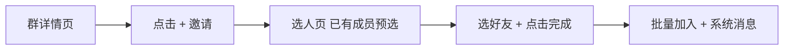
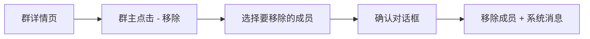
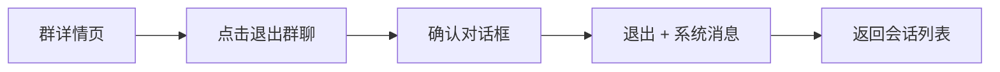
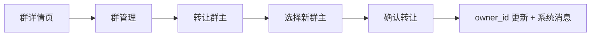
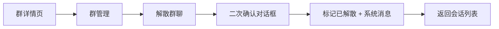
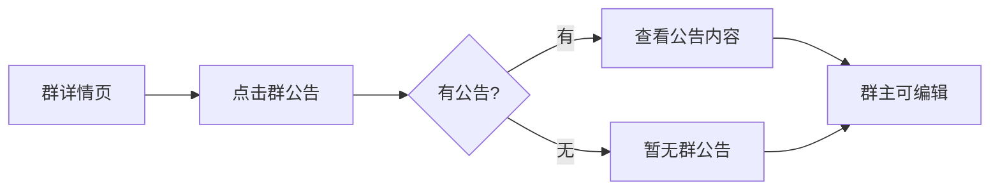
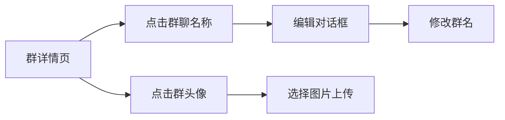

# 群成员管理与群详情 — 功能分析

## 概述

v0.0.1 实现了群聊创建，v0.0.2 补全了搜索加群与入群审批，并提供了最小的群详情页（成员列表 + 入群验证开关）。本次要给群聊装上完整的"治理能力"：邀请新成员、踢人、退群、转让群主、解散群聊、群公告、群设置（修改群名/头像）。

核心挑战在于权限控制和级联副作用。每个操作都有不同的权限要求（群主 vs 普通成员），操作完成后可能触发一系列连锁反应：踢人后要刷新宫格头像、发系统消息；解散群聊后标记 status=1，历史消息保留但不能再发送。本版本不引入管理员角色，权限模型只有群主和普通成员两级。

---

## 一、交互链

### 场景 1：邀请新成员入群

**用户故事**：作为群成员，我想邀请好友加入群聊，以便更多人参与讨论。

用户在群详情页点击"+"按钮，进入选人页（复用 CreateGroupPage 的选人交互，已有成员预选中且不可取消）。选好人后点击"完成"，后端批量添加成员（直接加入，不走入群审批），刷新宫格头像，发系统消息"XXX 邀请了 YYY、ZZZ 加入群聊"。

### 场景 2：群主踢人

**用户故事**：作为群主，我想移除不合适的成员，以便维护群聊秩序。

群主在群详情页点击"-"按钮，进入移除成员模式（成员头像上显示红色删除角标）。点击某个成员弹出确认对话框，确认后该成员被移除，刷新宫格头像，发系统消息"XXX 被移出群聊"。被踢的成员的会话列表中该群聊标记为已删除。

### 场景 3：退出群聊

**用户故事**：作为普通成员，我想退出不再关注的群聊。

用户在群详情页底部点击"退出群聊"（红色文字），弹出确认对话框。确认后该成员被移除，刷新宫格头像，发系统消息"XXX 退出了群聊"。退出后自动返回会话列表，该群聊从列表中消失。群主不能退出，只能转让或解散。

### 场景 4：转让群主

**用户故事**：作为群主，我想把群主身份转让给其他成员。

群主在群详情页的"群管理"入口中选择"转让群主"，弹出成员选择列表（排除自己）。选择新群主后确认，`conversations.owner_id` 更新，发系统消息"XXX 将群主转让给了 YYY"。转让后原群主变为普通成员，群详情页的权限按钮随之变化。

### 场景 5：解散群聊

**用户故事**：作为群主，我想解散不再需要的群聊。

群主在群详情页的"群管理"入口中选择"解散群聊"，弹出确认对话框（二次确认，因为不可逆）。确认后：发系统消息"群聊已解散"，conversations.status 标记为 1（已解散）。群聊不删除成员和消息，历史消息仍可查看但不能再发送。群主自动返回会话列表。

### 场景 6：群公告

**用户故事**：作为群主，我想发布群公告，让所有成员看到重要信息。

群主在群详情页点击"群公告"入口，进入群公告页面。如果没有公告显示"暂无群公告"+ 发布按钮；如果有公告显示公告内容。群主可以编辑/发布公告（TextField + 发布按钮），普通成员只能查看。

### 场景 7：群设置（修改群名/头像）

**用户故事**：作为群主，我想修改群名和群头像。

群主在群详情页点击"群聊名称"行，弹出编辑对话框修改群名。点击"群头像"行，从相册选择图片上传。修改后即时生效，所有成员的会话列表和群详情页同步更新。

---

## 二、逻辑树

### 事件流：邀请新成员

| 时刻 | 事件 | 处理 | 产生的新事件 |
|------|------|------|-------------|
| T1 | 用户点击完成 | 前端 `POST /groups/{id}/members`，body: `{ member_ids }` | HTTP 请求 |
| T2 | 后端校验 | 群存在、当前用户是成员、新成员不在群中、不超过 max_members | — |
| T3 | 批量加入 | INSERT conversation_members × N + 刷新宫格头像 | 成员加入 |
| T4 | 系统消息 | send_system "XXX 邀请了 YYY、ZZZ 加入群聊" | 所有成员收到 |

### 事件流：踢人

| 时刻 | 事件 | 处理 | 产生的新事件 |
|------|------|------|-------------|
| T1 | 群主确认移除 | 前端 `DELETE /groups/{id}/members/{uid}` | HTTP 请求 |
| T2 | 后端校验 | 当前用户是群主、目标不是群主 | — |
| T3 | 移除成员 | UPDATE is_deleted=true + 刷新宫格头像 | 成员被移除 |
| T4 | 系统消息 | send_system "XXX 被移出群聊" | 所有成员收到 |

### 事件流：退出群聊

| 时刻 | 事件 | 处理 | 产生的新事件 |
|------|------|------|-------------|
| T1 | 用户确认退出 | 前端 `POST /groups/{id}/leave` | HTTP 请求 |
| T2 | 后端校验 | 当前用户是成员、不是群主 | — |
| T3 | 退出 | UPDATE is_deleted=true + 刷新宫格头像 | 成员退出 |
| T4 | 系统消息 | send_system "XXX 退出了群聊" | 剩余成员收到 |

### 事件流：转让群主

| 时刻 | 事件 | 处理 | 产生的新事件 |
|------|------|------|-------------|
| T1 | 群主确认转让 | 前端 `PUT /groups/{id}/transfer`，body: `{ new_owner_id }` | HTTP 请求 |
| T2 | 后端校验 | 当前用户是群主、新群主是成员 | — |
| T3 | 转让 | UPDATE conversations SET owner_id = new_owner_id | 群主变更 |
| T4 | 系统消息 | send_system "XXX 将群主转让给了 YYY" | 所有成员收到 |

### 事件流：解散群聊

| 时刻 | 事件 | 处理 | 产生的新事件 |
|------|------|------|-------------|
| T1 | 群主确认解散 | 前端 `POST /groups/{id}/disband` | HTTP 请求 |
| T2 | 后端校验 | 当前用户是群主 | — |
| T3 | 系统消息 | send_system "群聊已解散" | 所有成员收到 |
| T4 | 标记解散 | UPDATE conversations SET status=1（已解散） | 群聊状态变更 |

解散不删除成员和消息——历史消息仍可查看，但不能再发送。前端进入已解散的群聊时：输入框禁用并显示"该群聊已解散"提示栏，右上角不显示群详情按钮（无法进入详情页）。后端 `MessageService.send` 需要校验群聊 status，已解散的群拒绝发送消息。

### 事件流：群公告

| 时刻 | 事件 | 处理 | 产生的新事件 |
|------|------|------|-------------|
| T1 | 群主发布公告 | 前端 `PUT /groups/{id}/announcement`，body: `{ announcement }` | HTTP 请求 |
| T2 | 后端校验 | 当前用户是群主 | — |
| T3 | 更新公告 | UPDATE group_info SET announcement, announcement_updated_at, announcement_updated_by | 公告更新 |

### 事件流：修改群名

| 时刻 | 事件 | 处理 | 产生的新事件 |
|------|------|------|-------------|
| T1 | 群主提交新群名 | 前端 `PUT /groups/{id}`，body: `{ name }` | HTTP 请求 |
| T2 | 后端校验 | 当前用户是群主、群名非空 | — |
| T3 | 更新群名 | UPDATE conversations SET name | 群名变更 |

### 状态流转

| 实体 | 触发事件 | 前状态 | 后状态 |
|------|---------|--------|--------|
| ConversationMember | 邀请入群 | 不存在 / is_deleted=true | is_deleted=false |
| ConversationMember | 踢人 / 退群 | is_deleted=false | is_deleted=true |
| ConversationMember | 解散群聊 | — | 不变（保留成员关系，历史消息可查看） |
| conversations.status | 解散群聊 | 0（正常） | 1（已解散） |
| conversations.owner_id | 转让群主 | 原群主 ID | 新群主 ID |
| conversations.name | 修改群名 | 旧群名 | 新群名 |
| conversations.avatar | 成员变动 | 旧宫格头像 | 刷新后的宫格头像 |
| group_info.announcement | 发布公告 | 旧公告 / NULL | 新公告内容 |

**异常回退**：
- 非群主踢人/转让/解散/改名/改设置：返回 403
- 群主退群：返回 400"群主不能退出，请先转让群主或解散群聊"
- 踢群主自己：返回 400
- 邀请已在群中的成员：跳过（ON CONFLICT），不报错
- 超过 max_members：返回 400

---

## 三、功能编号与网络定位

### 本次新增节点

| 编号 | 功能节点 | 层级 | 简介 |
|------|---------|------|------|
| D-24 | 邀请入群 | 领域 | POST /groups/{id}/members，批量添加成员 + 刷新头像 + 系统消息 |
| D-25 | 踢人 | 领域 | DELETE /groups/{id}/members/{uid}，群主移除成员 |
| D-26 | 退出群聊 | 领域 | POST /groups/{id}/leave，普通成员退出 |
| D-27 | 转让群主 | 领域 | PUT /groups/{id}/transfer，更新 owner_id |
| D-28 | 解散群聊 | 领域 | POST /groups/{id}/disband，标记 status=1 + 系统消息（不删成员和消息） |
| D-29 | 群公告 | 领域 | PUT /groups/{id}/announcement，群主发布/编辑公告 |
| D-30 | 修改群信息 | 领域 | PUT /groups/{id}，群主修改群名/头像 |
| P-38 | 群详情页扩展 | 前端业务 | 邀请/踢人/退群/转让/解散入口 + 群公告 + 群名编辑 + 群管理菜单 |
| P-39 | 邀请入群选人页 | 前端业务 | 复用 CreateGroupPage 选人交互，已有成员预选不可取消 |
| P-40 | 群公告页 | 前端业务 | 查看/编辑群公告，群主可发布 |

### 扩展节点

| 编号 | 扩展内容 |
|------|---------|
| D-23 | 群详情接口扩展（返回 announcement 字段） |
| P-37 | 群聊详情页大幅扩展（从最小版本到完整版本） |

### 前置依赖

| 依赖节点 | 依赖方式 | 是否已有 |
|----------|---------|---------|
| D-18 群聊创建 | 共享数据（conversations + conversation_members + group_info） | ✅ 已有 |
| D-23 群成员查询与设置 | 扩展（群详情返回更多字段） | ✅ 需扩展 |
| I-08 在线用户管理 | 调接口（解散群聊时可能需要通知在线成员） | ✅ 已有 |
| P-28 创建群聊页 | 复用（邀请入群复用选人交互） | ✅ 已有 |

### 边界接口

| 接口/协议 | 定义方 | 消费方 | 说明 |
|-----------|--------|--------|------|
| POST /groups/{id}/members | D-24 | P-39 | 新增接口 |
| DELETE /groups/{id}/members/{uid} | D-25 | P-38 | 新增接口 |
| POST /groups/{id}/leave | D-26 | P-38 | 新增接口 |
| PUT /groups/{id}/transfer | D-27 | P-38 | 新增接口 |
| POST /groups/{id}/disband | D-28 | P-38 | 新增接口 |
| PUT /groups/{id}/announcement | D-29 | P-40 | 新增接口 |
| PUT /groups/{id} | D-30 | P-38 | 新增接口 |

---

## 四、结论

- **开发顺序**：数据库迁移（conversations 加 status 字段 + group_info 加 announcement 相关字段）→ D-24 邀请入群 → D-25 踢人 → D-26 退群 → D-27 转让 → D-28 解散 → D-29 群公告 → D-30 修改群信息 → MessageService.send 拦截已解散群 → P-38 群详情页扩展 → P-39 邀请选人页 → P-40 群公告页 → ChatPage 已解散状态适配 + 群公告横幅
- **复杂度集中点**：
  - 权限控制：7 个接口中 5 个需要群主权限，2 个需要成员权限，每个接口的权限校验略有不同
  - 级联副作用：踢人/退群都要刷新宫格头像 + 发系统消息；解散标记 status=1 + 系统消息（不删成员）
  - P-38 群详情页：从最小版本扩展到完整版本，需要根据当前用户角色（群主/普通成员）动态显示不同的操作入口；已解散的群需要特殊处理（禁用操作）
- **和 v0.0.2 的关系**：所有新增接口继续放在 im-group crate 中，前端继续扩展 flash_im_group 模块和 GroupChatInfoPage
