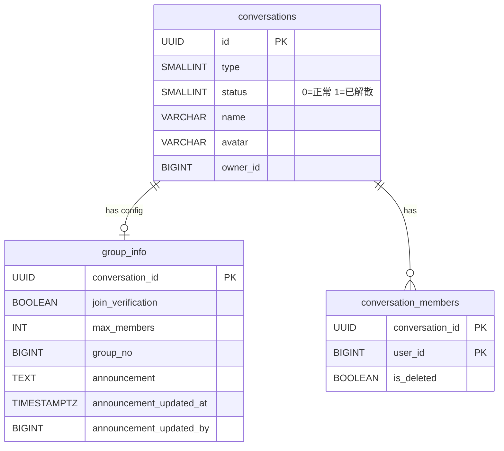
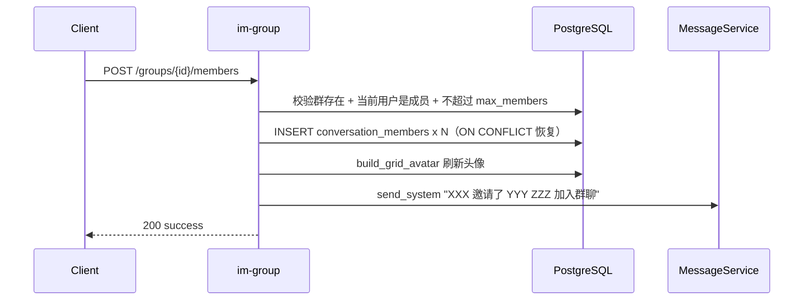
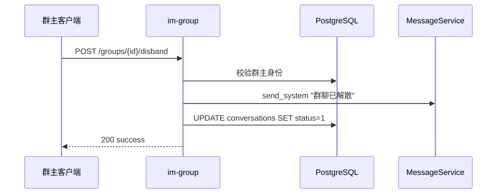

# 群成员管理与群详情 — 服务端设计报告

> 关联设计：[群聊 v0.0.2 服务端](../../v0.0.2/server/design.md) | [功能分析 analysis.md](../analysis.md)

## 1. 目标

- 新增 `POST /groups/{id}/members` 接口：邀请新成员入群（批量添加，直接加入不走审批）
- 新增 `DELETE /groups/{id}/members/{uid}` 接口：群主踢人
- 新增 `POST /groups/{id}/leave` 接口：普通成员退出群聊
- 新增 `PUT /groups/{id}/transfer` 接口：群主转让
- 新增 `POST /groups/{id}/disband` 接口：群主解散群聊（标记 status=1，不删成员和消息）
- 新增 `PUT /groups/{id}/announcement` 接口：群主发布/编辑群公告
- 新增 `PUT /groups/{id}` 接口：群主修改群名/头像
- 扩展 `conversations` 表：新增 `status` 字段（0=正常, 1=已解散）
- 扩展 `group_info` 表：新增 `announcement` 相关字段
- 扩展 `GroupDetail` 返回值：包含 status 和 announcement
- 扩展 `MessageService.send`：校验群聊 status，已解散拒绝发送

## 2. 现状分析

### 已有能力

- im-group crate 已有 7 个路由（创建/搜索/入群/审批/通知查询/群详情/群设置）
- `GroupRepository.join_group_direct()` 已实现单人加入 + 刷新宫格头像，可复用
- `GroupRepository.build_grid_avatar()` 已实现宫格头像刷新
- `MessageService.send_system()` 已实现系统消息发送
- `conversations.owner_id` 可用于群主权限校验
- `conversation_members.is_deleted` + ON CONFLICT 模式已验证可用

### 缺失

- 无邀请入群接口（批量添加成员）
- 无踢人/退群/转让/解散接口
- 无群公告字段和接口
- 无修改群名/头像接口
- `conversations` 表无 `status` 字段（无法标记已解散）
- `MessageService.send` 不校验群聊状态

## 3. 数据模型与接口

### 数据模型

#### 扩展表：conversations（新增 status）

```sql
-- server/migrations/20260420_007_group_manage.sql
ALTER TABLE conversations ADD COLUMN IF NOT EXISTS status SMALLINT NOT NULL DEFAULT 0;
-- 0=正常, 1=已解散
```

#### 扩展表：group_info（新增 announcement 相关字段）

```sql
ALTER TABLE group_info ADD COLUMN IF NOT EXISTS announcement TEXT;
ALTER TABLE group_info ADD COLUMN IF NOT EXISTS announcement_updated_at TIMESTAMPTZ;
ALTER TABLE group_info ADD COLUMN IF NOT EXISTS announcement_updated_by BIGINT;
```

#### ER 关系



#### 关键设计决策

| 决策 | 理由 |
|------|------|
| `status` 放在 conversations 表而非 group_info | 解散状态影响消息发送（MessageService 需要校验），放在 conversations 表查询更直接 |
| 解散不删成员和消息 | 历史消息仍可查看，用 status 标记即可；前端检测 status 禁用输入框 |
| announcement 放在 group_info 表 | 群公告是群配置的一部分，和 join_verification 同级 |
| 邀请入群直接加入，不走审批 | 邀请是群内成员的主动行为，和陌生人搜索加群不同，不需要审批 |
| 踢人/转让/解散/改名/改设置/发公告只允许群主 | 本版本不引入管理员角色，简化权限模型 |
| 群主不能退群 | 群主必须先转让或解散，避免群变成无主状态 |

### 新增 Rust 模型

```rust
// im-group/src/models.rs 新增

/// 邀请入群请求
#[derive(Debug, Deserialize)]
pub struct AddMembersRequest {
    pub member_ids: Vec<i64>,
}

/// 转让群主请求
#[derive(Debug, Deserialize)]
pub struct TransferOwnerRequest {
    pub new_owner_id: i64,
}

/// 修改群信息请求
#[derive(Debug, Deserialize)]
pub struct UpdateGroupRequest {
    pub name: Option<String>,
    pub avatar: Option<String>,
}

/// 群公告请求
#[derive(Debug, Deserialize)]
pub struct UpdateAnnouncementRequest {
    pub announcement: String,
}
```

### 接口契约

#### 接口一览

| 方法 | 路径 | 说明 | 权限 |
|------|------|------|------|
| POST | /groups/{id}/members | 邀请新成员入群 | 群成员 |
| DELETE | /groups/{id}/members/{uid} | 踢人 | 群主 |
| POST | /groups/{id}/leave | 退出群聊 | 普通成员（群主不可） |
| PUT | /groups/{id}/transfer | 转让群主 | 群主 |
| POST | /groups/{id}/disband | 解散群聊 | 群主 |
| PUT | /groups/{id}/announcement | 发布/编辑群公告 | 群主 |
| PUT | /groups/{id} | 修改群名/头像 | 群主 |

#### POST /groups/{id}/members

请求：
```json
{ "member_ids": [4, 5, 6] }
```

成功响应 200：
```json
{ "success": true, "added_count": 3 }
```

错误响应：
- 400：超过 max_members
- 403：非群成员

#### DELETE /groups/{id}/members/{uid}

成功响应 200：`{ "success": true }`

错误响应：
- 403：非群主
- 400：不能踢群主自己

#### POST /groups/{id}/leave

成功响应 200：`{ "success": true }`

错误响应：
- 400：群主不能退出

#### PUT /groups/{id}/transfer

请求：
```json
{ "new_owner_id": 5 }
```

成功响应 200：`{ "success": true }`

错误响应：
- 403：非群主
- 400：新群主不是群成员

#### POST /groups/{id}/disband

成功响应 200：`{ "success": true }`

错误响应：
- 403：非群主

#### PUT /groups/{id}/announcement

请求：
```json
{ "announcement": "本周六下午两点线下聚会" }
```

成功响应 200：`{ "success": true }`

错误响应：
- 403：非群主

#### PUT /groups/{id}

请求：
```json
{ "name": "新群名", "avatar": "/uploads/new_avatar.jpg" }
```

成功响应 200：`{ "success": true }`

错误响应：
- 403：非群主
- 400：群名为空

## 4. 核心流程

### 邀请入群



### 解散群聊



注意顺序：先发系统消息（此时成员关系还在，消息能广播到所有人），再标记解散。

## 5. 项目结构与技术决策

### 变更范围

```
server/
├── migrations/
│   └── 20260420_007_group_manage.sql     # 新增：conversations.status + group_info.announcement
├── modules/
│   └── im-group/src/
│       ├── models.rs                      # 扩展：AddMembersRequest / TransferOwnerRequest / UpdateGroupRequest / UpdateAnnouncementRequest
│       ├── repository.rs                  # 扩展：add_members / remove_member / leave / transfer / disband / update_announcement / update_group
│       ├── service.rs                     # 扩展：7 个新方法，每个都有权限校验
│       ├── routes.rs                      # 扩展：7 个新路由 handler（总计 14 个）
│       └── lib.rs                         # 不变
│   └── im-message/src/
│       └── service.rs                     # 扩展：send 方法校验群聊 status
```

### 技术决策

| 决策 | 方案 | 理由 |
|------|------|------|
| 权限校验统一模式 | service 层每个方法开头先查 owner_id，和 user_id 比较 | 简单直接，不需要中间件 |
| 踢人/退群复用 remove_member | repository 层一个方法，service 层区分权限（踢人要求群主，退群要求非群主） | 数据库操作一样，只是权限不同 |
| 解散先发消息再改状态 | send_system 在 UPDATE status 之前 | 消息广播需要成员关系，status=1 后 send 会被拦截 |
| 邀请入群跳过已有成员 | ON CONFLICT DO UPDATE SET is_deleted=false | 不报错，幂等操作 |
| send 拦截已解散群 | MessageService.send 开头查 conversations.status | 防止客户端绕过 UI 限制发消息 |

### 依赖关系

```
im-group → flash-core + im-message + im-ws（不变）
im-message → 扩展 send 方法（新增 status 校验）
```

## 6. 验收标准

| 验收条件 | 验收方式 |
|----------|----------|
| 数据库迁移成功 | `python scripts/server/reset_db.py` |
| 编译通过 | `cargo build` |
| 邀请入群：批量添加成功 + 头像刷新 + 系统消息 | POST /groups/{id}/members |
| 邀请入群：非成员邀请返回 403 | 用非成员 token |
| 踢人：群主移除成员成功 + 系统消息 | DELETE /groups/{id}/members/{uid} |
| 踢人：非群主返回 403 | 用普通成员 token |
| 踢人：踢群主自己返回 400 | 群主踢自己 |
| 退群：普通成员退出成功 + 系统消息 | POST /groups/{id}/leave |
| 退群：群主退出返回 400 | 群主调 leave |
| 转让：owner_id 更新 + 系统消息 | PUT /groups/{id}/transfer |
| 转让：新群主不是成员返回 400 | 传不存在的 user_id |
| 解散：status=1 + 系统消息 | POST /groups/{id}/disband |
| 解散后发消息：被拦截 | 向已解散群发消息 |
| 群公告：发布/编辑成功 | PUT /groups/{id}/announcement |
| 修改群名：成功 | PUT /groups/{id} |
| 修改群名：群名为空返回 400 | 传空字符串 |
| 接口测试脚本全部 PASS | python 测试脚本 |

## 7. 暂不实现

| 功能 | 理由 |
|------|------|
| 管理员角色 | 本版本只有群主和普通成员两级权限 |
| 全员禁言 | group_info 已预留字段，下一版可加 |
| 群头像上传 | 前端先上传到 app-storage 拿 URL，再调 PUT /groups/{id} 传 URL，后端不直接处理文件 |
| 解散后通知离线成员 | 本版本不做离线通知 |
| 邀请需确认 | 邀请直接加入，不走审批流程 |
