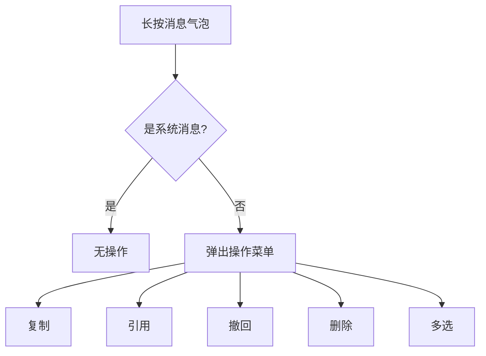
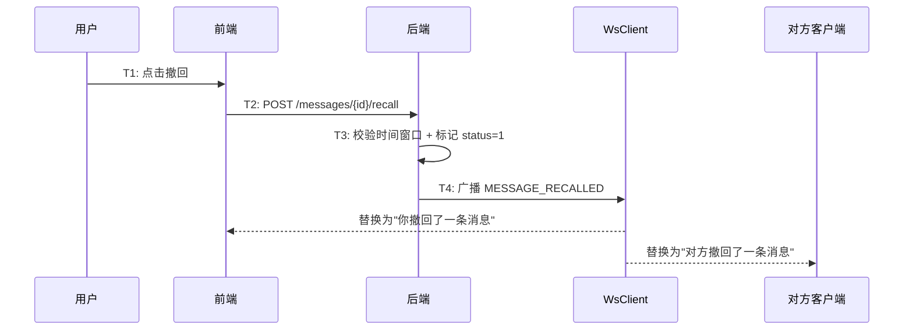
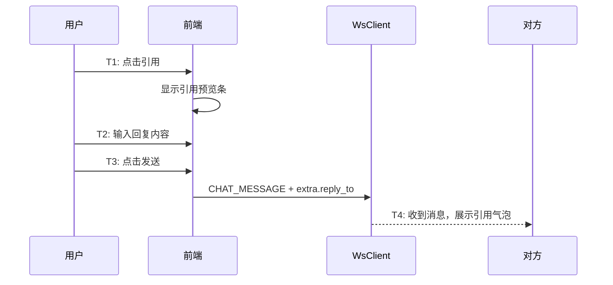

# 消息操作 — 功能分析

## 概述

闪讯的消息目前只能发和看，不能操作。长按一条消息什么都不会发生。这一版补齐消息的基础操作：长按菜单、复制、撤回、引用回复、本地删除、多选批量删除。

核心目标：
- 长按消息弹出操作菜单，覆盖最常用的消息交互
- 消息撤回：2 分钟内可撤回，对方实时看到"对方撤回了一条消息"
- 引用回复：回复时引用原消息，气泡里显示被引用内容
- 复制文本消息内容到剪贴板
- 本地删除：标记本地不显示，不影响对方
- 多选模式：批量选择消息，批量删除

核心挑战：
- 撤回涉及前后端协调：后端校验时间窗口 + 标记状态 + WS 广播，前端实时替换展示
- 引用回复需要在 extra 里存引用消息的 ID 和预览，气泡里嵌套展示被引用内容
- 长按菜单的定位：菜单要出现在手指按住的位置附近，不能遮挡消息内容
- 多选模式是一个全局状态切换：进入多选后消息列表变成勾选模式，底部出现操作栏

---

## 一、交互链

### 场景 1：长按菜单

**用户故事**：作为用户，我长按一条消息，想看到可以对它做什么。

长按消息气泡，弹出微信风格的操作菜单。菜单项根据消息类型和发送者动态显示：

| 菜单项 | 文本消息 | 图片/视频/文件 | 自己发的 | 别人发的 | 系统消息 |
|--------|---------|--------------|---------|---------|---------|
| 复制 | ✅ | ❌ | ✅ | ✅ | ❌ |
| 引用 | ✅ | ✅ | ✅ | ✅ | ❌ |
| 撤回 | ✅ | ✅ | ✅（2分钟内） | ❌ | ❌ |
| 删除 | ✅ | ✅ | ✅ | ✅ | ❌ |
| 多选 | ✅ | ✅ | ✅ | ✅ | ❌ |

系统消息（sender_id=0）不显示长按菜单。

---

### 场景 2：消息撤回

**用户故事**：作为用户，我发错了消息，想在 2 分钟内撤回。

点击"撤回"后，前端发送撤回请求到后端。后端校验：是否是自己发的、是否在 2 分钟内。校验通过后标记消息 status=1（RECALLED），通过 WS 广播 MESSAGE_RECALLED 帧给会话所有成员。所有客户端收到后将该消息替换为"你撤回了一条消息"或"对方撤回了一条消息"。

---

### 场景 3：引用回复

**用户故事**：作为用户，我想回复某条特定消息，让对方知道我在说哪条。

点击"引用"后，输入框上方出现引用预览条，显示被引用消息的发送者和内容摘要。用户输入回复内容后发送，消息的 extra 里携带引用信息。聊天气泡里嵌套展示被引用的原消息。

---

### 场景 4：复制

**用户故事**：作为用户，我想复制一条文本消息的内容。

点击"复制"，将消息 content 写入系统剪贴板，显示 Toast "已复制"。只有文本消息（type=0）显示复制选项。

---

### 场景 5：本地删除

**用户故事**：作为用户，我想删除某条消息，不想再看到它。

点击"删除"，弹出确认对话框。确认后将消息 ID 写入本地回收站表（local_trash），消息不再显示。不通知服务端，不影响对方。SyncEngine 同步时正常写入消息数据，Repository 读取时过滤掉回收站里的 ID。

---

### 场景 6：多选模式

**用户故事**：作为用户，我想批量删除多条消息。

点击"多选"进入多选模式：消息列表左侧出现勾选框，底部出现操作栏（删除）。勾选多条消息后点击"删除"，批量标记本地已删除。点击"取消"退出多选模式。

---

## 二、逻辑树

### 事件流：消息撤回

| 时刻 | 事件 | 处理 | 产生的新事件 |
|------|------|------|-------------|
| T1 | 用户点击"撤回" | 前端发送 HTTP POST /messages/{id}/recall | — |
| T2 | 后端校验 | 是否本人发送、是否在 2 分钟内 | — |
| T3 | 校验通过 | UPDATE messages SET status=1，广播 MESSAGE_RECALLED 帧 | WS 帧 |
| T4 | 所有客户端收到帧 | 替换消息内容为撤回提示 | UI 刷新 |

### 事件流：引用回复

| 时刻 | 事件 | 处理 | 产生的新事件 |
|------|------|------|-------------|
| T1 | 用户点击"引用" | 输入框上方显示引用预览条 | — |
| T2 | 用户输入回复内容 | — | — |
| T3 | 用户点击发送 | 消息 extra 携带 reply_to 信息 | WS CHAT_MESSAGE |
| T4 | 对方收到消息 | 解析 extra.reply_to，展示引用气泡 | UI 刷新 |

### 设计决策

| 决策 | 方案 | 理由 |
|------|------|------|
| 撤回时间窗口 | 2 分钟 | 微信标准，用户习惯 |
| 撤回方式 | HTTP 接口 + WS 广播 | 撤回需要后端校验，不能纯前端 |
| 撤回后展示 | 替换内容为提示文字 | 不删除消息行，保留 seq 连续性 |
| 引用存储 | extra 字段存 reply_to 对象 | 复用已有 extra JSONB，不加新列 |
| 本地删除 | 本地回收站表（local_trash） | 统一的"本地不可见"机制，不改同步逻辑。回收站存 entity_id + entity_type（message/conversation），方便按类型查看和恢复。Repository 读取时过滤掉回收站里的 ID，SyncEngine 同步时正常写入不受影响。未来会话删除（第 33 章）直接复用 |
| 长按菜单 | 自定义 Overlay | 微信风格气泡菜单，定位在消息附近 |
| 多选模式 | ChatCubit 状态切换 | isMultiSelect 标志 + selectedIds 集合 |
| 新 WS 帧 | MESSAGE_RECALLED | 撤回需要实时通知所有会话成员 |

---

## 三、功能编号与网络定位

### 本次新增节点

| 编号 | 功能节点 | 层级 | 简介 |
|------|---------|------|------|
| D-40 | 消息撤回 | 领域 | POST /messages/{id}/recall + WS 广播 |
| P-48 | 长按菜单 | 前端业务 | 微信风格气泡操作菜单 |
| P-49 | 消息撤回展示 | 前端业务 | 撤回提示替换 + MESSAGE_RECALLED 帧处理 |
| P-50 | 引用回复 | 前端业务 | 引用预览条 + 引用气泡 + extra.reply_to |
| P-51 | 多选模式 | 前端业务 | 勾选框 + 底部操作栏 + 批量删除 |

### 扩展节点

| 编号 | 扩展内容 |
|------|---------|
| I-06 | ws.proto 新增 MESSAGE_RECALLED 帧类型 |
| D-06 | messages 表 status 字段：0=正常 1=已撤回 2=已删除 |
| P-06 | ChatPage 长按手势 + 多选模式 UI |
| P-07 | 消息发送支持 extra.reply_to |
| F-06 | WsClient 新增 messageRecalledStream |

### 前置依赖

| 依赖节点 | 依赖方式 | 是否已有 |
|----------|---------|---------|
| D-06 消息存储 | 撤回修改 status 字段 | ✅ 已有 |
| I-09 帧分发器 | 广播 MESSAGE_RECALLED 帧 | ✅ 已有 |
| F-06 WsClient 帧分发 | 新增 messageRecalledStream | ✅ 已有（需扩展） |
| P-06 ChatPage | 长按手势 + 多选模式 | ✅ 已有（需扩展） |
| I-14 本地数据库 | 本地回收站表 local_trash | ✅ 已有（需扩展） |

### 边界接口

| 接口/协议 | 定义方 | 消费方 | 说明 |
|-----------|--------|--------|------|
| POST /conversations/{conv_id}/messages/{msg_id}/recall | D-40 | P-49 | 消息撤回请求 |
| MESSAGE_RECALLED WS 帧 | D-40 | F-06 → P-49 | 撤回实时通知 |
| extra.reply_to | P-50 | P-06 (ChatPage) | 引用回复数据 |

---

## 四、结论

- **开发顺序**：proto 扩展（MESSAGE_RECALLED）→ 后端撤回接口 → WsClient 扩展 → 长按菜单组件 → 复制/删除 → 撤回展示 → 引用回复 → 多选模式
- **复杂度集中点**：
  - 消息撤回的前后端协调：时间窗口校验、WS 广播、前端实时替换
  - 引用回复的气泡嵌套：引用内容可能是图片/视频/文件，需要不同的预览样式
  - 长按菜单的定位：需要计算消息气泡的位置，菜单不能超出屏幕
- **和已有架构的关系**：后端新增一个撤回接口 + WS 帧类型。前端主要改动在 ChatPage（长按手势、多选模式）和 MessageBubble（撤回展示、引用气泡）。不新建模块，所有改动在 flash_im_chat 和 flash_im_core 内完成
