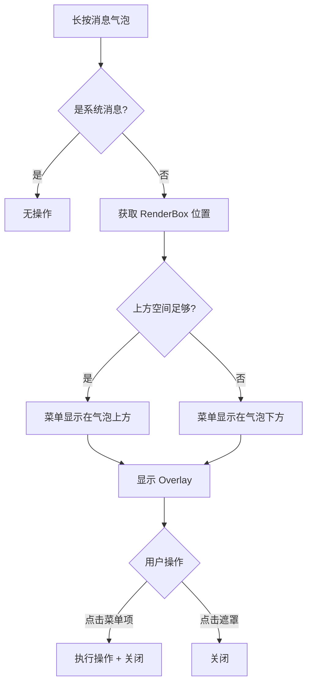
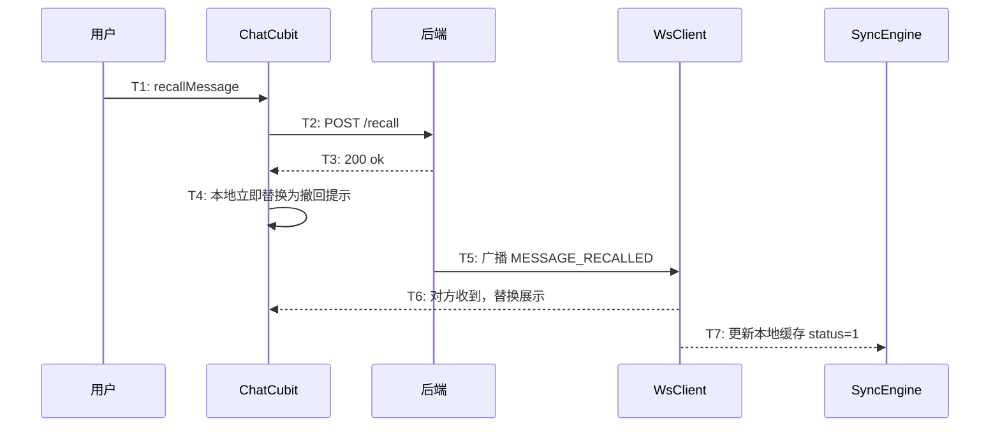
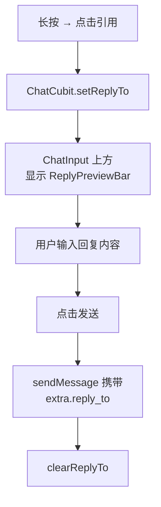
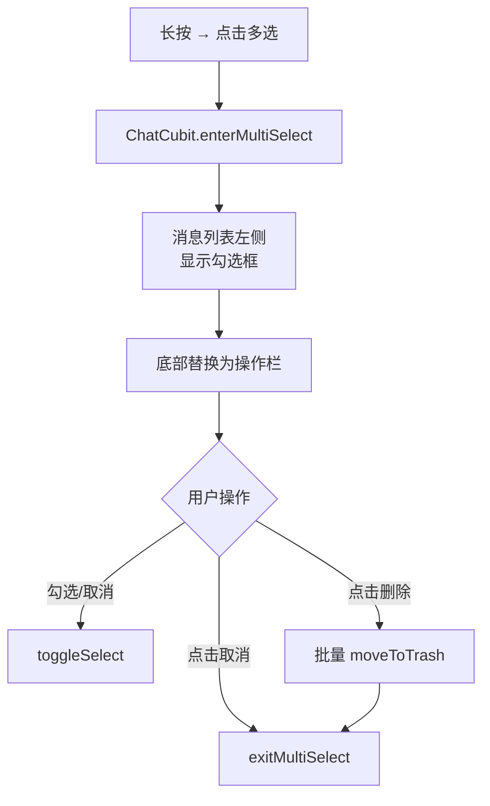
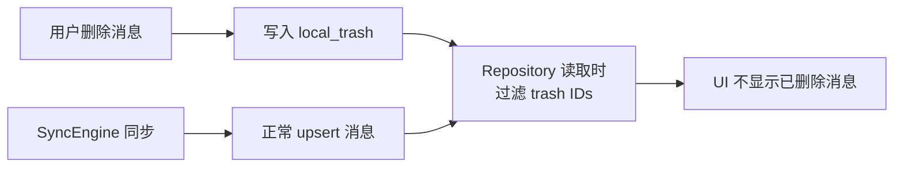

# 消息操作 — 客户端设计报告

> 关联设计：[功能分析](../analysis.md) · [服务端设计](../server/design.md)

## 1. 目标

- 长按消息弹出操作菜单（复制、引用、撤回、删除、多选）
- 消息撤回：调后端接口 + 监听 MESSAGE_RECALLED 帧 + 替换展示
- 引用回复：输入框上方引用预览条 + 消息气泡嵌套引用内容
- 复制文本到剪贴板
- 本地删除：写入 local_trash 回收站表，静默移除（不触发重新加载）
- 多选模式：勾选 + 底部操作栏 + 批量删除（带确认弹窗）
- 删除/撤回后同步更新会话列表最后一条消息预览
- 撤回后写入本地缓存，退出重进不会复原
- 引用气泡显示在消息内容下方

## 2. 现状分析

### 已有能力

- ChatPage 有完整的消息列表（ListView.builder reverse）和消息气泡（MessageBubble）
- ChatCubit 管理消息状态，监听 chatMessageStream 和 messageAckStream
- WsClient 有帧分发机制（switch + StreamController.broadcast）
- flash_im_cache 有 LocalStore 抽象接口和 DriftLocalStore 实现
- SyncEngine 监听 WS 事件写入本地缓存
- messages 表已有 status 字段（0=正常，1=已撤回，2=已删除）
- proto 已定义 MessageStatus 枚举和 MESSAGE_RECALLED 帧类型（刚新增）

### 缺失

- 消息气泡没有长按手势，没有操作菜单
- WsClient 没有 messageRecalledStream
- ChatCubit 没有多选状态、引用状态
- ChatInput 没有引用预览条
- 没有本地回收站表

## 3. 数据模型与接口

### 客户端数据模型

**ChatState 扩展**：

| 字段 | 类型 | 说明 |
|------|------|------|
| replyTo | Message? | 当前引用的消息，null 表示不引用 |
| isMultiSelect | bool | 是否多选模式 |
| selectedIds | Set\<String\> | 已选消息 ID 集合 |

**引用回复 extra 结构**：

```json
{
  "reply_to": {
    "message_id": "uuid",
    "sender_name": "朱红",
    "content": "明天几点开会？",
    "msg_type": 0
  }
}
```

引用内容是发送时的快照。被引用消息可能被撤回或删除，快照保证引用内容始终可见。

**local_trash 表**：

| 列 | 类型 | 说明 |
|----|------|------|
| entity_id | TEXT PK | 被删除的 ID |
| entity_type | TEXT | message / conversation |
| deleted_at | INTEGER | 删除时间（毫秒时间戳） |

### 接口

| 方法 | 路径 | 说明 |
|------|------|------|
| POST | /conversations/{conv_id}/messages/{msg_id}/recall | 消息撤回 |

其他操作（复制、删除、引用、多选）不需要后端接口。

## 4. 核心流程

### 长按菜单



菜单项动态规则：

| 菜单项 | 条件 |
|--------|------|
| 复制 | 仅文本消息 |
| 引用 | 所有非系统消息 |
| 撤回 | 自己发的 + 2 分钟内 |
| 删除 | 所有非系统消息 |
| 多选 | 所有非系统消息 |

### 消息撤回



自己撤回时不等 WS 帧，API 成功后立即替换。对方通过 WS 帧实时收到。离线用户重连后通过增量同步拿到 status=1 的消息。

### 引用回复



### 多选模式



### 本地删除与同步



回收站和同步互不干扰。SyncEngine 照常写入，Repository 读取时过滤。

## 5. 项目结构与技术决策

### 项目结构

```
flash_im_core/lib/src/logic/
└── ws_client.dart                      # 职责：WS 帧收发 + 分发
                                        # 改动：+messageRecalledStream

flash_im_chat/lib/src/
├── data/
│   ├── message.dart                    # 职责：消息数据模型
│   └── message_repository.dart         # 职责：消息数据访问（HTTP + 本地）
│                                       # 改动：+recallMessage +回收站过滤
├── logic/
│   ├── chat_cubit.dart                 # 职责：聊天页状态管理
│   │                                   # 改动：+撤回 +引用 +多选 +复制 +删除
│   └── chat_state.dart                 # 职责：聊天页状态定义
│                                       # 改动：+replyTo +isMultiSelect +selectedIds
└── view/
    ├── chat_page.dart                  # 职责：聊天页面布局和手势
    │                                   # 改动：+长按触发菜单 +多选模式 UI
    ├── chat_input.dart                 # 职责：消息输入框
    │                                   # 改动：+引用预览条集成
    ├── message_action_menu.dart        # 【新建】职责：长按操作菜单 Overlay
    ├── reply_preview_bar.dart          # 【新建】职责：输入框上方引用预览条
    └── bubble/
        ├── message_bubble.dart         # 职责：消息气泡容器
        │                              # 改动：+撤回展示 +引用嵌套 +多选勾选框
        └── reply_bubble.dart           # 【新建】职责：引用内容嵌套组件

flash_im_cache/lib/src/
├── local_store.dart                    # 职责：本地存储抽象接口
│                                       # 改动：+moveToTrash +restoreFromTrash +getTrashIds
├── models/
│   └── （无新增）
├── drift/
│   ├── database/
│   │   ├── app_database.dart           # 职责：drift 数据库定义
│   │   │                               # 改动：注册 LocalTrashTable, schemaVersion=2
│   │   └── tables/
│   │       └── local_trash_table.dart  # 【新建】职责：回收站表定义
│   ├── dao/
│   │   └── trash_dao.dart              # 【新建】职责：回收站 CRUD
│   ├── drift_local_store.dart          # 职责：LocalStore 的 drift 实现
│   │                                   # 改动：实现 trash 方法
│   └── converters.dart                 # （无改动）
└── sync_engine.dart                    # 职责：WS 事件写入本地 + 同步
                                        # 改动：+messageRecalledStream 监听
```

### 职责划分

```mermaid
graph TD
    subgraph 组件层 — 只管渲染
        MAM[MessageActionMenu<br/>菜单定位 + 显示]
        RB[ReplyBubble<br/>引用内容渲染]
        RPB[ReplyPreviewBar<br/>预览条渲染]
        MB[MessageBubble<br/>气泡容器]
    end

    subgraph 状态层 — 只管逻辑
        CC[ChatCubit<br/>撤回/引用/多选/删除]
        CS[ChatState<br/>状态字段定义]
    end

    subgraph 数据层 — 只管存取
        MR[MessageRepository<br/>HTTP + 本地读写]
        LS[LocalStore<br/>回收站接口]
        SE[SyncEngine<br/>WS → 本地]
    end

    MB --> RB
    MAM -.->|回调| CC
    RPB -.->|回调| CC
    CC --> CS
    CC --> MR
    CC --> LS
    SE --> LS
```

- 组件层不持有状态，通过回调通知 Cubit
- Cubit 不直接操作 Widget，只 emit 新状态
- Repository 不知道 UI 的存在，只提供数据

### 技术决策

| 决策 | 方案 | 理由 |
|------|------|------|
| 长按菜单 | Overlay + CompositedTransformFollower | 精确定位在消息附近，不受 ListView 滚动影响 |
| 菜单样式 | 深色气泡（和 WxPopupMenuButton 一致） | 视觉统一 |
| 撤回本地处理 | API 成功后立即替换，不等 WS 帧 | 自己撤回不需要等广播，体验更快 |
| 引用存储 | extra.reply_to JSON 对象 | 复用已有 extra 字段，不加新列 |
| 引用内容 | 发送时快照 | 被引用消息可能被撤回或删除，快照保证可见 |
| 本地删除 | local_trash 回收站表 | 不改同步逻辑，未来会话删除复用 |
| 多选模式 | ChatLoaded 状态扩展 | 不新建 Cubit，复用已有状态管理 |
| 数据库版本 | schemaVersion 2 | 新增 local_trash 表需要迁移 |
| 删除确认 | showTolyPopPicker（tolyui_feedback_modal） | 微信风格底部弹窗，红色删除按钮 |
| 删除体验 | 静默移除（内存过滤 + emit） | 不触发 loadMessages，避免 Loading 闪烁 |
| 撤回持久化 | _replaceWithRecalled 后 cacheMessages 写入 | 退出重进保持撤回状态 |
| 会话预览同步 | ChatCubit.onConversationChanged 回调 | 删除/撤回后实时通知会话列表刷新 |
| 引用气泡位置 | 消息内容下方 | 主内容优先，引用作为补充信息 |

| 依赖 | 用途 | 已有/需新增 |
|------|------|-----------|
| flutter/services (Clipboard) | 复制文本 | 已有 |
| flash_im_core (WsClient) | messageRecalledStream | 已有（需扩展） |
| flash_im_cache (LocalStore) | 回收站 | 已有（需扩展） |
| tolyui_feedback_modal | 删除确认底部弹窗 | 需新增（^0.0.1） |

## 6. 验收标准

| 验收条件 | 验收方式 |
|----------|----------|
| 长按文本消息显示 5 个菜单项（复制、引用、撤回、删除、多选） | 手动测试 |
| 长按图片消息不显示"复制" | 手动测试 |
| 长按别人的消息不显示"撤回" | 手动测试 |
| 长按系统消息无反应 | 手动测试 |
| 菜单项点击区域覆盖整个图标+文字区域 | 手动测试 |
| 复制文本消息内容到剪贴板，Toast 提示"已复制" | 手动测试 |
| 2 分钟内撤回成功，气泡变为撤回提示 | 手动测试 |
| 撤回后退出聊天页再进入，仍显示撤回状态 | 手动测试 |
| 对方实时看到撤回提示 | 双设备测试 |
| 引用回复：预览条显示 + 发送后引用气泡在消息下方 | 手动测试 |
| 删除弹出确认弹窗，确认后消息静默消失（无闪烁） | 手动测试 |
| 删除后会话列表最后一条消息预览实时更新 | 手动测试 |
| 撤回后会话列表最后一条消息预览实时更新 | 手动测试 |
| 本地删除后消息不显示，重启后仍不显示 | 手动测试 |
| 多选模式：勾选 + 批量删除（带确认弹窗） + 取消退出 | 手动测试 |
| flutter analyze 无错误 | `flutter analyze` |

## 7. 暂不实现

| 功能 | 理由 |
|------|------|
| 消息转发 | 需要会话选择器，放第 32 章 |
| @提及 | 输入框交互复杂，放第 32 章 |
| 消息置顶 | 群管理低频功能，放第 32 章 |
| 多选转发 | 依赖转发功能，放第 32 章 |
| 回收站查看/恢复 | local_trash 表已预留，UI 后续补 |
| 撤回后重新编辑 | 微信有此功能，当前版本不做 |
