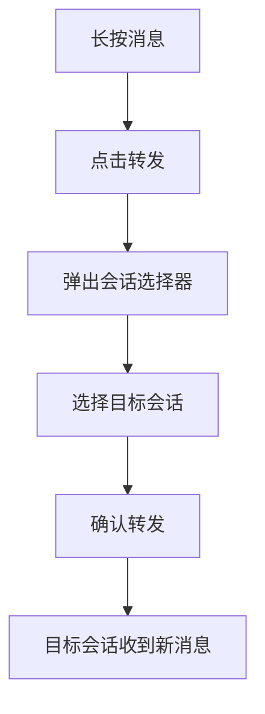
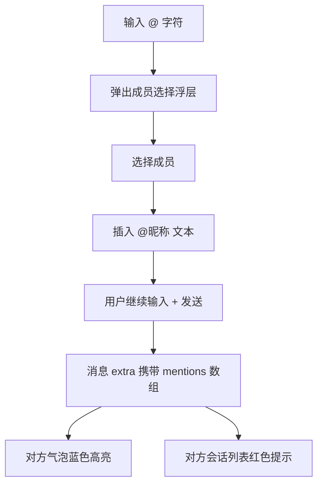
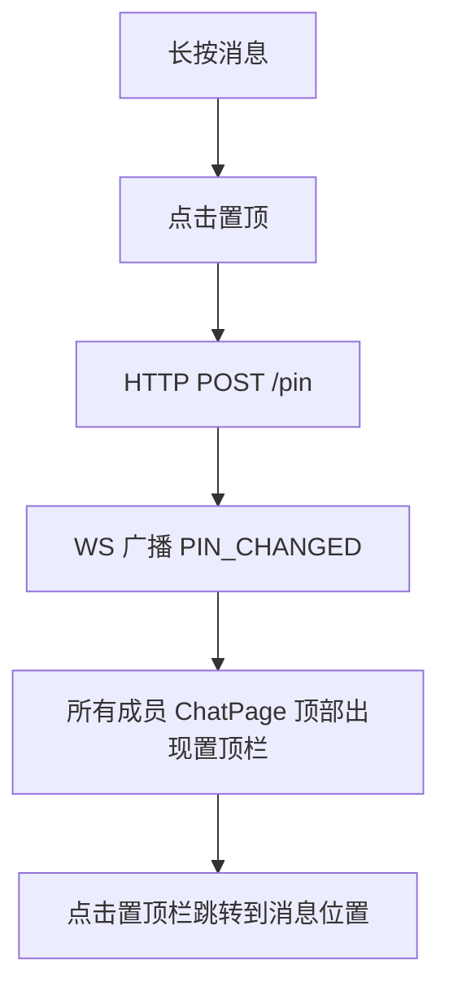
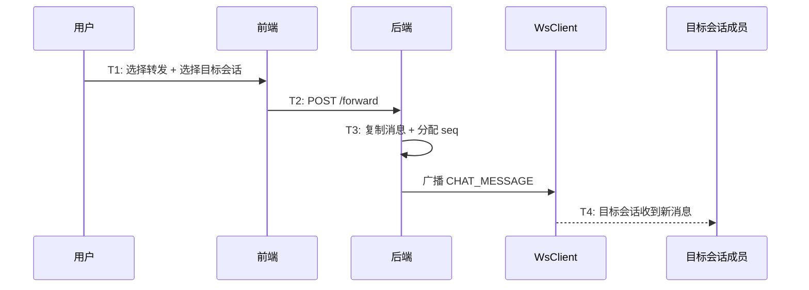
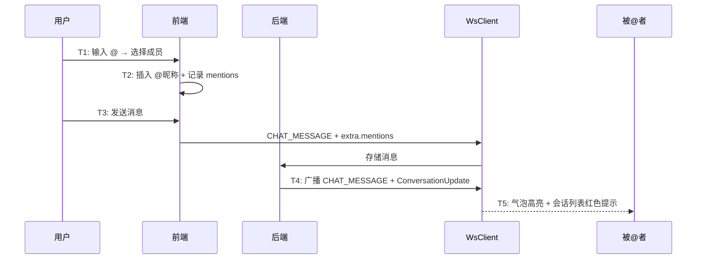
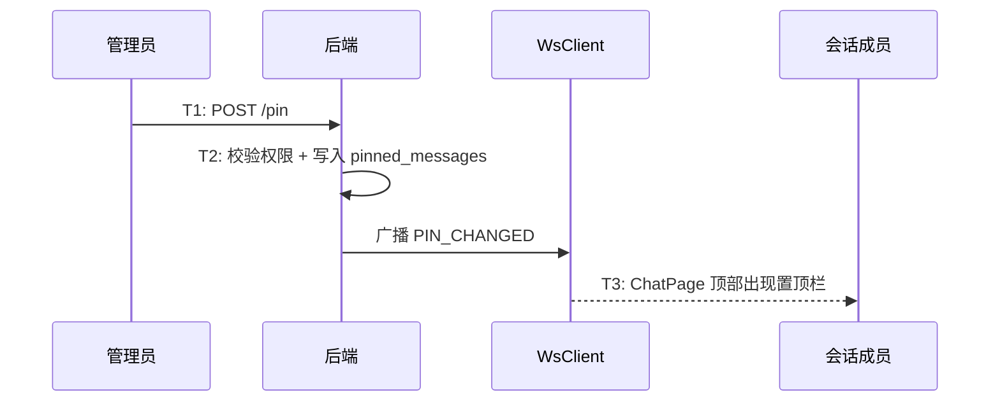

# 消息转发与@提及与置顶 — 功能分析

## 概述

闪讯的消息目前只能在当前会话里操作（撤回、删除、引用回复）。这一版补齐三个跨会话/跨成员的高级交互：消息转发、@提及、消息置顶。

核心目标：
- 消息转发：单条/多条消息转发到其他会话（需要会话选择器）
- @提及：群聊中 @ 某人或 @所有人，被 @ 的人在会话列表看到红色提示
- 消息置顶：群管理员将重要消息置顶，聊天页顶部常驻展示

核心挑战：
- 转发涉及"会话选择器"——一个独立的页面，展示最近会话和好友列表，支持搜索和多选
- @提及需要在输入框里检测 @ 字符触发成员选择浮层，选择后插入特殊格式文本，发送时解析为 mentions 数组存入 extra
- @提及还需要在会话列表层面展示"有人@我"标识，涉及 ConversationUpdate 帧扩展
- 消息置顶需要新建 pinned_messages 表，支持置顶/取消置顶，ChatPage 顶部常驻展示

---

## 一、交互链

### 场景 1：单条消息转发

**用户故事**：作为用户，我想把一条消息转发给另一个人或群。

长按消息 → 点击"转发" → 弹出会话选择器 → 选择目标会话 → 确认转发。转发后目标会话收到一条新消息，内容和原消息相同，发送者是转发者（不是原始发送者）。

转发的本质是"复制消息内容到另一个会话重新发送"。不是"共享引用"——转发后的消息和原消息没有关联，原消息被撤回不影响转发后的副本。

---

### 场景 2：多条消息转发（合并转发）

**用户故事**：作为用户，我想把多条消息打包转发给别人。

进入多选模式 → 勾选多条消息 → 点击底部"转发"按钮 → 弹出会话选择器 → 选择目标会话 → 确认。多条消息合并为一条"聊天记录"消息，展示为可展开的卡片。

合并转发的消息类型为 `FORWARD`（type=5），content 存标题（如"张三和李四的聊天记录"），extra 存原始消息列表的 JSON 快照。

---

### 场景 3：@提及（群聊）

**用户故事**：作为群成员，我想 @ 某人让他注意到我的消息。

在输入框输入 `@` 字符 → 弹出成员选择浮层 → 选择成员（或"所有人"）→ 输入框插入 `@昵称 ` 文本 → 发送消息。

被 @ 的人：
- 收到消息时，气泡里 @文本 蓝色高亮
- 会话列表显示红色「[有人@我]」前缀（直到进入该会话）

@提及的数据存储：
- 消息 content 里包含 `@张三 ` 这样的文本（用户可见）
- 消息 extra 里存 `mentions` 数组：`[{user_id, offset, length}]`
- offset 和 length 用于前端精确定位高亮范围

---

### 场景 4：@所有人

**用户故事**：作为群主/管理员，我想 @所有人 发布重要通知。

和 @某人 流程相同，但选择"所有人"选项。extra.mentions 里 user_id 为特殊值 `"all"`。所有群成员的会话列表都显示红色提示。

只有群主和管理员可以 @所有人，普通成员只能 @具体的人。

---

### 场景 5：消息置顶

**用户故事**：作为群管理员，我想把一条重要消息置顶，让所有人进群就能看到。

长按消息 → 点击"置顶" → 消息被置顶。ChatPage 顶部出现置顶消息栏，显示置顶内容摘要。点击置顶栏可跳转到该消息位置。

置顶/取消置顶通过 WS 帧 `PIN_CHANGED` 实时通知所有会话成员。

权限：只有群主和管理员可以置顶/取消置顶。每个会话最多 3 条置顶消息（微信标准）。

---

### 场景 6：取消置顶

**用户故事**：作为群管理员，我想取消一条已置顶的消息。

点击置顶栏右侧"×" → 确认取消 → HTTP DELETE → WS 广播 PIN_CHANGED（action=unpin）→ 置顶栏消失。

---

## 二、逻辑树

### 事件流：消息转发

| 时刻 | 事件 | 处理 |
|------|------|------|
| T1 | 用户选择转发 | 打开会话选择器 |
| T2 | 选择目标会话 + 确认 | 调用转发 API |
| T3 | 后端处理 | 复制消息内容 + 分配新 seq + 存储 + WS 推送 |
| T4 | 目标会话收到消息 | 正常的 CHAT_MESSAGE 帧处理 |

### 事件流：@提及

| 时刻 | 事件 | 处理 |
|------|------|------|
| T1 | 用户输入 @ | 弹出成员选择浮层 |
| T2 | 选择成员 | 插入 @昵称 文本，记录 offset/length |
| T3 | 发送消息 | content 含 @文本，extra 含 mentions 数组 |
| T4 | 后端存储 + 广播 | 正常存储，ConversationUpdate 携带 mention 信息 |
| T5 | 被@者收到 | 气泡蓝色高亮 + 会话列表红色提示 |

### 事件流：消息置顶

| 时刻 | 事件 | 处理 |
|------|------|------|
| T1 | 管理员点击"置顶" | HTTP POST /pin |
| T2 | 后端处理 | 校验权限 + 写入 pinned_messages + WS 广播 |
| T3 | 所有成员收到 PIN_CHANGED | ChatPage 顶部出现置顶栏 |

### 设计决策

| 决策 | 方案 | 理由 |
|------|------|------|
| 转发方式 | 复制消息重新发送 | 转发后的消息独立于原消息，原消息撤回不影响副本 |
| 多条转发 | 合并为一条 FORWARD 类型消息 | 不污染目标会话的消息列表，可展开查看 |
| @存储 | content 含 @文本 + extra 含 mentions 数组 | content 保证无 extra 时也能看到 @文本，mentions 用于精确高亮 |
| @所有人权限 | 仅群主/管理员 | 防止滥用 |
| 会话列表@提示 | ConversationUpdate 帧携带 mention 信息 | 复用已有的会话更新推送机制 |
| 置顶上限 | 每会话最多 3 条 | 微信标准，防止置顶栏过长 |
| 置顶权限 | 仅群主/管理员 | 群管理功能 |
| 置顶通知 | PIN_CHANGED WS 帧 | 实时通知所有成员 |
| 转发 API | HTTP POST（不是 WS） | 需要后端校验权限和目标会话有效性 |

---

## 三、功能编号与网络定位

### 本次新增节点

| 编号 | 功能节点 | 层级 | 简介 |
|------|---------|------|------|
| D-41 | 消息转发 | 领域 | POST /forward + 复制消息 + WS 推送 |
| D-42 | 消息置顶 | 领域 | POST/DELETE /pin + pinned_messages 表 + WS 广播 |
| F-18 | PIN_CHANGED WS 帧分发 | 前端基础 | WsClient 新增 pinChangedStream |
| P-54 | 会话选择器 | 前端业务 | 转发目标选择页面（最近会话 + 好友 + 搜索） |
| P-55 | 消息转发 | 前端业务 | 单条/多条转发流程 |
| P-56 | @提及输入 | 前端业务 | 输入框 @ 触发 + 成员选择浮层 + mentions 构建 |
| P-57 | @提及展示 | 前端业务 | 气泡蓝色高亮 + 会话列表红色提示 |
| P-58 | 消息置顶 | 前端业务 | 置顶栏 + 置顶/取消置顶操作 |

### 扩展节点

| 编号 | 扩展内容 |
|------|---------|
| I-06 | ws.proto 新增 PIN_CHANGED 帧类型 + FORWARD 消息类型 |
| D-06 | messages 表新增 type=5（FORWARD） |
| P-07 | sendMessage 支持 extra.mentions |
| P-48 | 长按菜单新增"转发"和"置顶"选项 |
| P-51 | 多选模式底部新增"转发"按钮 |

### 前置依赖

| 依赖节点 | 依赖方式 | 是否已有 |
|----------|---------|---------|
| D-06 消息存储 | 转发写入新消息 | ✅ |
| D-08 消息广播 | 转发后推送 | ✅ |
| I-08 在线用户管理 | 置顶广播 | ✅ |
| P-48 长按菜单 | 新增转发/置顶选项 | ✅ |
| P-51 多选模式 | 复用 selectedIds 做多条转发 | ✅ |
| D-23 群成员查询 | @提及获取成员列表 | ✅ |

### 边界接口

| 接口/协议 | 定义方 | 消费方 | 说明 |
|-----------|--------|--------|------|
| POST /conversations/{id}/messages/forward | D-41 | P-55 | 单条/多条转发 |
| POST /conversations/{id}/messages/pin | D-42 | P-58 | 置顶消息 |
| DELETE /conversations/{id}/messages/pin/{pin_id} | D-42 | P-58 | 取消置顶 |
| GET /conversations/{id}/messages/pinned | D-42 | P-58 | 查询置顶列表 |
| PIN_CHANGED WS 帧 | D-42 | F-18 → P-58 | 置顶变更实时通知 |
| extra.mentions | P-56 | P-57 | @提及数据传递 |

---

## 四、结论

- **开发顺序**：proto 扩展（PIN_CHANGED + FORWARD 类型）→ 后端转发接口 → 后端置顶接口 → WsClient 扩展 → 会话选择器 → 转发流程 → @提及输入 → @提及展示 → 置顶栏
- **复杂度集中点**：
  - 会话选择器是一个独立页面，需要展示最近会话 + 好友列表 + 搜索，工作量不小
  - @提及的输入体验：检测 @ 字符 → 弹出浮层 → 选择后插入文本 → 维护 offset/length 映射
  - @提及的展示：RichText + TextSpan 精确高亮，会话列表的红色提示状态管理
- **和已有架构的关系**：转发复用消息发送链路（分配 seq + 广播），置顶复用 WS 帧广播机制，@提及复用 extra JSONB 扩展点。长按菜单和多选模式在上一章已经打好基础，直接扩展。
