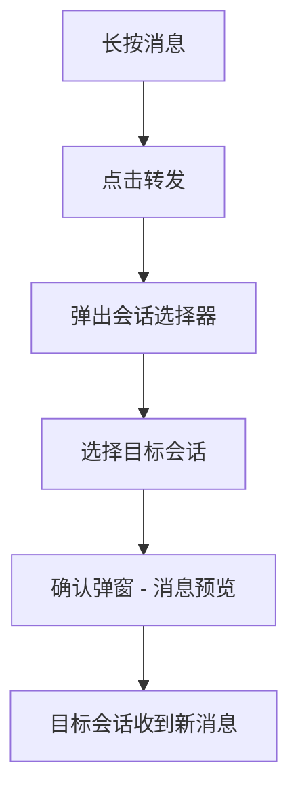
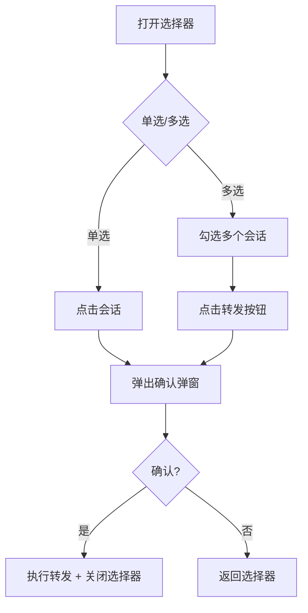
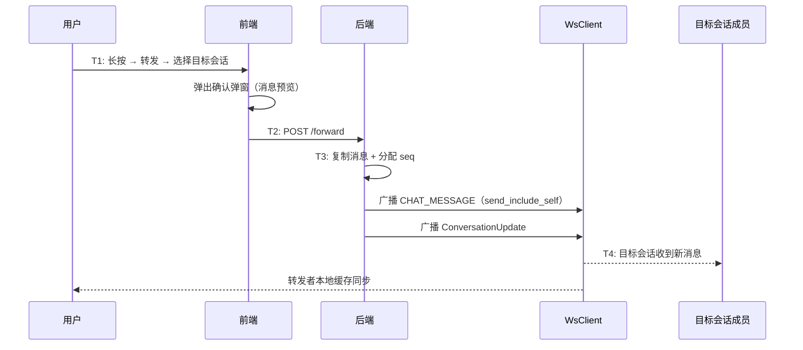

# 消息转发 — 功能分析

## 概述

闪讯的消息目前只能在当前会话里操作（撤回、删除、引用回复）。本版补齐跨会话的消息转发能力：用户可以将单条消息转发到其他会话。

核心目标：
- 单条消息转发到其他会话
- 会话选择器：独立页面，展示最近会话，支持搜索和单选/多选切换

核心挑战：
- 会话选择器是一个独立页面，需要展示最近会话列表，支持搜索和多选
- 转发确认弹窗需要在选择器内弹出（onConfirmAsync），确认后才 pop
- 转发后端用 `send_include_self`（不排除发送者），确保转发者本地缓存同步

---

## 一、交互链

### 场景 1：单条消息转发

**用户故事**：作为用户，我想把一条消息转发给另一个人或群。

长按消息 → 点击"转发" → 弹出会话选择器 → 选择目标会话 → 确认转发（含消息预览）→ 目标会话收到新消息。

转发的本质是"复制消息内容到另一个会话重新发送"。不是"共享引用"——转发后的消息和原消息没有关联，原消息被撤回不影响转发后的副本。

### 场景 2：会话选择器

**用户故事**：作为用户，我想快速找到要转发的目标会话。

选择器默认单选模式（点击直接触发确认），右上角可切换多选模式。确认弹窗内展示消息预览（文本/图片/视频/文件），确认后才执行转发并关闭选择器。

---

## 二、逻辑树

### 事件流：消息转发

| 时刻 | 事件 | 处理 |
|------|------|------|
| T1 | 用户选择转发 | 打开会话选择器 |
| T2 | 选择目标会话 + 确认 | 调用转发 API |
| T3 | 后端处理 | 复制消息内容 + 分配新 seq + 存储 + WS 推送（send_include_self） |
| T4 | 目标会话收到消息 | 正常的 CHAT_MESSAGE 帧处理 |

### 设计决策

| 决策 | 方案 | 理由 |
|------|------|------|
| 转发方式 | 单条复制重新发送 | 转发后的消息独立于原消息，原消息撤回不影响副本 |
| 转发 API | HTTP POST（不是 WS） | 需要后端校验权限和目标会话有效性 |
| 广播方式 | send_include_self | 转发者自己也需要收到推送，确保本地缓存同步 |
| 确认弹窗 | 选择器内 onConfirmAsync | 避免时序问题，用户看到预览再确认 |
| 会话选择器 | 复用 MemberPickerPage（PickerSelectMode 切换） | 统一选人组件，减少重复代码 |

---

## 三、功能编号与网络定位

### 本次新增节点

| 编号 | 功能节点 | 层级 | 简介 |
|------|---------|------|------|
| D-41 | 消息转发 | 领域 | POST /forward + 复制消息 + WS 推送 |
| P-54 | 会话选择器 | 前端业务 | 转发目标选择页面（最近会话 + 搜索 + 单选/多选） |
| P-55 | 消息转发 | 前端业务 | 单条转发流程 + 确认弹窗 |

### 扩展节点

| 编号 | 扩展内容 |
|------|---------|
| I-06 | ws.proto 新增 FORWARD 消息类型（type=5） |
| D-06 | messages 表新增 type=5（FORWARD） |
| P-48 | 长按菜单新增"转发"选项 |

### 前置依赖

| 依赖节点 | 依赖方式 | 是否已有 |
|----------|---------|---------|
| D-06 消息存储 | 转发写入新消息 | ✅ |
| D-08 消息广播 | 转发后推送 | ✅ |
| P-48 长按菜单 | 新增转发选项 | ✅ |

### 边界接口

| 接口/协议 | 定义方 | 消费方 | 说明 |
|-----------|--------|--------|------|
| POST /conversations/{id}/messages/forward | D-41 | P-55 | 单条转发 |

---

## 四、结论

- **开发顺序**：proto 扩展（FORWARD 类型）→ 后端转发接口 → 会话选择器 → 转发流程集成
- **复杂度集中点**：
  - 会话选择器是独立页面，复用 MemberPickerPage 但需要扩展 selectMode / onConfirmAsync / actions 参数
  - 确认弹窗的时序：必须在选择器内弹出，确认后才 pop，避免页面跳转混乱
- **和已有架构的关系**：转发复用消息发送链路（分配 seq + 广播），长按菜单在上一章已打好基础，直接扩展
