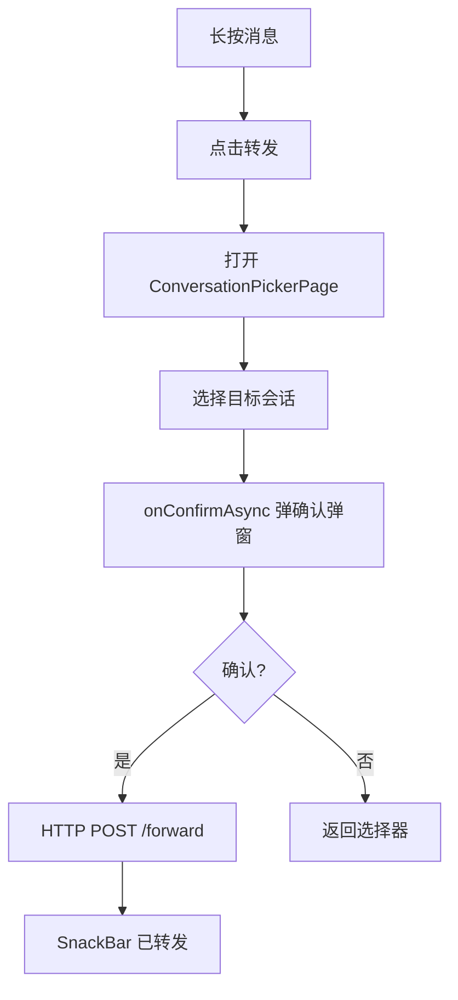

# 消息转发 — 客户端设计报告

> 关联设计：[功能分析](../analysis.md) · [服务端设计](../server/design.md)

## 1. 目标

- 消息转发：单条转发，通过会话选择器选择目标
- 会话选择器：复用 MemberPickerPage，展示最近会话，支持搜索
- 转发确认弹窗：在选择器内弹出（onConfirmAsync），含消息预览，确认后才 pop
- 长按菜单扩展：新增"转发"选项

## 2. 现状分析

### 已有能力

- 长按菜单（MessageActionMenu）已实现，支持动态菜单项过滤
- ChatCubit 管理消息状态
- MessageRepository 有 HTTP 请求封装
- MemberPickerPage 已有基础选人功能

### 缺失

- 没有会话选择器页面
- MemberPickerPage 不支持 selectMode / onConfirmAsync / actions 参数

## 3. 核心流程

### 转发流程



## 4. 项目结构与技术决策

### 文件结构

```
flash_im_chat/lib/src/
├── data/
│   └── message_repository.dart       # 修改：新增 forwardMessage
├── logic/
│   └── chat_cubit.dart               # 修改：新增 forwardMessages 方法
├── view/
│   ├── chat_page.dart                # 修改：转发菜单处理
│   ├── message_action_menu.dart      # 修改：新增 forward 菜单项
│   └── conversation_picker_page.dart # 新建：会话选择器

flash_shared/lib/src/
│   └── member_picker_page.dart       # 修改：新增 selectMode / onConfirmAsync / actions
```

### 技术决策

| 决策 | 方案 | 理由 |
|------|------|------|
| 会话选择器 | 复用 MemberPickerPage（PickerSelectMode.single/multi 切换） | 统一选人组件，右上角切换单选/多选 |
| 确认弹窗 | onConfirmAsync 回调 | 在选择器内弹出，确认后才 pop，避免时序问题 |
| 消息预览 | previewBuilder 延迟构建 | 复用气泡组件渲染预览 |
| MemberPickerPage 扩展 | 新增 selectMode / showIndexBar / onConfirmAsync / actions 参数 | 通用选人组件支持更多场景 |

### MemberPickerPage 扩展参数

| 参数 | 类型 | 说明 |
|------|------|------|
| selectMode | PickerSelectMode | 单选（点击直接返回）或多选（勾选 + 确认） |
| showIndexBar | bool | 是否显示右侧字母索引栏 |
| onConfirmAsync | Future\<bool\> Function(result) | 异步确认回调，返回 true 才 pop |
| actions | List\<Widget\> | AppBar 右侧额外操作按钮 |

## 5. 验收标准

| 验收条件 | 验收方式 |
|----------|----------|
| 单条转发成功 | 长按 → 转发 → 选择会话 → 确认 → 目标会话出现消息 |
| 会话选择器展示正确 | 最近会话列表 + 搜索 |
| 单选/多选切换 | 右上角按钮切换模式 |
| 确认弹窗含消息预览 | 文本/图片/视频/文件预览正确 |
| flutter analyze 通过 | 零错误 |

## 6. 暂不实现

| 功能 | 理由 |
|------|------|
| 合并转发 | 复杂度高，后续版本考虑 |
| 转发来源标注 | 当前版本转发后看起来是普通消息 |
