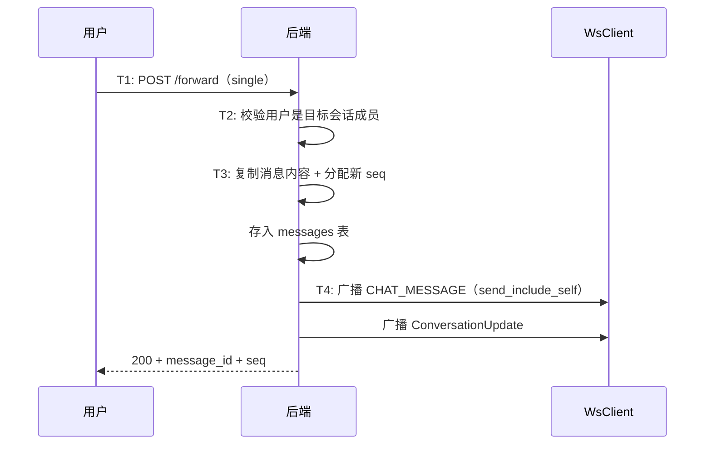

# 消息转发 — 服务端设计报告

> 关联设计：[功能分析](../analysis.md)

## 1. 目标

- 新增消息转发接口：POST /forward，支持单条转发
- 新增 FORWARD 消息类型（type=5）
- 转发使用 send_include_self 广播，确保转发者本地缓存同步

## 2. 现状分析

### 已有能力

- messages 表有 type 字段（0=文本, 1=图片, 2=视频, 3=文件），可扩展 5=转发
- messages 表有 extra JSONB 字段
- MessageService 有 broadcast_message 方法
- conversation_members 表可查询会话成员

### 缺失

- 没有转发接口
- proto 没有 FORWARD 消息类型

## 3. 数据模型与接口

### proto 扩展

```protobuf
// message.proto
enum MessageType {
  // ... 已有 0~4
  FORWARD = 5;
}
```

### 接口契约

**转发消息**

```
POST /conversations/{conv_id}/messages/forward
Authorization: Bearer {token}
```

请求体：

```json
{
  "message_ids": ["uuid1"],
  "target_conversation_id": "uuid",
  "forward_type": "single"
}
```

| 字段 | 说明 |
|------|------|
| message_ids | 要转发的消息 ID 列表（单条转发只有 1 个） |
| target_conversation_id | 目标会话 ID |
| forward_type | "single"（逐条转发） |

响应（200）：

```json
{
  "message_id": "新消息的 UUID",
  "seq": 123
}
```

错误响应：

| 状态码 | 场景 |
|--------|------|
| 404 | 源消息不存在 |
| 403 | 用户不是目标会话成员 |
| 400 | message_ids 为空 |

## 4. 核心流程



## 5. 项目结构与技术决策

### 文件结构

```
server/modules/im-message/src/
├── routes.rs          # 修改：新增 forward 路由
├── service.rs         # 修改：新增 forward_message 方法
├── repository.rs      # 修改：查询源消息
└── broadcast.rs       # 修改：send_include_self 广播
```

### 技术决策

| 决策 | 方案 | 理由 |
|------|------|------|
| 转发实现 | 复制消息内容重新插入，用 send_include_self 广播 | 转发者自己也需要收到消息推送，确保本地缓存同步 |
| 转发 API | HTTP POST | 需要后端校验权限和目标会话有效性 |
| sender_id | 改为转发者 | 转发后的消息发送者是转发者，不是原始发送者 |

## 6. 验收标准

| 验收条件 | 验收方式 |
|----------|----------|
| 单条转发成功 | POST /forward + 目标会话查询到新消息 |
| 转发到非成员会话失败（403） | HTTP 请求 |
| 转发者本地收到推送 | WS 监听验证 |

## 7. 暂不实现

| 功能 | 理由 |
|------|------|
| 转发消息的"来源标注" | 当前版本转发后看起来是普通消息 |
| 合并转发 | 复杂度高，后续版本考虑 |
