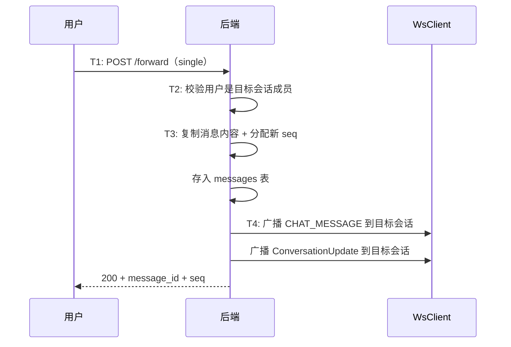
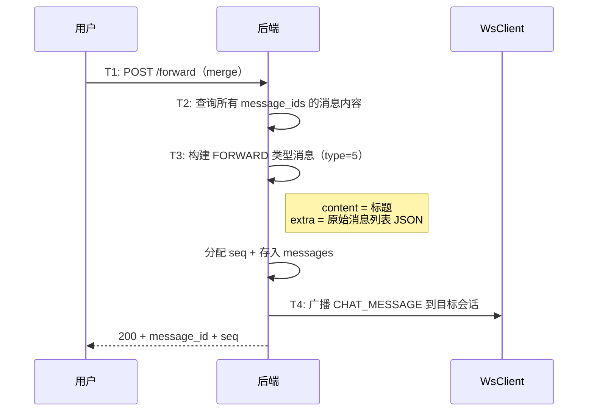
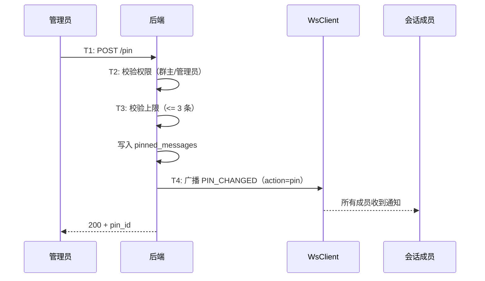

# 消息转发与@提及与置顶 — 服务端设计报告

> 关联设计：[功能分析](../analysis.md)

## 1. 目标

- 新增消息转发接口：POST /forward，支持单条和多条（合并转发）
- 新增消息置顶接口：POST /pin、DELETE /pin/{id}、GET /pinned
- 新增 PIN_CHANGED WS 帧类型，置顶/取消置顶时广播
- 新增 FORWARD 消息类型（type=5），合并转发的消息体
- @提及不需要后端特殊处理（复用 extra JSONB 透传），但 ConversationUpdate 需要携带 mention 信息
- 新建 pinned_messages 表

## 2. 现状分析

### 已有能力

- messages 表有 type 字段（0=文本, 1=图片, 2=视频, 3=文件），可扩展 5=转发
- messages 表有 extra JSONB 字段，@提及的 mentions 数组直接存入
- im-ws dispatcher 有帧广播能力（MESSAGE_RECALLED 已验证）
- MessageService 有 broadcast_message 方法
- conversation_members 表可查询会话成员（@提及权限校验用）
- 群成员有 role 字段（owner/admin/member），可用于置顶权限校验

### 缺失

- 没有转发接口
- 没有 pinned_messages 表
- proto 没有 PIN_CHANGED 帧类型和 FORWARD 消息类型
- ConversationUpdate 帧没有携带 mention 信息的字段

## 3. 数据模型与接口

### 数据模型

**pinned_messages 表**：

```sql
CREATE TABLE pinned_messages (
    id UUID PRIMARY KEY DEFAULT gen_random_uuid(),
    conversation_id UUID NOT NULL REFERENCES conversations(id),
    message_id UUID NOT NULL REFERENCES messages(id),
    pinned_by BIGINT NOT NULL,
    pinned_at TIMESTAMPTZ NOT NULL DEFAULT NOW(),
    UNIQUE(conversation_id, message_id)
);

CREATE INDEX idx_pinned_messages_conv ON pinned_messages(conversation_id);
```

| 决策 | 理由 |
|------|------|
| 独立表而非 messages 加字段 | 置顶是会话级别的元数据，不是消息本身的属性。一条消息可以在多个会话被转发后分别置顶 |
| UNIQUE(conversation_id, message_id) | 同一条消息在同一会话只能置顶一次 |
| pinned_by 记录操作者 | 审计需要，知道谁置顶的 |

**proto 扩展**：

```protobuf
// ws.proto
enum WsFrameType {
  // ... 已有 0~16
  PIN_CHANGED = 17;
}

// message.proto
enum MessageType {
  // ... 已有 0~4
  FORWARD = 5;
}

message PinChangedNotification {
  string conversation_id = 1;
  string message_id = 2;
  string action = 3;       // "pin" 或 "unpin"
  string pinned_by = 4;
}
```

**ConversationUpdate 扩展**：

现有的 ConversationUpdate 帧新增 `last_message_extra` 字段（string，JSON），用于传递 mentions 信息给会话列表：

```protobuf
message ConversationUpdate {
  // ... 已有字段 1~5
  string last_message_extra = 6;  // 新增：JSON 字符串，含 mentions 等
}
```

### 接口契约

**转发消息**

```
POST /conversations/{conv_id}/messages/forward
Authorization: Bearer {token}
```

请求体：

```json
{
  "message_ids": ["uuid1"],
  "target_conversation_id": "uuid",
  "forward_type": "single"
}
```

| 字段 | 说明 |
|------|------|
| message_ids | 要转发的消息 ID 列表（单条转发只有 1 个） |
| target_conversation_id | 目标会话 ID |
| forward_type | "single"（逐条转发）或 "merge"（合并转发） |

响应（200）：

```json
{
  "message_id": "新消息的 UUID",
  "seq": 123
}
```

错误响应：

| 状态码 | 场景 |
|--------|------|
| 404 | 源消息不存在 |
| 403 | 用户不是目标会话成员 |
| 400 | message_ids 为空 |

---

**置顶消息**

```
POST /conversations/{conv_id}/messages/pin
Authorization: Bearer {token}
```

请求体：

```json
{
  "message_id": "uuid"
}
```

响应（200）：

```json
{
  "pin_id": "uuid",
  "pinned_at": "2026-05-08T10:00:00Z"
}
```

错误响应：

| 状态码 | 场景 |
|--------|------|
| 403 | 非群主/管理员 |
| 400 | 已置顶 / 超过 3 条上限 |
| 404 | 消息不存在 |

---

**取消置顶**

```
DELETE /conversations/{conv_id}/messages/pin/{pin_id}
Authorization: Bearer {token}
```

响应（200）：`{"message": "ok"}`

错误响应：403（非群主/管理员）、404（pin_id 不存在）

---

**查询置顶列表**

```
GET /conversations/{conv_id}/messages/pinned
Authorization: Bearer {token}
```

响应（200）：

```json
[
  {
    "pin_id": "uuid",
    "message_id": "uuid",
    "content": "消息内容",
    "msg_type": 0,
    "sender_name": "张三",
    "pinned_by": "1",
    "pinned_at": "2026-05-08T10:00:00Z"
  }
]
```

## 4. 核心流程

**单条转发**：



**合并转发**：



**消息置顶**：



## 5. 项目结构与技术决策

### 文件结构

```
server/modules/im-message/src/
├── routes.rs          # 修改：新增 forward、pin、unpin、get_pinned 路由
├── service.rs         # 修改：新增 forward_message、pin_message 等方法
├── repository.rs      # 修改：新增 pinned_messages CRUD
├── models.rs          # 修改：新增 PinnedMessage 结构体
└── broadcast.rs       # 修改：新增 broadcast_pin_changed
```

### 技术决策

| 决策 | 方案 | 理由 |
|------|------|------|
| 转发实现 | 复制消息内容重新插入 | 转发后的消息独立于原消息，简单可靠 |
| 合并转发存储 | type=5 + extra 存原始消息 JSON | 复用 extra JSONB，不加新表 |
| 合并转发 extra 大小 | 限制最多 20 条消息 | 防止 extra 过大 |
| @提及后端处理 | 透传 extra.mentions，ConversationUpdate 携带 last_message_extra | 后端不解析 mentions 内容，只负责传递 |
| 置顶权限 | 查 conversation_members.role | 复用已有的角色字段 |
| 置顶上限 | 应用层校验 COUNT <= 3 | 简单，不需要数据库约束 |

## 6. 验收标准

| 验收条件 | 验收方式 |
|----------|----------|
| 单条转发成功 | POST /forward + 目标会话查询到新消息 |
| 合并转发成功 | POST /forward（merge）+ 目标会话查询到 type=5 消息 |
| 转发到非成员会话失败（403） | HTTP 请求 |
| 置顶成功 | POST /pin + GET /pinned 返回 |
| 置顶超过 3 条失败（400） | HTTP 请求 |
| 非管理员置顶失败（403） | HTTP 请求 |
| 取消置顶成功 | DELETE /pin + GET /pinned 不再包含 |
| PIN_CHANGED WS 广播 | 两端连接验证 |
| @提及消息正常存储 | 发送含 mentions 的消息 + 查询 extra 正确 |
| ConversationUpdate 携带 mention | WS 监听验证 |

## 7. 暂不实现

| 功能 | 理由 |
|------|------|
| 转发消息的"来源标注" | 微信有"转发自 XXX"标识，当前版本不做，转发后的消息看起来就是普通消息 |
| @提及推送通知 | 需要推送服务（FCM/APNs），当前版本只做会话列表红色提示 |
| 置顶消息编辑 | 置顶后不能修改内容，只能取消重新置顶 |
| 跨会话置顶 | 置顶是会话级别的，不支持"全局置顶" |
