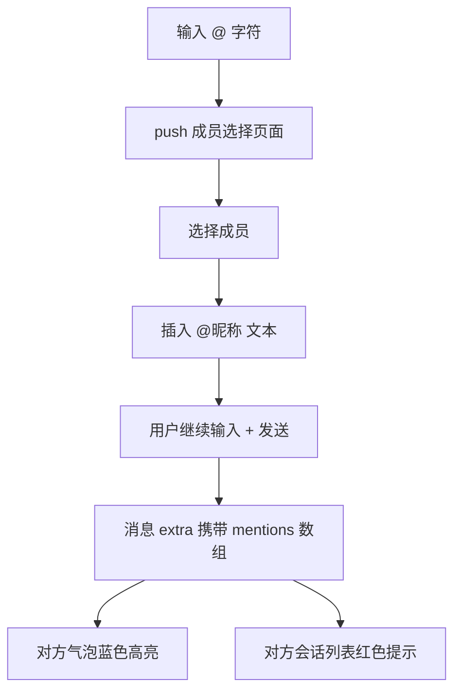
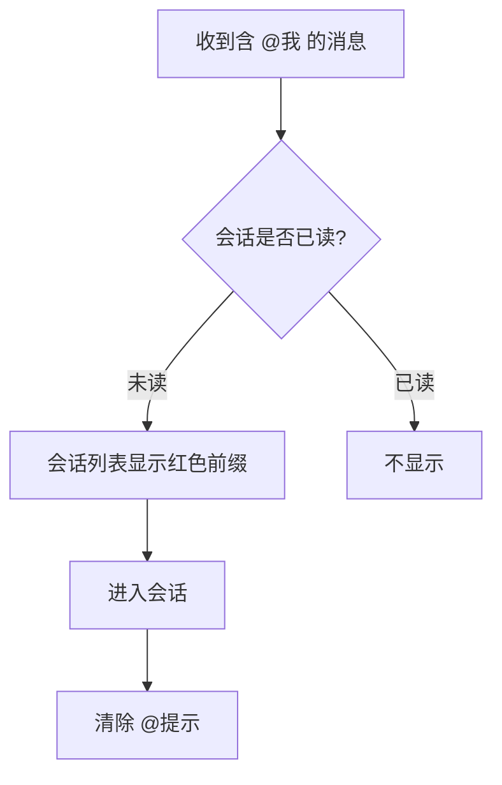
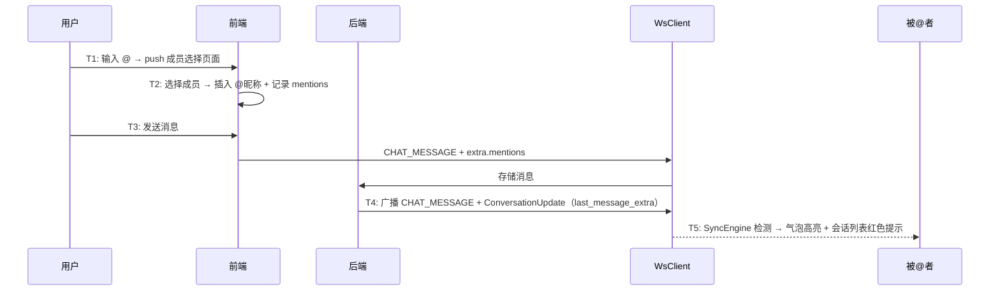

# @提及 — 功能分析

## 概述

群聊中用户需要 @ 某人或 @所有人，让对方注意到消息。被 @ 的人在会话列表看到红色提示，进入会话后气泡中 @文本 蓝色高亮。

核心目标：
- @提及输入：群聊输入框检测 @ 字符 → 弹出成员选择页面 → 插入 @昵称 文本 → 构建 mentions 数组
- @提及展示：消息气泡中 @文本 蓝色高亮（RichText）
- 会话列表提示：红色「[有人@我]」/「[@所有人]」前缀

核心挑战：
- 输入框检测 @ 字符后 push 成员选择页面，选择后插入特殊格式文本，维护 offset/length 映射
- 会话列表的 @提示需要 SyncEngine 检测 mentions + ConversationListCubit 维护 MentionMeRecord 列表
- 需要区分 @我 和 @所有人，优先显示 @我
- @所有人列表首项，品牌蓝背景 + 群组图标，quickSelectIds 点击直接返回

---

## 一、交互链

### 场景 1：@提及（群聊）

**用户故事**：作为群成员，我想 @ 某人让他注意到我的消息。

在输入框输入 `@` 字符 → push 成员选择页面 → 选择成员（或"所有人"）→ 输入框插入 `@昵称 ` 文本 → 发送消息。



### 场景 2：@所有人

**用户故事**：作为群成员，我想 @所有人 发布重要通知。

和 @某人 流程相同，但选择"所有人"选项（列表首项，品牌蓝背景 + 群组图标）。点击"所有人"后直接返回（quickSelectIds），不需要确认按钮。

extra.mentions 里 user_id 为特殊值 `"all"`。所有群成员的会话列表都显示红色提示。

### 场景 3：被@者的体验

**用户故事**：作为被@的人，我想快速知道谁@了我。

- 会话列表：未读时显示红色前缀
  - 有 @我 → `[有人@我]`（多条时 `[有人@我×3]`）
  - 只有 @所有人 → `[@所有人]`
  - 同时有 @我 和 @所有人 → 优先显示 `[有人@我]`
- 进入会话后清除 @提示
- 气泡中 @文本 蓝色高亮



---

## 二、逻辑树

### 事件流：@提及

| 时刻 | 事件 | 处理 |
|------|------|------|
| T1 | 用户输入 @ | push 成员选择页面 |
| T2 | 选择成员 | 插入 @昵称 文本，记录 offset/length |
| T3 | 发送消息 | content 含 @文本，extra 含 mentions 数组 |
| T4 | 后端存储 + 广播 | 正常存储，ConversationUpdate 携带 last_message_extra |
| T5 | 被@者收到 | SyncEngine 检测 mentions → 通知 ConversationListCubit |



### @数据存储格式

```json
{
  "mentions": [
    {"user_id": "1", "offset": 0, "length": 4},
    {"user_id": "all", "offset": 5, "length": 4}
  ]
}
```

- content 里包含 `@张三 ` 这样的文本（用户可见）
- extra.mentions 用于前端精确定位高亮范围
- user_id="all" 表示 @所有人

### 设计决策

| 决策 | 方案 | 理由 |
|------|------|------|
| @存储 | content 含 @文本 + extra 含 mentions 数组 | content 保证无 extra 时也能看到 @文本，mentions 用于精确高亮 |
| @选择界面 | push MemberPickerPage（quickSelectIds 支持"所有人"快速返回） | 复用已有选人组件 |
| @所有人权限 | 前端控制（不显示选项），后端透传 | 简化后端逻辑 |
| @高亮 | RichText + TextSpan | 精确控制每段文字的样式 |
| @会话列表提示 | SyncEngine 检测 mentions + ConversationListCubit 维护 MentionMeRecord 列表 | 结构化记录，区分 @我/@所有人 |
| @后端处理 | 透传 extra，ConversationUpdate 携带 last_message_extra | 后端不解析 mentions 内容 |

---

## 三、功能编号与网络定位

### 本次新增节点

| 编号 | 功能节点 | 层级 | 简介 |
|------|---------|------|------|
| P-56 | @提及输入 | 前端业务 | 输入框 @ 触发 + 成员选择 + mentions 构建 |
| P-57 | @提及展示 | 前端业务 | 气泡蓝色高亮 + 会话列表红色提示 |

### 扩展节点

| 编号 | 扩展内容 |
|------|---------|
| P-07 | sendMessage 支持 extra.mentions |
| I-06 | ConversationUpdate 新增 last_message_extra 字段 |

### 前置依赖

| 依赖节点 | 依赖方式 | 是否已有 |
|----------|---------|---------|
| D-23 群成员查询 | @提及获取成员列表 | ✅ |
| P-07 消息发送 | extra 携带 mentions | ✅ |

### 边界接口

| 接口/协议 | 定义方 | 消费方 | 说明 |
|-----------|--------|--------|------|
| extra.mentions | P-56 | P-57 | @提及数据传递 |
| ConversationUpdate.last_message_extra | 后端 | SyncEngine | 会话列表 @提示 |

---

## 四、结论

- **开发顺序**：ConversationUpdate proto 扩展 → 后端 last_message_extra 透传 → ChatInput @检测 → MentionPicker → TextBubble @高亮 → 会话列表@提示
- **复杂度集中点**：
  - 输入体验：检测 @ 字符 → push 选择页面 → 选择后插入文本 → 维护 offset/length 映射
  - 展示：RichText + TextSpan 精确高亮
  - 会话列表：SyncEngine 检测 + MentionMeRecord 结构化记录 + 优先级显示
- **和已有架构的关系**：复用 extra JSONB 扩展点，复用 MemberPickerPage（quickSelectIds），SyncEngine 已有 chatMessageStream 监听
