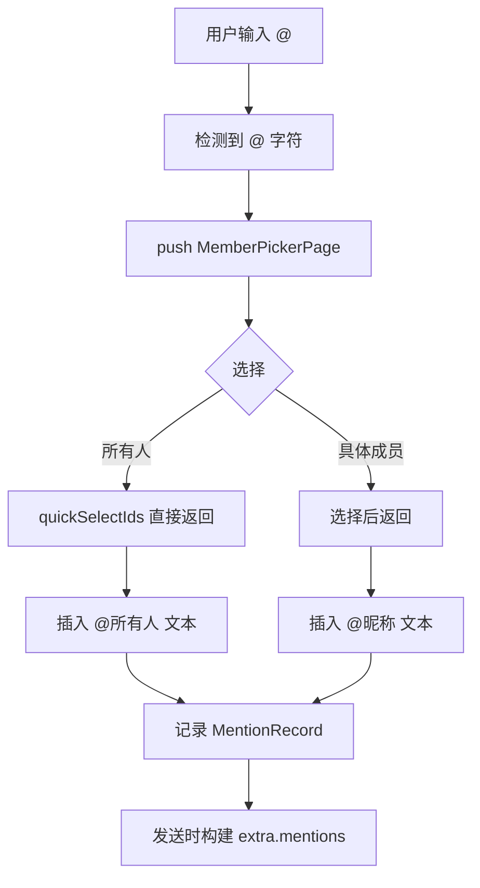
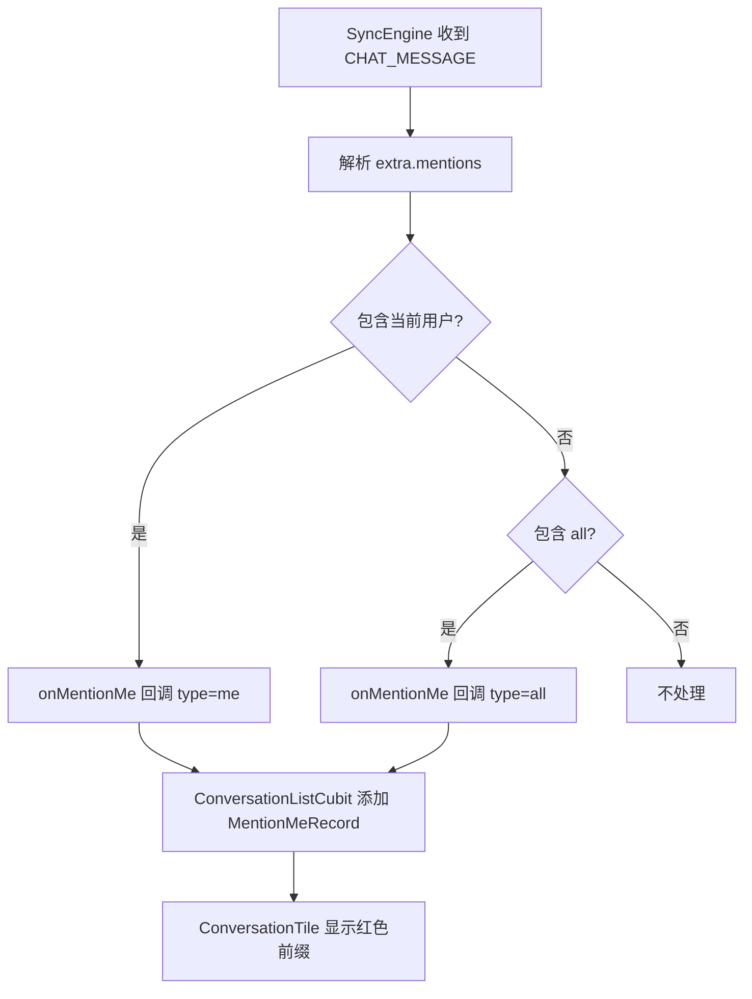

# @提及 — 客户端设计报告

> 关联设计：[功能分析](../analysis.md) · [服务端设计](../server/design.md)

## 1. 目标

- @提及输入：群聊输入框检测 @ 字符 → push 成员选择页面 → 插入 @昵称 文本 → 构建 mentions 数组
- @提及展示：消息气泡中 @文本 蓝色高亮（RichText）
- 会话列表提示：红色「[有人@我]」/「[@所有人]」前缀
- @所有人：MemberPickerPage 列表首项，品牌蓝背景 + 群组图标，quickSelectIds 点击直接返回

## 2. 现状分析

### 已有能力

- ChatInput 有 TextEditingController
- MemberPickerPage 已有 quickSelectIds 支持
- SyncEngine 已有 chatMessageStream 监听
- ConversationListCubit 管理会话列表状态

### 缺失

- ChatInput 没有 @ 检测
- TextBubble 没有 @文本高亮渲染
- SyncEngine 没有 mentions 检测
- ConversationListCubit 没有 MentionMeRecord 维护
- 会话列表没有"有人@我"标识

## 3. 数据模型

### MentionMeRecord 结构体

```dart
enum MentionType { me, all }

class MentionMeRecord {
  final String messageId;
  final MentionType type;
}
```

### extra.mentions 格式

```json
{
  "mentions": [
    {"user_id": "1", "offset": 0, "length": 4},
    {"user_id": "all", "offset": 5, "length": 4}
  ]
}
```

### Conversation 扩展

```dart
class Conversation {
  // ... 已有字段
  final List<MentionMeRecord> mentionMeRecords; // 未读的 @我 消息记录
}
```

## 4. 核心流程

### @输入流程



### @展示流程

```mermaid
flowchart TD
    A[收到含 mentions 的消息] --> B[TextBubble 解析 mentions]
    B --> C[RichText 分段渲染]
    C --> D[普通文本黑色]
    C --> E[@文本蓝色高亮]
```

### 会话列表@提示流程



## 5. 项目结构与技术决策

### 文件结构

```
flash_im_chat/lib/src/
├── view/
│   ├── chat_input.dart           # 修改：@ 检测 + membersFetcher + mentions 构建
│   ├── mention_picker.dart       # 新建：MentionMember 模型（轻量）
│   └── bubble/
│       └── text_bubble.dart      # 修改：RichText 渲染 mentions 高亮

flash_im_cache/lib/src/
│   └── sync_engine.dart          # 修改：检测 @我 + onMentionMe 回调

flash_im_conversation/lib/src/
├── data/
│   └── conversation.dart         # 修改：新增 MentionMeRecord + MentionType
├── view/
│   └── conversation_tile.dart    # 修改：展示 @提示前缀
└── logic/
    └── conversation_list_cubit.dart  # 修改：维护 mentionMeMap
```

### 技术决策

| 决策 | 方案 | 理由 |
|------|------|------|
| @检测 | TextEditingController.addListener 监听文本变化 | 检测最后输入的字符是否为 @ |
| @选择界面 | push MemberPickerPage（quickSelectIds 支持"所有人"快速返回） | 复用已有选人组件 |
| @所有人 UI | 列表首项，品牌蓝背景 + 群组图标，letter='!' 无 section header | 视觉突出 + 快速操作 |
| @高亮 | RichText + TextSpan，蓝色 #3B82F6 + FontWeight.w500 | 精确控制每段文字的样式 |
| @会话列表提示 | MentionMeRecord 结构体，区分 me/all | 支持优先级显示和数量统计 |
| @提示清除 | 进入会话时 clearMentionMe(convId) | 和微信行为一致 |

## 6. 验收标准

| 验收条件 | 验收方式 |
|----------|----------|
| @输入触发选择页面 | 群聊输入 @ → 成员列表弹出 |
| @所有人点击直接返回 | 点击"所有人" → 立即插入文本 |
| @选择后插入文本 | 选择成员 → 输入框出现 @昵称 |
| @高亮展示 | 收到含 mentions 的消息 → 蓝色高亮 |
| 会话列表@提示 | 被@后会话列表显示红色前缀 |
| @我优先显示 | 同时有 @我 和 @所有人 → 显示 [有人@我] |
| 进入会话清除提示 | 进入被@的会话 → 红色前缀消失 |
| flutter analyze 通过 | 零错误 |

## 7. 暂不实现

| 功能 | 理由 |
|------|------|
| @推送通知 | 需要 FCM/APNs，当前只做会话列表红色提示 |
| @跳转定位 | 需要 ScrollController 精确定位，后续版本做 |
