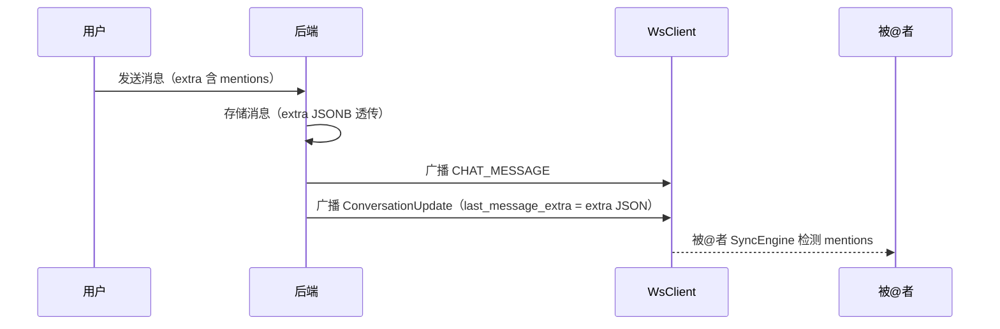

# @提及 — 服务端设计报告

> 关联设计：[功能分析](../analysis.md)

## 1. 目标

- @提及不需要后端特殊处理（复用 extra JSONB 透传）
- ConversationUpdate 帧需要携带 last_message_extra 字段，传递 mentions 信息给会话列表
- 新增 ConversationUpdate proto 字段

## 2. 现状分析

### 已有能力

- messages 表有 extra JSONB 字段，mentions 数组直接存入
- im-ws dispatcher 有帧广播能力
- ConversationUpdate 帧已有 conversation_id / last_message_preview / last_message_at 等字段

### 缺失

- ConversationUpdate 帧没有携带 mention 信息的字段

## 3. 数据模型与接口

### proto 扩展

```protobuf
message ConversationUpdate {
  // ... 已有字段 1~5
  string last_message_extra = 6;  // 新增：JSON 字符串，含 mentions 等
}
```

### 接口契约

无新增 HTTP 接口。@提及的数据通过消息发送接口的 extra 字段透传。

后端在广播 ConversationUpdate 时，如果消息的 extra 包含 mentions，将 extra JSON 字符串填入 `last_message_extra` 字段。

## 4. 核心流程



## 5. 项目结构与技术决策

### 文件结构

```
server/modules/im-message/src/
├── broadcast.rs       # 修改：ConversationUpdate 填充 last_message_extra

proto/
├── ws.proto           # 修改：ConversationUpdate 新增 last_message_extra 字段
```

### 技术决策

| 决策 | 方案 | 理由 |
|------|------|------|
| @提及后端处理 | 透传 extra.mentions | 后端不解析 mentions 内容，只负责存储和传递 |
| ConversationUpdate 扩展 | 新增 last_message_extra 字段 | 会话列表需要知道最后一条消息是否含 @我 |

## 6. 验收标准

| 验收条件 | 验收方式 |
|----------|----------|
| @提及消息正常存储 | 发送含 mentions 的消息 + 查询 extra 正确 |
| ConversationUpdate 携带 last_message_extra | WS 监听验证 |

## 7. 暂不实现

| 功能 | 理由 |
|------|------|
| @提及推送通知 | 需要推送服务（FCM/APNs），当前只做会话列表红色提示 |
| @所有人后端权限校验 | 前端控制，后端透传 |
