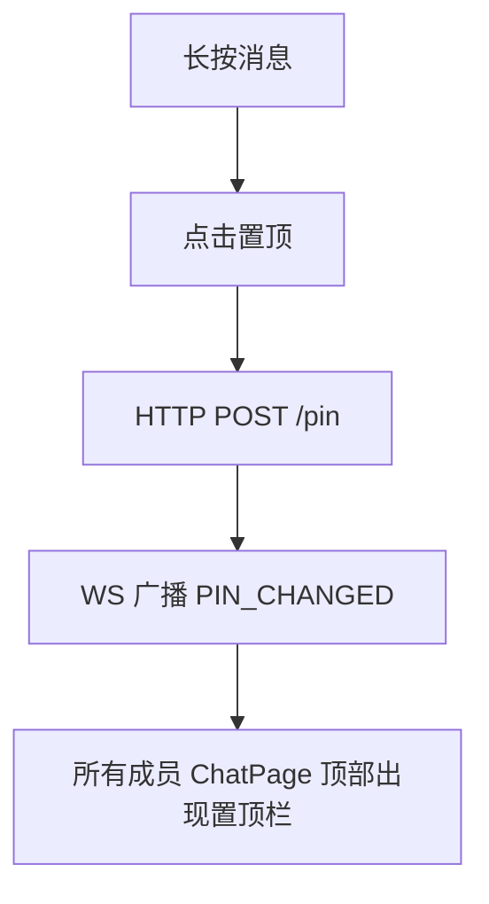
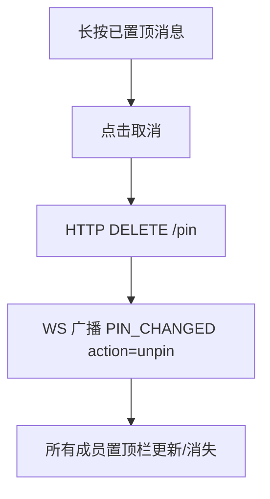
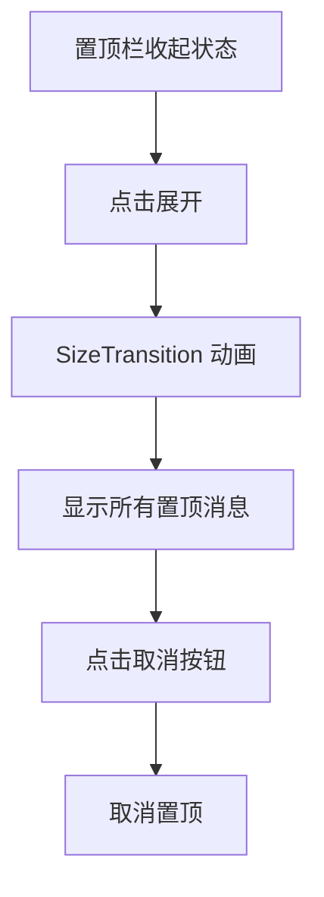
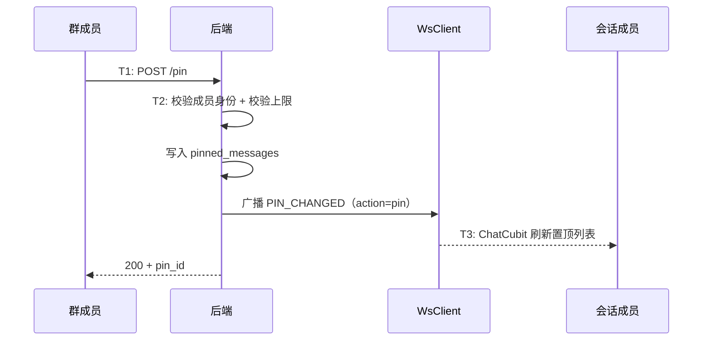
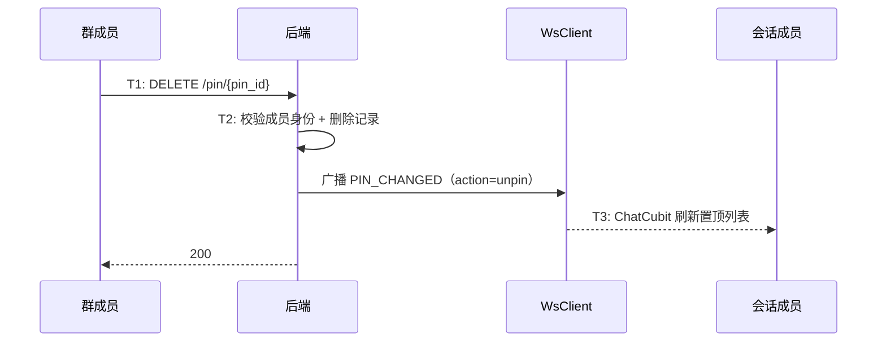

# 消息置顶 — 功能分析

## 概述

群聊中需要将重要消息置顶，让所有成员进入聊天页就能看到。本版实现消息置顶/取消置顶功能，ChatPage 顶部常驻展示置顶消息栏。

核心目标：
- 任何群成员可以置顶/取消置顶消息
- ChatPage 顶部置顶消息栏（点击展开动画）
- PIN_CHANGED WS 帧实时通知所有会话成员
- 每个会话最多 3 条置顶消息

核心挑战：
- 新建 pinned_messages 表，独立于 messages 表
- PIN_CHANGED WS 帧广播机制
- 置顶栏 UI：SizeTransition 展开动画

---

## 一、交互链

### 场景 1：消息置顶

**用户故事**：作为群成员，我想把一条重要消息置顶，让所有人进群就能看到。

长按消息 → 点击"置顶" → 消息被置顶。ChatPage 顶部出现置顶消息栏，显示置顶内容摘要。

### 场景 2：取消置顶

**用户故事**：作为群成员，我想取消一条已置顶的消息。

方式一：长按已置顶消息 → 菜单显示"取消" → 点击取消置顶。
方式二：置顶栏展开后点击取消按钮。

### 场景 3：置顶栏交互

**用户故事**：作为群成员，我想查看所有置顶消息。

点击置顶栏 → SizeTransition 动画展开 → 显示所有置顶消息列表 → 每条可取消置顶。

---

## 二、逻辑树

### 事件流：消息置顶

| 时刻 | 事件 | 处理 |
|------|------|------|
| T1 | 群成员点击"置顶" | HTTP POST /pin |
| T2 | 后端处理 | 校验成员身份 + 写入 pinned_messages + WS 广播 |
| T3 | 所有成员收到 PIN_CHANGED | ChatCubit 刷新置顶列表 |

### 事件流：取消置顶

| 时刻 | 事件 | 处理 |
|------|------|------|
| T1 | 群成员点击"取消" | HTTP DELETE /pin/{id} |
| T2 | 后端处理 | 校验成员身份 + 删除记录 + WS 广播 |
| T3 | 所有成员收到 PIN_CHANGED | ChatCubit 刷新置顶列表 |

### 设计决策

| 决策 | 方案 | 理由 |
|------|------|------|
| 置顶权限 | 任何群成员 | 简化权限模型，后端校验成员身份即可 |
| 置顶上限 | 每会话最多 3 条 | 微信标准，防止置顶栏过长 |
| 置顶通知 | PIN_CHANGED WS 帧 | 实时通知所有成员 |
| 置顶数据 | 进入聊天页时 GET /pinned 加载 | 不缓存到本地，每次进入实时查询 |
| 置顶栏动画 | SizeTransition | 展开/收起平滑过渡 |
| 独立表 | pinned_messages | 置顶是会话级别的元数据，不是消息本身的属性 |

---

## 三、功能编号与网络定位

### 本次新增节点

| 编号 | 功能节点 | 层级 | 简介 |
|------|---------|------|------|
| D-42 | 消息置顶 | 领域 | POST/DELETE /pin + pinned_messages 表 + WS 广播 |
| F-18 | PIN_CHANGED WS 帧分发 | 前端基础 | WsClient 新增 pinChangedStream |
| P-58 | 消息置顶 | 前端业务 | 置顶栏 + 置顶/取消置顶操作 |

### 扩展节点

| 编号 | 扩展内容 |
|------|---------|
| I-06 | ws.proto 新增 PIN_CHANGED 帧类型（=17） |
| P-48 | 长按菜单新增"置顶"/"取消"选项 |

### 前置依赖

| 依赖节点 | 依赖方式 | 是否已有 |
|----------|---------|---------|
| I-08 在线用户管理 | 置顶广播 | ✅ |
| P-48 长按菜单 | 新增置顶选项 | ✅ |

### 边界接口

| 接口/协议 | 定义方 | 消费方 | 说明 |
|-----------|--------|--------|------|
| POST /conversations/{id}/messages/pin | D-42 | P-58 | 置顶消息 |
| DELETE /conversations/{id}/messages/pin/{pin_id} | D-42 | P-58 | 取消置顶 |
| GET /conversations/{id}/messages/pinned | D-42 | P-58 | 查询置顶列表 |
| PIN_CHANGED WS 帧 | D-42 | F-18 → P-58 | 置顶变更实时通知 |

---

## 四、结论

- **开发顺序**：proto 扩展（PIN_CHANGED）→ pinned_messages 表 → 后端置顶接口 → WsClient pinChangedStream → PinnedMessageBar → ChatCubit 置顶逻辑
- **复杂度集中点**：
  - 置顶栏 UI：SizeTransition 展开动画 + 多条置顶切换
  - PIN_CHANGED 实时监听：ChatCubit 订阅 + 自动刷新
- **和已有架构的关系**：复用 WS 帧广播机制（参考 MESSAGE_RECALLED），长按菜单直接扩展
