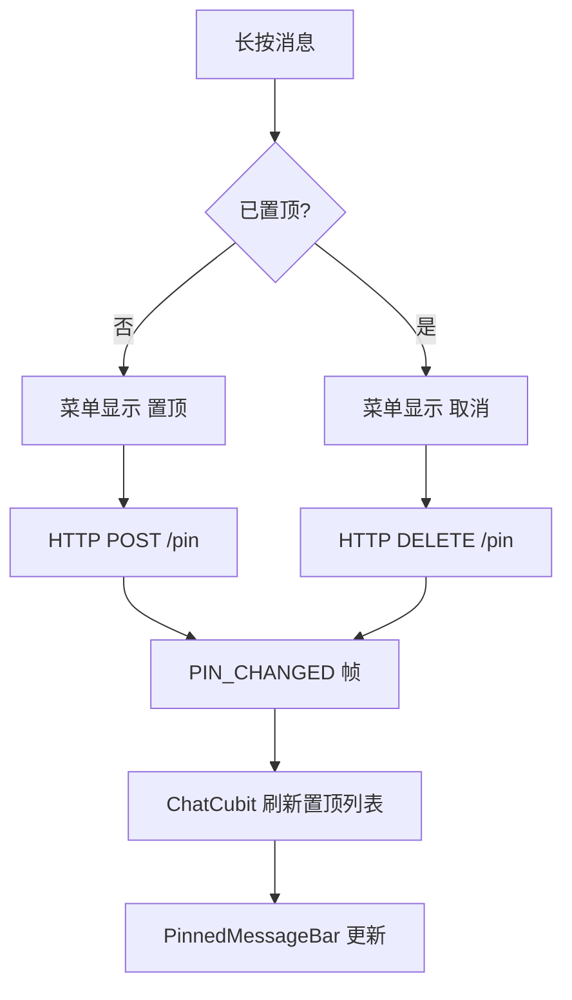
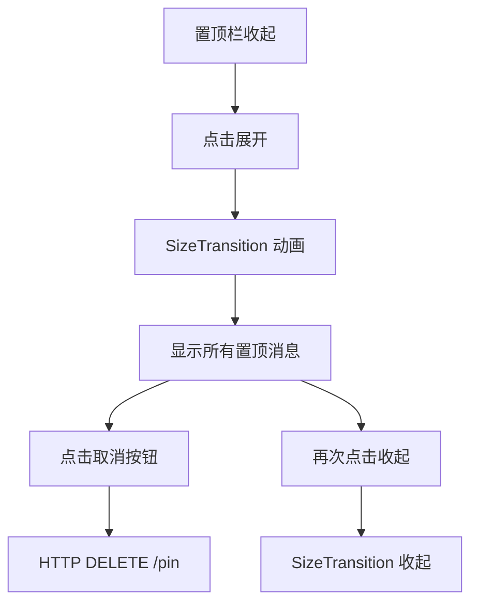

# 消息置顶 — 客户端设计报告

> 关联设计：[功能分析](../analysis.md) · [服务端设计](../server/design.md)

## 1. 目标

- ChatPage 顶部置顶消息栏（PinnedMessageBar）
- 置顶/取消置顶操作
- PIN_CHANGED 帧监听，实时更新置顶栏
- 长按菜单扩展：新增"置顶"/"取消"选项
- 置顶栏展开动画（SizeTransition）

## 2. 现状分析

### 已有能力

- ChatCubit 管理消息状态，有完整的 WS 帧监听机制
- WsClient 有帧分发机制（StreamController.broadcast）
- MessageRepository 有 HTTP 请求封装
- 长按菜单已实现

### 缺失

- WsClient 没有 pinChangedStream
- ChatPage 没有置顶消息栏
- ChatState 没有 pinnedMessages 字段

## 3. 数据模型

### PinnedMessage 模型

```dart
class PinnedMessage {
  final String pinId;
  final String messageId;
  final String content;
  final int msgType;
  final String senderName;
  final int pinnedBy;
  final DateTime pinnedAt;

  factory PinnedMessage.fromJson(Map<String, dynamic> json) => ...;
}
```

### ChatState 扩展

```dart
class ChatLoaded extends ChatState {
  // ... 已有字段
  final List<PinnedMessage> pinnedMessages;
}
```

## 4. 核心流程

### 置顶操作流程



### 置顶栏交互



## 5. 项目结构与技术决策

### 文件结构

```
flash_im_chat/lib/src/
├── data/
│   ├── message.dart              # 修改：新增 PinnedMessage 模型
│   └── message_repository.dart   # 修改：新增 pinMessage / unpinMessage / getPinnedMessages
├── logic/
│   ├── chat_cubit.dart           # 修改：置顶逻辑 + PIN_CHANGED 监听
│   └── chat_state.dart           # 修改：新增 pinnedMessages 字段
├── view/
│   ├── chat_page.dart            # 修改：置顶栏集成 + 菜单扩展
│   ├── message_action_menu.dart  # 修改：新增 pin/unpin 菜单项
│   └── pinned_message_bar.dart   # 新建：置顶消息栏

flash_im_core/lib/src/logic/
│   └── ws_client.dart            # 修改：新增 pinChangedStream
```

### 技术决策

| 决策 | 方案 | 理由 |
|------|------|------|
| 置顶栏动画 | SizeTransition + AnimationController | 参考企业微信风格，展开/收起平滑过渡 |
| 置顶栏样式 | 浅灰背景 + 内边距 + 下圆角 | 与群公告栏视觉统一 |
| 置顶数据 | 进入聊天页时 GET /pinned 加载 | 不缓存到本地，每次进入实时查询 |
| PIN_CHANGED 监听 | ChatCubit 订阅 pinChangedStream | 实时更新置顶栏 |
| 菜单判断 | _isMessagePinned 检查当前消息是否已置顶 | 动态显示"置顶"或"取消" |

## 6. 验收标准

| 验收条件 | 验收方式 |
|----------|----------|
| 置顶成功 | 长按 → 置顶 → 顶部出现置顶栏 |
| 取消置顶 | 长按已置顶消息 → 取消 → 置顶栏更新 |
| PIN_CHANGED 实时 | 其他成员实时看到置顶变化 |
| 展开动画 | 点击置顶栏 → SizeTransition 展开 |
| 展开后取消 | 展开列表中点击取消 → 置顶消失 |
| flutter analyze 通过 | 零错误 |

## 7. 暂不实现

| 功能 | 理由 |
|------|------|
| 置顶消息跳转定位 | 需要 ScrollController 精确定位到 seq，复杂度高 |
