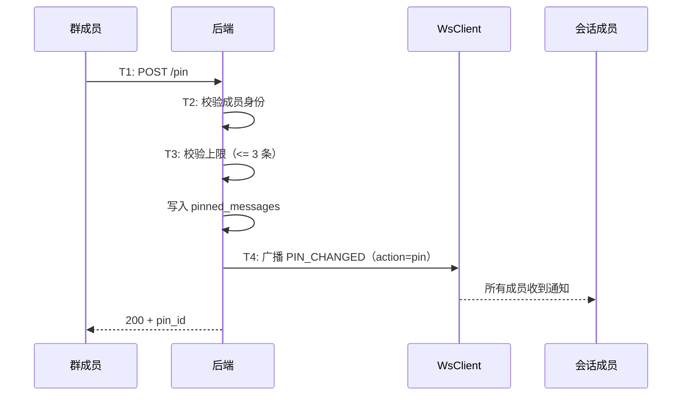

# 消息置顶 — 服务端设计报告

> 关联设计：[功能分析](../analysis.md)

## 1. 目标

- 新增消息置顶接口：POST /pin、DELETE /pin/{id}、GET /pinned
- 新增 PIN_CHANGED WS 帧类型，置顶/取消置顶时广播
- 新建 pinned_messages 表
- 权限：任何群成员都可以置顶/取消置顶

## 2. 现状分析

### 已有能力

- im-ws dispatcher 有帧广播能力（MESSAGE_RECALLED 已验证）
- conversation_members 表可查询会话成员
- 群成员有 role 字段

### 缺失

- 没有 pinned_messages 表
- proto 没有 PIN_CHANGED 帧类型

## 3. 数据模型与接口

### 数据模型

**pinned_messages 表**：

```sql
CREATE TABLE pinned_messages (
    id UUID PRIMARY KEY DEFAULT gen_random_uuid(),
    conversation_id UUID NOT NULL REFERENCES conversations(id),
    message_id UUID NOT NULL REFERENCES messages(id),
    pinned_by BIGINT NOT NULL,
    pinned_at TIMESTAMPTZ NOT NULL DEFAULT NOW(),
    UNIQUE(conversation_id, message_id)
);

CREATE INDEX idx_pinned_messages_conv ON pinned_messages(conversation_id);
```

| 决策 | 理由 |
|------|------|
| 独立表而非 messages 加字段 | 置顶是会话级别的元数据，不是消息本身的属性 |
| UNIQUE(conversation_id, message_id) | 同一条消息在同一会话只能置顶一次 |
| pinned_by 记录操作者 | 审计需要 |

### proto 扩展

```protobuf
// ws.proto
enum WsFrameType {
  // ... 已有 0~16
  PIN_CHANGED = 17;
}

message PinChangedNotification {
  string conversation_id = 1;
  string message_id = 2;
  string action = 3;       // "pin" 或 "unpin"
  string pinned_by = 4;
}
```

### 接口契约

**置顶消息**

```
POST /conversations/{conv_id}/messages/pin
Authorization: Bearer {token}
```

请求体：

```json
{
  "message_id": "uuid"
}
```

响应（200）：

```json
{
  "pin_id": "uuid",
  "pinned_at": "2026-05-08T10:00:00Z"
}
```

错误响应：

| 状态码 | 场景 |
|--------|------|
| 403 | 非会话成员 |
| 400 | 已置顶 / 超过 3 条上限 |
| 404 | 消息不存在 |

---

**取消置顶**

```
DELETE /conversations/{conv_id}/messages/pin/{pin_id}
Authorization: Bearer {token}
```

响应（200）：`{"message": "ok"}`

错误响应：403（非会话成员）、404（pin_id 不存在）

---

**查询置顶列表**

```
GET /conversations/{conv_id}/messages/pinned
Authorization: Bearer {token}
```

响应（200）：

```json
[
  {
    "pin_id": "uuid",
    "message_id": "uuid",
    "content": "消息内容",
    "msg_type": 0,
    "sender_name": "张三",
    "pinned_by": "1",
    "pinned_at": "2026-05-08T10:00:00Z"
  }
]
```

## 4. 核心流程



## 5. 项目结构与技术决策

### 文件结构

```
server/modules/im-message/src/
├── routes.rs          # 修改：新增 pin、unpin、get_pinned 路由
├── service.rs         # 修改：新增 pin_message、unpin_message 方法
├── repository.rs      # 修改：新增 pinned_messages CRUD
├── models.rs          # 修改：新增 PinnedMessage 结构体
└── broadcast.rs       # 修改：新增 broadcast_pin_changed

server/migrations/
└── 20260508_008_pinned_messages.sql  # 新建
```

### 技术决策

| 决策 | 方案 | 理由 |
|------|------|------|
| 置顶权限 | 查 conversation_members 是否为成员 | 任何群成员都可置顶/取消置顶 |
| 置顶上限 | 应用层校验 COUNT <= 3 | 简单，不需要数据库约束 |
| PIN_CHANGED 广播 | 向会话所有成员广播 | 实时通知 |

## 6. 验收标准

| 验收条件 | 验收方式 |
|----------|----------|
| 置顶成功 | POST /pin + GET /pinned 返回 |
| 置顶超过 3 条失败（400） | HTTP 请求 |
| 非成员置顶失败（403） | HTTP 请求 |
| 取消置顶成功 | DELETE /pin + GET /pinned 不再包含 |
| PIN_CHANGED WS 广播 | 两端连接验证 |

## 7. 暂不实现

| 功能 | 理由 |
|------|------|
| 置顶消息编辑 | 置顶后不能修改内容，只能取消重新置顶 |
| 跨会话置顶 | 置顶是会话级别的，不支持"全局置顶" |
| 置顶消息跳转定位 | 需要 ScrollController 精确定位，后续版本做 |
