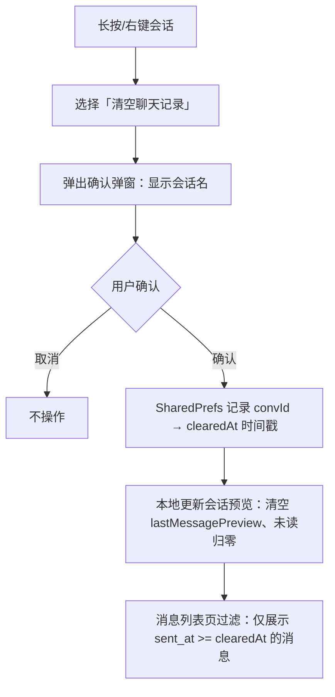
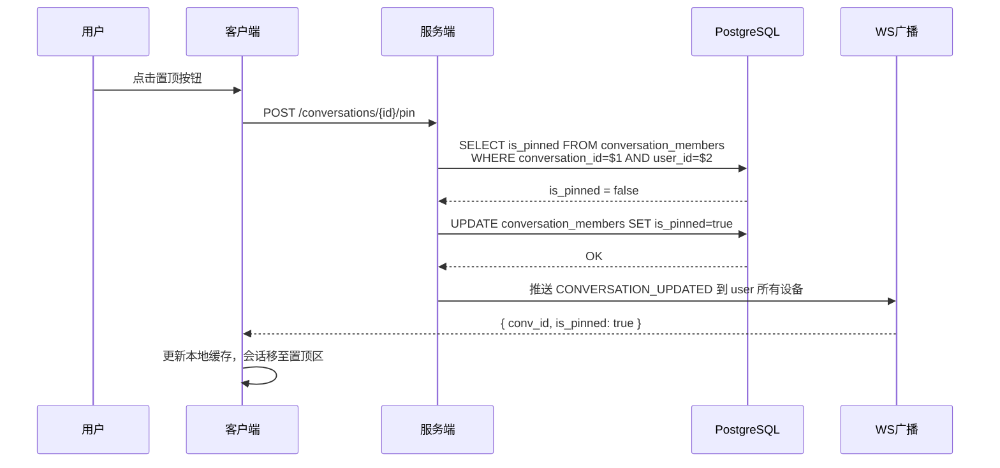

# 会话列表操作优化 — 功能分析

> 版本: v0.0.5 | 分支: v0.42.0 | 日期: 2026-07-03 | 前置讨论: chat.md

## 概述

为 IM 会话列表补齐核心管理操作：置顶、免打扰、标记未读、删除、清空。移动端通过滑动菜单（高频操作）和长按菜单（全功能）两种通道承载，桌面端通过右键菜单承载。清空会话采用本地时间戳过滤方案，遵循微信「各端独立」的用户心智。

核心改动范围：后端新增 3 个 toggle API + WS 推送扩展，前端补齐滑动/长按/右键交互层 + 置顶排序 + 清空聊天记录。清空会话聊天记录采用本地时间戳过滤方案，遵循微信「各端独立」的用户心智。

---

## 一、交互链

### 场景 1：置顶/取消置顶会话

**用户故事**：作为 IM 用户，我想把重要的会话固定在列表顶部，以便快速找到常用联系人。

- 移动端：左滑会话行露出操作按钮，点击「置顶」按钮；或长按会话在弹出的菜单中选择「置顶/取消置顶」
- 桌面端：右键点击会话，在菜单中选择「置顶/取消置顶」
- 操作后：会话从当前位置移到列表顶部置顶区，旁有置顶标识；再次操作取消置顶，会话回到普通区按时间排序
- 多端同步：操作后 WS 推送到同一用户的其他设备，实时同步置顶状态

```mermaid
flowchart TB
    A[会话列表页] --> B{平台}
    B -->|移动端| C[左滑暴露操作按钮]
    B -->|移动端| D[长按弹出 BottomSheet]
    B -->|桌面端| E[右键弹出 ContextMenu]
    C --> F[点击「置顶」]
    D --> F
    E --> F
    F --> G{当前是否已置顶}
    G -->|否| H[POST /conversations/{id}/pin]
    G -->|是| I[POST /conversations/{id}/pin 取消]
    H --> J[服务端更新 is_pinned=true]
    I --> K[服务端更新 is_pinned=false]
    J --> L[WS 推送到所有端]
    K --> L
    L --> M[会话移至置顶区/普通区]
```

### 场景 2：设置/取消免打扰

**用户故事**：作为 IM 用户，我想对不重要的群聊开启免打扰，以便不被频繁的消息通知打扰。

- 移动端：左滑会话行，点击「免打扰」按钮（铃铛图标）；或长按在菜单中选择
- 桌面端：右键点击会话，在菜单中选择「免打扰/取消免打扰」
- 视觉反馈：免打扰开启后会话显示静音铃铛图标
- 多端同步：WS 实时推送状态变更

```mermaid
flowchart TB
    A[会话列表页] --> B{平台}
    B -->|移动端| C[左滑暴露操作按钮]
    B -->|移动端| D[长按弹出 BottomSheet]
    B -->|桌面端| E[右键弹出 ContextMenu]
    C --> F[点击「免打扰」]
    D --> F
    E --> F
    F --> G[POST /conversations/{id}/mute]
    G --> H[服务端更新 is_muted]
    H --> I[WS 推送到所有端]
    I --> J[列表项图标更新]
```

> 注：本次只做标记开关，通知过滤逻辑在后续版本实现。

### 场景 3：标记会话已读

**用户故事**：作为 IM 用户，我想把某个会话标记为已读（消除未读角标），以便清理不需要查看的未读消息。

- 前提：会话有未读消息（unread_count > 0），操作入口才可见/可用
- 移动端：左滑点击「标为已读」按钮
- 桌面端：右键菜单中选择
- 操作后：该会话的未读角标消失，总未读计数减少

```mermaid
flowchart TB
    A[会话有未读数 > 0] --> B[操作入口可用]
    B --> C[POST /conversations/{id}/read]
    C --> D[服务端 unread_count = 0]
    D --> E[WS 推送到所有端]
    E --> F[未读角标消失]
    E --> G[总未读计数更新]
```

> 已有 API，本次补齐前端 UI 入口。

### 场景 4：标记会话未读

**用户故事**：作为 IM 用户，我想把已读的会话标记回未读状态，以便稍后提醒自己处理。

- 操作入口：仅长按菜单/右键菜单（低频操作，不占滑动位）
- 操作后：会话显示未读标记（unread_count = 1），无需关心实际有多少条未读消息

```mermaid
flowchart TB
    A[长按/右键会话] --> B[选择「标记为未读」]
    B --> C[POST /conversations/{id}/unread]
    C --> D[服务端 unread_count = 1]
    D --> E[WS 推送到所有端]
    E --> F[列表项显示未读角标 1]
    F --> G[总未读计数 +1]
```

### 场景 5：删除会话

**用户故事**：作为 IM 用户，我想删除不再需要的会话，以便保持会话列表整洁。

- 移动端：左滑点击红色「删除」按钮 → 弹出确认弹窗 → 确认后删除
- 桌面端：右键选择「删除」或按 Delete 键 → 弹出确认弹窗 → 确认后删除
- 确认弹窗：参考删除消息的 `showTolyPopPicker` 风格（移动端底部 BottomSheet，桌面端居中 Dialog）
- 删除后：会话从列表中移除，可重新通过搜索/发起新会话恢复

```mermaid
flowchart TB
    A[会话列表页] --> B{平台}
    B -->|移动端| C[左滑点击「删除」]
    B -->|移动端| D[长按选择「删除」]
    B -->|桌面端| E[右键/Delete 键]
    C --> F[弹出确认弹窗]
    D --> F
    E --> F
    F --> G{用户确认}
    G -->|取消| H[弹窗关闭，不操作]
    G -->|确认| I[DELETE /conversations/{id}]
    I --> J[服务端标记 is_deleted = true]
    J --> K[WS 推送 CONVERSATION_DELETED]
    K --> L[列表移除该会话]
```

> 后端 API 已有，本次补齐前端 UI 入口和确认弹窗。

### 场景 6：清空当前会话聊天记录

**用户故事**：作为 IM 用户，我想清空某个会话的所有聊天记录，以便清理不需要的消息。清空仅影响当前设备，其他端和后端数据保持不变。

- 入口：长按/右键会话，在菜单中选择「清空聊天记录」
- 操作后：弹出确认弹窗（显示「确定清空与「{name}」的聊天记录？」），确认后该会话预览清空（最后消息、未读归零）
- 存储方式：SharedPreferences 中按 `conversationId → clearedAt` 记录时间戳（JSON Map）
- 消息过滤：消息列表页展示时过滤 `sent_at < clearedAt` 的消息
- 其他端：完全不受影响（各端独立）



> 各端独立，不走后端 API。SharedPreferences 在各平台有独立的存储文件，互不干扰。消息过滤逻辑在消息模块（flash_im_chat）中通过 `cubit.getClearedAt(conversationId)` 获取时间戳后实现。

---

## 二、逻辑树

### 2.1 事件流：置顶开关

| 时刻 | 事件 | 处理 | 产生的新事件 |
|------|------|------|-------------|
| T0 | 用户点击「置顶」 | 前端调用 POST `/conversations/{id}/pin` | HTTP 请求 → 服务端 |
| T1 | 服务端收到请求 | 从 JWT 提取 user_id，查询 conversation_members 当前 is_pinned | DB 查询 |
| T2 | 服务端判断 | 若 is_pinned=false → UPDATE SET is_pinned=true；若 true → UPDATE SET is_pinned=false | DB 写入 |
| T3 | DB 写入成功 | 构造 WS 帧推送到该用户所有在线设备 | WS PUSH: CONVERSATION_UPDATED |
| T4 | 该用户各端收到 WS | 更新本地缓存中该会话的 isPinned 字段，按新排序重排列表 | 列表刷新 |



### 2.2 事件流：免打扰开关

| 时刻 | 事件 | 处理 | 产生的新事件 |
|------|------|------|-------------|
| T0 | 用户点击「免打扰」 | 前端调用 POST `/conversations/{id}/mute` | HTTP 请求 |
| T1 | 服务端收到请求 | 查询当前 is_muted 状态 | DB 查询 |
| T2 | 服务端 toggle | UPDATE conversation_members SET is_muted = NOT is_muted | DB 写入 |
| T3 | DB 写入成功 | WS 帧推送到该用户所有设备 | WS PUSH: CONVERSATION_UPDATED |
| T4 | 各端收到 WS | 更新本地缓存中 isMuted 字段，刷新列表项图标 | UI 更新 |

### 2.3 事件流：标记未读

| 时刻 | 事件 | 处理 | 产生的新事件 |
|------|------|------|-------------|
| T0 | 用户选择「标记为未读」 | 前端调用 POST `/conversations/{id}/unread` | HTTP 请求 |
| T1 | 服务端收到请求 | 验证该用户是该会话成员 | 权限校验 |
| T2 | 校验通过 | UPDATE conversation_members SET unread_count = 1 | DB 写入 |
| T3 | DB 写入成功 | WS 帧推送到该用户所有设备 | WS PUSH: CONVERSATION_UPDATED |
| T4 | 各端收到 WS | 更新 unreadCount = 1，显示未读角标 | UI 更新 |

### 2.4 事件流：删除会话

| 时刻 | 事件 | 处理 | 产生的新事件 |
|------|------|------|-------------|
| T0 | 用户确认删除 | 前端调用 DELETE `/conversations/{id}` | HTTP 请求 |
| T1 | 服务端收到请求 | 软删除：UPDATE conversation_members SET is_deleted=true | DB 写入 |
| T2 | DB 写入成功 | 返回成功 | HTTP 204 |
| T3 | 前端收到 204 | 从本地缓存移除该会话 | 列表刷新 |
| T4 | WS 推送 | 推送给该用户其他设备 CONVERSATION_DELETED | 其他端同步移除 |

> 后端 API 已有，本次补齐前端 UI + 确认弹窗 + WS 推送。

### 2.5 状态流转

| 实体 | 触发事件 | 前状态 | 后状态 |
|------|---------|--------|--------|
| conversation_members.is_pinned | POST /pin | false/true | true/false（toggle） |
| conversation_members.is_muted | POST /mute | false/true | true/false（toggle） |
| conversation_members.unread_count | POST /unread | 任意值（含 0） | 1 |
| conversation_members.unread_count | POST /read | >0 | 0 |
| conversation_members.is_deleted | DELETE /{id} | false | true |
| 当前设备 SharedPrefs `conv_cleared_at_map` | 清空聊天记录 | 该会话无/旧值 | now() → JSON Map 写入 |
| 当前设备列表过滤 | SyncEngine 同步后 | 全量会话 | 过滤 last_message_at < cleared_at |

**异常流处理**：
- 置顶/免打扰/标记未读 API 调用失败：前端回滚 UI（恢复按钮状态），并 toast 提示
- 非会话成员操作：服务端返回 403，前端不处理
- 清空操作无异常流（纯本地操作，无网络依赖）

---

## 三、功能编号与网络定位

### 3.1 本次新增节点

| 编号 | 功能节点 | 层级 | 简介 |
|------|---------|------|------|
| D-51 | 会话置顶开关 | 领域 | POST /conversations/{id}/pin，toggle is_pinned，WS 推送 |
| D-52 | 会话免打扰开关 | 领域 | POST /conversations/{id}/mute，toggle is_muted，WS 推送 |
| D-53 | 标记会话未读 | 领域 | POST /conversations/{id}/unread，设 unread_count=1，WS 推送 |
| F-28 | 会话操作 WS 帧分发 | 前端基础 | 分发 CONVERSATION_UPDATED / CONVERSATION_DELETED 帧 |
| P-84 | 移动端会话滑动操作 | 前端业务 | CustomSlidableAction 自适应宽度，动态文案（已置顶显示"取消置顶"），点击自动关闭，SlidableAutoCloseBehavior 包裹列表实现互斥 |
| P-85 | 移动端会话长按菜单 | 前端业务 | showTolyPopPicker 底部弹出 BottomSheet，图标+文字居中，删除项红色高亮 |
| P-86 | 桌面端会话右键菜单 | 前端业务 | ContextMenu 全功能菜单 + Delete 快捷键 |
| P-87 | 会话置顶排序 | 前端业务 | 置顶区 + 普通区分区排序 |
| P-88 | 清空会话聊天记录 | 前端业务 | 各端独立本地 SharedPrefs 时间戳存储（per-conversation） |
| P-89 | 会话删除确认弹窗 | 前端业务 | 复用 showTolyPopPicker 风格 |

### 3.2 前置依赖

| 依赖节点 | 依赖方式 | 是否已有 |
|----------|---------|---------|
| D-01 创建会话 | 清空后新建会话依赖此能力 | ✅ |
| D-02 会话列表查询 | 所有操作基于会话列表数据 | ✅ |
| D-05 标记已读 | POST /conversations/{id}/read — 补齐 UI 入口 | ✅ |
| D-10 会话更新推送 | WS 推送通道，本次扩展其推送范围（含 pin/mute/unread/delete 变更） | ✅ |
| F-15 LocalStore | 本地 SQLite 缓存，置顶/免打扰状态需同步更新 | ✅ |
| F-16 SyncEngine | 清空后同步过滤依赖其全量覆盖机制 | ✅ |
| P-48 长按菜单（消息操作） | 参考其 BottomSheet 实现风格 | ✅ |
| P-65 桌面端会话分栏 | 桌面端右键菜单在此页面内实现 | ✅ |

### 3.3 边界接口

| 接口/协议 | 定义方 | 消费方 | 敏感度 |
|-----------|--------|--------|--------|
| POST /conversations/{id}/pin | 服务端 | 客户端（7端） | 低 |
| POST /conversations/{id}/mute | 服务端 | 客户端（7端） | 低 |
| POST /conversations/{id}/unread | 服务端 | 客户端（7端） | 低 |
| DELETE /conversations/{id} | 服务端（已有） | 客户端（补齐 UI） | 低 |
| WS CONVERSATION_UPDATED | 服务端 | 客户端 F-28 分发 | 低 |
| WS CONVERSATION_DELETED | 服务端 | 客户端 F-28 分发 | 低 |
| SharedPreferences `conv_cleared_at_map` | 移动端本地 | 移动端 P-88 | 无（纯本地） |

---

## 四、技术参考

### 桌面端右键菜单实现模式

参考已有的**消息右键菜单**实现链路（`flash_im_chat` 模块）：

| 文件 | 职责 |
|------|------|
| `message_bubble.dart` | `GestureDetector.onSecondaryTapUp` → `TolyPopover` 触发入口 |
| `desktop_context_menu.dart` | 白色背景、圆角竖向列表菜单 UI |
| `message_action_menu.dart` | `MenuAction` 枚举 + `getActions()` 菜单项决策逻辑 |
| `chat_menu_handler.dart` | `handle()` 统一分发各 `MenuAction` 的业务逻辑 |

关键模式：
- 组件：`TolyPopover`（来自 `tolyui_feedback` 包），`placement` + `decorationConfig` 控制位置和样式
- 触发：`onSecondaryTapUp` → `ctrl.open(position:)`
- 关闭：`ctrl.close()` 后执行 `onAction?.call(action)`
- 菜单项：白色背景、圆角 8px、最大宽度 180px、竖向列表

本次会话右键菜单采用相同模式，用 `ConversationMenuAction` 枚举替代 `MenuAction`。

---

## 五、结论

### 开发顺序建议

```
第 1 批（后端 API）：D-51 → D-52 → D-53  + WS 推送扩展
第 2 批（前端基础）：F-28 WS 帧分发
第 3 批（前端 UI）：P-84 滑动 → P-85 长按 → P-86 右键 → P-87 排序 → P-89 确认弹窗 → P-88 清空
```

### 复杂度集中的地方

- **D-51/D-52 后端 toggle API**：需要统一 toggle 模式（同一个端点 POST 后翻转状态），避免竞态条件
- **P-84 移动端滑动菜单**：
  - `CustomSlidableAction` 替代 `SlidableAction`，支持点击后自动关闭
  - 按钮文案动态显示（根据当前状态：已置顶显示"取消置顶"、已免打扰显示"取消免打扰"）
  - `SlidableAutoCloseBehavior` 包裹列表，打开一个时其他自动关闭
  - 自适应宽度计算：`(actions.length * 64) / screenWidth`
- **P-87 置顶排序**：置顶区与普通区之间追加新消息时的排序策略，需与 SyncEngine 全量覆盖机制协调

### 暂不实现的部分

| 功能 | 理由 |
|------|------|
| 拖拽排序置顶项 | 本次只做两区自动排序，不做拖拽 |
| 批量选择删除 | 需要多选模式，本次不做 |
| 免打扰通知过滤 | 本次只做标记开关，通知过滤后续版本 |
| 清空聊天记录跨端同步 | 遵循微信模式，各端独立 |
| 清空聊天记录后端 API | 纯本地 SharedPreferences 操作，不需要服务端存储 |
