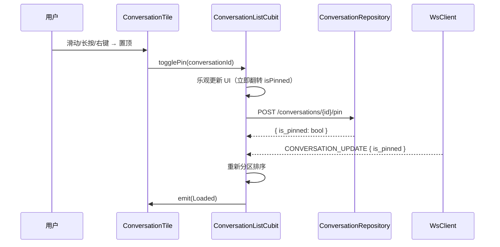
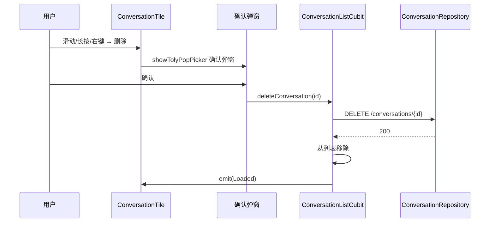
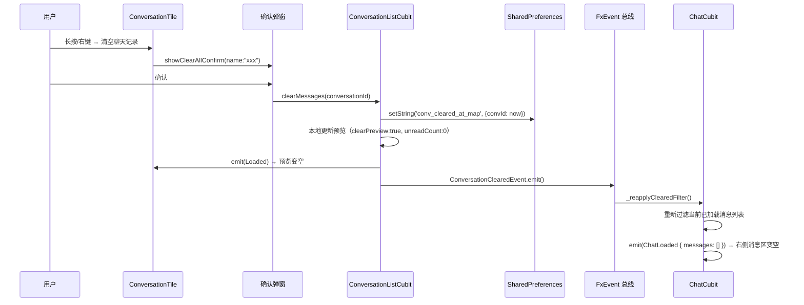

# 会话列表操作 — 客户端设计报告

> 关联设计：[功能分析](../analysis.md) · [服务端设计](../server/design.md)

## 1. 目标

- 移动端左滑会话行暴露 4 个操作按钮：置顶、免打扰、标为已读、删除
- 移动端长按会话弹出 BottomSheet 全功能菜单
- 桌面端右键会话弹出 TolyPopover 上下文菜单
- 置顶会话与普通会话分区显示，置顶区按 `pinned_at` 排序
- 清空会话聊天记录（本地 SharedPrefs 按会话存储时间戳，各端独立）
- 删除会话增加确认弹窗
- 响应 WS `CONVERSATION_UPDATE` 帧中的 `is_pinned`/`is_muted`/`is_deleted` 字段

## 2. 现状分析

### 已有能力

- `ConversationListPage`：基础 ListView + 下拉刷新 + 滚动加载
- `ConversationTile`：单个会话行组件（头像 + 名称 + 时间 + 预览）
- `ConversationListCubit`：分页加载、WS 实时更新、未读清除、删除
- `ConversationRepository`：HTTP + 本地 SQLite 缓存双通道
- `Conversation` 模型：已有 `isPinned`、`isMuted` 字段
- `WsClient.conversationUpdateStream`：已有 CONVERSATION_UPDATE 帧分发
- `TolyPopover`：`tolyui_feedback` 已集成，桌面端消息右键已验证
- `showTolyPopPicker`：`tolyui_feedback` 已集成
- `shared_preferences`：已在项目中多处使用

### 缺失

- 没有滑动操作组件（flutter_slidable 未安装）
- `ConversationTile` 不支持滑动、长按、右键交互
- `ConversationListPage` 不分区排序（无置顶区/普通区）
- `ConversationRepository` 无 pin/mute/unread 的 HTTP 方法
- `ConversationListCubit` 不处理 WS 中的 is_pinned/is_muted/is_deleted 字段
- `Conversation` 模型缺少 `pinnedAt` 字段（排序用）
- 无 `ConversationMenuAction` 枚举和菜单决策逻辑
- 无清空会话功能

## 3. 数据模型与交互

### 3.1 菜单动作枚举

新增 `ConversationMenuAction` 枚举，统一移动端滑动/长按/桌面端右键的所有操作：

```dart
enum ConversationMenuAction {
  pin,      // 置顶/取消置顶
  mute,     // 免打扰/取消免打扰
  markRead, // 标为已读（仅当 unreadCount > 0 可用）
  markUnread, // 标为未读
  delete,   // 删除会话
  clearAll, // 清空当前会话聊天记录
}
```

### 3.2 菜单内容决策

```dart
List<ConversationMenuAction> getActions({
  required Conversation conv,
  required bool isSlidableView, // 滑动菜单还是全量菜单
}) {
  if (isSlidableView) {
    // 滑动菜单：4 个固定按钮
    return [
      ConversationMenuAction.pin,
      ConversationMenuAction.mute,
      if (conv.unreadCount > 0) ConversationMenuAction.markRead,
      ConversationMenuAction.delete,
    ];
  }
  // 全量菜单（长按/右键）
  return [
    ConversationMenuAction.pin,
    ConversationMenuAction.mute,
    if (conv.unreadCount > 0) ConversationMenuAction.markRead,
    ConversationMenuAction.markUnread,
    ConversationMenuAction.delete,
    ConversationMenuAction.clearAll,
  ];
}
```

### 3.3 Conversation 模型扩展

```dart
class Conversation {
  // ... 已有字段不变 ...
  final DateTime? pinnedAt; // 新增：置顶时间，用于置顶区排序

  const Conversation({
    // ... 已有参数 ...
    this.pinnedAt,
  });

  // fromJson 补 pinned_at 解析
  // copyWith 扩展 pinnedAt、isPinned、isMuted 参数
}
```

| 决策 | 理由 |
|------|------|
| `copyWith` 补 `isPinned`/`isMuted` + `clearPreview` 标志 | 目前 copyWith 只支持 unreadCount/lastMessage 三个字段，且 `??` 无法区分「不传」和「传 null」，增加 `clearPreview` 用于清空预览场景 |
| `pinnedAt` 可为 null | 非置顶会话不需要此字段，服务端返回 null |

### 3.4 新增 Repository 方法

```dart
// ConversationRepository
Future<ConversationToggleResponse> togglePin(String conversationId);
Future<ConversationToggleResponse> toggleMute(String conversationId);
Future<ConversationToggleResponse> markUnread(String conversationId);
```

API 映射：
| 方法 | HTTP |
|------|------|
| `togglePin(id)` | `POST /conversations/{id}/pin` |
| `toggleMute(id)` | `POST /conversations/{id}/mute` |
| `markUnread(id)` | `POST /conversations/{id}/unread` |

### 3.5 清空聊天记录：本地时间戳（按会话）

```dart
// SharedPreferences key：JSON Map { conversationId: "ISO8601" }
static const _keyClearedMap = 'conv_cleared_at_map';

// 清空指定会话
Future<void> clearMessages(String conversationId) async {
  final prefs = await SharedPreferences.getInstance();
  final raw = prefs.getString(_keyClearedMap) ?? '{}';
  final Map<String, dynamic> map = jsonDecode(raw);
  map[conversationId] = DateTime.now().toUtc().toIso8601String();
  await prefs.setString(_keyClearedMap, jsonEncode(map));
}

// 消息模块通过 getClearedAt(conversationId) 获取时间戳用于过滤
Future<DateTime?> getClearedAt(String conversationId) async { ... }
```

> 消息列表页展示时过滤 `sent_at < clearedAt` 的消息，由 `flash_im_chat` 模块通过 `ConversationListCubit.getClearedAt()` 获取时间戳后实现。

---

## 4. 核心流程

### 4.1 置顶操作



### 4.2 免打扰操作

与置顶对称，调用 `POST /conversations/{id}/mute`，UI 更新 `isMuted` 后列表项显示静音图标。

### 4.3 标记未读

调用 `POST /conversations/{id}/unread`，服务端设 `unread_count=1`，WS 推送更新。长按/右键菜单中始终可用（不限 unreadCount 当前值）。

### 4.4 标记已读

已有的 `POST /conversations/{id}/read` API，本次补齐滑动入口。仅 `unreadCount > 0` 时该按钮可见。

### 4.5 删除会话



### 4.6 清空当前会话聊天记录



> 不调后端 API，纯本地 SharedPreferences 操作。通过 `ConversationClearedEvent` 全局事件通知消息模块立刻重新过滤已加载消息，确保桌面端右侧消息区也立即清空。各端独立。

### 4.7 WS 状态同步 + clearedAt 过滤

扩展现有 `_handleUpdate` 方法，改为 async，处理新增的 optional 字段，并确保 clearedAt 过滤生效：

```dart
Future<void> _handleUpdate(WsFrame frame) async {
  final update = ConversationUpdate.fromBuffer(frame.payload);

  // 处理 is_deleted
  if (update.hasIsDeleted() && update.isDeleted) {
    // 从列表移除该会话
  }

  // 未知会话：插入骨架 → 异步补全后 await _ensureClearedAtMapLoaded() + _applyClearedAtToPreviews()
  // 已知会话：更新字段 → await _ensureClearedAtMapLoaded() + _applyClearedAtToPreviews()
}
```

> 关键：`_ensureClearedAtMapLoaded()` 确保 SharedPrefs 中的清空时间戳已加载到内存，避免 WS 推送在 `loadConversations()` 之前到达时 clearedAt 过滤失效。`_patchAndEmit` 同样在 emit 前调用 `_applyClearedAtToPreviews()`。

---

## 5. 项目结构与技术决策

### 5.1 文件结构

```
flash_im_conversation/lib/src/
├── data/
│   ├── conversation.dart                  # 修改：pinnedAt + copyWith 扩展
│   ├── conversation_repository.dart       # 修改：togglePin/toggleMute/markUnread
│   └── conversation_menu_action.dart      # 新建：枚举 + getActions()
├── logic/
│   ├── conversation_list_cubit.dart       # 修改：toggle + WS is_deleted/pin/mute + 清空 + 排序
│   └── conversation_list_state.dart       # 不变
├── view/
│   ├── conversation_list_page.dart        # 修改：分区排序渲染
│   ├── conversation_tile.dart             # 修改：集成 Slidable + 长按 + 右键
│   ├── conversation_slide_actions.dart    # 新建：滑动操作按钮组 UI
│   ├── conversation_context_menu.dart     # 新建：桌面端 TolyPopover 菜单 UI
│   └── conversation_delete_dialog.dart    # 新建：删除确认弹窗

flash_im_core/lib/src/
├── data/proto/
│   └── message.pb.dart                    # 重新生成：ConversationUpdate 补充字段
```

### 5.2 职责划分

```
ConversationListPage → 分区渲染（PinnedSection + NormalSection）
  └── ConversationTile → 交互容器（Slidable + GestureDetector）
        ├── ConversationSlideActions → 滑动按钮组
        ├── ConversationContextMenu → 桌面端右键（TolyPopover）
        ├── ConversationDeleteDialog → 删除确认弹窗
        └── ConversationListCubit → 状态管理
              └── ConversationRepository → HTTP + 本地缓存
```

**分区排序逻辑**：在 `ConversationListLoaded` 中维护两个排序后的列表，或维护一个带分区标记的列表：

```dart
// 方案：在 build 时动态分区
final pinned = conversations.where((c) => c.isPinned).toList()
  ..sort((a, b) => (b.pinnedAt ?? b.createdAt).compareTo(a.pinnedAt ?? a.createdAt));
final normal = conversations.where((c) => !c.isPinned).toList()
  ..sort((a, b) => (b.lastMessageAt ?? b.createdAt).compareTo(a.lastMessageAt ?? a.createdAt));
```

### 5.3 技术决策

| 决策 | 方案 | 理由 |
|------|------|------|
| 滑动组件 | `flutter_slidable` ^0.4.0 | 社区最主流，开源可用，支持自定义 action 面板 |
| 移动端长按菜单 | `showModalBottomSheet` + 列表 | 微信同款交互，与消息长按菜单风格一致 |
| 桌面端右键菜单 | `TolyPopover` + `GestureDetector.onSecondaryTapUp` | 复用消息右键菜单的已验证模式 |
| 删除确认弹窗 | `showTolyPopPicker`（移动端 BottomSheet / 桌面端 Dialog） | 项目已集成，交互风格统一 |
| 置顶排序 | 客户端分区渲染，SQLite 查询不变 | 排序逻辑轻量，服务端已排好序，客户端做视觉分区 |
| WS 字段解析 | proto 重新生成 `message.pb.dart` | 服务端已扩展 optional 字段，客户端同步 |
| 乐观更新 | toggle 操作先更新 UI 再发请求，失败回滚 | 即时反馈提升体验，网络失败 toast 提示 |
| 清空存储 | `SharedPreferences` JSON Map（per-conversation） | 各端独立，微信模式，零服务端改动 |

### 5.4 三方依赖

| 依赖 | 版本 | 用途 | 已有/新增 |
|------|------|------|:---:|
| `flutter_slidable` | ^0.4.0 | 移动端滑动操作 | **新增** |
| `shared_preferences` | ^2.2.0 | 清空时间戳持久化 | 已有 |
| `tolyui_feedback` | workspace | TolyPopover + showTolyPopPicker | 已有 |
| `protobuf` | workspace | ConversationUpdate 解析 | 已有 |

---

## 6. 验收标准

| 验收条件 | 验收方式 |
|----------|----------|
| 移动端左滑显示 4 个按钮 | 真机/模拟器滑动验证 |
| 置顶按钮：点击后会话移至顶部置顶区 | 滑动点击，观察列表变化 |
| 免打扰按钮：点击后列表项显示静音图标 | 滑动点击，观察图标切换 |
| 标为已读按钮（仅未读会话可见） | 观察有/无未读的会话 |
| 长按弹出 BottomSheet 菜单 | 长按会话，观察菜单弹出 |
| 桌面端右键弹出 TolyPopover | 桌面端右键会话行 |
| 删除弹出确认弹窗 → 确认后移除 | 点击删除 → 弹窗 → 确认 |
| 清空聊天记录后该会话预览清空 | 菜单操作 → 预览区变空、未读归零 |
| 清空后新建消息正常显示 | 收到新消息 → 预览恢复 |
| 清空后其他端不受影响 | 桌面端/另一设备会话内容不变 |
| 清空聊天记录确认弹窗显示会话名 | 长按/右键 → 弹窗标题含会话名 |
| WS 推送 is_pinned 后列表重新排序 | 另一设备 toggle 置顶，观察当前设备 |
| WS 推送 is_deleted 后会话移除 | 另一设备删除会话，观察当前设备 |
| flutter analyze 零错误 | `cd client && flutter analyze` |

---

## 7. 暂不实现

| 功能 | 理由 |
|------|------|
| 拖拽排序置顶项 | 本次只做分区自动排序，不做拖拽 |
| 批量选择/删除 | 需要多选模式，交互复杂度高 |
| 免打扰通知过滤 | 本次只做标记开关，通知系统改造单独版本 |
| 置顶数量上限 | 不做限制，用户自行管理 |
| 清空聊天跨端同步 | 遵循微信各端独立模式，与 analysis.md 决策一致 |
| 清空消息后端 API | 纯本地操作，不需要服务端接口 |
